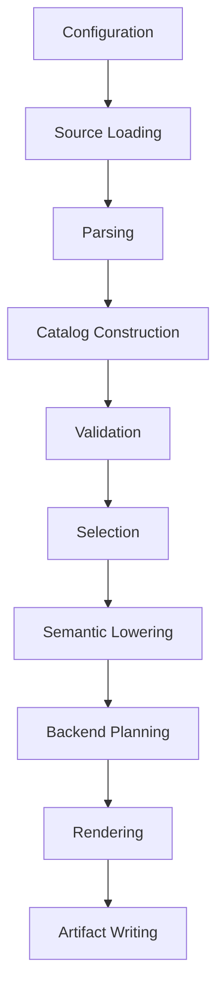

# Behavioral Specification

This specification defines observable behavior for the redesigned system. It is expressed in terms of inputs, processing, outputs, invariants, and compatibility expectations.

## Core Flow



Each stage receives explicit inputs and returns explicit outputs. Only source loading and artifact writing own filesystem side effects.

## Input Behavior

| Input | Expected Behavior | Evidence |
| --- | --- | --- |
| `.tsl` primitive files | Parse one or more primitive declarations with signatures, attributes, parameter names, descriptions, tests, generic parameters, and implementation blocks. | `tsldata/primitives/arithmetic/fundamental.tsl` |
| Extension file | Parse named hardware extensions and preserve metadata for selection, testing, backend support, and inheritance. | `tsldata/extensions/extension.tsl` |
| Type group file | Parse named type groups and expand them deterministically. | `tsldata/detail/types.tsl` |
| Lane set file | Parse named lane sets with lane counts and allowed type tags. | `tsldata/detail/lane_sets.tsl` |
| Flags file | Parse flag aliases and normalize CPU feature flags. | `tsldata/detail/flags.tsl` |
| Template file | Parse operation templates, shape strings, required fields, and optional fields. | `tsldata/detail/templates.tsl` |
| Language type maps | Map type tags to backend type names. | `tsldata/detail/lang/types/types_cpp.tsl`, `types_rust.tsl` |
| Translation maps | Map semantic operations to backend snippets. | `tsldata/detail/lang/translate_cpp.tsl`, `translate_rust.tsl` |
| Backend manifests | Resolve artifact name, extension, primary templates, specialization templates, wrappers, traits, and combined templates. | `frozen/generator_specs/backend_cpp.yaml`, `frozen/generator_specs/backend_rust.yaml` |

## Parsing Behavior

- Comments beginning with `#` or `//` are ignored outside multiline strings.
- Indentation defines nested blocks.
- Newlines inside inline maps enclosed by `{...}` are allowed.
- Strings, multiline strings, signed numbers, booleans, bare names, wildcard `*`, lists, key lists, and maps are valid values.
- `prim<signature>[attrs] name(params):` starts a primitive block.
- `template`, `extension`, `types`, `flags`, `language`, `translation`, and `lane_set` define catalog blocks.
- The parser must preserve enough source span information for downstream diagnostics.

Compatibility expectation: TSL files in `tsldata/` must parse without errors.
`tsldata/` is accepted source corpus and read-only fixture corpus. It is not a
generated artifact, and it must be validated through parser, catalog, and
semantic probes rather than Python linting or type-checking.

### M107 Tiny Restart Source Form

Milestone 107 started the clean restart product path with one intentionally
tiny fixture form. The source-loading boundary reads one explicit `.tsl` file,
and the initial parser accepted exactly this three-line non-comment shape:

```text
prim<v:=(v,v)> add(left, right):
  implementation scalar si32:
    body add(left, right)
```

Catalog construction promotes that parsed form into one typed `binary`
primitive, one `scalar`/`si32` implementation, and a typed binary-add body.
C++ and Rust emitters consume the selected typed implementation to produce
in-memory artifact values; they do not infer semantics from raw source text or
write files.

Nearby body forms are diagnostic boundaries, not repair targets. For example,
`body add(left)` parses as the narrow body-line syntax but fails catalog
validation with `TSL-CATALOG-UNSUPPORTED-BODY` at the body source location.

### M108 Minimal Lowering Boundary

Milestone 108 inserts a pure lowering boundary after selection for the same
tiny fixture form. The selected `add` / `scalar` / `si32` implementation lowers
to one backend-neutral function value named `add_scalar_si32`, with ordered
parameters `left` and `right`, scalar type tag `si32`, and a binary-add
expression referencing those parameters. C++ and Rust emitters consume that
lowered value; they no longer inspect the catalog body directly.

The M108 lowerer initially accepted only the exact selected M107 body shape.
Unsupported selected body values produce a structured
`TSL-LOWER-UNSUPPORTED-BODY` diagnostic at the body source location. The M107
source-level catalog diagnostic for nearby parsed fixture bodies remains
unchanged.

### M109 Artifact Writer Boundary

Milestone 109 adds the first filesystem-write boundary for clean restart
generated artifacts. The pure source-to-artifact API still returns an
`ArtifactSet` without writing files. Callers must pass an existing
`ArtifactSet` and an explicit output root to the artifact writer when they
want filesystem output.

The writer validates all artifact logical paths before writing. Absolute
logical paths, parent-directory escapes, duplicate logical paths, duplicate
normalized target paths, and file/directory collisions produce structured
`TSL-WRITE-*` diagnostics. If validation produces any diagnostic, the writer
does not create the output root or write partial artifacts.

Successful writes create needed parent directories, write artifact content as
UTF-8 text, and return deterministic written records sorted by logical path.
Each record includes the logical path, resolved written path, content digest,
UTF-8 byte count, and `written` status.

### M110 Tiny Scalar Type Lowering Table

Milestone 110 broadens only the tiny clean scalar type path. The same exact
three-line `scalar` / `add(left, right)` source form may now declare the
supported clean restart scalar tags `si32`, `ui32`, `f32`, and `f64`.

Catalog construction preserves the parsed scalar type tag without deciding
backend spellings. The lowerer owns the typed scalar descriptor table. A
lowered function carries a backend-neutral descriptor containing tag,
`scalar` kind, integer or floating family, bit width, and signedness. C++ and
Rust emitters consume that descriptor through backend-owned spelling tables.

The existing `si32` C++ and Rust artifact bytes, logical paths, and digests
remain stable. Syntactically malformed type tags are parser diagnostics.
Syntactically valid but unsupported selected scalar tags are lowering
diagnostics with code `TSL-LOWER-UNSUPPORTED-TYPE`.

### M111 Tiny Binary Operation Lowering Table

Milestone 111 broadens only the tiny clean binary operation path. The same
three-line `scalar` source form may now use the supported clean restart
operation ids `add`, `sub`, and `mul` as both the primitive name and the body
operation:

```text
prim<v:=(v,v)> sub(left, right):
  implementation scalar si32:
    body sub(left, right)
```

Catalog construction preserves the parsed primitive name, body operation, and
exact `left, right` body arguments without deciding backend operator spelling.
The lowerer owns the typed binary-operation descriptor table. A lowered
function carries a backend-neutral operation descriptor containing operation
id, binary category, arity, expected source body operation name, and stable
semantic name. C++ and Rust emitters consume that descriptor through
backend-owned operator spelling tables.

The existing `add`/`si32` C++ and Rust artifact bytes, logical paths, and
digests remain stable. Unsupported selected operation ids are lowering
diagnostics with code `TSL-LOWER-UNSUPPORTED-OPERATION`. A supported primitive
whose body uses a different operation is a lowering diagnostic with code
`TSL-LOWER-OPERATION-MISMATCH`. Body arguments other than exactly
`left, right` remain diagnostic boundaries and are not repaired.

### M112 Tiny Return Statement Body Model

Milestone 112 keeps the M111 source form unchanged but makes the lowered
function body explicit. A lowered function now carries one backend-neutral
function body containing exactly one return statement over the accepted binary
operation expression. The return statement preserves the source body location
for traceability; it does not contain C++ or Rust text, backend operator
spelling, or source-body repair policy.

C++ and Rust emitters consume the explicit return statement body and still own
language syntax and operator spellings. Existing accepted tiny artifact bytes,
logical paths, ordering, descriptor tables, and lowering diagnostics remain
stable.

### M113 Tiny Function Signature Model

Milestone 113 keeps the M112 source and body form unchanged but makes the
lowered function signature explicit. A lowered function now carries one
backend-neutral signature containing the deterministic function name, source
primitive name, ordered parameters, and scalar type descriptor, paired with
the M112 return-statement body.

C++ and Rust emitters consume the explicit signature/body pair while still
owning language syntax, type spelling, operator spelling, logical paths, and
metadata. Existing accepted tiny artifact bytes, logical paths, ordering,
descriptor tables, body values, and lowering diagnostics remain stable.

### M114 Tiny Lowering Stage Output Boundary

Milestone 114 keeps the M113 source, signature, and body values unchanged but
makes the lowering stage output explicit. Batch lowering of selected
implementations returns an ordered lowered function set plus accumulated
lowering diagnostics. The existing single-selected lowering behavior remains
available and is the unit used by the batch boundary.

The generator lowers each target's selected implementations into this stage
output before backend emission, and C++ and Rust emitters consume only the
ordered lowered functions from that output. Existing accepted tiny artifact
bytes, logical paths, metadata, ordering, diagnostics, and digests remain
stable.

### M115 Tiny Binary Division Operation Lowering Slice

Milestone 115 extends only the tiny clean binary operation descriptor table to
accept `div` alongside `add`, `sub`, and `mul`:

```text
prim<v:=(v,v)> div(left, right):
  implementation scalar si32:
    body div(left, right)
```

Catalog construction still only preserves the parsed operation name and exact
`left, right` body arguments. The lowerer owns the backend-neutral `div`
descriptor and emits the existing binary operation expression shape. C++ and
Rust emitters own the `/` spelling through their backend-local operator tables.

This slice does not define divide-by-zero behavior, integer overflow behavior,
floating special-value behavior, modulo/remainder semantics, constant folding,
or source repair. Unsupported operation ids still fail in lowering with
`TSL-LOWER-UNSUPPORTED-OPERATION`, now reporting `add, sub, mul, div` as the
supported tiny clean operation set.

### M116 Tiny Integer Remainder Operation Type Gate

Milestone 116 extends the tiny clean binary operation descriptor table to
accept `mod` after `div` in deterministic descriptor order:

```text
prim<v:=(v,v)> mod(left, right):
  implementation scalar si32:
    body mod(left, right)
```

Catalog construction still only preserves the parsed operation name, scalar
type tag, and exact `left, right` body arguments. The lowerer owns a small
operation/type compatibility boundary over the existing scalar and binary
operation descriptors: `mod` lowers only for the currently supported integer
scalar descriptors `si32` and `ui32`. Floating scalar descriptors such as
`f32` and `f64` reach lowering and fail with
`TSL-LOWER-UNSUPPORTED-OPERATION-TYPE` at the implementation source location.

The `mod` descriptor remains backend-neutral and does not define C++ or Rust
spelling, divide-by-zero behavior, signed-remainder runtime behavior, overflow
policy, floating special-value policy, constant folding, or source repair.
C++ and Rust emitters own the `%` spelling for accepted lowered `mod`
functions. Unsupported operation ids now report `add, sub, mul, div, mod` as
the supported tiny clean operation set.

### M117 Tiny Integer Bitwise Binary Operation Type Gate

Milestone 117 extends the tiny clean binary operation descriptor table to
accept `bit_and`, `bit_or`, and `bit_xor` after `mod` in deterministic
descriptor order:

```text
prim<v:=(v,v)> bit_and(left, right):
  implementation scalar si32:
    body bit_and(left, right)
```

Catalog construction still only preserves the parsed operation name, scalar
type tag, and exact `left, right` body arguments. The lowerer reuses the
operation/type compatibility boundary: `bit_and`, `bit_or`, and `bit_xor`
lower only for the currently supported integer scalar descriptors `si32` and
`ui32`. Floating scalar descriptors such as `f32` and `f64` reach lowering and
fail with `TSL-LOWER-UNSUPPORTED-OPERATION-TYPE` at the implementation source
location.

The bitwise descriptors remain backend-neutral and do not define C++ or Rust
spelling, logical-boolean behavior, mask behavior, signedness runtime behavior,
overflow policy, constant folding, or source repair. C++ and Rust emitters own
the `&`, `|`, and `^` spellings for accepted lowered bitwise functions.
Unsupported operation ids now report `add, sub, mul, div, mod, bit_and,
bit_or, bit_xor` as the supported tiny clean operation set.

### M118 Tiny Unary Bitwise-Not Shape

Milestone 118 adds the first exact unary source and lowering shape:

```text
prim<v:=(v)> bit_not(value):
  implementation scalar si32:
    body bit_not(value)
```

Catalog construction preserves this as a typed unary operation body with the
exact `value` body argument rather than adapting it to the binary body model.
Nearby unary body forms such as missing, renamed, or extra body arguments are
diagnostic boundaries and are not repaired.

The lowerer owns the backend-neutral `bit_not` unary descriptor and lowers it
only for the currently supported integer scalar descriptors `si32` and
`ui32`. Floating scalar descriptors such as `f32` and `f64` reach lowering and
fail with `TSL-LOWER-UNSUPPORTED-OPERATION-TYPE` at the implementation source
location. The descriptor does not define C++ or Rust spelling,
logical-boolean behavior, mask behavior, signedness runtime behavior, overflow
policy, constant folding, or source repair. C++ and Rust emitters own their
accepted unary bitwise-not spellings while existing binary operations remain
byte-stable.

## Catalog Behavior

The catalog must contain immutable typed objects for:

- Primitive declarations and variants.
- Parameters and attributes.
- Implementation entries by declared target extension and type category.
- Primitive tests.
- Extension metadata.
- Type groups and lane sets.
- Backend language type maps and translation maps.
- Flag normalization.
- Template metadata.

Catalog construction must reject or diagnose malformed structures instead of silently discarding required data. Unknown extra fields may be preserved as constrained catalog values when they are not required for the current milestone. Repeated keys inside nested preserved fields are structural input and must not be merged semantically during catalog construction.

## Signature And Template Resolution

Signatures are normalized by removing whitespace. A signature plus attributes resolves to a template name.

| Signature Pattern | Attribute Condition | Template |
| --- | --- | --- |
| `v:=(v,v)` | none | `binary` |
| `m:=(v,v)` | none | `compare` |
| `v:=(m,v,v)` | `mask=zero` or `mask=pass_through` | `masked_binary` |
| `v:=v` | `cast=convert` | `convert` |
| `v:=v` | `cast=reinterpret` | `reinterpret` |
| `v:=(m,v)` | `mask=zero, op=expand` | `expand` |
| `v:=(m,v)` | `mask=zero, op=pack` | `pack` |
| `v:=(m,v)` | `mask=zero, op` omitted or `op=keep` | `masked_unary` |
| `v:=()` | `value=undef` | `set_undef` |
| `v:=()` | otherwise valid | `set_zero` |
| `v:=ptr` | `aligned=true|false` | `load` |
| `void:=(ptr,v)` | `aligned=true|false` | `store` |
| `v:=(v,sImm)` | `cast=convert, direction=up` | `convert_up` |
| `v:=(v,sImm)` | `cast=convert, direction=down` | `convert_down` |
| `m:=(m,v,v,v)` | `mask=zero` or `mask=pass_through` when provided | `masked_between` |
| `v:=sequence` | declared as `sequence()` with no runtime parameters | `sequence` |
| `ptr:=(s)` | none | `alloc` |

The full resolution table is grounded in `frozen/generator_specs/signatures.yaml`.

If no rule matches, emit a diagnostic containing primitive name, signature, attributes, and source location.

## Attribute Behavior

- `mask` values are limited to `zero` and `pass_through` where masks are required.
- `aligned` and `packed` values are booleans or boolean wildcards.
- `op` values for relevant mask/load/store shapes are constrained to `pack`, `expand`, or `keep` as appropriate.
- `value` values for zero/undef/all primitives are constrained by signature.
- `cast` values are constrained to `convert` or `reinterpret`.
- `direction` values are constrained to `up` or `down` when `cast=convert`.
- `arg_count(<param>)=return_vector_length` is required for repeated scalar splat signatures such as `v:=s...`.
- Template-specific required fields from `tsldata/detail/templates.tsl` must be present after template resolution.

## Wildcard Expansion

Boolean wildcard attributes expand deterministically.

Example:

| Source Attribute | Variants |
| --- | --- |
| `aligned=*` | `aligned=true`, `aligned=false` |
| `aligned=*, packed=*` | four variants ordered deterministically |

Test names created from wildcard variants should receive stable suffixes when one test definition produces multiple concrete variants. The suffix policy must be specified and golden-tested before it becomes compatibility-critical.

## Variant Expansion And Selection Planning Behavior

Variant expansion consumes a reference-validated catalog built from a validated catalog. Boolean wildcard attributes currently expand for `aligned=*` and `packed=*`; each wildcard expands in declaration order with `true` before `false`, producing stable variant identifiers that contain the primitive name, normalized signature, concrete attributes, and parameter names.

Selection planning is pure and host-independent. A `SelectionRequest` may filter primitive variants by primitive name, template name, explicit extension names, or supplied CPU feature flags. CPU flags normalize through the flag catalog before planning; flag aliases and already-normalized flag names are accepted, while unknown requested flags are diagnostics. When no explicit extension list is supplied, autodetectable extensions are allowed only when their normalized `lscpu_flags` are included in the supplied CPU flags. Support extensions such as `scalar` and `generic` are added by an explicit request policy. An empty allowed-extension set means no implementation selectors are planned; it is not an implicit "allow all" mode.

Selection plans record variant candidates, allowed extensions, normalized CPU flags, implementation extension selectors, implementation type selectors, and normalized feature requirements. They do not select a final implementation body, evaluate backend support, expand dependency closure, parse TSIL, or render code.

`requires` maps are planned only where their selector role is structurally clear. Extension-keyed maps with no recognizable extension selector produce diagnostics. Mixed flag-policy keys that appear beside known extension or type selectors are preserved as deferred policy rather than interpreted as catalog references.

## Type And Lane Behavior

- Type groups expand to concrete type tags using `tsldata/detail/types.tsl`.
- Lane sets constrain test lane counts by type group using `tsldata/detail/lane_sets.tsl`.
- Concrete type tags currently include integer and floating tags such as `si8`, `ui8`, `si16`, `ui16`, `si32`, `ui32`, `si64`, `ui64`, `f32`, and `f64`.
- Pointer-like tags such as `ptr` may appear in signatures and type maps but require explicit handling because they are not arithmetic vector lanes.

## Extension And Feature Behavior

- Extensions are selected explicitly or derived from normalized CPU flags.
- Extension inheritance forms fallback chains. A target extension can reuse implementation sources from its ancestors when the child has no direct implementation.
- Inheritance must reject unknown parents, self-inheritance, and cycles.
- Backend support flags in extension metadata filter extensions by target language.
- Feature requirements in implementation blocks are normalized through the flag map before support checks.
- `scalar` and `generic` are support extensions and are included as forced extensions unless configuration explicitly changes that policy.

## Reference Validation Behavior

Reference validation checks that declarative names already represented by the catalog resolve to known declarations before later selection or lowering stages run.

- Type group members must reference known type groups.
- Lane set `types` entries must reference known type groups.
- Extension inheritance, backend generation-support extension lists, and extension template filters must reference known extensions or templates.
- Primitive test `type`, `to_type`, `lane_set`, `extension`, `to_extension`, and `template` fields must reference known catalog declarations.
- Primitive implementation extension selectors, implementation type selectors, and structurally typed `requires` map keys must reference known extensions or type groups when the `requires` shape is unambiguous. Flag-policy-shaped `requires` keys are deferred until flag normalization is typed.
- A validated primitive's resolved template name must still reference a known operation template.

Reference validation does not yet normalize flag aliases, inspect backend language or translation maps, parse TSIL dependencies, or decide whether type, lane, extension, and template combinations are semantically compatible. Preserved nested primitive and extension fields currently retain the owning declaration span rather than per-field spans, so diagnostics for those nested references use the owning declaration location until those nested structures are promoted into typed catalog models.

## Implementation Selection Behavior

Given a catalog, selection request, and backend, the selector produces an ordered set of supported implementation candidates.

Candidate identity includes:

- Emitted primitive name.
- Source primitive name.
- Template.
- Backend.
- Target extension.
- Source extension that supplied the implementation.
- Type tag.
- Required flags.
- Implementation definition.

The selector must:

- Expand primitive wildcard variants before matching.
- Respect requested primitive names, templates, and extensions.
- Include selected primitive dependencies where dependency expansion is requested.
- Expand type categories through type groups.
- Apply extension fallback chains in deterministic order.
- Apply backend support and CPU feature requirements.
- Emit diagnostics for ambiguous or malformed implementation maps.

Milestone 8 candidate selection treats implementation payload fields as opaque
metadata. It may carry a TSIL payload, intrinsic payload, or future
backend-specific payload without parsing or rendering it. Backend filtering is
limited to explicit extension metadata in this slice: a backend entry with
`supported false` excludes the candidate, while richer backend manifest policy is
deferred. When a request supplies CPU flags, implementation-level required flags
must be satisfied by the normalized request flags; when no CPU flags are
supplied, required flags remain candidate metadata for a later target-support
policy.

Milestone 20 promotes selected implementation-shaped catalog data into typed
implementation specs before selection planning and candidate selection consume
it. Promotion is selector-aware: unsupported branches that are not relevant to
the current request are deferred and must not block valid selected branches. A
branch that is selected or otherwise needed is promoted into an implementation
spec or produces a structured diagnostic. The promoted spec covers extension
selector, type selector, `requires` value, implementation body kind, opaque
payload, and preserved extra fields. Downstream dependency discovery, lowering
input preparation, coverage reporting, and summary backend renderers consume
the typed implementation body rather than walking implementation dictionaries.
List-backed implementation variants remain unsupported when selected and
produce deterministic diagnostics until an explicit variant policy is accepted.

## Dependency Behavior

TSIL bodies can call other primitives with syntax such as:

```text
call<primitive=mov attrs[mask=zero]>(...)
call<primitive=@self[type<backend>(vector::as_extension(scalar))]>(...)
```

The redesign should parse or model dependency references rather than rely only on regex. Dependencies affect targeted generation because support primitives must be included even when the user selected a small primitive set.

Milestone 9 dependency planning conservatively discovers only explicit
`call<primitive=...>` forms inside opaque TSIL implementation payloads. It
recognizes primitive names, optional raw type arguments such as `[Vec]`, optional
`attrs[...]` maps, and `@self` references resolved to the source primitive name.
It does not parse arbitrary TSIL expressions, resolve generic type or extension
arguments, choose dependency implementations, lower call bodies, or render code.
The closure result contains deterministic required primitive names and the
candidate IDs already available for those primitive names. Known dependency
primitive names that are not present in the current candidate set are reported as
unplanned primitive names so a later pipeline stage can re-run selection with an
expanded request. Unknown dependency primitive names and non-trivial dependency
cycles are diagnostics.

Milestone 19 adds a candidate-specific dependency closure layer on top of the
Milestone 9 primitive graph. Candidate-specific edges are created only when the
existing selected-candidate metadata identifies exactly one target candidate. An
exact concrete dependency type argument, such as `[si32]`, may narrow target
candidates by selected type tag. Generic or lowering-dependent arguments, such
as `[Vec]` or `type<backend>(...)`, are not treated as semantic TSIL and remain
unsupported for candidate-specific resolution until a later lowering milestone.
Ambiguous, missing, or unsupported target candidate resolutions are structured
warning diagnostics; the closure preserves the referenced primitive name as a
primitive-level fallback instead of silently selecting an implementation.

## Lowering Behavior

Implementation bodies may be:

- TSIL strings.
- Backend-specific strings or maps.
- Intrinsic names or intrinsic compose expressions.

The new system must separate:

- Semantic TSIL analysis.
- Backend-neutral intermediate representation.
- Backend-specific translation.
- Text rendering.

Immediate values (`sImm`) and generic parameters must be explicit model data during lowering, not string-only conventions.

Milestone 18 is the next boundary for lowering. It must not attempt broad code
generation. It must either keep implementation payloads typed-but-opaque with
explicit unsupported diagnostics, or parse one minimal TSIL subset backed by a
small fixture. Generation-time branches such as `if<generation>(...)` belong in
lowering, where they can be evaluated against typed generation context before
backend rendering. Template renderers must not evaluate those conditions by
string rewriting.

Milestone 18 chooses the typed-opaque strategy for the first lowering boundary.
Lowering input preparation consumes selected implementation candidates and
classifies payloads as TSIL, intrinsic, backend-specific, or opaque metadata.
TSIL payloads must be text; malformed TSIL payload shapes are diagnostics.
Generation-time branch markers such as `if<generation>(...)` are represented on
the classified payload, but are not evaluated yet. Semantic lowering currently
returns explicit unsupported diagnostics for non-empty candidate inputs instead
of pretending opaque payload text is backend-neutral IR.

Milestone 27 adds the first mini-lowered TSIL form. The supported form is exactly
a direct parameter-add return shaped as
`emit_return(<parameter> + <parameter>);`, where both operands are names from
the selected primitive declaration. This produces a backend-neutral lowered
return statement containing a binary `+` expression over parameter references.
Milestone 38 adds the next narrow TSIL helper slice by lowering exactly
`emit_return(intrin_compose<add>(<parameter>, <parameter>));`. The lowered model
represents this as backend-neutral intrinsic-compose helper data named `add`
with ordered parameter-reference arguments. It does not render backend text and
does not evaluate intrinsic names.

Milestone 39 is accepted only as a transitional native C++ parity slice. It may
prove the selected observable `avx2/f32` output, including
`_mm256_add_ps(left, right)`, but its renderer-local intrinsic/type mapping is
not architectural precedent. That mapping must not be expanded to additional
intrinsics, extensions, types, backends, or helper forms.

Milestone 40 corrects the boundary for the selected M39 output. Intrinsic
composition is represented as data: base intrinsic name, ordered arguments,
optional modifiers such as `prefix`, `infix`, `suffix`, `post`, and
`immediate(n)`, plus selected backend/type/extension context. The selected
`add + avx2 + f32` composition resolves to `_mm256_add_ps` through backend
translation using typed `tsldata` metadata. Backend renderers consume
translated backend-call IR or an equivalent typed value; they must not carry
tuple-key intrinsic lookup tables for this semantic decision.

The lowering and translation order is explicit. TSIL parsing produces helper
IR first. Generation-time helpers such as `if<generation>(...)`,
`type<generation>(...)`, and `value<generation>(...)` are then resolved against
typed generation context before backend translation runs. Backend-scoped forms
such as `type<backend>(...)` and `value<backend>(...)` are translation requests
over already-resolved semantic values; they are not allowed to evaluate raw
nested generation-time TSIL text. Backend rendering receives only translated
backend-call/type/name values and formats them.

Milestone 41 records the detailed helper inventory and context contract in
`generation-time-semantic-lowering.md`. It selects a future boolean
primitive-attribute branch slice:
`if<generation>(value<generation>(primitive::attribute(aligned)))`.
Milestone 42 implements that selected slice for `aligned` and prunes only the
selected branch before nested unresolved-helper diagnostics run.
Milestone 43 implements the next semantic-lowering slice. It resolves only
generation-time base scalar type queries:
`type<generation>(base::in)`,
`type<generation>(base::signed_of(type<generation>(base::in)))`, and
`type<generation>(base::unsigned_of(type<generation>(base::in)))`. These
queries resolve to typed generation type references before backend translation;
they do not render backend type spellings or evaluate suffix modifiers.

The current mini-lowering strategy does not parse a general expression
language, does not evaluate arbitrary generation-time branches or
generation-time type/value queries, does not lower primitive calls, and does
not render backend text. Unsupported TSIL remains diagnostic-producing:
unrecognized TSIL returns `TSL-LOWER-TSIL-UNSUPPORTED`, nearby unsupported or
malformed direct `emit_return(...)` forms return `TSL-LOWER-TSIL-RETURN-SHAPE`,
unsupported intrinsic names return `TSL-LOWER-TSIL-INTRIN-UNSUPPORTED`,
malformed intrinsic-compose syntax returns `TSL-LOWER-TSIL-INTRIN-MALFORMED`,
wrong intrinsic-compose arity returns `TSL-LOWER-TSIL-INTRIN-ARITY`,
non-parameter intrinsic-compose arguments return
`TSL-LOWER-TSIL-INTRIN-ARGUMENT`, and unknown operand names return
`TSL-LOWER-TSIL-UNKNOWN-PARAMETER`. The selected generation-time branch slice
adds `TSL-LOWER-GEN-*` diagnostics for malformed branches, unsupported
conditions, missing/unknown/non-boolean `aligned` attributes, missing
generation context, and unresolved helpers in the selected branch. The
Milestone 43 base-type query slice implemented typed semantic type values for
selected exact
`type<generation>(base::in)`,
`type<generation>(base::signed_of(type<generation>(base::in)))`, and
`type<generation>(base::unsigned_of(type<generation>(base::in)))` forms only;
prose shorthand such as `base::signed_of(base::in)` is not accepted TSIL
syntax. M43 introduced the behavior for `si32` and `ui32`; M52 extends it to
`si8`, `ui8`, `si16`, `ui16`, `si32`, `ui32`, `si64`, and `ui64`, with typed
signed/unsigned companions for each bit width. Missing type context,
unknown tags, unsupported tags, non-integer companion requests, malformed
queries, shorthand forms, and unsupported nested queries are structured
diagnostics. `GenerationContext.type_tag_override` is the explicit
request-local override and wins over the context-selected type tag and selected
candidate default. All other generation-time type/value queries remain
unsupported until selected by a later milestone. The
`typed_opaque` strategy remains available for callers that need the Milestone 18
unsupported behavior. Any C++ body-rendering milestone must consume this lowered
model rather than raw TSIL text. Backend translation rejects unresolved raw
generation helper text; renderer behavior remains unchanged and renderers do
not parse or evaluate generation-time helpers. This lowering behavior does not
expand C++ or Rust output and does not implement backend suffix, prefix, post,
infix, immediate, or type-spelling translation for the new M52 integer tags.
Milestone 53 changes only ownership of the concrete integer generation rules:
lowering consumes typed domain/catalog rule values rather than owning a private
concrete-integer table, while preserving all M52 behavior and unsupported
selected-tag diagnostics. Milestone 54 wires those typed rules through the
normal catalog/lowering-input path for pipeline-facing lowering use by building
a lowering request from typed catalog type groups before semantic evaluation.
Milestone 55 adds exactly
`value<generation>(type::size_bytes(type<generation>(base::in)))` as a
generation-time semantic value query for selected scalar tags. The selected
byte-size values are `1` for `si8`/`ui8`, `2` for `si16`/`ui16`, `4` for
`si32`/`ui32`/`f32`, and `8` for `si64`/`ui64`/`f64`. The result is a typed
integer generation value, not rendered text. Float tags are selected only for
this exact size-bytes query; M55 does not broaden standalone `base.in` or
signed/unsigned companion behavior to floats. Group and wildcard selectors
remain unsupported as selected scalar tags.
Milestone 56 extends this lowering boundary only for the exact expression
`value<generation>(type::size_bytes(type<generation>(base::in))) * 8`,
producing typed scalar bit-width generation values. It does not add general
arithmetic, value comparisons, branch pruning, `else if<generation>`, body
lowering, backend translation, or rendering.
Milestone 57 extends the boundary only for exact
predicates comparing the M55 typed `type.size_bytes` value to `2`, `4`, and
`8`. It produces typed boolean predicate results. M57 does not prune branch
chains, add `else if<generation>` support, lower direct intrinsics or branch
bodies, add general comparison evaluation, or change backend translation or
rendering.
Milestone 58 keeps those semantics unchanged and adds an explicit staged
lowering contract to the lowered implementation model. The staged outputs make
helper/expression recognition, typed generation values, typed generation
predicates, generation control-flow pruning, and selected-body lowering
inspectable as typed values. Later control-flow slices can consume the typed
predicate stage results without reparsing raw generation helper text.
Milestone 59 consumes those staged M57 predicate results for exactly the SVE
size-byte no-final-else branch chain with ordered `== 2`, `== 4`, and `== 8`
arms. Byte sizes `2`, `4`, and `8` record the selected arm as opaque pruning
metadata; byte size `1` records explicit no-match provenance without
synthesizing a final `else`. M59 does not add broad `else if<generation>`
parsing, selected-body handoff, direct-intrinsic/SVE body lowering, backend
translation, rendering, or output.
Milestone 60 keeps the next step in generation-time lowering by turning the M59
selected arm into a distinct typed/provenanced opaque selected-body handoff
value. It does not parse or lower the selected body, inspect unselected bodies,
synthesize a no-match body, or add direct-intrinsic/SVE body semantics,
backend translation, rendering, or output.
Milestone 61 consumes only those M60 handoff values and recognizes exactly the
selected single-statement assignment form as typed form metadata through a
distinct `selected_body_form_recognition` stage. It does not lower assignment
semantics, direct intrinsics, SVE predicate meaning, backend translation,
rendering, or broad TSIL body syntax.
Milestone 62 consumes only those M61 typed form-recognition outputs and
produces unresolved, backend-neutral typed
selected-body IR for the exact `pg = intrin<svptrue_b16/b32/b64>();`
assignment/direct-intrinsic shape. M62 preserves M61 target/token/text and
provenance fields as typed IR facts, but it does not validate SVE/backend
intrinsic meaning, infer byte-size-to-intrinsic mappings, create backend
translation requests, feed renderers, emit generated output, or parse broad
TSIL body syntax.

Milestone 63 is accepted as the backend-neutral selected-body envelope IR
slice. It consumes only accepted M62 `selected_body_ir_lowering` outputs and
produces a deterministic selected-body envelope with an ordered typed sequence.
For M63, selected envelopes contain exactly one M62
`SelectedAssignmentDirectIntrinsicBodyIr` entry; byte-size `1` no-body cases
produce an explicit no-body envelope. The SVE-looking body in
`tsldata/primitives/load_store/array.tsl:105-111` is evidence for the need for
an extendable body boundary, but M63 does not lower or validate SVE predicate
semantics, direct intrinsic meanings, surrounding declarations, stores,
returns, vector metadata, backend translation, rendering, generated output, or
broad TSIL body syntax.

Milestone 64 is accepted as the exact array-body envelope slot assembly slice.
It consumes accepted M63 `selected_body_envelope_lowering` outputs and
assembles only the exact ordered structural body evidenced by
`tsldata/primitives/load_store/array.tsl:105-111` into typed, deterministic
slots: opaque pre-branch slots, one selected-body slot referencing the M63
envelope, and opaque post-branch slots. These are structural/provenance slots,
not semantic statements. M64 does not lower or validate declarations, arrays,
`svbool_t`, `pg`, direct intrinsics, `svst1`, stores, `tmp.data()`,
`emit_return`, vector metadata, backend uninit values, backend translation,
rendering, generated output, or broad TSIL body syntax.

Milestone 65 is accepted as the exact array-body envelope pipeline integration
slice. It makes the normal lowering pipeline consume typed/provenanced M64
`ExactArrayBodyEnvelopeSkeleton` input and accepted M63 selected/no-body
envelopes to populate `LoweredImplementation.array_body_envelopes` and append
the `array_body_envelope_slot_assembly` stage. M65 is pipeline wiring only: it
does not produce skeletons from raw payload text, lower slot semantics,
validate declarations, arrays, stores, returns, SVE/direct intrinsics, vector
metadata, backend uninit values, backend translation, rendering, generated
output, or broad TSIL body syntax.

Milestone 66 implements the exact array-initialization slot form IR slice over
accepted M65 `ExactArrayBodyEnvelopeIr` values. It refines only the
`opaque_pre_branch_array_initialization` slot at ordinal `0` for the exact
`array.tsl:105` form and appends `array_initialization_slot_form_lowering`
after `array_body_envelope_slot_assembly`. It records unresolved
typed/provenance leaves for the base type, vector length, vector alignment,
and backend uninit helpers, but it must not evaluate those helpers or add broad
declaration, array, variable, store, return, SVE/direct-intrinsic, backend
translation, rendering, generated output, or broad TSIL body semantics.

Milestone 67 is accepted as a request/provenance IR slice over the accepted M66
first-slot helper leaves. It classifies exactly the base-type,
vector-length, vector-alignment, and backend-uninit leaves into typed deferred
helper-request records while preserving M66 provenance. It may consume the
direct M66 form, its stage output, or a typed `LoweredImplementation` carrying
exactly one accepted M66 form as a container/source. It must not evaluate those
helpers, call existing helper evaluators, create backend translation requests,
or add declaration, array, variable, store, return, SVE/direct intrinsic,
rendering, generated output, or broad TSIL body semantics.

Milestone 68 is accepted as the first request-resolution slice over the
accepted M67 helper-request IR. It consumes typed M67 request records and
resolves only the base-type request for `type<generation>(base::in)` into a
typed base-type result equivalent to `GenerationTypeRef(kind="base.in")`.
M68 must not parse raw helper text, call raw query-string helper evaluators on
M67 leaf text, resolve vector length/alignment or backend uninit requests, add
declaration/array semantics, create backend translation requests, feed
renderers, or change generated output.

Milestone 69 is accepted as behavior-preserving lowering-pipeline
maintainability work. It extracts the accepted M64-M68 exact
array-initialization stage assembly tail into a private typed helper/result
without changing the accepted observable M65-M68 contract: same
`LoweredImplementation` fields, same `GenerationLoweringStage` names/order,
same typed outputs, same diagnostics, same deterministic behavior, and no
generated-output changes.

Milestone 70 is accepted as exact array-initialization vector-length request
resolution. It consumes the accepted M67
`value<generation>(vector::length)` request through the M69 pipeline and
explicit typed vector-length metadata supplied before lowering evaluation,
then produces a typed vector-length resolution value/stage. It preserves
base-type behavior, leaves vector alignment and backend uninit unresolved, and
must not infer lanes from raw text, SVE tokens, extension names, vector-bit
strings, host CPU state, catalog data, backend maps, or renderers.

Milestone 71 is accepted as exact array-initialization vector-alignment
request resolution. It consumes accepted M67/M68/M69/M70 typed
request/result/pipeline values and explicit typed vector-alignment metadata
supplied before lowering evaluation, then produces a typed vector-alignment
resolution value/stage after the vector-length stage. It preserves M70
behavior, leaves backend uninit unresolved, and must not infer alignment from
vector length, vector bits, scalar byte size, selected type tags, SVE token
text, extension names, host CPU state, catalog data, backend maps, backend
vector-alignment spellings, or renderers.

Milestone 72 implements exact array-initialization helper-set completion IR. It
consumes accepted M68/M70/M71 request-resolution values and the remaining exact
M67 `value<backend>(uninit::array)` request, then packages the complete
first-slot helper set into one typed aggregate after the M71 vector-alignment
stage. Backend uninit remains a typed deferred backend-value request boundary;
M72 does not translate it to backend text, create renderer-ready values, lower
`var`/`array_type`, or change generated output.

Milestone 73 implements exact first-slot declaration-shell structural IR. It
consumes the accepted M72 helper-set completion and produces one typed
structural value for the exact `array.tsl:105`
`var<typed>(array_type<...>, tmp, ...)` shell. It is not generic declaration
or array semantics: backend uninit translation, renderer input, generated
output, allocation/lifetime, initializer behavior, variable scope, store,
return, `tmp.data()`, and `emit_return` remain deferred.

Milestone 74 implements exact array-body structural sequence and slot-role
classification. It consumes accepted M64/M65 exact array-body envelope state
and the accepted M73 declaration-shell IR, then produces one typed
source-ordered structural sequence for the exact `array.tsl:105-111` body. The
slot roles are structural/provenance labels only: first-slot declaration shell,
opaque predicate-init-shaped slot, selected-body envelope slot, opaque
post-branch store-call-shaped slot, and opaque return-emission-shaped slot. M74
must not interpret those roles as
declaration, array, variable, predicate, store, return, intrinsic, SVE,
backend, renderer, or output semantics.

Milestone 75 implements exact predicate path structural/request IR. It
consumes accepted M74 structural sequence state and records the exact predicate
path from slot 1 predicate initialization, through accepted selected/no-body
predicate update evidence in slot 2, to slot 3 post-branch store-call
predicate-token use. M75 keeps `svbool_t`, `pg`, `svptrue_b8`, selected
`svptrue_b16/b32/b64`, and slot-3 `pg` as structural tokens/request
provenance only. It does not interpret SVE predicate behavior, store behavior,
`svst1`, `tmp.data()`, `a`, backend maps, renderer behavior, generated output,
variable scope, or broad body semantics.

Milestone 76 is accepted as exact post-branch intrinsic call-site structural/
request IR. It consumes accepted M75 predicate-path state and records only the
exact `array.tsl:110` call-site shape
`intrin<svst1>(pg, tmp.data(), a);`. The call head `intrin`, unresolved token
`svst1`, predicate argument `pg`, member-access-shaped token/path
`tmp.data()`, and source operand token `a` are structural tokens/provenance
only. M76 must not define store behavior, ARM/SVE intrinsic behavior, memory
or pointer semantics, variable scope, backend translation, renderer behavior,
generated output, generic call IR, or broad body semantics.

M77 is behavior-preserving lowering architecture work. It does not add a new
TSL behavior; it preserves accepted M57-M76 behavior while moving exact
recognizer shapes and exact array-body pipeline-tail bookkeeping behind
composable typed private module boundaries. Future backfeeds must be explicit
typed facts/requests or coordinator decisions, and exact ARM-looking tokens
remain structural evidence until a later semantic milestone says otherwise.

Post-M77 planning selects M78 as behavior-preserving lowering package
decomposition. M78 also does not add new TSL behavior. It must preserve
accepted M57-M77 behavior while moving the accepted exact array-body /
array-initialization package out of `boundary.py` and proving the facade is at
least 1,000 physical lines smaller than the 12,371-line pre-M78 baseline.
M78 execution keeps this as a no-behavior-change refactor: exact shape/rule
values and diagnostics moved to private lowering modules, `boundary.py` remains
the public facade, and the measured facade size is 11,109 physical lines.

Post-M78 planning selects M79 as another behavior-preserving lowering
architecture slice. M79 adds no new TSL behavior and no new generation helper
semantics. It consolidates exact array-body / array-initialization typed model
ownership into private lowering modules, keeps `boundary.py` as the public
facade, preserves accepted M57-M78 diagnostics and stage behavior, and uses
typed model/protocol ownership to remove duplicated exact helper aliases and
targeted diagnostic `Any` inputs without changing selected-branch behavior.
M79 execution keeps that no-behavior-change contract: the same selected
branches, diagnostics, stage names/order, output identities, and deterministic
keys are preserved while `tslgen.lowering._array_body_models` becomes the
private typed owner and `boundary.py` remains only the public facade at 8,915
physical lines.

Post-M79 planning selects M80 as another no-behavior-change lowering
architecture slice. M80 moves exact array-body / array-initialization
validation and request-record helpers into a private boundary while preserving
the same selected branches, diagnostics, stage names/order, output identities,
deterministic keys, and public imports. It adds no new helper semantics,
source adapter behavior, backend translation, rendering, generated output, or
return/store behavior.

M80 execution preserves the behavioral contract. The validation and
request-record helper boundary now lives in
`tslgen.lowering._array_body_validation`, `boundary.py` remains the public
facade, and accepted selected branches, diagnostics, stage names/order, output
identities, deterministic keys, and public imports remain unchanged. The
facade now measures 7,208 physical lines.

M81 is another no-behavior-change lowering architecture slice. It moves
accepted generation-time lowering core models, query helpers, control-flow/
branch-pruning helpers, and diagnostics into private typed generation modules
while preserving the same selected branches, diagnostics, stage names/order,
output identities, deterministic keys, and public imports. It adds no helper
semantics, broad helper parsing, source adapter behavior, backend translation,
rendering, generated output, or extension-specific behavior.

M82 is another no-behavior-change lowering architecture slice. It moves the
accepted selected-body handoff, assignment-form, selected/no-body IR, and
selected/no-selected envelope value models into
`tslgen.lowering._selected_body_models` while preserving the same M60-M81
selected branches, diagnostics, stage names/order, output identities,
deterministic keys, public imports, nested envelope identity, and no-reparse
behavior. It adds no selected-body semantics, broad body parsing, source
adapter behavior, backend translation, rendering, generated output, or
extension-specific behavior.

M83 is accepted as another no-behavior-change lowering architecture slice. It
moves only the accepted `GenerationLoweringStage` stage-name/output validation
contract, `GenerationLoweringStage`, and the minimal mini-TSIL value-model
dependency into a private typed module while preserving the same M42-M82
selected branches, diagnostics, stage names/order, output identities,
deterministic keys, public imports, pipeline snapshots, and invalid-stage/
output exception behavior. It adds no new stage, helper semantics,
return/store/body semantics, source adapter behavior, backend translation,
rendering, generated output, or extension-specific behavior.

M84 is accepted as another no-behavior-change lowering architecture slice. It
moved accepted exact array-body pipeline/source-adapter and exact-array public
lowerer ownership out of `boundary.py` into private typed lowering modules
while preserving the same M42-M83 lowered values, diagnostics, source
locations, stage names/order, output identities, deterministic keys, public
imports, and pipeline snapshots. It adds no new helper semantics, source
forms, return/store/body semantics, backend translation, rendering, generated
output, or extension-specific behavior.

Post-M84 planning selects M85 as another no-behavior-change lowering
architecture slice. It should move accepted M60-M63 selected-body lowerer and
direct private helper ownership out of `boundary.py` into a private typed
lowering module while preserving the same selected-body handoff/form/body-IR/
envelope values, diagnostics, source locations, stage names/order, output
identities, deterministic keys, public imports, selected-branch-only behavior,
and pipeline snapshots. It adds no new selected-body semantics, source forms,
return/store/body semantics, backend translation, rendering, generated output,
or extension-specific behavior.

M85 is accepted as that ownership extraction. It moves the accepted
selected-body lowerer implementations and their direct helper cluster into
`tslgen.lowering._selected_body_lowering`. Public calls through
`tslgen.lowering.boundary` and `tslgen.lowering` remain stable, and the move
does not change selected-body outputs, diagnostics, source locations, stage
ordering, keys, selected-branch-only behavior, or pipeline snapshots.

M86 is accepted as another no-behavior-change lowering architecture slice. It
moved accepted candidate payload-intake helpers into
`tslgen.lowering._lowering_inputs` and accepted mini-TSIL leaf return lowering
into `tslgen.lowering._mini_tsil_lowering` while preserving the same payload
classification, typed-opaque behavior, mini direct parameter-add return
lowering, `intrin_compose<add>` return lowering, diagnostics, source
locations, stage ordering, keys, public imports, and pipeline snapshots. It
adds no new TSIL syntax, broad return/body semantics, exact return-emission IR,
backend translation, rendering, generated output, or extension-specific
behavior.

M87 is accepted as the exact return-emission structural/request IR slice. It
recognizes only the selected trailing array-body slot shaped as
`emit_return(tmp);` with insignificant whitespace, links the returned token to
the accepted M73 declaration-shell variable token, and records typed structural
request data after the accepted M76 post-branch call-site stage. It does not
correct malformed `.tsl` bodies, broaden `emit_return(...)`, infer intended
operands, implement return semantics, evaluate variable lifetime/scope, add
backend translation, render output, or turn nearby malformed forms into
supported syntax. Nearby forms are diagnostic cases.

M88 is accepted as the exact array-body structural package assembly slice. It
assembles accepted M64-M87 exact array-body facts into one typed, source-
ordered structural package for the selected `array.tsl:105-111` body and adds
the deterministic `array_body_structural_package_assembly` stage after
`return_emission_structural_request_lowering`. Missing, duplicate, malformed,
mismatched, out-of-order, or provenance-inconsistent facts produce diagnostics
rather than source repair. M88 does not implement declaration, array, store,
return, pointer, SVE, backend, renderer, generated-output, or broad TSIL body
semantics.

M89 is accepted as the exact array backend-deferred request inventory slice. It
consumes the accepted M88 structural package and produces one typed inventory
whose only supported member is the accepted M72/M67
`value<backend>(uninit::array)` deferred backend-value boundary. Missing,
duplicate, malformed, mismatched, wrong-policy, or provenance-inconsistent
inventory facts produce diagnostics. M89 does not resolve backend uninit, read
backend maps, create renderer-ready IR, render output, generate artifacts, or
implement generic backend-value, declaration, array, store, return, pointer,
SVE, memory, or broad TSIL body semantics.

M90 is accepted as the exact array lowering completion package slice. It
consumes the accepted M89 backend-deferred inventory and its accepted M88
structural package to produce one typed Stage 8 completion package for the
selected `array.tsl:105-111` body. "Completion" means completion of the
current lowering-side handoff only: accepted exact structural facts and
unresolved backend-deferred dependencies are packaged together for later
backend planning. M90 does not complete declaration, array, store, return,
pointer, SVE, backend, renderer, generated-output, generic backend-value, or
broad TSIL body semantics, and it does not repair source bodies.

M91 is accepted as a behavior-preserving Stage 8 exact array pipeline
ownership consolidation slice. It moves exact array pipeline result DTO/key
ownership into `tslgen.lowering._array_body_pipeline_results` and exact stage
construction plus result/snapshot assembly into
`tslgen.lowering._array_body_stage_assembly`, while preserving accepted
M64-M90 behavior. M91 is not a semantic lowering milestone: it does not change
diagnostics, stage names/order, deterministic keys, output identities, public
imports, selected-branch-only behavior, pipeline snapshots, backend
boundaries, rendering/output behavior, broad TSIL/body semantics, or
source-body repair policy.

M92 is accepted as an exact array lowering backend-handoff request slice. It
consumes the accepted M90 completion package through stable M91 pipeline
ownership and produces one typed lowering-side request for later backend
planning. The request is not backend planning, backend translation,
renderer-ready IR, or generated output: it preserves accepted
completion-package and unresolved-dependency identity/provenance while leaving
backend-uninit resolution and declaration/array/store/return/SVE/body
semantics open.

M93 is accepted as a dual-source lowering operation package boundary slice.
It packages exactly the accepted M86 mini-TSIL leaf return source family and
the accepted M92 exact array backend-handoff source family behind typed Stage
8 package records. It preserves each source family's identity and provenance
rather than normalizing them into broad body semantics, and it must not
introduce backend planning, backend translation, renderer-ready IR, rendering,
generated output, source-body repair, broad TSIL parsing, operation
registries, semantic dispatchers, hidden backfeeds, or fixpoint machinery.

M94 is accepted as behavior-preserving operation-package maintainability work
before adding more package families. It splits M93 diagnostics,
accepted-source narrowing, accepted M86 mini-TSIL package checks, exact-array
provenance validation, and package models into focused private modules while
preserving the accepted M93 package outputs, diagnostic codes and locations,
keys, identities, stage order, and public import behavior. It adds no new
lowering semantics, new operation families, backend planning, renderer-ready
IR, broad source protocols, semantic dispatchers, or source-body repair.

M95 is accepted as the focused selected-body direct-intrinsic package-family
slice. It packages only accepted M63 `SelectedBodyEnvelopeIr` selected cases
and their enclosed accepted M62 selected assignment/direct-intrinsic body IR as
typed Stage 8 operation-package provenance. `svptrue_b16`, `svptrue_b32`,
`svptrue_b64`, `pg`, selected literals, and selected type tags remain
preserved fields, not semantics or dispatch keys. No package is produced for
`NoSelectedBodyEnvelopeIr` except diagnostics when the selected body
direct-intrinsic family is explicitly requested.

M96 is accepted as a Stage 8 lowering completion manifest over accepted
operation packages. It records current accepted package families, package
identities, source locations, and unresolved backend-handoff dependencies as
lowering-side readiness/provenance only. It does not resolve backend values or
infer semantic body completion, backend readiness, renderer readiness, or
generated-output readiness.

M97 is accepted as a Stage 8 lowering completion gap inventory. The accepted
inventory records lowering-observed gaps visible from accepted M96 manifests:
initially unresolved backend-handoff dependency records plus a no-known-gap
state. It remains lowering inventory/provenance only, not backend planning,
dependency closure, operation scheduling, renderer-ready IR, rendering,
source repair, or broad body semantics.

M98 is accepted as behavior-preserving Stage 8 stage-assembly ownership
extraction. It moved accepted stage construction and accepted per-candidate
operation-package -> completion-manifest -> completion-gap-inventory result
assembly into focused private `_lowering_stage_assembly.py` ownership while
preserving all accepted M57-M97 behavior. It adds no new source-body semantics,
backend translation, Stage 9 planning, renderer-ready IR, rendering,
generated output, registries, dispatchers, hidden backfeeds, or fixpoint
behavior.

M99 is accepted as Stage 8 backend-translation request inventory/provenance.
It records accepted backend-scoped request facts from operation packages,
completion manifests, and gap inventories without translating those facts.
M100 accepts the first request-to-translation-result
boundary: exact-array `exact_array_backend_value_uninit_array` records may be
resolved only to typed C++ backend-uninit translation-result state from
explicit typed rule input. M100 must not produce C++ or Rust source, create
Stage 9 plans, read backend maps/catalogs/manifests or `tsldata/detail/lang`
during lowering, resolve Rust uninit, evaluate generic backend helpers, or
infer selected-body direct-intrinsic/SVE semantics.

Post-M100 planning selects M101 as a behavior-preserving lowering IR taxonomy
and provenance consolidation over the M99/M100 backend-translation path. It
should reduce one-off request/result/provenance layering by clarifying the
stable categories of semantic facts, requests, results, inventories,
provenance values, rule inputs, and stage envelopes. It must not add new
lowering semantics, backend evaluation, rendering, Stage 9 planning, source
repair, raw helper parsing, or a registry/dispatcher hierarchy.

The accepted post-M43 phase is explicit and numbered. Milestone 44 selects the
backend modifier value boundary. Milestone 45 translates the selected intrinsic
suffix request over typed M43 `GenerationTypeRef` inputs. Milestone 46
translates selected C++ scalar type spellings over typed M43 inputs, and
Milestone 47 implements the first allowed native integer C++ `add` output
expansion. The renderer in Milestone 47 consumes translated suffix and
type-spelling values; it must not evaluate `type<generation>(...)`,
`value<generation>(...)`, or backend modifier/type-map semantics locally.

M45 implements
`suffix=value<backend>(intrin::suffix(<GenerationTypeRef>))`, where the
`GenerationTypeRef` is the M43 `base.signed_of` result. For selected `si32` and
`ui32` native integer add candidates, the produced typed suffix value is
`epi32`. M46 implements selected C++ scalar backend type spelling over typed
M43 `GenerationTypeRef` inputs for `base.in`, `base.signed_of`, and
`base.unsigned_of`: `si32` resolves to `int32_t` and `ui32` resolves to
`uint32_t` as typed `BackendTypeSpelling` values. M47 consumes those values to
render only `add_binary<simd<int32_t, avx2>>` and
`add_binary<simd<uint32_t, avx2>>` bodies returning
`_mm256_add_epi32(left, right)`. C++/Rust output expansion beyond this selected
slice and prefix, post, infix, and immediate modifier evaluation remain
deferred.

Milestone 48 implements the selected post-M47 generation-time semantic lowering
slice for signedness type-predicate branch pruning. It evaluates only
`value<generation>(type::is_signed(type<generation>(base::in)))` from typed
M43 `GenerationTypeRef(kind="base.in")` values, prunes exact
`if<generation> ... else<generation>` branches with M42-style selected-branch
provenance, and keeps unselected branch helpers from producing diagnostics.
It does not add backend translation, backend rendering, generated output,
plain `else` syntax support, or broad shift/conversion body lowering.

Milestone 51 is accepted as a generation-time semantic lowering slice that
accepts only the same M48 signedness predicate branch form with plain `else`.
M51 consumes typed M43
`GenerationTypeRef(kind="base.in")` values, preserves M42/M48 branch provenance
and selected-branch-only diagnostics, and must not add conversion body
lowering, backend translation, rendering, generated output, broad TSIL parsing,
or generalized plain-`else` support.

Milestone 52 broadens the accepted M43
`GenerationTypeRef(kind="base.in" | "base.signed_of" | "base.unsigned_of")`
semantics and M48/M51 signedness branch pruning from `si32`/`ui32` to
`si8`, `ui8`, `si16`, `ui16`, `si32`, `ui32`, `si64`, and `ui64`. It must keep
wildcard/group tags such as `?i?`, `?i64`, `si?`, and `ui?` unsupported as
selected concrete lowering tags, and it must not add backend suffix/type
translation expansion, rendering, generated output, vector/register metadata,
branch-body semantics, or broad TSIL parsing.
Milestone 53 keeps that same behavior but moves concrete integer semantic-rule
ownership to a typed domain/catalog rule source consumed by lowering. The
M54 wiring slice keeps behavior unchanged while passing catalog-derived rule
values into lowering before evaluation through `GenerationContext` /
`LoweringRequest` construction.

Milestone 49 is the accepted generated C++ test-source parity slice for the
single scalar `add_i32_basic` case. M49 consumes typed
`TestSourcePlan` / `PlannedTestCase` data plus an explicit M46-style typed C++
type-spelling value for `si32 -> int32_t`, and produces one deterministic
redesign-owned C++ test-source golden fixture for logical artifact path
`tests/add_i32_basic_test.cpp`. It preserves semantic evidence for the test
name, input vectors, expected vector, wrapper-call intent, `Vec` alias using
the typed C++ spelling, boolean test function shape, and
`TEST(...){ ASSERT_TRUE(...) }` registration intent. It must not compile or run
tests, fetch or require `gtest`, read legacy templates at runtime, infer type
spellings locally, broaden generated-test framework parity, or modify
generation-time lowering, backend translation, or generated C++ implementation
output rendering.

Milestone 50 is the accepted pure reporting-adapter slice for one legacy-style
coverage JSON row: `add`, `avx2`, `cpp`, `f32`. It consumes accepted typed
coverage/report DTOs, produces stable selected-field JSON with legacy
string-valued booleans only at the adapter boundary, and must not rerun
parsing, selection, lowering, backend rendering, test rendering, CLI, writer,
or compiler execution work during serialization.

## Rendering Behavior

Rendering receives a backend plan and produces artifacts. Rendering must not perform selection, parse source files, read CPU flags, or write files.

Backend renderers must:

- Use typed manifest data.
- Use stable job ordering.
- Validate referenced templates or rendering strategies before rendering.
- Produce stable artifact content for identical inputs.
- Return artifact metadata such as backend, required flags, extension list, and suite count when relevant.

The first C++ backend slice supports only the `cpp` backend and `generated`
artifact kind. It renders a deterministic header-like artifact that summarizes
selected primitive candidates, required flags, target/source extensions, type
tags, template names, and escaped opaque TSIL payload text. This slice does not
lower TSIL, evaluate backend translations, render full backend templates, or
produce final SIMD implementation code.

Milestone 22 expanded the C++ `generated` artifact with a narrow
production-shaped declaration section for selected scalar `binary` candidates
with signature `v:=(v,v)` and type tag `si32`. Milestone 26 extends that same
slice to selected scalar `binary` candidates with type tag `ui32`, mapping
`si32` to `std::int32_t` and `ui32` to `std::uint32_t`. The declaration section is
derived from typed candidate, signature, and implementation-spec metadata; it
does not consume parser trees, does not lower TSIL, and does not treat opaque
TSIL payload text as generated C++ statements. Selected candidates outside this
slice are rejected with `TSL-CPP-RENDER-DECLARATION-UNSUPPORTED` rather than
silently omitted or rendered as misleading code.

The C++ declaration naming contract for this slice is intentionally narrow.
Function names are derived as `<emitted_primitive_name>_<type_tag>`, and the
derived name must already be a valid, non-keyword C++ identifier. Parameter
names are preserved from the TSL primitive declaration; for `v:=(v,v)`, the
supported production declaration expects valid C++ parameter identifiers such as
`left` and `right`. The renderer does not sanitize, rename, or mangle invalid
names. Invalid function names produce
`TSL-CPP-RENDER-DECLARATION-FUNCTION-NAME`, and invalid parameter names produce
`TSL-CPP-RENDER-DECLARATION-PARAMETER-NAME`. Attribute, extension, overload,
wrapper, and body naming remain deferred until those output forms become
supported slices.

Milestone 28 is the first permitted C++ body-rendering milestone. It renders
only the scalar `binary` `si32`/`ui32` declaration slice when a supplied
`LoweringPlan` contains the Milestone 27 mini-lowered direct parameter-add
return statement. The generated C++ body is exactly `return <left> + <right>;`
using validated declaration parameter names. If no lowering plan is supplied,
the C++ renderer keeps the declaration-only behavior. If body rendering is
requested with missing or unsupported lowered data, it reports
`TSL-CPP-RENDER-LOWERING-MISSING`,
`TSL-CPP-RENDER-LOWERING-UNSUPPORTED`, or
`TSL-CPP-RENDER-LOWERING-PARAMETER` rather than emitting a stub. Raw opaque TSIL
payload text must not be spliced into C++ bodies.

Milestones 36 and 37 add the selected C++ native-header parity path for
`tsl/tsl_native.hpp` through layout, support preamble, the `detail::add_binary`
primary, scalar `simd<int32_t, scalar>` and `simd<uint32_t, scalar>`
specializations, and the public `add<Vec>` wrapper. Native SIMD
specializations are no longer allowed to grow from renderer-local intrinsic
maps. Milestone 39 may retain the already-selected native `simd<float, avx2>`
parity output as a transitional spike; Milestone 40 preserves that output
through backend-call IR produced by the lowering/translation boundary.
Unsupported native type, extension, intrinsic, missing translated call IR,
missing lowering, and unsupported lowered-expression inputs are structured
diagnostics rather than silent omissions.
The broader known missing lowering surface is tracked in
`docs/redesign/missing-lowering-inventory.md`; lowering gap inventories do not
mean backend readiness or whole-corpus lowering completeness.

The first Rust backend slice supports only the `rust` backend and `generated`
artifact kind. It renders a deterministic Rust module-like summary artifact
analogous to the C++ summary: selected primitive candidates, required flags,
target/source extensions, type tags, template names, and escaped opaque TSIL
payload text. This slice does not lower TSIL, evaluate Rust translation maps,
render full Rust templates, invoke Cargo, or produce final Rust SIMD
implementation code.

Milestone 31 adds the first Rust production-shaped signature slice. The Rust
`generated` artifact now includes a body-free `pub mod production` section with
a `ScalarBinaryDeclarations` trait for selected scalar `binary` candidates with
normalized signature `v:=(v,v)` and type tags `si32` and `ui32`. The selected
slice maps `si32` to `i32` and `ui32` to `u32` through a local renderer mapping
grounded in the Rust language type evidence; it does not evaluate
`types_rust.tsl` or Rust translation maps.

The Rust naming contract is intentionally narrow. Function names are derived as
`<emitted_primitive_name>_<type_tag>` and must already be valid non-keyword
Rust identifiers. Parameter names are preserved from the selected primitive
declaration and must also be valid non-keyword Rust identifiers. The renderer
does not sanitize, mangle, or convert names to raw identifiers. Invalid function
names produce `TSL-RUST-RENDER-DECLARATION-FUNCTION-NAME`, invalid parameter
names produce `TSL-RUST-RENDER-DECLARATION-PARAMETER-NAME`, and selected
candidates outside this scalar signature slice produce
`TSL-RUST-RENDER-DECLARATION-UNSUPPORTED`.

The Rust signature slice remains body-free. It does not lower TSIL, emit
function bodies, evaluate translation maps, render intrinsics, invoke Cargo,
or claim full Rust wrapper/trait parity.

The next production-shaped backend rendering slice must wait until artifact
writing, lowering, dependency semantics, and implementation spec promotion have
clear boundaries. It should target one backend and one narrow primitive/template
class, and it should produce diagnostics for unsupported selected candidates
rather than silently skipping them.

Public pipeline rendering dispatches through an explicit backend renderer
registry. Generic pipeline code builds backend-neutral artifact plans and asks
the registry for the requested renderer; it must not grow backend-specific
rendering conditionals for each new backend.

Backend renderers must reject backend mismatches before producing artifacts:

- A renderer must reject an artifact plan or descriptor for a backend other than
  its own backend ID.
- A renderer must reject candidates selected explicitly for a different backend.
- Candidates without backend-specific selection metadata may be accepted by a
  renderer only when the renderer documents that generic policy.

## Backend Manifest And Artifact Planning Behavior

Backend artifact planning consumes typed backend manifests, selected implementation
candidates, and dependency closure metadata. It does not render templates, lower
TSIL, write files, inspect host hardware, or evaluate backend runtime support.

Backend manifests are declarative metadata. YAML backend manifest files may be
loaded at the I/O boundary, but downstream planning consumes typed
`BackendManifest` values. The authoritative backend set for artifact planning is
the supplied `BackendManifestSet`; a minimal manifest set may be derived from
catalog entries only when matching `language` and `translation` entries exist
for the same backend ID.

Milestone 30 defines the active backend IDs for the current redesign slice as
`cpp` and `rust`. C17 catalog files and manifest fixtures may still be loaded as
evidence, but `c17` is deferred and must not be derived into active manifests or
planned for rendering. Artifact planning rejects inactive manifest backends
before renderer dispatch.

Catalog `language` and `translation` declarations are promoted into typed
backend metadata boundary data. A language map records backend/language ID,
source type keys, target language type names, and preserved entry fields. A
translation map records backend ID and raw snippet templates. This boundary
validates presence and shape only; it does not evaluate translation snippets,
lower TSIL through translation maps, or change renderer output.

For every active manifest being validated, the manifest `language_id` must have
a corresponding language type map and the manifest `backend_id` must have a
corresponding translation map. Unsupported manifest backend IDs, unsupported
manifest language IDs, missing maps, malformed language entries, and malformed
translation entries are structured diagnostics.

Artifact descriptors are content-free. They record logical output paths,
artifact kind, backend/language IDs, selected candidate IDs, and primitive-level
dependency closure names. When dependency closure is primitive-name based, the
descriptor preserves that conservative primitive-level closure rather than
choosing dependency implementations.

Artifact plans must:

- Reject unknown requested backend IDs.
- Reject duplicate logical target paths.
- Sort artifact descriptors deterministically.
- Produce stable descriptor digest metadata for identical planning inputs.

## Artifact Writing Behavior

The artifact writer:

- Resolves output paths relative to an explicit root.
- Sorts artifacts deterministically.
- Rejects absolute paths, parent traversal, duplicate logical target paths, and
  any path that would escape the output root.
- Computes SHA-256 digests.
- Creates parent directories.
- Skips writing unchanged files when skip-unchanged behavior is enabled.
- Supports dry-run mode that reports planned writes without mutating the
  filesystem.
- Reports written paths, skipped paths, failed paths, would-write paths, and a
  digest map.

Write reports use these per-artifact statuses:

- `would_write`: the artifact content would be written in dry-run mode.
- `written`: the artifact content was written or rewritten.
- `skipped_unchanged`: the target file already contained the artifact content
  and skip-unchanged behavior was enabled.
- `failed`: the artifact was not written because path validation, conflict
  detection, or filesystem I/O failed.

Non-dry-run reports must not contain `would_write` records. If planning errors
abort a non-dry-run write before otherwise safe artifacts are written, those
artifacts are reported as `failed`.

The writer emits deterministic diagnostics for:

- `TSL-ARTIFACT-WRITE-UNSAFE-PATH`: a logical path is absolute, contains parent
  traversal, follows an existing symlink outside the output root, or otherwise
  cannot be resolved safely under the output root.
- `TSL-ARTIFACT-WRITE-DUPLICATE-TARGET`: multiple artifacts resolve to the same
  output target.
- `TSL-ARTIFACT-WRITE-ROOT-CONFLICT`: the output root exists but is not a
  directory.
- `TSL-ARTIFACT-WRITE-TARGET-CONFLICT`: the target path is a directory or an
  existing parent path is not a directory.
- `TSL-ARTIFACT-WRITE-IO`: directory creation or file writing failed.
- `TSL-ARTIFACT-WRITE-ABORTED`: an otherwise writable artifact was not written
  because the write plan contained errors.

Artifact writing is the only generation stage that mutates the filesystem.
Rendering and reporting must produce in-memory artifacts; they must not write
files directly.

## Test Generation Behavior

Production test-source planning must:

- Select tests relevant to generated primitive implementations.
- Filter unsupported backend/extension/type combinations.
- Adjust or reject lane counts based on target extension vector size and runtime-lane behavior.
- Apply mask resize rules and no-repeat mask rules from the test manifest.
- Skip templates that cannot be tested for runtime-lane targets when documented by manifest.
- Produce deterministic test variants.
- Produce artifact descriptors or plans before any generated test text is
  rendered.
- Emit diagnostics for unsupported TSL `tests` declaration shapes.

Milestone 17 introduces the first production test-source planning slice. It
normalizes `tests` entries with `test_name`, `type`, `case.inputs`, and
`case.expected`; optional `extension`, `to_extension`, `to_type`, `lane_set`,
`lanes`, and `attrs`; and preserved extra metadata such as `offset`, `scale`,
or `index`. The planner validates referenced type, lane-set, and extension
names, then matches declarations to selected implementation candidates by
primitive, backend, concrete type tag, explicit extension, and declared
attribute constraints. Its output is deterministic `ArtifactDescriptor` /
`ArtifactPlan` metadata for planned production test sources. It does not render
test source text, write files, invoke compilers, run tests, resize lane data, or
apply mask/test-manifest policy.

Test rendering must be backend-specific but data-driven. Compiler invocation,
runtime execution, and generated-test framework orchestration are separate
future concerns.

Milestone 29 renders one narrow C++ production test source artifact from typed
`TestSourcePlan` values. The supported artifact kind is `production_tests`; the
supported planned cases are scalar `binary` `si32`/`ui32` metadata tests with
two integer input vectors and one integer expected vector. The artifact is a
deterministic C++ source file containing inspectable test-case records that
trace each planned case to its primitive, generated function name, candidate,
extension, type tag, lane metadata, inputs, and expected values. It does not
emit executable assertions, invoke compilers, inspect host hardware, write
files, or use repository unit-test helpers as production generator logic.
Unsupported planned cases report `TSL-TEST-RENDER-*` diagnostics rather than
being silently skipped.

## CLI Behavior

The CLI should support:

- Backend selection: C++, Rust.
- Input file selection.
- Extension selection.
- CPU flag injection and optional autodetection.
- Primitive and template selection.
- Code generation and test generation.
- Output path/root selection.
- Diagnostic reporting with nonzero exit on errors.

Host hardware autodetection belongs to CLI adapters. API callers must be able to supply flags explicitly.

Milestone 13 exposes the accepted pipeline through a public API and a minimal
diagnostic CLI. The API accepts explicit source configuration, selection
configuration, optional backend manifests, and an optional in-memory render
backend. It orchestrates source loading, parsing, catalog construction,
validation, selection planning, candidate selection, dependency closure,
artifact planning, and the accepted C++ summary renderer when requested. The API
does not write generated artifacts and does not inspect host hardware.

The Milestone 13 CLI is a thin adapter over the public API. It parses explicit
source, manifest, backend, primitive, template, extension, and CPU-flag options;
it reads host hardware flags only when autodetection is explicitly requested;
and it reports diagnostics with a nonzero exit code on errors. Full production
CLI compatibility, output writing, skip-unchanged behavior, production test
generation, and broad backend rendering remain deferred.

Milestone 24 exposes accepted post-15 behavior through narrow API and CLI
polish. The public API includes helpers for deriving coverage reports from a
`PipelineResult`, serializing those reports as deterministic JSON or HTML,
wrapping HTML reports as in-memory artifacts, and writing already-rendered
artifacts through the accepted artifact writer. The CLI can print a JSON or HTML
coverage report to stdout and can write already-rendered artifacts only when an
explicit `--output-root` is provided. `--dry-run` and `--no-skip-unchanged` are
valid only with `--output-root`. Report printing remains pure; output writing
continues to be routed through `io.artifact_writer`.

Milestone 25 must lock down the combined `--coverage-report` and
`--output-root` behavior. When report output is requested, stdout must remain
machine-readable for that report format; write diagnostics must remain
diagnostics, and artifact files must be written only through the writer
boundary. Repeated runs with and without `--no-skip-unchanged` must have
documented write-report behavior.

The combined report/write CLI contract is:

- `--coverage-report json|html` without `--output-root` writes only the report
  to stdout and does not write artifact files.
- `--output-root` without `--coverage-report` writes already-rendered artifacts
  through `io.artifact_writer` and writes human-readable write-report lines to
  stdout.
- `--coverage-report json|html --output-root <dir>` writes only the requested
  report format to stdout, writes already-rendered artifacts through
  `io.artifact_writer`, and writes human-readable write-report lines to stderr.
- `--dry-run --output-root <dir>` uses the writer dry-run path, reports
  `would_write`, and does not create or modify artifact files.
- `--no-skip-unchanged --output-root <dir>` maps to the writer
  `skip_unchanged=False` option, so repeated runs rewrite matching artifact
  content instead of reporting `skipped_unchanged`.
- `--dry-run` and `--no-skip-unchanged` without `--output-root` remain CLI
  argument diagnostics.

## Coverage And Reporting Behavior

Coverage reports are descriptive summaries over accepted pipeline outputs. They
must consume structured catalog, selection, candidate-selection, dependency,
artifact-plan, rendered-artifact, and diagnostic values that already exist in a
pipeline result or equivalent stage outputs. Report generation must not parse raw
TSL, re-run validation, re-run selection, render artifacts, inspect host
hardware, or mutate pipeline results.

The Milestone 15 report model summarizes:

- Catalog primitive rows, including declaration count and candidate coverage.
- Selection context, including requested backend/extensions and allowed
  extensions.
- Candidate body coverage, using implementation bodies as opaque metadata.
- Primitive dependency closure coverage, including unplanned primitive names.
- Backend summary-rendering coverage, including planned and rendered artifact
  counts.
- Diagnostic counts grouped by severity and code.
- Deferred categories such as artifact writing, TSIL lowering, production test
  generation, and full template rendering.

Structured JSON report output must be deterministic for identical pipeline
outputs. The Milestone 15 slice produces report values and JSON text in memory
only; report file writing, HTML parity with legacy reports, CI upload, and
production documentation generation remain deferred. Future report files or HTML
must be modeled as artifacts and written through the artifact writer boundary.

Milestone 23 adds a narrow legacy-style HTML report slice over the accepted
`PipelineCoverageReport` value. The HTML report is rendered deterministically in
memory, escapes dynamic report content, and can be wrapped as a normal
`Artifact` at `reports/coverage.html`. The HTML report contains summary,
selection context, primitive coverage, backend coverage, diagnostics summary,
and deferred-category sections. It does not re-run pipeline stages, write files,
load external CSS or JavaScript, or claim full parity with legacy generated
documentation.

Milestone 32 exposes candidate-specific dependency closure through stable report
fields and the public API helper `candidate_dependency_report(...)`. The
pipeline computes the candidate-specific closure from the accepted
primitive-level dependency graph and keeps primitive-level dependency closure
visible as the broad fallback model. Reporting consumes the retained closure and
diagnostics; JSON and HTML rendering must not re-run dependency analysis,
reinterpret TSIL, change selection, or schedule backend render jobs.

Candidate dependency report data includes deterministic edge rows, issue rows,
fallback primitive names, ambiguous/missing/unsupported primitive-name groups,
root and required candidate IDs, required primitive names, and candidate
dependency diagnostic counts. If the pipeline did not reach candidate
dependency planning, the report marks the candidate dependency section
unavailable and emits empty deterministic collections. HTML output must escape
all dynamic candidate IDs, primitive names, issue details, and diagnostics.

## Determinism Requirements

The following must be stable:

- Filesystem traversal order.
- Catalog item ordering.
- Wildcard expansion order.
- Extension fallback order.
- Type group expansion order.
- Candidate ordering.
- Render job ordering.
- Artifact ordering.
- Diagnostic ordering.
- Digest maps.
- Coverage report row and JSON key ordering.

Parallel stages may exist only if they merge results through stable keys.

## Intentional Changes From Legacy Behavior

| Legacy-Observed Behavior | New Behavior |
| --- | --- |
| Validators may raise `SystemExit`. | Validators return diagnostics or raise typed domain exceptions caught at the boundary. |
| Some later stages reparse raw TSL for dependencies or compatibility projections. | Typed catalog and IR are the canonical pipeline data. |
| Dicts remain dominant domain objects in many stages. | Dicts are confined to parser/boundary layers. |
| Host CPU flags can be read inside selection helpers. | Hardware data is supplied through configuration. |
| Regex-heavy TSIL handling is used for semantic tasks. | TSIL gets a parser/model at the milestone where lowering becomes real. |
| Backend template filenames drive behavior. | Backends expose typed capabilities and rendering strategies. |

## Compatibility Expectations

The new system should preserve:

- Successful parsing of `tsldata/`.
- Signature-to-template resolution for documented signatures.
- Attribute validation semantics that reflect `tsldata/detail/templates.tsl` and current primitive declarations.
- Extension metadata semantics, including inheritance and backend support.
- Deterministic generated artifacts once golden baselines are established.

The new system does not need to preserve:

- Internal legacy class/function names.
- Legacy module layout.
- Exact diagnostic wording unless a golden diagnostic test is introduced.
- Accidental behavior caused by malformed data silently being ignored.

## Functional Parity Gap Matrix

This matrix guides the post-Milestone-34 functional parity phase. It maps
legacy-observed behavior to requirements and milestones, not legacy modules to
new modules.

Parity levels:

- `required-now`: selected for the next parity phase.
- `required-later`: likely required before production replacement, but not in
  the first parity slice.
- `nice-to-have`: useful only after core parity is established.
- `explicitly-not-required`: legacy behavior should not be reproduced.
- `unknown`: needs more evidence before implementation.

| Category / legacy-observed behavior | Evidence path | Required parity level | Accepted redesign capability | Gap | Proposed milestone | Validation |
| --- | --- | --- | --- | --- | --- | --- |
| CLI/workflow parity: legacy scripts support generate/build/run/test modes, language selection, extension filters, primitive filters, docs toggles, clean mode, CPU-derived defaults, and target-specific behavior. | `frozen/run_all.sh`, `frozen/run_tests.py`, `frozen/tsl-gen/tsl_gen/app/cli.py` | `required-later` for broad workflow replacement; defer the first selected workflow until generated C++ behavior is corrected | Public API/CLI, explicit config, artifact writer, report/write stream contract | No broad compatibility shim, no build/test/run orchestration, no legacy flag parity | M35 inventory; deferred old M41 after M40 boundary correction unless limited to scalar output | CLI integration tests, stdout/stderr contract tests, temp output root, diagnostics for unsupported legacy flags, no runtime dependency on `frozen` |
| Generated C++ output parity: legacy writes large header artifacts and CMake sidecars, including `tsl_native.hpp`, `tsl_generic.hpp`, `tsl_flags.cmake`, and `CMakeLists.txt`. | `frozen/out/tsl/tsl_native.hpp`, `frozen/out/tsl/tsl_generic.hpp`, `frozen/out/tsl/tsl_flags.cmake`, `frozen/out/tsl/CMakeLists.txt`, `frozen/generator_specs/backend_cpp.yaml` | `required-now` for selected `binary/add` excerpts and output layout; `required-later` for broad headers | Artifact descriptors, writer, C++ summary/declaration/body slices, M36 native header path/preamble slice, M37 scalar `add_binary` primary/specialization/wrapper slice, M39 transitional native `avx2/f32` output, M40 backend-call correction, and M47 selected native `avx2` `si32`/`ui32` output from M45/M46 translated values | Broad native output, masks, generic/combined templates, sidecars, generated tests, and shift/conversion output remain deferred; M48 is a lowering prerequisite and not an output slice | M35, M36, M37, M39 transitional, M40 correction, M45-M47; M48 implemented for lowering only | Golden excerpts or selected whole-file sections, semantic equivalence where exact whitespace is rejected, deterministic artifact order/digests, renderer consumes already-translated backend-call/suffix/type values |
| Generated Rust output parity: legacy manifests/templates describe Rust primary/specialization/wrapper/trait generation. | `frozen/generator_specs/backend_rust.yaml`, `frozen/jinja/rust/**`, `frozen/examples/filter_count.rs` | `required-later` | Rust summary and body-free scalar trait signature slice | No Rust bodies, wrappers, tests, Cargo integration, or generated Rust output baseline | Future phase after C++ parity baseline | Rust golden fixtures selected from legacy templates or regenerated evidence, no Cargo/toolchain requirement in default tests |
| TSIL semantic/lowering parity: legacy TSIL grammar and compiler handle calls, intrinsics, variables, loops, generation-time conditions, casts, type/value metadata, and cleanup passes. | `frozen/tsl-gen/tsl_gen/tsil.lark`, `frozen/tsl-gen/tsl_gen/tsil_engine/compiler.py`, `frozen/tsl-gen/tsl_gen/tsil_engine/passes/*.py`, `tsldata/primitives/**.tsl` | `required-now` for selected intrinsic-compose, base-type, signedness branch-pruning, scalar size-byte value, selected scalar bit-width arithmetic, selected size-byte equality predicate, exact size-byte branch-chain pruning, selected-body M60-M63 handoff/form/body-IR/envelope values, exact array-body M64-M76 structural/request slices, M67-M72 helper request/resolution slices, M77-M99 behavior-preserving ownership/completion/handoff/package/manifest/gap-inventory/stage-assembly/request-inventory slices, and accepted M100 exact C++ backend-uninit translation-result boundary; `required-later` for full semantic TSIL | Typed-opaque lowering, direct parameter-add mini-lowering, M38 selected intrinsic-compose helper lowering, M41-M43 generation-time/base-type lowering, M48/M51/M52 signedness branch support, M53/M54 typed rule-source wiring, M55-M57 scalar size/value predicate lowering, M58 staged lowering contract, M59 branch-chain pruning, M60-M63 selected-body handoff/form/body-IR/envelope values, M64-M76 exact array-body structural/request path, M67-M72 exact helper request/resolution path, M77 composable pipeline boundary, M78 package decomposition, M79 exact array-body model ownership, M80 exact array-body validation boundary, M81 generation-time lowering core ownership, M82 selected-body envelope/model ownership extraction, M83 stage-contract ownership extraction, M84 exact array-body pipeline/source-adapter ownership extraction, M85 selected-body lowering ownership extraction, M86 candidate payload-intake / mini-TSIL leaf lowering ownership extraction, M87 exact return-emission structural/request IR, M88 exact array-body structural package, M89 exact array backend-deferred request inventory, M90 exact array lowering completion package, M91 exact array pipeline ownership consolidation, M92 exact array backend-handoff request, M93 dual-source operation package boundary, M94 operation-package ownership split, M95 selected-body direct-intrinsic operation package, M96 lowering completion manifest, M97 lowering completion gap inventory, M98 stage-assembly ownership extraction, M99 backend-translation request inventory, and accepted M100 exact C++ backend-uninit translation-result state | No semantic primitive calls, loops, variables, broad type/value queries, broad direct intrinsics, broad `intrin_compose` metadata, generalized plain `else` generation branches, broad vector/register metadata, general generation-value comparisons beyond the accepted M57 predicates, branch-chain pruning beyond the accepted M59 exact chain, broad generation-value arithmetic beyond the accepted M56 expression, skeleton recognition from raw body text, helper evaluation beyond the accepted M68/M70/M71/M72 exact request/resolution path, broad backend uninit translation beyond accepted exact C++ `value_array_uninit`, Rust uninit translation, broad cross-primitive operation semantics, or branch/body parity beyond selected M60-M63, accepted M64-M76 exact structural/request boundaries, and accepted M77-M100 architecture/package/handoff/manifest/gap-inventory/stage-assembly/request-inventory/result boundaries. Known missing lowering work is tracked in `docs/redesign/missing-lowering-inventory.md`. | M38 selected helper lowering, M40 translation/boundary correction, M41-M43 accepted lowering slices, M48/M51/M52 signedness slices, M53/M54 rule-source/catalog wiring, M55-M57 scalar value/predicate slices, M58 stage boundary, M59 branch-chain pruning, M60-M63 selected-body slices, M64-M76 exact array-body structural/request slices, M67-M72 helper request/resolution slices, M77-M100 architecture/package/handoff/operation-package/manifest/gap-inventory/stage-assembly/request-inventory/result slices, and accepted M100 exact C++ backend-uninit result | Unit lowering fixtures, unsupported-form diagnostics, deterministic lowered IR/stage outputs, selected-branch-only diagnostics, generation-value diagnostics, typed handoff/form-recognition/body-IR/envelope/slot-envelope/request/request-resolution/package/manifest/gap/request-inventory/result diagnostics, pipeline integration and first-slot form/request-resolution tests, translation metadata tests, backend rejection of unresolved generation-time helpers, renderer non-evaluation |
| Template-family coverage: legacy specs map many templates to primary and specialization templates. | `frozen/generator_specs/signatures.yaml`, `frozen/generator_specs/backend_cpp.yaml`, `frozen/jinja/cpp/spec_*.j2`, `tsldata/detail/templates.tsl` | `required-now` for `binary/add`; `required-later` for broad template families | Signature/template/attribute validation and narrow binary scalar rendering | No primary/specialization abstraction for broad template families; wrapper rules are not fully modeled | M35, M37, later family-specific milestones | Golden tests per selected family, unsupported-template diagnostics, no broad template engine until needed |
| Generated test-source parity: legacy C++ tests include support/output headers, `gtest`, generated test functions, and `TEST(...)` registration. | `frozen/generator_specs/tests.yaml`, `frozen/jinja/cpp/test_file.j2`, `frozen/jinja/cpp/test_case.j2`, `frozen/tsl-gen/tsl_gen/backend/tests/planner.py` | `required-now` for the selected `add_i32_basic` C++ source fixture; `required-later` for broad generated tests | Test-source planning, metadata-style C++ test artifact, and selected M49 generated C++ `add_i32_basic` test-source parity slice | No compiler execution, full support-header policy, runtime lane/mask policy, `gtest` fetch policy, Rust tests, or broad generated-test framework parity | M29 metadata-style rendering; M49 generated C++ `add_i32_basic` source parity | Golden C++ test source and provenance, typed-plan rendering tests, unsupported diagnostics, deterministic rendering, no compiler execution |
| Executable test behavior: legacy workflows configure CMake/Cargo, fetch or use googletest, cross-run ARM/SVE/NEON via qemu when available, and summarize runs. | `frozen/run_all.sh`, `frozen/run_tests.py`, `frozen/CMakeLists.txt` | `required-later`; not in this phase by default | Host-independent unit/golden tests; artifact writer; no compiler dependency | No compile/run orchestration, no toolchain abstraction, no host runtime policy | Future toolchain/test-execution phase | Optional `toolchain`/`slow` tests only, explicit compiler/qemu/rustup requirements, no default host dependency |
| Generated documentation/report parity: legacy generates MkDocs content and large JSON/HTML primitive coverage reports. | `frozen/docs/_templates/**`, `frozen/out/reports/primitive_coverage.json`, `frozen/out/reports/primitive_coverage.html`, `frozen/run_all.sh` docs generation block | `required-now` for the selected M50 `add`/`avx2`/`cpp`/`f32` coverage JSON row adapter; `required-later` for broad docs/report parity | Deterministic coverage report DTOs, redesign-owned JSON/HTML artifacts, and candidate dependency report | No whole-report parity, row-count parity, HTML/site parity, CLI workflow, writer changes, or pipeline reruns during adapter serialization; M50 is scoped only for one selected legacy row adapter | M15/M23/M24/M25 reporting foundation; M50 accepted selected JSON row adapter | Golden row fixture and provenance, selected field mapping, deterministic key order, adapter consumes typed report DTOs, report serialization does not rerun pipeline, docs/site parity explicitly deferred |
| Backend manifest/language/translation parity: legacy YAML manifests and TSL language/translation maps drive artifacts, wrappers, type strings, and TSIL text expansion. | `frozen/generator_specs/backend_cpp.yaml`, `frozen/generator_specs/backend_rust.yaml`, `tsldata/detail/lang/types/types_cpp.tsl`, `tsldata/detail/lang/translate_cpp.tsl` | `required-now` for selected C++ binary/intrinsic forms and accepted exact C++ array-uninit translation result; `required-later` for broad evaluation | Typed backend manifests and backend metadata validation, M40 selected backend-call translation, M45 intrinsic suffix translation over typed M43 inputs, M46 selected C++ scalar type spelling over typed M43 inputs, and accepted M100 exact C++ `value_array_uninit` translation-result state from explicit typed rule input | Broad translation-map evaluation, prefix/post/infix/immediate modifiers, vector/generic backend requests, Rust backend translation, renderer-local intrinsic/type maps, and generated output remain deferred; M100 does not read backend maps/catalogs/manifests during lowering | M40 boundary correction, M44-M46 suffix/type-spelling phase, accepted M100 exact C++ backend-uninit result; M48 implemented for lowering only | Metadata unit tests, selected data-driven intrinsic/suffix/type/uninit mapping tests, unsupported translation diagnostics, raw-helper rejection, renderer-boundary regression tests, and M100 negative tests for no backend map/catalog/`tsldata` reads during lowering |
| Dependency/call closure parity: legacy detects `call<primitive=...>` dependencies and can expand helper primitives for tests. | `frozen/tsl-gen/tsl_gen/tsil_engine/dependencies.py`, `frozen/tsl-gen/tsl_gen/backend/tests/planner.py`, `tsldata/primitives/**.tsl` | `required-later` for semantic calls; `required-now` only for preserving existing primitive/candidate fallback visibility | Primitive and candidate-specific dependency closure with fallback rows | No semantic TSIL call AST, no `@self` generic call lowering, no test-helper dependency policy beyond accepted metadata | M35 records target; later TSIL call/test-helper milestone | Dependency golden/DTO tests, unsupported generic-call diagnostics, primitive fallback remains visible |
| Output layout/file naming parity: legacy writes specific names under `out/tsl`, `out/reports`, `out/tsl_rs`, tests, examples, and docs. | `frozen/run_all.sh`, `frozen/out/**`, `frozen/tsl-gen/tsl_gen/app/cli.py` | `required-now` for selected C++ output names; `required-later` for broad tree parity | Artifact descriptors, path-safety writer, deterministic writer reports, M36 `tsl/tsl_native.hpp` path support | Broad tree parity, CLI workflow compatibility, and sidecar path coverage remain deferred | M35, M36; old M41 deferred | Artifact path golden tests, path safety, duplicate target diagnostics, no hidden writes |
| Diagnostics/error behavior parity: legacy raises `SystemExit` for many user errors and scripts print shell-style errors. | `frozen/run_all.sh`, `frozen/tsl-gen/tsl_gen/app/cli.py`, `frozen/tsl-gen/tsl_gen/core/diagnostics.py` | `explicitly-not-required` for exact exception/wording; `required-later` for comparable actionable diagnostics | Structured diagnostics with stable codes and CLI exit handling | Not all legacy invalid workflows have redesigned diagnostic coverage | Deferred CLI compatibility milestone; later validation expansion | Assert diagnostic code/severity/location where available; no `SystemExit` from pure logic; exact legacy wording not required |
| C17 backend behavior: legacy has a C17 manifest/templates. | `frozen/generator_specs/backend_c17.yaml`, `frozen/jinja/c17/**` | `explicitly-not-required` for current parity phase | C++ and Rust active backend policy; C17 deferred evidence | C17 not active and should not be reintroduced by C++ parity work | None in this phase | Tests ensure active backend IDs remain C++/Rust unless a future ADR changes policy |

## Milestone 35 Parity Baseline

Milestone 35 selects the first measured functional-parity target in
`docs/redesign/frozen-parity-baselines.md`.

Selected first target:

- Backend: C++.
- Logical generated artifact path: `tsl/tsl_native.hpp`.
- Primitive/template family: `fundamental/add`, normalized signature
  `v:=(v,v)`, template family `binary`.
- Scalar type tags: `si32` and `ui32`, compared against legacy
  `simd<int32_t, scalar>` and `simd<uint32_t, scalar>` excerpts.
- Native extension/type pair: `avx2/f32`, compared against the legacy
  `simd<float, avx2>` specialization using `_mm256_add_ps(left, right)`.
- Generated test evidence: the accepted M49 C++ test-source baseline for
  `add_i32_basic`.
- Report evidence: the selected M50 legacy-style coverage JSON row baseline for
  `add`, `avx2`, `cpp`, `f32`.

Selected parity levels:

- Whole-file byte-for-byte parity for `frozen/out/**` is not selected.
- Output logical paths use exact parity for selected artifact names. Milestone
  36 selects `tsl/tsl_native.hpp` and defers `tsl/CMakeLists.txt` and
  `tsl/tsl_flags.cmake` until sidecar behavior can be tied to accepted native
  extension output and required-flag data.
- The Milestone 36 C++ support preamble uses semantic parity against
  `frozen/out/tsl/tsl_native.hpp` evidence and a redesign-owned exact golden
  fixture under `tslgen/tests/fixtures/golden/parity/cpp/`.
- C++ scalar and native generated code use semantic equivalence against legacy
  evidence plus redesign-owned exact golden output for the new renderer, but
  native intrinsic parity must be reached through data-driven lowering and
  translation rather than renderer-local lookup tables.
  Milestone 37 selects `detail::add_binary`, scalar `simd<int32_t, scalar>` and
  `simd<uint32_t, scalar>` specializations, and public `add<Vec>` wrapper
  delegation for the scalar `add` slice. Milestone 39 is the first selected
  native-output spike; Milestone 40 must preserve that output while moving
  intrinsic/type resolution behind data-driven lowering/translation.
- Generated C++ test parity is semantic for test name, inputs, expected values,
  wrapper call, boolean test function shape, and assertion/registration intent.
  M49 selects only `add_i32_basic` as a redesign-owned exact golden fixture.
- Coverage JSON parity is selected-field semantic parity until a future report
  milestone broadens the adapter.

The selected baseline does not activate C17, does not require full TSIL
grammar, does not evaluate translation maps globally, does not run legacy
workflows, and does not make `frozen/` a runtime dependency.
