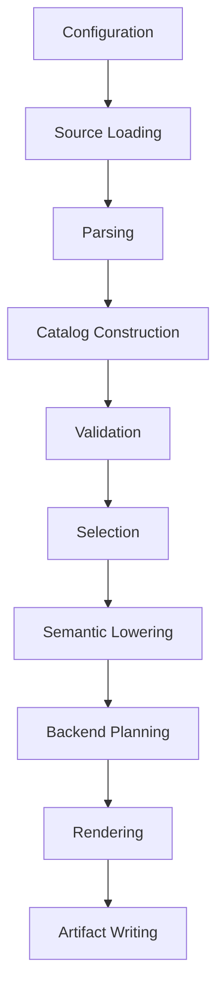

# Behavioral Specification

This specification defines observable behavior for the redesigned system. It is expressed in terms of inputs, processing, outputs, invariants, and compatibility expectations.

## Core Flow



Each stage receives explicit inputs and returns explicit outputs. Only source loading and artifact writing own filesystem side effects.

## Input Behavior

| Input | Expected Behavior | Evidence |
| --- | --- | --- |
| `.tsl` primitive files | Parse one or more primitive declarations with signatures, attributes, parameter names, descriptions, tests, generic parameters, and implementation blocks. | `tsldata/primitives/arithmetic/fundamental.tsl` |
| Extension file | Parse named hardware extensions and preserve metadata for selection, testing, backend support, and inheritance. | `tsldata/extensions/extension.tsl` |
| Type group file | Parse named type groups and expand them deterministically. | `tsldata/detail/types.tsl` |
| Lane set file | Parse named lane sets with lane counts and allowed type tags. | `tsldata/detail/lane_sets.tsl` |
| Flags file | Parse flag aliases and normalize CPU feature flags. | `tsldata/detail/flags.tsl` |
| Template file | Parse operation templates, shape strings, required fields, and optional fields. | `tsldata/detail/templates.tsl` |
| Language type maps | Map type tags to backend type names. | `tsldata/detail/lang/types/types_cpp.tsl`, `types_rust.tsl` |
| Translation maps | Map semantic operations to backend snippets. | `tsldata/detail/lang/translate_cpp.tsl`, `translate_rust.tsl` |
| Backend manifests | Resolve artifact name, extension, primary templates, specialization templates, wrappers, traits, and combined templates. | `frozen/generator_specs/backend_cpp.yaml`, `frozen/generator_specs/backend_rust.yaml` |

## Parsing Behavior

- Comments beginning with `#` or `//` are ignored outside multiline strings.
- Indentation defines nested blocks.
- Newlines inside inline maps enclosed by `{...}` are allowed.
- Strings, multiline strings, signed numbers, booleans, bare names, wildcard `*`, lists, key lists, and maps are valid values.
- `prim<signature>[attrs] name(params):` starts a primitive block.
- `template`, `extension`, `types`, `flags`, `language`, `translation`, and `lane_set` define catalog blocks.
- The parser must preserve enough source span information for downstream diagnostics.

Compatibility expectation: TSL files in `tsldata/` must parse without errors.

## Catalog Behavior

The catalog must contain immutable typed objects for:

- Primitive declarations and variants.
- Parameters and attributes.
- Implementation entries by declared target extension and type category.
- Primitive tests.
- Extension metadata.
- Type groups and lane sets.
- Backend language type maps and translation maps.
- Flag normalization.
- Template metadata.

Catalog construction must reject or diagnose malformed structures instead of silently discarding required data. Unknown extra fields may be preserved as constrained catalog values when they are not required for the current milestone. Repeated keys inside nested preserved fields are structural input and must not be merged semantically during catalog construction.

## Signature And Template Resolution

Signatures are normalized by removing whitespace. A signature plus attributes resolves to a template name.

| Signature Pattern | Attribute Condition | Template |
| --- | --- | --- |
| `v:=(v,v)` | none | `binary` |
| `m:=(v,v)` | none | `compare` |
| `v:=(m,v,v)` | `mask=zero` or `mask=pass_through` | `masked_binary` |
| `v:=v` | `cast=convert` | `convert` |
| `v:=v` | `cast=reinterpret` | `reinterpret` |
| `v:=(m,v)` | `mask=zero, op=expand` | `expand` |
| `v:=(m,v)` | `mask=zero, op=pack` | `pack` |
| `v:=(m,v)` | `mask=zero, op` omitted or `op=keep` | `masked_unary` |
| `v:=()` | `value=undef` | `set_undef` |
| `v:=()` | otherwise valid | `set_zero` |
| `v:=ptr` | `aligned=true|false` | `load` |
| `void:=(ptr,v)` | `aligned=true|false` | `store` |
| `v:=(v,sImm)` | `cast=convert, direction=up` | `convert_up` |
| `v:=(v,sImm)` | `cast=convert, direction=down` | `convert_down` |
| `m:=(m,v,v,v)` | `mask=zero` or `mask=pass_through` when provided | `masked_between` |
| `v:=sequence` | declared as `sequence()` with no runtime parameters | `sequence` |
| `ptr:=(s)` | none | `alloc` |

The full resolution table is grounded in `frozen/generator_specs/signatures.yaml`.

If no rule matches, emit a diagnostic containing primitive name, signature, attributes, and source location.

## Attribute Behavior

- `mask` values are limited to `zero` and `pass_through` where masks are required.
- `aligned` and `packed` values are booleans or boolean wildcards.
- `op` values for relevant mask/load/store shapes are constrained to `pack`, `expand`, or `keep` as appropriate.
- `value` values for zero/undef/all primitives are constrained by signature.
- `cast` values are constrained to `convert` or `reinterpret`.
- `direction` values are constrained to `up` or `down` when `cast=convert`.
- `arg_count(<param>)=return_vector_length` is required for repeated scalar splat signatures such as `v:=s...`.
- Template-specific required fields from `tsldata/detail/templates.tsl` must be present after template resolution.

## Wildcard Expansion

Boolean wildcard attributes expand deterministically.

Example:

| Source Attribute | Variants |
| --- | --- |
| `aligned=*` | `aligned=true`, `aligned=false` |
| `aligned=*, packed=*` | four variants ordered deterministically |

Test names created from wildcard variants should receive stable suffixes when one test definition produces multiple concrete variants. The suffix policy must be specified and golden-tested before it becomes compatibility-critical.

## Variant Expansion And Selection Planning Behavior

Variant expansion consumes a reference-validated catalog built from a validated catalog. Boolean wildcard attributes currently expand for `aligned=*` and `packed=*`; each wildcard expands in declaration order with `true` before `false`, producing stable variant identifiers that contain the primitive name, normalized signature, concrete attributes, and parameter names.

Selection planning is pure and host-independent. A `SelectionRequest` may filter primitive variants by primitive name, template name, explicit extension names, or supplied CPU feature flags. CPU flags normalize through the flag catalog before planning; flag aliases and already-normalized flag names are accepted, while unknown requested flags are diagnostics. When no explicit extension list is supplied, autodetectable extensions are allowed only when their normalized `lscpu_flags` are included in the supplied CPU flags. Support extensions such as `scalar` and `generic` are added by an explicit request policy. An empty allowed-extension set means no implementation selectors are planned; it is not an implicit "allow all" mode.

Selection plans record variant candidates, allowed extensions, normalized CPU flags, implementation extension selectors, implementation type selectors, and normalized feature requirements. They do not select a final implementation body, evaluate backend support, expand dependency closure, parse TSIL, or render code.

`requires` maps are planned only where their selector role is structurally clear. Extension-keyed maps with no recognizable extension selector produce diagnostics. Mixed flag-policy keys that appear beside known extension or type selectors are preserved as deferred policy rather than interpreted as catalog references.

## Type And Lane Behavior

- Type groups expand to concrete type tags using `tsldata/detail/types.tsl`.
- Lane sets constrain test lane counts by type group using `tsldata/detail/lane_sets.tsl`.
- Concrete type tags currently include integer and floating tags such as `si8`, `ui8`, `si16`, `ui16`, `si32`, `ui32`, `si64`, `ui64`, `f32`, and `f64`.
- Pointer-like tags such as `ptr` may appear in signatures and type maps but require explicit handling because they are not arithmetic vector lanes.

## Extension And Feature Behavior

- Extensions are selected explicitly or derived from normalized CPU flags.
- Extension inheritance forms fallback chains. A target extension can reuse implementation sources from its ancestors when the child has no direct implementation.
- Inheritance must reject unknown parents, self-inheritance, and cycles.
- Backend support flags in extension metadata filter extensions by target language.
- Feature requirements in implementation blocks are normalized through the flag map before support checks.
- `scalar` and `generic` are support extensions and are included as forced extensions unless configuration explicitly changes that policy.

## Reference Validation Behavior

Reference validation checks that declarative names already represented by the catalog resolve to known declarations before later selection or lowering stages run.

- Type group members must reference known type groups.
- Lane set `types` entries must reference known type groups.
- Extension inheritance, backend generation-support extension lists, and extension template filters must reference known extensions or templates.
- Primitive test `type`, `to_type`, `lane_set`, `extension`, `to_extension`, and `template` fields must reference known catalog declarations.
- Primitive implementation extension selectors, implementation type selectors, and structurally typed `requires` map keys must reference known extensions or type groups when the `requires` shape is unambiguous. Flag-policy-shaped `requires` keys are deferred until flag normalization is typed.
- A validated primitive's resolved template name must still reference a known operation template.

Reference validation does not yet normalize flag aliases, inspect backend language or translation maps, parse TSIL dependencies, or decide whether type, lane, extension, and template combinations are semantically compatible. Preserved nested primitive and extension fields currently retain the owning declaration span rather than per-field spans, so diagnostics for those nested references use the owning declaration location until those nested structures are promoted into typed catalog models.

## Implementation Selection Behavior

Given a catalog, selection request, and backend, the selector produces an ordered set of supported implementation candidates.

Candidate identity includes:

- Emitted primitive name.
- Source primitive name.
- Template.
- Backend.
- Target extension.
- Source extension that supplied the implementation.
- Type tag.
- Required flags.
- Implementation definition.

The selector must:

- Expand primitive wildcard variants before matching.
- Respect requested primitive names, templates, and extensions.
- Include selected primitive dependencies where dependency expansion is requested.
- Expand type categories through type groups.
- Apply extension fallback chains in deterministic order.
- Apply backend support and CPU feature requirements.
- Emit diagnostics for ambiguous or malformed implementation maps.

Milestone 8 candidate selection treats implementation payload fields as opaque
metadata. It may carry a TSIL payload, intrinsic payload, or future
backend-specific payload without parsing or rendering it. Backend filtering is
limited to explicit extension metadata in this slice: a backend entry with
`supported false` excludes the candidate, while richer backend manifest policy is
deferred. When a request supplies CPU flags, implementation-level required flags
must be satisfied by the normalized request flags; when no CPU flags are
supplied, required flags remain candidate metadata for a later target-support
policy.

## Dependency Behavior

TSIL bodies can call other primitives with syntax such as:

```text
call<primitive=mov attrs[mask=zero]>(...)
call<primitive=@self[type<backend>(vector::as_extension(scalar))]>(...)
```

The redesign should parse or model dependency references rather than rely only on regex. Dependencies affect targeted generation because support primitives must be included even when the user selected a small primitive set.

Milestone 9 dependency planning conservatively discovers only explicit
`call<primitive=...>` forms inside opaque TSIL implementation payloads. It
recognizes primitive names, optional raw type arguments such as `[Vec]`, optional
`attrs[...]` maps, and `@self` references resolved to the source primitive name.
It does not parse arbitrary TSIL expressions, resolve generic type or extension
arguments, choose dependency implementations, lower call bodies, or render code.
The closure result contains deterministic required primitive names and the
candidate IDs already available for those primitive names. Known dependency
primitive names that are not present in the current candidate set are reported as
unplanned primitive names so a later pipeline stage can re-run selection with an
expanded request. Unknown dependency primitive names and non-trivial dependency
cycles are diagnostics.

## Lowering Behavior

Implementation bodies may be:

- TSIL strings.
- Backend-specific strings or maps.
- Intrinsic names or intrinsic compose expressions.

The new system must separate:

- Semantic TSIL analysis.
- Backend-neutral intermediate representation.
- Backend-specific translation.
- Text rendering.

Immediate values (`sImm`) and generic parameters must be explicit model data during lowering, not string-only conventions.

## Rendering Behavior

Rendering receives a backend plan and produces artifacts. Rendering must not perform selection, parse source files, read CPU flags, or write files.

Backend renderers must:

- Use typed manifest data.
- Use stable job ordering.
- Validate referenced templates or rendering strategies before rendering.
- Produce stable artifact content for identical inputs.
- Return artifact metadata such as backend, required flags, extension list, and suite count when relevant.

The first C++ backend slice supports only the `cpp` backend and `generated`
artifact kind. It renders a deterministic header-like artifact that summarizes
selected primitive candidates, required flags, target/source extensions, type
tags, template names, and escaped opaque TSIL payload text. This slice does not
lower TSIL, evaluate backend translations, render full backend templates, or
produce final SIMD implementation code.

The first Rust backend slice supports only the `rust` backend and `generated`
artifact kind. It renders a deterministic Rust module-like summary artifact
analogous to the C++ summary: selected primitive candidates, required flags,
target/source extensions, type tags, template names, and escaped opaque TSIL
payload text. This slice does not lower TSIL, evaluate Rust translation maps,
render full Rust templates, invoke Cargo, or produce final Rust SIMD
implementation code.

Public pipeline rendering dispatches through an explicit backend renderer
registry. Generic pipeline code builds backend-neutral artifact plans and asks
the registry for the requested renderer; it must not grow backend-specific
rendering conditionals for each new backend.

Backend renderers must reject backend mismatches before producing artifacts:

- A renderer must reject an artifact plan or descriptor for a backend other than
  its own backend ID.
- A renderer must reject candidates selected explicitly for a different backend.
- Candidates without backend-specific selection metadata may be accepted by a
  renderer only when the renderer documents that generic policy.

## Backend Manifest And Artifact Planning Behavior

Backend artifact planning consumes typed backend manifests, selected implementation
candidates, and dependency closure metadata. It does not render templates, lower
TSIL, write files, inspect host hardware, or evaluate backend runtime support.

Backend manifests are declarative metadata. YAML backend manifest files may be
loaded at the I/O boundary, but downstream planning consumes typed
`BackendManifest` values. The authoritative backend set for artifact planning is
the supplied `BackendManifestSet`; a minimal manifest set may be derived from
catalog entries only when matching `language` and `translation` entries exist
for the same backend ID.

Artifact descriptors are content-free. They record logical output paths,
artifact kind, backend/language IDs, selected candidate IDs, and primitive-level
dependency closure names. When dependency closure is primitive-name based, the
descriptor preserves that conservative primitive-level closure rather than
choosing dependency implementations.

Artifact plans must:

- Reject unknown requested backend IDs.
- Reject duplicate logical target paths.
- Sort artifact descriptors deterministically.
- Produce stable descriptor digest metadata for identical planning inputs.

## Artifact Writing Behavior

The artifact writer:

- Resolves output paths relative to an explicit root.
- Sorts artifacts deterministically.
- Rejects duplicate logical target paths.
- Computes SHA-256 digests.
- Creates parent directories.
- Skips writing unchanged files.
- Reports written paths, skipped paths, and digest map.

Artifact writing is the only generation stage that mutates the filesystem.

## Test Generation Behavior

Test planning must:

- Select tests relevant to generated primitive implementations.
- Filter unsupported backend/extension/type combinations.
- Adjust or reject lane counts based on target extension vector size and runtime-lane behavior.
- Apply mask resize rules and no-repeat mask rules from the test manifest.
- Skip templates that cannot be tested for runtime-lane targets when documented by manifest.
- Produce deterministic test variants.

Test rendering must be backend-specific but data-driven.

## CLI Behavior

The CLI should support:

- Backend selection: C++, Rust.
- Input file selection.
- Extension selection.
- CPU flag injection and optional autodetection.
- Primitive and template selection.
- Code generation and test generation.
- Output path/root selection.
- Diagnostic reporting with nonzero exit on errors.

Host hardware autodetection belongs to CLI adapters. API callers must be able to supply flags explicitly.

Milestone 13 exposes the accepted pipeline through a public API and a minimal
diagnostic CLI. The API accepts explicit source configuration, selection
configuration, optional backend manifests, and an optional in-memory render
backend. It orchestrates source loading, parsing, catalog construction,
validation, selection planning, candidate selection, dependency closure,
artifact planning, and the accepted C++ summary renderer when requested. The API
does not write generated artifacts and does not inspect host hardware.

The Milestone 13 CLI is a thin adapter over the public API. It parses explicit
source, manifest, backend, primitive, template, extension, and CPU-flag options;
it reads host hardware flags only when autodetection is explicitly requested;
and it reports diagnostics with a nonzero exit code on errors. Full production
CLI compatibility, output writing, skip-unchanged behavior, production test
generation, and broad backend rendering remain deferred.

## Coverage And Reporting Behavior

Coverage reports are descriptive summaries over accepted pipeline outputs. They
must consume structured catalog, selection, candidate-selection, dependency,
artifact-plan, rendered-artifact, and diagnostic values that already exist in a
pipeline result or equivalent stage outputs. Report generation must not parse raw
TSL, re-run validation, re-run selection, render artifacts, inspect host
hardware, or mutate pipeline results.

The Milestone 15 report model summarizes:

- Catalog primitive rows, including declaration count and candidate coverage.
- Selection context, including requested backend/extensions and allowed
  extensions.
- Candidate body coverage, using implementation bodies as opaque metadata.
- Primitive dependency closure coverage, including unplanned primitive names.
- Backend summary-rendering coverage, including planned and rendered artifact
  counts.
- Diagnostic counts grouped by severity and code.
- Deferred categories such as artifact writing, TSIL lowering, production test
  generation, and full template rendering.

Structured JSON report output must be deterministic for identical pipeline
outputs. The Milestone 15 slice produces report values and JSON text in memory
only; report file writing, HTML parity with legacy reports, CI upload, and
production documentation generation remain deferred.

## Determinism Requirements

The following must be stable:

- Filesystem traversal order.
- Catalog item ordering.
- Wildcard expansion order.
- Extension fallback order.
- Type group expansion order.
- Candidate ordering.
- Render job ordering.
- Artifact ordering.
- Diagnostic ordering.
- Digest maps.
- Coverage report row and JSON key ordering.

Parallel stages may exist only if they merge results through stable keys.

## Intentional Changes From Legacy Behavior

| Legacy-Observed Behavior | New Behavior |
| --- | --- |
| Validators may raise `SystemExit`. | Validators return diagnostics or raise typed domain exceptions caught at the boundary. |
| Some later stages reparse raw TSL for dependencies or compatibility projections. | Typed catalog and IR are the canonical pipeline data. |
| Dicts remain dominant domain objects in many stages. | Dicts are confined to parser/boundary layers. |
| Host CPU flags can be read inside selection helpers. | Hardware data is supplied through configuration. |
| Regex-heavy TSIL handling is used for semantic tasks. | TSIL gets a parser/model at the milestone where lowering becomes real. |
| Backend template filenames drive behavior. | Backends expose typed capabilities and rendering strategies. |

## Compatibility Expectations

The new system should preserve:

- Successful parsing of `tsldata/`.
- Signature-to-template resolution for documented signatures.
- Attribute validation semantics that reflect `tsldata/detail/templates.tsl` and current primitive declarations.
- Extension metadata semantics, including inheritance and backend support.
- Deterministic generated artifacts once golden baselines are established.

The new system does not need to preserve:

- Internal legacy class/function names.
- Legacy module layout.
- Exact diagnostic wording unless a golden diagnostic test is introduced.
- Accidental behavior caused by malformed data silently being ignored.
