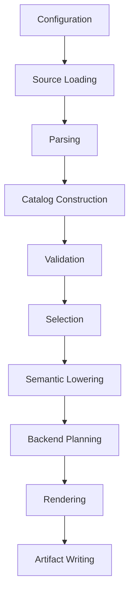

# Behavioral Specification

This specification defines observable behavior for the redesigned system. It is expressed in terms of inputs, processing, outputs, invariants, and compatibility expectations.

## Core Flow



Each stage receives explicit inputs and returns explicit outputs. Only source loading and artifact writing own filesystem side effects.

## Supplementary Output Asset Behavior

Backend/output stages may add generated-project scaffolding, helper source
files, and render templates under `supplementary/`. Static supplementary files
are copied byte-for-byte into in-memory `ArtifactSet` values. Template
supplementary files render from explicit typed render contexts only.

Templates may decide presentation details such as iteration, indentation, and
optional sections. They must not decide backend semantics, select primitive or
intrinsic implementations, evaluate TSIL, inspect raw source payloads, choose
fallbacks, or repair source text. Those decisions must already be represented
as typed backend/output values before rendering.

### M188 Supplementary Project Skeleton Boundary

Milestone 188 adds a small supplementary rendering boundary for project
skeleton artifacts. The boundary consumes typed `SupplementaryStaticAsset`,
`SupplementaryTemplateAsset`, and `ProjectSkeletonRenderContext` values and
returns an in-memory `ArtifactSet` plus diagnostics. It does not write files.

The accepted M188 template renderer uses Python standard-library formatting
only; it does not introduce a Jinja dependency. The accepted project skeleton
context exposes only presentation fields:

- `backend_id`;
- `project_name`;
- `artifact_path`;
- `helper_manifest`.

Templates that reference semantic-looking fields such as primitive names,
type tags, intrinsic names, TSIL/source payloads, feature gates, dependency
fields, selectors, or fallback fields are rejected before formatting with
`TSL-SUPPLEMENTARY-TEMPLATE-SEMANTIC-FIELD`. Unsupported compound field
syntax is rejected with
`TSL-SUPPLEMENTARY-TEMPLATE-UNSUPPORTED-FIELD-SHAPE`. Unknown presentation
fields are rejected with `TSL-SUPPLEMENTARY-TEMPLATE-UNKNOWN-FIELD`. Missing
static and template files are reported as
`TSL-SUPPLEMENTARY-MISSING-STATIC-ASSET` and
`TSL-SUPPLEMENTARY-MISSING-TEMPLATE-ASSET`.

### M217 Primitive Template Boundary

Milestone 217 adds a primitive-template rendering boundary for C++ and Rust
under `supplementary/templates/cpp/` and `supplementary/templates/rust/`. This
boundary consumes dedicated `PrimitiveTemplateRenderContext` values and returns
an in-memory `ArtifactSet` plus diagnostics. It does not write files, render a
generated project, compile output, select primitives, perform dependency
closure, reopen lowering, or parse raw TSIL.

The accepted M217 primitive-template renderer uses Python standard-library
formatting only; it does not introduce a Jinja dependency. The primitive
context is intentionally separate from the M188 `ProjectSkeletonRenderContext`
because primitive templates need different already-decided presentation
fields.

Primitive templates may format only presentation fields that have already been
decided before rendering, including:

- `artifact_path`;
- `backend_id`;
- `profile_name`;
- `includes`;
- `imports`;
- `namespace_open` and `namespace_close`;
- `module_open` and `module_close`;
- `primitive_declarations`;
- `primitive_definitions`;
- `rendered_body_text`.

Templates that reference unresolved semantic/source fields such as raw `tsil`,
`primitive_name`, `type_tag`, `intrinsic_name`, primitive selectors,
dependency rules, backend metadata keys, lowering requests, fallback fields,
or source payloads are rejected before formatting with
`TSL-PRIMITIVE-TEMPLATE-SEMANTIC-FIELD`. Unsupported compound field syntax is
rejected with `TSL-PRIMITIVE-TEMPLATE-UNSUPPORTED-FIELD-SHAPE`. Unknown fields
are rejected with `TSL-PRIMITIVE-TEMPLATE-UNKNOWN-FIELD`. Missing primitive
template files are reported as `TSL-PRIMITIVE-TEMPLATE-MISSING-TEMPLATE`.

The M217 templates are minimal presentation files. They accept already-rendered
primitive declaration/definition/body text for fixture rendering only. The
full selected primitive render context, Rust intrinsic-call rendering, shared
body-token replacement, generated-project integration, artifact writing, and
build verification remain later backend/output work.

### M227 Primitive Function-Shape Template Boundary

Milestone 227 adds a focused function-shape template boundary for exact
`v:=(v,v)` primitive functions. The selected shape is carried from the typed
catalog/lowering `PrimitiveSignature`, not inferred from raw source text in a
renderer or template. Unsupported shapes diagnose before rendering.

Function-shape templates live under
`supplementary/templates/{cpp,rust}/shapes/` and may format only already
decided presentation fields: function name text, result type text, parameter
list text, and already-rendered body text. Shape templates reject semantic or
source fields such as `primitive_name`, `signature_shape`, `type_tag`,
`intrinsic_name`, and `tsil` before formatting.

M227 renders the exact function definition into
`RenderedPrimitiveDefinitionText`, which the existing file-level primitive
templates then compose into profile artifacts. It does not add intrinsic
semantics, broaden TSIL parsing, or implement the real x86 fixture.

### M238 Generated-Project Source Template Boundary

Milestone 238 applies the presentation-only template boundary to the remaining
generated-project source skeleton artifacts. CMake and Cargo buildsystem
templates remain under `supplementary/buildsystem/**/templates/`; generated
C++/Rust public/profile/test source presentation now lives under:

```text
supplementary/templates/cpp/generated_project/
supplementary/templates/rust/generated_project/
```

The boundary renders:

- `cpp/include/tsl.hpp`;
- `cpp/include/profiles/{profile}.hpp`;
- `cpp/tests/smoke.cpp`;
- `rust/src/lib.rs`;
- `rust/src/profiles/{profile}.rs`;
- `rust/tests/smoke.rs`.

Python generated-project code supplies already-decided presentation values
such as profile macros, profile file stems, profile names, machine families,
Rust feature names, Rust module names, crate/package names, and already
rendered partial joins. Python may select a first/subsequent presentation
partial and join rendered partial fragments deterministically, but it must not
assemble whole generated C++/Rust public headers, profile files, or smoke
tests from language-line lists.

Generated-project source templates reject unresolved semantic/source fields
such as raw `tsil`, `primitive_name`, `type_tag`, `intrinsic_name`,
primitive selectors, dependency rules, backend metadata keys, lowering
requests, fallback fields, and source payloads before formatting with
`TSL-GENERATED-PROJECT-TEMPLATE-SEMANTIC-FIELD`. Unsupported compound field
syntax is rejected with
`TSL-GENERATED-PROJECT-TEMPLATE-UNSUPPORTED-FIELD-SHAPE`. Unknown or
unsupported fields are rejected with
`TSL-GENERATED-PROJECT-TEMPLATE-UNKNOWN-FIELD`. Missing generated-project
templates are reported as `TSL-GENERATED-PROJECT-MISSING-TEMPLATE`.

M238 preserves the existing artifact paths, media types, metadata,
deterministic ordering, manifest-clean writing behavior, scalar and
scalar+`avx2` profile build flags, and after-write C++/Rust build
verification. It does not reopen lowering, parse `.tsl` bodies, implement the
real x86 intrinsic fixture, add intrinsic translation/rendering, or change
primitive selection.

### M239 Backend Intrinsic Body-Token Render Bridge

Milestone 239 adds a focused backend/rendering bridge for already-lowered
typed intrinsic body-token streams. The bridge consumes typed
`BackendIntrinsicHandoff` values plus already-decided primitive presentation
values. It does not parse, discover, rescan, or lower source text.

The accepted M239 bridge performs this side-effect-free sequence:

```text
typed backend intrinsic handoff
-> accepted backend intrinsic invocation assembly
-> accepted C++ or Rust intrinsic call rendering
-> accepted body-token substitution
-> accepted v:=(v,v) function-shape template
-> accepted primitive profile template
-> in-memory ArtifactSet
```

C++ and Rust are handled in parity. Rust architecture-module selection is not
inferred by the bridge; callers supply the existing typed
`RustArchitectureModule`. Any raw text surrounding the intrinsic request in
the handoff is treated as already-decided body-token presentation, not as
target-language syntax to parse or repair.

The bridge stops before returning artifacts when typed inputs are missing or
unsupported. It adds:

- `TSL-INTRINSIC-BODY-TOKEN-BRIDGE-MISSING-HANDOFF-REQUEST` when the handoff
  has no already-lowered backend intrinsic request segment.
- `TSL-INTRINSIC-BODY-TOKEN-BRIDGE-UNSUPPORTED-BACKEND` for bridge contexts
  whose backend is not `cpp` or `rust`.
- `TSL-INTRINSIC-BODY-TOKEN-BRIDGE-UNUSED-MODIFIER-TRANSLATION` when a
  translated compose modifier does not belong to any intrinsic compose request
  segment in the handoff.

Diagnostics from the accepted intrinsic assembly, call rendering, body-token
rendering, function-shape rendering, and primitive-template boundaries are
preserved and likewise prevent partial artifact output.

M239 does not implement real corpus primitive selection, dependency closure,
the full `fundamental.tsl` x86 fixture, generated-project composition,
artifact writing, build verification, lowering changes, parser changes, or new
backend semantics.

### M218 Typed Primitive Render Context

Milestone 218 adds a typed primitive render model for already-decided
primitive presentation values. It adapts those values into the M217
`PrimitiveTemplateRenderContext` for C++ and Rust without rendering real
selected primitives.

The accepted model uses typed wrappers for presentation text and identifiers,
including backend id, profile name, logical artifact path, include/import
lines, namespace/module presentation text, primitive declarations,
definitions, body text, and deterministic primitive sort keys. These values
mean "already rendered for presentation"; they are not raw source, raw TSIL,
catalog selections, dependency requests, backend metadata lookups, lowering
requests, or semantic render decisions.

The M218 adapter:

- supports C++ and Rust primitive render models in parity;
- sorts backend contexts by logical artifact path;
- sorts primitive records by explicit presentation sort key;
- preserves rendered declaration, definition, and body text exactly except for
  deterministic block joining;
- rejects raw TSIL/source sentinel values with
  `TSL-PRIMITIVE-RENDER-CONTEXT-RAW-TSIL`;
- rejects unresolved semantic sentinel values with
  `TSL-PRIMITIVE-RENDER-CONTEXT-UNRESOLVED-VALUE`;
- rejects unsupported typed value shapes with
  `TSL-PRIMITIVE-RENDER-CONTEXT-UNSUPPORTED-VALUE`;
- rejects backend-inappropriate presentation fields with
  `TSL-PRIMITIVE-RENDER-CONTEXT-UNSUPPORTED-BACKEND-FIELD`;
- rejects unsupported backend ids with
  `TSL-PRIMITIVE-RENDER-CONTEXT-UNKNOWN-BACKEND`.

M218 deliberately does not perform primitive selection, dependency closure or
topological dependency sorting, body-token substitution, Rust intrinsic-call
rendering, source-operation rendering, generated-project integration, artifact
writing, build verification, Jinja rendering, new lowering, raw TSIL rescans,
or statement parsing.

### M222 Primitive Render Plan Boundary

Milestone 222 adds a typed primitive render plan assembly boundary for C++ and
Rust. It consumes already-decided profile/backend context, artifact path,
include/import and namespace/module presentation text, ordered selected
primitive records, already-rendered declaration/definition/body text, and
plan/record provenance. It adapts those values into the accepted M218
primitive render model and then into M217 `PrimitiveTemplateRenderContext`
values.

M222 preserves the supplied primitive record order as dependency/planning
order. This is distinct from M218's default presentation-sort behavior:
ordinary `adapt_primitive_render_models(...)` still sorts primitive records by
`PrimitiveRenderSortKey`, while the M222 plan adapter explicitly requests
supplied-order adaptation. The plan does not compute dependency closure or
topological order; callers must supply an already-decided order.

The M222 plan adapter:

- supports C++ and Rust plans in parity;
- orders multiple plan contexts deterministically by logical artifact path,
  backend id, and profile name;
- preserves plan and primitive-record source/provenance values on the returned
  accepted plans;
- rejects unsupported backend ids with
  `TSL-PRIMITIVE-RENDER-PLAN-UNKNOWN-BACKEND`;
- rejects duplicate plan identities with
  `TSL-PRIMITIVE-RENDER-PLAN-DUPLICATE-PLAN`;
- rejects duplicate primitive record identities within a plan with
  `TSL-PRIMITIVE-RENDER-PLAN-DUPLICATE-PRIMITIVE`;
- rejects backend-inappropriate plan fields with
  `TSL-PRIMITIVE-RENDER-PLAN-WRONG-BACKEND-FIELD`;
- forwards M218 raw TSIL/source and unresolved semantic sentinel diagnostics.

M222 does not reopen lowering, rescan raw TSIL, run body-token substitution,
translate source operations, intrinsics, type queries, value queries,
signatures, or declarations, render full generated projects, write artifacts,
run build verification, or put semantic decisions into templates.

### M223 First Real Generated Primitive Project

Milestone 223 composes one tiny already-decided primitive profile artifact for
C++ and one for Rust with the accepted M191 generated-project skeleton. It
uses M222 primitive render plans and the M217 primitive templates to render
profile artifacts, then combines those artifacts with the skeleton before the
manifest-clean writer and build verifier run.

The generated primitive project composition boundary:

- consumes only in-memory `ArtifactSet` values from the skeleton renderer and
  primitive template renderer;
- allows primitive artifacts to replace skeleton placeholder artifacts only at
  the exact selected scalar profile paths
  `cpp/include/profiles/scalar.hpp` and `rust/src/profiles/scalar.rs`;
- preserves public entry artifacts, buildsystem artifacts, smoke tests, and
  unrelated skeleton artifacts;
- rejects duplicate logical paths inside skeleton input with
  `TSL-GENERATED-PRIMITIVE-PROJECT-DUPLICATE-SKELETON-ARTIFACT`;
- rejects duplicate logical paths inside primitive input with
  `TSL-GENERATED-PRIMITIVE-PROJECT-DUPLICATE-PRIMITIVE-ARTIFACT`;
- rejects primitive/skeleton collisions outside allowed profile replacement
  paths with `TSL-GENERATED-PRIMITIVE-PROJECT-DUPLICATE-LOGICAL-PATH`;
- returns a deterministic in-memory `ArtifactSet` and diagnostics.

M223 verifies that the combined scalar C++ and Rust generated projects compile
and run their accepted smoke tests through the existing after-write build
verifier. It does not parse `.tsl`, select primitives from `tsldata`, reopen
lowering, run body-token substitution, perform dependency closure, broaden
profile selection beyond scalar, or hide semantic decisions in templates,
renderers, the artifact writer, or the build verifier.

### M224 Parsed Tiny TSL To Generated Project

Milestone 224 connects one tiny parsed `.tsl` source fixture to the accepted
generated-project path:

```text
SourceDocument
  -> TslParser
  -> CatalogBuilder
  -> Selector
  -> Lowerer
  -> PrimitiveRenderPlan
  -> primitive templates
  -> generated primitive project composition
```

The M224 bridge consumes accepted `LoweredFunction` values and produces M222
`PrimitiveRenderPlan` values for the single scalar profile. It supports only
the deliberately tiny scalar `si32` binary `add` slice for C++ and Rust. The
bridge renders already-decided presentation text for profile artifacts and
preserves the accepted M217-M223 output boundaries: primitive templates format
the plan, generated-project composition combines artifacts in memory, the
artifact writer is the filesystem boundary, and the build verifier runs after
write.

Accepted M224 diagnostics include:

- `TSL-PARSED-GENERATED-PRIMITIVE-UNSUPPORTED-PROFILE-SET`
- `TSL-PARSED-GENERATED-PRIMITIVE-UNSUPPORTED-BACKEND`
- `TSL-PARSED-GENERATED-PRIMITIVE-UNSUPPORTED-TYPE`
- `TSL-PARSED-GENERATED-PRIMITIVE-UNSUPPORTED-RESULT-TYPE`
- `TSL-PARSED-GENERATED-PRIMITIVE-UNSUPPORTED-EXPRESSION`
- `TSL-PARSED-GENERATED-PRIMITIVE-UNSUPPORTED-OPERATION`

M224 deliberately does not use the older direct `Generator`/backend emitter
path, generate from the full `tsldata` corpus, broaden the parser, add TSIL
syntax, parse operators, repair source, compute dependency closure, broaden
profiles beyond scalar, add generated tests, or hide semantic decisions in
templates, renderers, the artifact writer, or the verifier.

### M225 Generated Profile Build Flags

Milestone 225 extends the generated-project render model with already-decided
target-feature build presentation values derived from the selected M189
machine profile facts.

Accepted M225 behavior:

- `scalar` remains a no-feature profile and renders no C++ target-feature
  compile options or Rust target-feature flags.
- Non-scalar profiles carry typed C++ compile options and typed Rust
  target-feature values before template rendering.
- Non-scalar profile spellings are derived from the M189 feature flag
  normalization catalog, with explicit machine-profile alternatives taking
  precedence. Missing feature spelling evidence is a diagnostic boundary, not
  a renderer-side spelling guess.
- The generated CMake project consumes C++ profile compile options through
  `target_compile_options` in the selected `TSL_PROFILE` branch.
- The generated Cargo manifest records profile target-feature metadata as
  presentation-only package metadata. Cargo features still select profile
  modules; they do not decide target features.
- After-write Rust verification consumes the typed Rust target-feature values
  by setting profile-specific `RUSTFLAGS` on the generated `cargo test`
  command.
- A tiny generated `scalar,avx2` project can be written through
  manifest-clean mode and configured/built/tested for C++ and Rust without
  real intrinsic code.

M225 does not generate real SIMD intrinsic calls, parse or lower new `.tsl`
forms, broaden primitive rendering beyond the M224 tiny fixture, model
compiler capability or host autodetection, add qemu/aarch64/NEON/SVE
verification, or put profile feature semantics in templates.

### M189 Machine Feature Profile Boundary

Milestone 189 adds a typed machine feature profile catalog for generated
project build metadata. The product profile source lives at
`supplementary/buildsystem/machine_profiles.json` and is grouped by
architecture family. Each profile has a name, a space-separated feature flag
string, and optional alternative feature spellings.

Feature flags normalize through `tsldata/detail/flags.tsl`. A source flag may
be an alias listed in that file or an already-normalized canonical flag
spelling that appears as a normalization result. The `generic/scalar`
profile's `NOSIMD-INVALID` value is a sentinel for no SIMD target features and
is not emitted as a feature flag.

Alternative entries map a canonical feature key to a source-provided
build/presentation spelling. The key must normalize through the flag catalog;
the value is preserved as authored and is not required to be a canonical TSL
feature flag.

Selected profiles expose typed build option values such as target family,
target profile name, normalized feature list, and alternative spellings. These
values are build metadata only. The generator does not decide whether a
compiler supports the requested feature set, does not perform host
autodetection, and does not invoke a compiler.

Accepted diagnostics include:

- `TSL-FLAGS-MALFORMED-FORM`
- `TSL-FLAGS-DUPLICATE-SPELLING`
- `TSL-MACHINE-PROFILE-MALFORMED-JSON`
- `TSL-MACHINE-PROFILE-MALFORMED-JSON-SHAPE`
- `TSL-MACHINE-PROFILE-MALFORMED-FAMILY`
- `TSL-MACHINE-PROFILE-MALFORMED-ENTRY`
- `TSL-MACHINE-PROFILE-MALFORMED-NAME`
- `TSL-MACHINE-PROFILE-MALFORMED-FLAGS`
- `TSL-MACHINE-PROFILE-MALFORMED-ALTERNATIVES`
- `TSL-MACHINE-PROFILE-DUPLICATE-PROFILE`
- `TSL-MACHINE-PROFILE-DUPLICATE-FLAG`
- `TSL-MACHINE-PROFILE-DUPLICATE-ALTERNATIVE`
- `TSL-MACHINE-PROFILE-UNKNOWN-FLAG`
- `TSL-MACHINE-PROFILE-UNKNOWN-PROFILE`

### M190 Backend Metadata Catalog Boundary

Milestone 190 adds a typed backend metadata catalog for active C++ and Rust
language/type maps and translation templates under `tsldata/detail/lang/**`.
The active loader reads exactly the current C++ and Rust metadata sources.
C17 remains deferred evidence and is not loaded into the active catalog.

Backend language maps promote entries such as `s32 {type "int32_t"}` into
typed backend/type/spelling facts. Backend translation maps promote entries
such as `call "..."`
and `value_uninit "{}"` into typed inert template facts. Multiline templates,
such as the Rust `preamble`, are preserved as authored template text. M190
does not format, evaluate, inspect placeholders, render code, or replace
backend emitters.

Accepted diagnostics include:

- `TSL-BACKEND-METADATA-SOURCE-NOT-FOUND`
- `TSL-BACKEND-METADATA-MALFORMED-LANGUAGE`
- `TSL-BACKEND-METADATA-MALFORMED-TYPE`
- `TSL-BACKEND-METADATA-MALFORMED-TRANSLATION`
- `TSL-BACKEND-METADATA-MALFORMED-TRANSLATION-ENTRY`
- `TSL-BACKEND-METADATA-UNCLOSED-TRANSLATION-TEMPLATE`
- `TSL-BACKEND-METADATA-DUPLICATE-TYPE`
- `TSL-BACKEND-METADATA-DUPLICATE-TRANSLATION`
- `TSL-BACKEND-METADATA-UNKNOWN-TYPE-SPELLING`
- `TSL-BACKEND-METADATA-UNKNOWN-TRANSLATION`

### M192 Backend Type Spelling Translation Boundary

Milestone 192 adds the first backend translation consumer for accepted
lowering handoff values. It consumes typed `BackendTypeSpellingRequest`
objects and the typed backend metadata catalog; it does not rediscover,
parse, repair, or render raw `type<backend>(...)` source text.

Supported requests are deliberately small:

- `LoweredScalarTypeIdentity` for scalar tags `si8`, `si16`, `si32`, `si64`,
  `ui8`, `ui16`, `ui32`, `ui64`, `f32`, and `f64`;
- `LoweredSizeType()`.

Signed and unsigned scalar source tags normalize to backend language-map keys
before lookup: `si32` becomes `s32`, and `ui32` becomes `u32`. Float tags
already match the language-map keys. The final scalar spelling is read from
the active backend language map, such as C++ `s32 -> int32_t` or Rust
`u32 -> u32`. `LoweredSizeType()` is fulfilled by the exact backend
translation metadata entry `type_size`, such as C++ `std::size_t` or Rust
`usize`.

The result is a typed backend translated type spelling carrying the original
request, backend ID, spelling text, metadata kind, metadata key, request
source, and metadata source location. Collection translation preserves request
order. Renderers and templates still receive only already-decided values and
must not perform type lookup, scalar normalization, or metadata evaluation.

Accepted M192 diagnostic codes include:

- `TSL-BACKEND-TYPE-SPELLING-MISSING-METADATA`
- `TSL-BACKEND-TYPE-SPELLING-UNSUPPORTED-BACKEND`
- `TSL-BACKEND-TYPE-SPELLING-UNSUPPORTED-VALUE`
- `TSL-BACKEND-TYPE-SPELLING-UNSUPPORTED-SCALAR-TAG`
- `TSL-BACKEND-TYPE-SPELLING-MISSING-SCALAR-SPELLING`
- `TSL-BACKEND-TYPE-SPELLING-MISSING-SIZE-TYPE`

### M193 Backend Value Translation Boundary

Milestone 193 adds a typed backend value translation boundary for existing
`BackendValueRequest` values and the typed backend metadata catalog. It does
not rediscover or parse raw `value<backend>(...)` source text, render output,
assemble intrinsic names, or evaluate arbitrary translation templates.

Supported requests are metadata-only:

- `BackendUninitValueRequest(kind="array")` through `value_array_uninit`;
- `BackendUninitValueRequest(kind="scalar")` through `value_uninit`;
- `BackendConstantValueRequest(name="x86::mm_fround_to_zero")` through
  `value_mm_fround_to_zero`.

A metadata template is promoted to a backend value result only when it has no
unresolved `{name}` placeholder fields. Literal braces such as C++ `{}` and
Rust block braces are allowed, but Rust `value_array_uninit` contains
`{type}` and is therefore a diagnostic in this milestone until a later typed
type context is part of the request or rule input.

The result is a typed backend translated value carrying the original request,
backend ID, backend value text, translation metadata key, request source, and
metadata source location. Collection translation preserves request order and
accumulates diagnostics without repairing unsupported requests.

Accepted M193 diagnostic codes include:

- `TSL-BACKEND-VALUE-TRANSLATION-MISSING-METADATA`
- `TSL-BACKEND-VALUE-TRANSLATION-UNSUPPORTED-BACKEND`
- `TSL-BACKEND-VALUE-TRANSLATION-UNSUPPORTED-REQUEST`
- `TSL-BACKEND-VALUE-TRANSLATION-UNSUPPORTED-UNINIT`
- `TSL-BACKEND-VALUE-TRANSLATION-UNSUPPORTED-CONSTANT`
- `TSL-BACKEND-VALUE-TRANSLATION-MISSING-TRANSLATION`
- `TSL-BACKEND-VALUE-TRANSLATION-UNRESOLVED-PLACEHOLDER`

### M195-M206 Intrinsic Modifier Translation Boundary

Milestone 195 adds a typed backend translation boundary for accepted M182
`BackendIntrinsicComposeHandoffRequest` modifier fields. It consumes typed
handoff values only; it does not rediscover or parse raw
`intrin_compose<...>(...)` source text, direct `intrin<...>` names, or
intrinsic argument payloads.

Supported translations are final literal modifier components:

- direct literal `suffix` symbol or string operands that contain no unresolved
  wildcard marker;
- direct literal `post` symbol or string operands;
- direct literal `infix` symbol or string operands except the semantic marker
  `to_type_suffix`;
- quoted-string `infix_sep` operands;
- integer-literal `immediate(N)` operands.

The result is a typed backend intrinsic modifier value carrying the backend
ID, original modifier field, modifier name, translated component value, and
source provenance. Collection translation preserves modifier order and
accumulates diagnostics.

Milestone 197 adds metadata-backed type-derived suffix translation for typed
`suffix=value<backend>(intrin::suffix(TYPE))` fields whose `TYPE` argument has
already lowered to a scalar type identity. The translator maps
`(intrinsic_style, type_tag)` to a backend metadata key and takes the emitted
fragment text from active C++/Rust backend metadata.

Milestone 198 adds metadata-backed prefix translation for the observed typed
`prefix=value<backend>(intrin::prefix)` family. The translator maps selected
x86-family extensions `sse`, `sse_vl`, `avx2`, `avx2_vl`, and `avx512` to
backend metadata keys and takes prefix fragments such as `_mm_`, `_mm256_`,
and `_mm512_` from active C++/Rust backend metadata. The prefix fragment is
only an intrinsic-name fragment; Rust `core::arch::*` qualification remains a
future renderer or backend intrinsic-call translation concern.

Milestone 200 adds metadata-backed current-type suffix translation for
no-argument `intrin::suffix` requests. For fields named `suffix` or `infix`,
`value<backend>(intrin::suffix)` means the suffix for the selected current
implementation `TypeTag` supplied by typed backend modifier context. The
translator maps that current type plus the selected extension's
`intrinsic_style` to a backend metadata key and takes the fragment text from
active C++/Rust backend metadata. It preserves the source field name: a
`suffix` field stays a suffix modifier and an `infix` field stays an infix
modifier; final intrinsic-name assembly remains out of scope.

Milestone 202 adds metadata-backed named suffix translation for the exact
accepted handoff form `suffix=value<backend>(intrin::suffix("stream"))`.
`"stream"` is a named suffix policy, not raw emitted text and not arbitrary
quoted-string suffix support. The translator maps the selected x86-family
extension to a backend metadata key and takes the fragment text from active
C++/Rust backend metadata. Quoted-string `infix` suffixes remain unsupported.

Milestone 204 adds destination/return-type suffix translation for
`suffix` and `infix` fields only when the suffix argument has already lowered
through selected return-type binding context to
`BackendValueTypeOperand(LoweredScalarTypeIdentity(...))`. Source-owned
binding names such as `ToBase` or `ResultBase` are not backend keywords; raw
`BackendValueSymbolOperand` values remain unsupported. Selected-binding
validation diagnostics block fallback to raw-symbol translation.

Milestone 206 adds a bounded compatibility bridge for the exact legacy marker
`infix=to_type_suffix`. The marker is accepted only when the selected
primitive declares `return_type: base: NAME` and the selected target supplies a
matching `TargetReturnTypeBaseBinding(name=NAME, type_tag=...)`. Lowering
turns the marker into typed destination-type suffix information without
inventing a `value<backend>(...)` island, and backend translation reuses the
same metadata-backed type-suffix rule path as M204. Raw
`BackendIntrinsicModifierSymbolOperand("to_type_suffix")` remains
unsupported.

Unsupported forms remain explicit diagnostics, including
arbitrary quoted suffix names, quoted-string `infix` suffixes,
unresolved symbol-argument suffixes such as unbound `ToBase`, FTF-002
`intrin::suffix(si?)`, context-free or unbound `infix=to_type_suffix`, symbol
immediates such as `index` or `Index`, direct intrinsic handoff requests,
unsupported selected prefix or named-suffix extensions such as `neon` and
`sve`, and metadata lookup failures.

Accepted M195 diagnostic codes include:

- `TSL-BACKEND-INTRINSIC-MODIFIER-UNSUPPORTED-FIELD`
- `TSL-BACKEND-INTRINSIC-MODIFIER-UNSUPPORTED-BACKEND-VALUE`
- `TSL-BACKEND-INTRINSIC-MODIFIER-UNSUPPORTED-OPERAND`
- `TSL-BACKEND-INTRINSIC-MODIFIER-UNSAFE-LITERAL`
- `TSL-BACKEND-INTRINSIC-MODIFIER-UNSUPPORTED-SEMANTIC-INFIX`
- `TSL-BACKEND-INTRINSIC-MODIFIER-UNSUPPORTED-IMMEDIATE`
- `TSL-BACKEND-INTRINSIC-MODIFIER-MISSING-IMMEDIATE-INDEX`
- `TSL-BACKEND-INTRINSIC-MODIFIER-UNSUPPORTED-DIRECT-INTRINSIC`
- `TSL-BACKEND-INTRINSIC-MODIFIER-UNSUPPORTED-REQUEST`
- `TSL-BACKEND-INTRINSIC-MODIFIER-TYPE-SUFFIX-MISSING-METADATA`
- `TSL-BACKEND-INTRINSIC-MODIFIER-TYPE-SUFFIX-UNSUPPORTED-BACKEND`
- `TSL-BACKEND-INTRINSIC-MODIFIER-TYPE-SUFFIX-UNKNOWN-EXTENSION`
- `TSL-BACKEND-INTRINSIC-MODIFIER-TYPE-SUFFIX-MISSING-STYLE`
- `TSL-BACKEND-INTRINSIC-MODIFIER-TYPE-SUFFIX-UNSUPPORTED-STYLE`
- `TSL-BACKEND-INTRINSIC-MODIFIER-TYPE-SUFFIX-UNSUPPORTED-TYPE`
- `TSL-BACKEND-INTRINSIC-MODIFIER-TYPE-SUFFIX-UNSUPPORTED-TYPE-VALUE`
- `TSL-BACKEND-INTRINSIC-MODIFIER-TYPE-SUFFIX-MISSING-ENTRY`
- `TSL-BACKEND-INTRINSIC-MODIFIER-TYPE-SUFFIX-UNRESOLVED-PLACEHOLDER`
- `TSL-BACKEND-INTRINSIC-MODIFIER-PREFIX-MISSING-METADATA`
- `TSL-BACKEND-INTRINSIC-MODIFIER-PREFIX-UNSUPPORTED-BACKEND`
- `TSL-BACKEND-INTRINSIC-MODIFIER-PREFIX-UNKNOWN-EXTENSION`
- `TSL-BACKEND-INTRINSIC-MODIFIER-PREFIX-UNSUPPORTED-EXTENSION`
- `TSL-BACKEND-INTRINSIC-MODIFIER-PREFIX-MISSING-ENTRY`
- `TSL-BACKEND-INTRINSIC-MODIFIER-PREFIX-UNRESOLVED-PLACEHOLDER`
- `TSL-BACKEND-INTRINSIC-MODIFIER-NAMED-SUFFIX-MISSING-METADATA`
- `TSL-BACKEND-INTRINSIC-MODIFIER-NAMED-SUFFIX-UNSUPPORTED-BACKEND`
- `TSL-BACKEND-INTRINSIC-MODIFIER-NAMED-SUFFIX-UNKNOWN-EXTENSION`
- `TSL-BACKEND-INTRINSIC-MODIFIER-NAMED-SUFFIX-UNSUPPORTED-NAME`
- `TSL-BACKEND-INTRINSIC-MODIFIER-NAMED-SUFFIX-UNSUPPORTED-EXTENSION`
- `TSL-BACKEND-INTRINSIC-MODIFIER-NAMED-SUFFIX-MISSING-ENTRY`
- `TSL-BACKEND-INTRINSIC-MODIFIER-NAMED-SUFFIX-UNRESOLVED-PLACEHOLDER`

### M213 Backend Intrinsic Invocation Assembly Boundary

Milestone 213 adds a typed backend/output assembly boundary for accepted
backend intrinsic handoff requests and translated intrinsic modifier results.
It consumes `BackendDirectIntrinsicHandoffRequest` and
`BackendIntrinsicComposeHandoffRequest` values only; it does not rediscover
raw TSIL, reopen lowering, parse intrinsic argument payloads, render C++ or
Rust syntax, qualify Rust `core::arch::*` paths, or render C++ non-type
template arguments or Rust const generics.

Direct `intrin<...>(...)` requests assemble only when the angle payload is
already a literal backend intrinsic name. Placeholder or template-like direct
names such as payloads containing `{{...}}` or embedded backend-value queries
are diagnostic boundaries until a focused direct-name translation rule is
selected.

Composed `intrin_compose<...>(...)` requests assemble from source-ordered
translated modifier results. The source `base_text` becomes the base name
part. Literal `prefix` fragments are placed before the base; literal `infix`
fragments after the base; literal `suffix` fragments after infix fragments;
and literal `post` fragments after suffix fragments. `infix_sep` controls the
separator between base and infix fragments and defaults to `_`. `_` is used
between infix and suffix fragments, between base and suffix fragments when no
infix exists, and before post fragments.

Immediate modifier translations remain typed compile-time metadata on the
assembled invocation. They are not spliced into the intrinsic name and are not
rendered as language syntax in this stage. Intrinsic arguments remain one
opaque payload string with source provenance, including nested TSIL-looking
text.

Assembly diagnoses missing modifier translations, extra translations that do
not belong to the request, duplicate translations for one field, backend
mismatches, unsupported translated modifier value kinds, and unsupported
direct intrinsic names. It does not repair source data or infer missing
translations.

Accepted M213 diagnostic codes include:

- `TSL-BACKEND-INTRINSIC-ASSEMBLY-UNSUPPORTED-DIRECT-NAME`
- `TSL-BACKEND-INTRINSIC-ASSEMBLY-EXTRA-MODIFIER-TRANSLATION`
- `TSL-BACKEND-INTRINSIC-ASSEMBLY-BACKEND-MISMATCH`
- `TSL-BACKEND-INTRINSIC-ASSEMBLY-DUPLICATE-MODIFIER-TRANSLATION`
- `TSL-BACKEND-INTRINSIC-ASSEMBLY-MISSING-MODIFIER-TRANSLATION`
- `TSL-BACKEND-INTRINSIC-ASSEMBLY-UNSUPPORTED-MODIFIER-VALUE`

### M214 C++ Intrinsic Invocation Call Rendering Boundary

Milestone 214 adds a typed C++ backend/output rendering boundary for accepted
M213 intrinsic invocation values. It consumes
`BackendDirectIntrinsicInvocation` and `BackendComposedIntrinsicInvocation`
values only after intrinsic-name assembly has already happened. It does not
rediscover raw TSIL, reopen lowering, parse or split intrinsic argument
payloads, resolve direct-name placeholders, render Rust calls, qualify Rust
`core::arch::*` paths, render C++ non-type template signatures, or write
generated projects.

The C++ call renderer supports backend `cpp` only. It renders one call text
value as:

```text
assembled_name(opaque_argument_payload)
```

An empty argument payload renders as `assembled_name()`. Argument payload text
is preserved byte-for-byte from the M213 invocation value, including nested
TSIL-looking text. Typed immediate metadata from composed invocations is
preserved on the rendered call result for later wrapper/signature/template
work, but M214 does not rewrite call text or choose C++ non-type template
syntax.

Accepted M214 diagnostic codes include:

- `TSL-CPP-INTRINSIC-CALL-UNSUPPORTED-BACKEND`
- `TSL-CPP-INTRINSIC-CALL-UNSUPPORTED-INVOCATION`

### M219 Rust Intrinsic Invocation Call Rendering Boundary

Milestone 219 adds the Rust counterpart to the M214 C++ intrinsic-call
rendering boundary. It consumes accepted M213
`BackendDirectIntrinsicInvocation` and `BackendComposedIntrinsicInvocation`
values only after intrinsic-name assembly has already happened. It does not
rediscover raw TSIL, reopen lowering, parse or split intrinsic argument
payloads, resolve direct-name placeholders, render Rust const-generic syntax,
perform body-token substitution, or write generated projects.

The Rust call renderer supports backend `rust` only and requires an explicit
typed `RustArchitectureModule` value. It renders one call text value as:

```text
core::arch::{module}::{assembled_name}(opaque_argument_payload)
```

An empty argument payload renders as
`core::arch::{module}::{assembled_name}()`. Argument payload text is preserved
byte-for-byte from the M213 invocation value, including nested TSIL-looking
text. Typed immediate metadata from composed invocations is preserved on the
rendered call result for later wrapper/signature/template work, but M219 does
not rewrite call text or choose Rust const-generic syntax.

The architecture module is never inferred from intrinsic name text. An
x86-looking intrinsic rendered with `RustArchitectureModule("aarch64")` still
uses the explicit `aarch64` module path. Later pipeline stages must supply the
module from typed backend/profile/extension facts.

Accepted M219 diagnostic codes include:

- `TSL-RUST-INTRINSIC-CALL-UNSUPPORTED-BACKEND`
- `TSL-RUST-INTRINSIC-CALL-UNSUPPORTED-INVOCATION`
- `TSL-RUST-INTRINSIC-CALL-MISSING-ARCHITECTURE-MODULE`
- `TSL-RUST-INTRINSIC-CALL-UNSUPPORTED-ARCHITECTURE-MODULE`
- `TSL-RUST-INTRINSIC-CALL-INVALID-ARCHITECTURE-MODULE`

### M215 C++ Body Token Substitution Rendering Boundary

Milestone 215 adds a typed C++ body-token substitution renderer for accepted
backend-intrinsic handoff streams. It consumes an ordered
`BackendIntrinsicHandoff` plus explicit `CppRenderedIntrinsicCall` values that
were already rendered from request segments in that handoff.

The renderer preserves `BackendIntrinsicOpaqueTextSegment.text` exactly and in
source order. Each `BackendIntrinsicHandoffRequestSegment` is substituted with
the matching rendered C++ intrinsic call text. Matching is by the typed handoff
request object carried through M213/M214 provenance, not by rescanning source
text or comparing raw spellings.

For example, M215 may render:

```text
Raw("return ")
+ rendered intrin<_mm_add_epi32>(left, right)
+ Raw(";")
```

as:

```text
return _mm_add_epi32(left, right);
```

The `return ` and `;` text are raw source text. M215 does not parse or invent
return statements, assignments, array indexing, operators, loops, braces,
semicolons, `emit_return(...)`, or surrounding C++ syntax.

Typed immediate metadata and call provenance are preserved on the rendered
body-token result for later wrapper/signature/template work. Opaque non-text
body-token segments are diagnostics rather than guessed or stringified output.

Accepted M215 diagnostic codes include:

- `TSL-CPP-BODY-TOKENS-MISSING-INTRINSIC-CALL`
- `TSL-CPP-BODY-TOKENS-EXTRA-INTRINSIC-CALL`
- `TSL-CPP-BODY-TOKENS-DUPLICATE-INTRINSIC-CALL`
- `TSL-CPP-BODY-TOKENS-BACKEND-MISMATCH`
- `TSL-CPP-BODY-TOKENS-UNSUPPORTED-OPAQUE-TOKEN-SEGMENT`

### M220 Shared/Rust Intrinsic Body Token Substitution Boundary

Milestone 220 accepts a shared intrinsic body-token substitution contract
because there are now exactly two concrete consumers: the M215 C++ intrinsic
body-token substitution path and the M220 Rust intrinsic body-token
substitution path. The shared contract accepts only
`BackendIntrinsicHandoff` streams and already-rendered intrinsic call facts
with:

- backend id;
- rendered call text;
- the original typed handoff request object/provenance;
- typed immediate metadata;
- source provenance.

The shared matcher preserves `BackendIntrinsicOpaqueTextSegment.text` exactly
and in source order. It substitutes only
`BackendIntrinsicHandoffRequestSegment` values whose typed request object is
the same object carried by a rendered intrinsic call fact. It does not rescan
source text, compare raw spellings, parse surrounding syntax, or substitute
non-intrinsic token families.

M220 keeps the public C++ M215 API and diagnostics stable while delegating the
substitution algorithm to the shared contract. It adds a Rust public API:

```python
RustBodyText = NewType("RustBodyText", str)

@dataclass(frozen=True, slots=True)
class RustRenderedBodyTokens:
    handoff: BackendIntrinsicHandoff
    text: RustBodyText
    calls: tuple[RustRenderedIntrinsicCall, ...]
    immediates: tuple[BackendIntrinsicInvocationImmediate, ...]
    source: SourceLocation

@dataclass(frozen=True, slots=True)
class RustBodyTokenRenderResult:
    body: RustRenderedBodyTokens | None
    diagnostics: tuple[Diagnostic, ...] = ()
```

Rust substitution consumes already-rendered `RustRenderedIntrinsicCall` values
from M219. For example, M220 may render:

```text
Raw("return ")
+ rendered intrin<_mm_add_epi32>(left, right)
+ Raw(";")
```

as:

```text
return core::arch::x86_64::_mm_add_epi32(left, right);
```

The `return ` and `;` text remain raw source text. M220 does not parse or
invent return statements, assignments, array indexing, operators, loops,
braces, semicolons, `emit_return(...)`, Rust const generics, or surrounding
Rust/C++ syntax. Opaque non-text body-token segments remain diagnostics until
those tokens are lowered/rendered by a selected future boundary.

Accepted M220 Rust diagnostic codes include:

- `TSL-RUST-BODY-TOKENS-MISSING-INTRINSIC-CALL`
- `TSL-RUST-BODY-TOKENS-EXTRA-INTRINSIC-CALL`
- `TSL-RUST-BODY-TOKENS-DUPLICATE-INTRINSIC-CALL`
- `TSL-RUST-BODY-TOKENS-BACKEND-MISMATCH`
- `TSL-RUST-BODY-TOKENS-UNSUPPORTED-OPAQUE-TOKEN-SEGMENT`

### M221 Backend Type/Value Body Token Substitution Boundary

Milestone 221 adds C++/Rust body-token substitution for the complete
currently eligible backend type/value subset:

- `BackendTypeQueryHandoff` plus already-translated
  `BackendTranslatedTypeSpelling`;
- `BackendValueQueryHandoff` plus already-translated
  `BackendTranslatedValue`.

Both families were eligible because lowering already produces handoff streams
with opaque text/token segments and request segments, and backend translation
already produces typed values that carry backend id, emitted text, source
provenance, and the original request object. Matching is by that typed request
object, not raw source spelling.

M221 exposes C++ and Rust wrappers that preserve backend-specific result
types:

```python
@dataclass(frozen=True, slots=True)
class CppRenderedTypeQueryBodyTokens:
    handoff: BackendTypeQueryHandoff
    text: CppBodyText
    spellings: tuple[BackendTranslatedTypeSpelling, ...]
    source: SourceLocation

@dataclass(frozen=True, slots=True)
class CppRenderedValueQueryBodyTokens:
    handoff: BackendValueQueryHandoff
    text: CppBodyText
    values: tuple[BackendTranslatedValue, ...]
    source: SourceLocation

@dataclass(frozen=True, slots=True)
class RustRenderedTypeQueryBodyTokens:
    handoff: BackendTypeQueryHandoff
    text: RustBodyText
    spellings: tuple[BackendTranslatedTypeSpelling, ...]
    source: SourceLocation

@dataclass(frozen=True, slots=True)
class RustRenderedValueQueryBodyTokens:
    handoff: BackendValueQueryHandoff
    text: RustBodyText
    values: tuple[BackendTranslatedValue, ...]
    source: SourceLocation
```

For example, a backend type query handoff may render raw text plus
`type<backend>(scalar::ui32)` to `uint32_t` for C++ or `u32` for Rust. A
backend value query handoff may render raw text plus
`value<backend>(uninit::scalar)` to an already-translated backend value. The
surrounding source text remains raw. M221 does not parse statements,
assignments, array access, operators, `emit_return(...)`, or surrounding
C++/Rust syntax.

M221 deliberately excludes source-operation handoffs, control directives,
loops, primitive calls, signatures, intrinsic body-token substitution, and
general body-token replacement. Those families require their own accepted
typed rendered values or planning before they can participate in body-token
substitution.

Accepted M221 diagnostic codes include:

- `TSL-CPP-TYPE-VALUE-BODY-TOKENS-MISSING-RENDERED-VALUE`
- `TSL-CPP-TYPE-VALUE-BODY-TOKENS-EXTRA-RENDERED-VALUE`
- `TSL-CPP-TYPE-VALUE-BODY-TOKENS-DUPLICATE-RENDERED-VALUE`
- `TSL-CPP-TYPE-VALUE-BODY-TOKENS-BACKEND-MISMATCH`
- `TSL-CPP-TYPE-VALUE-BODY-TOKENS-VALUE-KIND-MISMATCH`
- `TSL-CPP-TYPE-VALUE-BODY-TOKENS-UNSUPPORTED-OPAQUE-TOKEN-SEGMENT`
- corresponding `TSL-RUST-TYPE-VALUE-BODY-TOKENS-*` codes.

## Input Behavior

| Input | Expected Behavior | Evidence |
| --- | --- | --- |
| `.tsl` primitive files | Parse one or more primitive declarations with signatures, attributes, parameter names, descriptions, tests, generic parameters, and implementation blocks. | `tsldata/primitives/arithmetic/fundamental.tsl` |
| Extension file | Parse named hardware extensions and preserve metadata for selection, testing, backend support, and inheritance. | `tsldata/extensions/extension.tsl` |
| Type group file | Parse named type groups and expand them deterministically. | `tsldata/detail/types.tsl` |
| Lane set file | Parse named lane sets with lane counts and allowed type tags. | `tsldata/detail/lane_sets.tsl` |
| Flags file | Parse flag aliases and normalize CPU feature flags. | `tsldata/detail/flags.tsl` |
| Template file | Parse operation templates, shape strings, required fields, and optional fields. | `tsldata/detail/templates.tsl` |
| Language type maps | Map type tags to backend type names. | `tsldata/detail/lang/types/types_cpp.tsl`, `types_rust.tsl` |
| Translation maps | Map semantic operations to backend snippets. | `tsldata/detail/lang/translate_cpp.tsl`, `translate_rust.tsl` |
| Backend manifests | Resolve artifact name, extension, primary templates, specialization templates, wrappers, traits, and combined templates. | `frozen/generator_specs/backend_cpp.yaml`, `frozen/generator_specs/backend_rust.yaml` |

## Parsing Behavior

- Comments beginning with `#` or `//` are ignored outside multiline strings.
- Indentation defines nested blocks.
- Newlines inside inline maps enclosed by `{...}` are allowed.
- Strings, multiline strings, signed numbers, booleans, bare names, wildcard `*`, lists, key lists, and maps are valid values.
- `prim<signature>[attrs] name(params):` starts a primitive block.
- `template`, `extension`, `types`, `flags`, `language`, `translation`, and `lane_set` define catalog blocks.
- The parser must preserve enough source span information for downstream diagnostics.

Compatibility expectation: TSL files in `tsldata/` must parse without errors.
`tsldata/` is accepted source corpus and read-only fixture corpus. It is not a
generated artifact, and it must be validated through parser, catalog, and
semantic probes rather than Python linting or type-checking.

### M107 Tiny Restart Source Form

Milestone 107 started the clean restart product path with one intentionally
tiny fixture form. The source-loading boundary reads one explicit `.tsl` file,
and the initial parser accepted exactly this three-line non-comment shape:

```text
prim<v:=(v,v)> add(left, right):
  implementation scalar si32:
    body add(left, right)
```

Catalog construction promotes that parsed form into one typed `binary`
primitive, one `scalar`/`si32` implementation, and a typed binary-add body.
C++ and Rust emitters consume the selected typed implementation to produce
in-memory artifact values; they do not infer semantics from raw source text or
write files.

Nearby body forms are diagnostic boundaries, not repair targets. For example,
`body add(left)` parses as the narrow body-line syntax but fails catalog
validation with `TSL-CATALOG-UNSUPPORTED-BODY` at the body source location.

### M108 Minimal Lowering Boundary

Milestone 108 inserts a pure lowering boundary after selection for the same
tiny fixture form. The selected `add` / `scalar` / `si32` implementation lowers
to one backend-neutral function value named `add_scalar_si32`, with ordered
parameters `left` and `right`, scalar type tag `si32`, and a binary-add
expression referencing those parameters. C++ and Rust emitters consume that
lowered value; they no longer inspect the catalog body directly.

The M108 lowerer initially accepted only the exact selected M107 body shape.
Unsupported selected body values produce a structured
`TSL-LOWER-UNSUPPORTED-BODY` diagnostic at the body source location. The M107
source-level catalog diagnostic for nearby parsed fixture bodies remains
unchanged.

### M109 Artifact Writer Boundary

Milestone 109 adds the first filesystem-write boundary for clean restart
generated artifacts. The pure source-to-artifact API still returns an
`ArtifactSet` without writing files. Callers must pass an existing
`ArtifactSet` and an explicit output root to the artifact writer when they
want filesystem output.

The writer validates all artifact logical paths before writing. Absolute
logical paths, parent-directory escapes, duplicate logical paths, duplicate
normalized target paths, and file/directory collisions produce structured
`TSL-WRITE-*` diagnostics. If validation produces any diagnostic, the writer
does not create the output root or write partial artifacts.

Successful writes create needed parent directories, write artifact content as
UTF-8 text, and return deterministic written records sorted by logical path.
Each record includes the logical path, resolved written path, content digest,
UTF-8 byte count, and `written` status.

### M110 Tiny Scalar Type Lowering Table

Milestone 110 broadens only the tiny clean scalar type path. The same exact
three-line `scalar` / `add(left, right)` source form may now declare the
supported clean restart scalar tags. M174 completes the descriptor table for
the current concrete arithmetic scalar tags from `tsldata/detail/types.tsl`:
`si8`, `ui8`, `si16`, `ui16`, `si32`, `ui32`, `si64`, `ui64`, `f32`, and
`f64`.

Catalog construction preserves the parsed scalar type tag without deciding
backend spellings. The lowerer owns the typed scalar descriptor table. A
lowered function carries a backend-neutral descriptor containing tag,
`scalar` kind, integer or floating family, bit width, and signedness. C++ and
Rust emitters consume that descriptor through backend-owned spelling tables.

The existing `si32` C++ and Rust artifact bytes, logical paths, and digests
remain stable. Backend scalar spellings are not implied by descriptor
acceptance; emitters still own their supported type-spelling tables and may
diagnose unsupported backend spellings. Syntactically malformed type tags are
parser diagnostics. Syntactically valid but unsupported selected scalar tags
are lowering diagnostics with code `TSL-LOWER-UNSUPPORTED-TYPE`.

### M111 Tiny Binary Operation Lowering Table

Milestone 111 broadens only the tiny clean binary operation path. The same
three-line `scalar` source form may now use the supported clean restart
operation ids `add`, `sub`, and `mul` as both the primitive name and the body
operation:

```text
prim<v:=(v,v)> sub(left, right):
  implementation scalar si32:
    body sub(left, right)
```

Catalog construction preserves the parsed primitive name, body operation, and
exact `left, right` body arguments without deciding backend operator spelling.
The lowerer owns the typed binary-operation descriptor table. A lowered
function carries a backend-neutral operation descriptor containing operation
id, binary category, arity, expected source body operation name, and stable
semantic name. C++ and Rust emitters consume that descriptor through
backend-owned operator spelling tables.

The existing `add`/`si32` C++ and Rust artifact bytes, logical paths, and
digests remain stable. Unsupported selected operation ids are lowering
diagnostics with code `TSL-LOWER-UNSUPPORTED-OPERATION`. A supported primitive
whose body uses a different operation is a lowering diagnostic with code
`TSL-LOWER-OPERATION-MISMATCH`. Body arguments other than exactly
`left, right` remain diagnostic boundaries and are not repaired.

### M112 Tiny Return Statement Body Model

Milestone 112 keeps the M111 source form unchanged but makes the lowered
function body explicit. A lowered function now carries one backend-neutral
function body containing exactly one return statement over the accepted binary
operation expression. The return statement preserves the source body location
for traceability; it does not contain C++ or Rust text, backend operator
spelling, or source-body repair policy.

C++ and Rust emitters consume the explicit return statement body and still own
language syntax and operator spellings. Existing accepted tiny artifact bytes,
logical paths, ordering, descriptor tables, and lowering diagnostics remain
stable.

### M113 Tiny Function Signature Model

Milestone 113 keeps the M112 source and body form unchanged but makes the
lowered function signature explicit. A lowered function now carries one
backend-neutral signature containing the deterministic function name, source
primitive name, ordered parameters, and scalar type descriptor, paired with
the M112 return-statement body.

C++ and Rust emitters consume the explicit signature/body pair while still
owning language syntax, type spelling, operator spelling, logical paths, and
metadata. Existing accepted tiny artifact bytes, logical paths, ordering,
descriptor tables, body values, and lowering diagnostics remain stable.

### M114 Tiny Lowering Stage Output Boundary

Milestone 114 keeps the M113 source, signature, and body values unchanged but
makes the lowering stage output explicit. Batch lowering of selected
implementations returns an ordered lowered function set plus accumulated
lowering diagnostics. The existing single-selected lowering behavior remains
available and is the unit used by the batch boundary.

The generator lowers each target's selected implementations into this stage
output before backend emission, and C++ and Rust emitters consume only the
ordered lowered functions from that output. Existing accepted tiny artifact
bytes, logical paths, metadata, ordering, diagnostics, and digests remain
stable.

### M115 Tiny Binary Division Operation Lowering Slice

Milestone 115 extends only the tiny clean binary operation descriptor table to
accept `div` alongside `add`, `sub`, and `mul`:

```text
prim<v:=(v,v)> div(left, right):
  implementation scalar si32:
    body div(left, right)
```

Catalog construction still only preserves the parsed operation name and exact
`left, right` body arguments. The lowerer owns the backend-neutral `div`
descriptor and emits the existing binary operation expression shape. C++ and
Rust emitters own the `/` spelling through their backend-local operator tables.

This slice does not define divide-by-zero behavior, integer overflow behavior,
floating special-value behavior, modulo/remainder semantics, constant folding,
or source repair. Unsupported operation ids still fail in lowering with
`TSL-LOWER-UNSUPPORTED-OPERATION`, now reporting `add, sub, mul, div` as the
supported tiny clean operation set.

### M116 Tiny Integer Remainder Operation Type Gate

Milestone 116 extends the tiny clean binary operation descriptor table to
accept `mod` after `div` in deterministic descriptor order:

```text
prim<v:=(v,v)> mod(left, right):
  implementation scalar si32:
    body mod(left, right)
```

Catalog construction still only preserves the parsed operation name, scalar
type tag, and exact `left, right` body arguments. The lowerer owns a small
operation/type compatibility boundary over the existing scalar and binary
operation descriptors: `mod` lowers only for the currently supported integer
scalar descriptors. After M174 this means `si8`, `ui8`, `si16`, `ui16`,
`si32`, `ui32`, `si64`, and `ui64`. Floating scalar descriptors such as `f32`
and `f64` reach lowering and fail with
`TSL-LOWER-UNSUPPORTED-OPERATION-TYPE` at the implementation source location.

The `mod` descriptor remains backend-neutral and does not define C++ or Rust
spelling, divide-by-zero behavior, signed-remainder runtime behavior, overflow
policy, floating special-value policy, constant folding, or source repair.
C++ and Rust emitters own the `%` spelling for accepted lowered `mod`
functions. Unsupported operation ids now report `add, sub, mul, div, mod` as
the supported tiny clean operation set.

### M117 Tiny Integer Bitwise Binary Operation Type Gate

Milestone 117 extends the tiny clean binary operation descriptor table to
accept `bit_and`, `bit_or`, and `bit_xor` after `mod` in deterministic
descriptor order:

```text
prim<v:=(v,v)> bit_and(left, right):
  implementation scalar si32:
    body bit_and(left, right)
```

Catalog construction still only preserves the parsed operation name, scalar
type tag, and exact `left, right` body arguments. The lowerer reuses the
operation/type compatibility boundary: `bit_and`, `bit_or`, and `bit_xor`
lower only for the currently supported integer scalar descriptors. After M174
this means `si8`, `ui8`, `si16`, `ui16`, `si32`, `ui32`, `si64`, and `ui64`.
Floating scalar descriptors such as `f32` and `f64` reach lowering and fail
with `TSL-LOWER-UNSUPPORTED-OPERATION-TYPE` at the implementation source
location.

The bitwise descriptors remain backend-neutral and do not define C++ or Rust
spelling, logical-boolean behavior, mask behavior, signedness runtime behavior,
overflow policy, constant folding, or source repair. C++ and Rust emitters own
the `&`, `|`, and `^` spellings for accepted lowered bitwise functions.
Unsupported operation ids now report `add, sub, mul, div, mod, bit_and,
bit_or, bit_xor` as the supported tiny clean operation set.

### M118 Tiny Unary Bitwise-Not Shape

Milestone 118 adds the first exact unary source and lowering shape:

```text
prim<v:=(v)> bit_not(value):
  implementation scalar si32:
    body bit_not(value)
```

Catalog construction preserves this as a typed unary operation body with the
exact `value` body argument rather than adapting it to the binary body model.
Nearby unary body forms such as missing, renamed, or extra body arguments are
diagnostic boundaries and are not repaired.

The lowerer owns the backend-neutral `bit_not` unary descriptor and lowers it
only for the currently supported integer scalar descriptors. After M174 this
means `si8`, `ui8`, `si16`, `ui16`, `si32`, `ui32`, `si64`, and `ui64`.
Floating scalar descriptors such as `f32` and `f64` reach lowering and fail
with `TSL-LOWER-UNSUPPORTED-OPERATION-TYPE` at the implementation source
location. The descriptor does not define C++ or Rust spelling,
logical-boolean behavior, mask behavior, signedness runtime behavior, overflow
policy, constant folding, or source repair. C++ and Rust emitters own their
accepted unary bitwise-not spellings while existing binary operations remain
byte-stable.

### M119 Tiny Unary Arithmetic Negation Type Gate

Milestone 119 extends only the accepted exact unary source and lowering shape
to accept `neg` after `bit_not` in deterministic unary descriptor order:

```text
prim<v:=(v)> neg(value):
  implementation scalar si32:
    body neg(value)
```

Catalog construction continues to preserve the unary body as an exact
one-line implementation body whose single lowerable operation fragment carries
the `value` argument. The lowerer owns the backend-neutral `neg` unary
descriptor and lowers it only for the currently supported signed integer and
floating scalar descriptors. After M174 this means `si8`, `si16`, `si32`,
`si64`, `f32`, and `f64`. Unsigned scalar descriptors such as `ui32` reach
lowering and fail with
`TSL-LOWER-UNSUPPORTED-OPERATION-TYPE` at the implementation source location.

The `neg` descriptor does not define C++ or Rust spelling, unsigned-negation
semantics, integer overflow or wrapping policy, floating special-value policy,
constant folding, or source repair. C++ and Rust emitters own the `-` spelling
for accepted lowered `neg` functions, while existing binary operations and
`bit_not` remain preserved.

### M120 Tiny Integer Shift Binary Operation Type Gate

Milestone 120 extends the tiny clean binary operation descriptor table to
accept `shift_left` and `shift_right` after `bit_xor` in deterministic
descriptor order:

```text
prim<v:=(v,v)> shift_left(left, right):
  implementation scalar si32:
    body shift_left(left, right)
```

Catalog construction still only preserves the parsed operation name, scalar
type tag, and exact `left, right` body arguments. The lowerer reuses the
operation/type compatibility boundary: `shift_left` and `shift_right` lower
only for the currently supported integer scalar descriptors. After M174 this
means `si8`, `ui8`, `si16`, `ui16`, `si32`, `ui32`, `si64`, and `ui64`.
Floating scalar descriptors such as `f32` and `f64` reach lowering and fail
with `TSL-LOWER-UNSUPPORTED-OPERATION-TYPE` at the implementation source
location.

The shift descriptors remain backend-neutral and do not define C++ or Rust
spelling, shift-count range or width policy, arithmetic-vs-logical right-shift
runtime policy, signedness runtime policy, overflow or wrapping policy,
constant folding, or source repair. C++ and Rust emitters own the `<<` and
`>>` spellings for accepted lowered shift functions. Unsupported binary
operation ids now report `add, sub, mul, div, mod, bit_and, bit_or, bit_xor,
shift_left, shift_right` as the supported tiny clean operation set.

### M121 Tiny Scalar Equality Compare Result Shape

Milestone 121 adds the exact scalar comparison source and lowering shape:

```text
prim<m:=(v,v)> equal(left, right):
  implementation scalar si32:
    body equal(left, right)
```

Catalog construction preserves this as an exact one-line implementation body
whose single lowerable operation fragment carries the `left, right` arguments
rather than adapting it to the binary arithmetic/bitwise body model. Nearby
compare body forms with missing, renamed, reordered, or extra body arguments
are diagnostic boundaries and are not repaired.

The lowerer owns the backend-neutral comparison descriptor table and accepts
only `equal`. It lowers accepted `equal(left, right)` bodies for the currently
supported scalar input descriptors. After M174 this means `si8`, `ui8`,
`si16`, `ui16`, `si32`, `ui32`, `si64`, `ui64`, `f32`, and `f64`. Accepted
bodies lower into a lowered comparison expression paired with the existing
single return-statement function body. The lowered signature records an
explicit scalar-comparison result boundary; it does not contain C++ or Rust
result spelling.

C++ and Rust emitters own both the comparison operator spelling and result
type spelling for accepted lowered comparison functions. For M121, both
backends render the equality operator as `==` and the scalar-comparison result
as `bool`. This slice does not define compare operations beyond `equal`, mask
modeling, vector/SIMD compare results, boolean scalar inputs, floating
NaN/special-value policy, constant folding, source repair, backend manifests,
or broad comparison semantics.

### M122 Tiny Scalar Comparison Operator Family

Milestone 122 broadens only the accepted M121 exact scalar comparison source
and lowering shape. The same `m:=(v,v)` / `left, right` form now accepts the
comparison operation ids `equal`, `nequal`, `less_than`, `greater_than`,
`less_than_or_equal`, and `greater_than_or_equal`:

```text
prim<m:=(v,v)> nequal(left, right):
  implementation scalar si32:
    body nequal(left, right)
```

Catalog construction continues to preserve accepted comparison bodies as exact
one-line implementation bodies with one lowerable operation fragment and
exactly the `left, right` body arguments. Nearby body forms such as
`equal(value, right)`, missing arguments, reordered arguments, or extra
arguments remain diagnostic boundaries and are not repaired.

The lowerer owns the backend-neutral comparison descriptor table and lowers the
accepted comparison family for the currently supported scalar input
descriptors. After M174 this means `si8`, `ui8`, `si16`, `ui16`, `si32`,
`ui32`, `si64`, `ui64`, `f32`, and `f64`. Each accepted function retains the
explicit scalar-comparison result boundary introduced in M121.

C++ and Rust emitters own result-type spelling and comparison operator
spelling. Both backends render scalar-comparison results as `bool` and render
the comparison family as `==`, `!=`, `<`, `>`, `<=`, and `>=` respectively.
This slice does not define mask modeling, vector/SIMD compare results, boolean
scalar inputs, floating NaN/special-value policy, signed ordering policy,
constant folding, source repair, backend manifests, or broad comparison
semantics.

### M123 Bootstrap Operation Semantics Contract

Milestone 123 keeps the accepted M111-M122 scalar operation set as deliberate
clean-restart bootstrap core lowering semantics. Binary, unary, and comparison
operation descriptors, plus the lowering-owned operation/type compatibility
rules for integer-only and tag-specific gates, carry an explicit typed
semantic origin identifying `clean_restart_bootstrap_core`.

The origin is not a path into `tsldata/`, `frozen/`, or `tslgenold/`, and the
descriptor/rule records continue to omit backend type names, result spellings,
operator spellings, backend manifest keys, and renderer policy. `tsldata/`
remains source corpus and fixture evidence rather than runtime input to these
lowering-owned operation tables.

### M124 Tiny Multi-Primitive Source-Set Lowering Slice

Milestone 124 broadens the clean restart product path from one parsed
primitive per generator run to a small explicit source set containing multiple
parsed documents. Each `.tsl` document still uses the exact narrow parser shape:
one primitive header, one scalar implementation header, and one body line.
Catalog construction accepts one parsed primitive per document and builds a
deterministically ordered catalog from the explicit source documents.

Duplicate primitive names in the explicit source set fail during catalog
construction with `TSL-CATALOG-DUPLICATE-PRIMITIVE-NAME` before selection,
lowering, or backend emission can choose whichever declaration happens to
appear first. Target requests remain explicit by backend, primitive name,
extension, and type tag; M124 does not add automatic target discovery or
generate-all behavior.

The source-set slice reuses the accepted M108-M123 lowering semantics. It does
not add operations, scalar types, source body forms, backend manifests, runtime
`tsldata/` semantic reads, source repair, or renderer-side inference. Unsupported
operation ids, operation/type mismatches, and mismatched body operations in a
multi-document source set continue to produce the same structured lowering
diagnostics as the corresponding one-document cases.

### M125 Tiny Multi-Implementation Primitive Lowering Slice

Milestone 125 broadens the accepted exact primitive document shape from one
scalar implementation block to one or more scalar implementation blocks under
the same primitive header. Each accepted block is still exactly an
`implementation scalar <type_tag>:` line followed by one `body ...` line, using
the same primitive header forms and body argument shapes accepted by
M107-M124.

Catalog construction promotes all accepted implementation blocks into typed
`Implementation` values for the primitive. Repeated implementation keys within
one primitive, where the key is `(extension, type_tag)`, fail during catalog
construction with `TSL-CATALOG-DUPLICATE-IMPLEMENTATION-KEY` before selection,
lowering, or backend emission.

Target requests remain explicit by backend, primitive name, extension, and type
tag. Selection picks only the implementation whose extension and type tag match
the target; unselected exact-shape implementation bodies are not lowered and do
not produce lowering diagnostics. If the selected implementation body is
semantically unsupported or mismatched, the existing structured lowering
diagnostics apply to that selected body.

This slice does not add target discovery, generate-all behavior, extension
fallback, type groups, implementation ranking, broad TSL parsing, new operation
or scalar type semantics, runtime `tsldata/` semantic reads, source repair, or
renderer-side inference.

### M126 Ordered Implementation Body Boundary

Milestone 126 keeps the accepted source syntax unchanged but changes the body
model underneath it. Each accepted `body <operation>(...)` line is promoted to
an `ImplementationBody` containing one `LowerableOperationFragment` token. The
fragment carries the operation name,
argument names, and source location used by catalog diagnostics and lowering.

Lowering consumes the typed body-token stream. It accepts only the current
one-token operation-fragment body shape for the already supported binary,
unary, and comparison templates. Malformed containers, raw-only body tokens,
mixed token streams, missing fragments, or unsupported argument shapes produce
structured diagnostics rather than raw passthrough, source repair, renderer
inference, or TSIL parsing.

M126 does not add new accepted source syntax. It does not parse TSIL strings,
`emit_return(...)`, helper calls, primitive calls, intrinsics, casts,
assignments, array access, loops, multiline bodies, raw/lowerable mixed TSIL
lines, backend manifests, target discovery, runtime `tsldata/` semantic reads,
or backend-owned operator spellings in lowering.

### M128 Real TSIL Payload Envelope Body Intake

Milestone 128 adds source intake for exact quoted `tsil` payload envelopes in
the current narrow clean primitive/implementation shape. Inline quoted payloads
such as `tsil "emit_return(left + right);"` are promoted to an
`ImplementationBody` with one `RawStringToken` containing the payload text inside
the quotes. Multiline quoted payloads opened by `tsil """` and closed by a line
whose stripped text is `"""` are promoted to ordered `RawStringToken` values for
the intervening payload lines. Payload raw text and source locations are
preserved; indentation, punctuation, comments, blank payload lines, and nearby
malformed source are not repaired.

Catalog construction accepts only parser-recognized quoted `tsil` raw bodies as
source-owned raw implementation bodies. Arbitrary raw parsed body containers
remain malformed catalog input. Selected raw TSIL bodies still produce
`TSL-LOWER-UNSUPPORTED-BODY`; no raw TSIL payload text may be rendered as C++ or
Rust.

M128 does not parse or lower `emit_return(...)`, primitive calls, helpers,
intrinsics, assignments, array access, operators, declarations, loops,
generation/backend/runtime control, casts, memory helpers, I/O helpers,
`tsil:` block entries, full `tsldata/` `impls:` nesting, or any complete TSIL
grammar. The existing exact `body <operation>(...)` fixture syntax and artifact
bytes remain stable.

### M129 Exact TSIL Emit-Return Directive Boundary

Milestone 129 recognizes exact `emit_return(...)` TSIL statement envelopes
inside M128 quoted-TSIL raw payload lines. The recognized line becomes a typed
`LowerableDirective` named `emit_return` with one argument: the opaque source
text between the outer `emit_return(` and its matching close parenthesis.
Leading indentation on multiline payload lines may be ignored to find the
directive keyword, but the directive argument is not normalized, parsed, or
repaired.

The directive recognizer performs only delimiter matching for the outer
`emit_return` call. Nested parentheses are handled so payloads such as
`call<primitive=add>(left, right)` remain intact. Operators, operands, helper
calls, primitive calls, intrinsics, casts, array access, generation/backend
queries, and other target-language-looking payload text remain opaque.

Selected bodies containing only an `emit_return` directive with opaque payload
produce `TSL-LOWER-UNSUPPORTED-RETURN-EXPRESSION` until a later milestone
lowers that payload into a typed expression. Malformed directive envelopes,
missing semicolons, extra statement text, unsupported directive names, and
non-directive raw lines remain unsupported body/shape diagnostics. No raw TSIL
payload text may be rendered as C++ or Rust.

### M130 Exact TSIL Directive Envelope Boundary

Milestone 130 extends directive-envelope classification to the selected
keyword set `var`, `let`, `loop`, `if`, `switch`, and `else` inside M128
quoted-TSIL raw payload lines. Call-shaped envelopes are recognized as
`keyword<selector>(payload)` with optional semicolon for `var` and `let`, and
optional trailing `{` for `loop`, `if`, and `switch`. Selector-only
`else<selector>` envelopes may also have an optional trailing `{`. The M129
`emit_return(...)` directive remains supported.

The recognized directive span becomes a `LowerableDirective` with opaque
source-text arguments: `(selector, payload)` for call-shaped directives and
`(selector,)` for `else`. Leading multiline indentation may be ignored only to
find the directive. A leading `}` before `else<...>` and accepted trailing
`;` or `{` text are preserved as `RawStringToken` tokens rather than
interpreted.

M130 performs only directive-envelope delimiter matching. It does not evaluate
generation or compile conditions, pair `if`/`else`, match block bodies across
lines, execute loops, infer variable/type semantics, parse expressions, lower
helper or primitive calls, evaluate `type<...>` / `value<...>` queries, repair
source, or render backend code. Selected bodies containing these directives
still produce unsupported lowering diagnostics until later milestones define
complete body lowering.

### M131 Body Token Stream Consolidation

Milestone 131 consolidates the implementation-body model. The canonical domain
shape is a source-owned token stream made of raw text tokens and lowerable
tokens, not a line-primary `RawStringLine | SegmentedLine` structure. Raw text
tokens may contain newlines and target-like text; lowerable tokens preserve the
accepted M126-M130 operation/directive facts.

M131 does not add new TSIL syntax recognition or backend rendering. Its
purpose is to keep accepted M126-M130 behavior stable while removing the
canonical line-container boundary that would otherwise make future lowerable
islands awkward or push the generator toward a full TSIL parser.

### M132 Exact TSIL Primitive-Call Body-Token Island Boundary

Milestone 132 recognizes exact TSIL primitive-call keyword islands in raw
body-token text from parser-recognized quoted `tsil` payloads:

```text
call<primitive=selector>(opaque-payload)
```

Only the exact call span becomes a `LowerableDirective` token named `call` with
source-owned opaque arguments `(primitive, selector, payload)`. Raw text before
and after the island remains `RawStringToken` data, including assignments,
array access, semicolons, braces, whitespace, and other target-like text.

M132 performs only outer keyword-envelope delimiter matching. It may match
primitive-call islands across contiguous raw body tokens so current parser
line boundaries do not force a line-only design. It does not resolve
primitive names, interpret `@self`, split call arguments, evaluate
type/backend/generation queries, segment directive payloads, parse
assignments, array access, expressions, helpers, or operators, compute
dependency closure, repair source, or render backend code. Calls inside
already classified `emit_return`, `var`, `let`, `loop`, `if`, `switch`, or
`else` directive payloads remain opaque.

### M133 Exact TSIL Primitive-Call Lowering Boundary

Milestone 133 lowers only one self-contained primitive-call token shape:

```text
LowerableDirective(name="call", arguments=("primitive", "add", "left, right"))
```

When that token is the entire selected implementation body for the already
supported scalar `add(left, right)` primitive shape, lowering routes it through
the same typed add-operation path as the accepted synthetic
`body add(left, right)` source form. The generated C++ and Rust artifact bytes
match the existing scalar add artifacts.

Every other selected M132 primitive-call token produces
`TSL-LOWER-UNSUPPORTED-PRIMITIVE-CALL` at the call token source. The diagnostic
may include the selector and payload as opaque source context, but lowering
does not interpret them. This includes primitive calls embedded in raw
assignment-like text, calls with zero arguments, multiple recognized call
tokens in one selected body, `@self` selectors, and calls to primitives other
than the exact self-contained `add(left, right)` case.

M133 does not compute dependency closure, interpret `@self`, split arbitrary
call arguments, parse assignments, array access, expressions, helpers,
operators, or directive payloads, evaluate backend/generation queries, repair
source, render new backend call syntax, or use runtime `tsldata`, `frozen`, or
`tslgenold` as dependencies. Malformed nearby call-like source, direct
primitive-looking calls such as `sub(left, right)`, raw-only bodies, and
non-call directives preserve their existing unsupported-body or
unsupported-return diagnostics.

### M134 Exact Lowerable Directive Payload Token Boundary

Milestone 134 gives selected lowerable directives a narrow payload-token
boundary, first only for `emit_return(...)`. The directive keeps its original
opaque payload argument for diagnostics and also exposes ordered payload tokens
for exact lowerable islands inside that payload. Raw payload text remains raw
payload-token data.

For M134, only exact M132 `call<primitive=...>(...)` islands are classified
inside an `emit_return(...)` payload. The primitive-call selector and payload
text stay opaque, and non-`emit_return` directive payloads such as `var`,
`let`, `loop`, `if`, `switch`, and `else` remain opaque.

An `emit_return(...)` directive lowers only when its payload-token stream
contains exactly one token that already lowers through the M133 exact
`call<primitive=add>(left, right)` boundary for the accepted scalar add shape.
Recognized but unsupported primitive-call payload tokens produce
`TSL-LOWER-UNSUPPORTED-PRIMITIVE-CALL` at the call source. Raw-only or mixed
raw payloads continue to produce `TSL-LOWER-UNSUPPORTED-RETURN-EXPRESSION`.

M134 does not add a general `emit_return` expression parser, recursive
directive-payload parser, dependency closure, `@self` interpretation, argument
splitting, helper/operator lowering, assignment or array-access lowering,
backend call rendering, source repair, runtime `tsldata` lookup, or `frozen` /
`tslgenold` runtime dependency.

### M135 Structured Primitive-Call Selector Representation Boundary

Milestone 135 keeps the M132 primitive-call island boundary and adds typed
source-owned selector representation to recognized `call<primitive=...>(...)`
tokens. The directive still preserves its existing opaque arguments
`(primitive, selector, payload)`, and the call payload remains opaque source
text.

The accepted selector forms are:

```text
call<primitive=@self>(...)
call<primitive=@self[...]>(...)
call<primitive=@self attrs[...]>(...)
call<primitive=@self[...] attrs[...]>(...)
call<primitive=<primitive-name>>(...)
call<primitive=<primitive-name>[...]>(...)
call<primitive=<primitive-name> attrs[...]>(...)
call<primitive=<primitive-name>[...] attrs[...]>(...)
```

`<primitive-name>` is documentation notation for an arbitrary primitive name
token. The source spelling `_NAME_` is not accepted literally. The selector
representation distinguishes `@self` from named primitive references and
stores optional specialization and `attrs[...]` payloads as opaque source
text.

The structured selector is populated for both standalone M132 call tokens and
M134 `emit_return(...)` payload call tokens. The accepted M133/M134 exact
`call<primitive=add>(left, right)` lowering remains stable, but no other call
is resolved or executed. Unsupported recognized calls still produce
`TSL-LOWER-UNSUPPORTED-PRIMITIVE-CALL` diagnostics.

Malformed selector brackets, malformed `attrs[...]` forms, raw
`emit_return(left)` / `emit_return(result)` payloads, primitive dependency
closure, `@self` expansion, specialization interpretation, attrs
interpretation, call argument splitting, recursive call trees, expression
parsing, assignment or array-access lowering, backend call rendering, source
repair, runtime `tsldata` lookup, and `frozen` / `tslgenold` runtime
dependencies remain out of scope.

### M136 Structured Primitive-Call Argument List Boundary

Milestone 136 keeps the M135 primitive-call selector boundary and adds an
ordered source-owned argument-list representation for recognized
`call<primitive=...>(...)` tokens. The original opaque
`PrimitiveCall.payload` string remains preserved for diagnostics and exact
boundary checks.

The argument-list splitter recognizes only top-level commas in the call
payload. It respects nested parentheses and square brackets so forms such as:

```text
call<primitive=mov>(call<primitive=set_zero[Vec]>(), left)
call<primitive=set1>(cast<static>(type<generation>(base::in), factor))
```

produce raw argument payload records without interpreting the nested call,
cast-like text, helper-like text, or identifiers. Zero-argument calls produce
an empty argument tuple.

M136 preserves the accepted M133/M134 exact
`call<primitive=add>(left, right)` lowering boundary. The exact add-call check
may consume the structured argument list, but it still requires the same exact
payload shape and does not accept swapped, missing, duplicate, extra, spaced,
or expression-like argument variants.

Malformed argument delimiters remain unsupported source boundaries rather
than being repaired. M136 does not resolve primitive references, expand
`@self`, interpret selector specialization or `attrs[...]`, resolve argument
identifiers, parse array access, assignment, operators, helpers, casts, or
nested call semantics, recursively lower arguments, render backend call
syntax, use runtime `tsldata`, or depend on `frozen` / `tslgenold`.

### M137 Primitive-Call Dependency Diagnostic Boundary

Milestone 137 keeps recognized `call<primitive=...>(...)` tokens as structured
source-owned call data and clarifies the unsupported lowering diagnostic for
all recognized calls outside the exact M133/M134 add-call boundary.

Unsupported primitive-call diagnostics use code
`TSL-LOWER-UNSUPPORTED-PRIMITIVE-CALL` and report structured context when
available:

- target kind: named primitive or `@self`;
- target name for named primitive references;
- selector source text;
- opaque specialization payload, when present;
- opaque `attrs[...]` payload, when present;
- raw argument count and raw argument payload texts;
- opaque original call payload text;
- the missing semantic capability:
  primitive-call dependency resolution is not implemented yet.

The same diagnostic context applies to standalone M132 call tokens and to M134
`emit_return(...)` payload call tokens. Hand-constructed call directives that
lack `PrimitiveCall` data keep the legacy opaque selector/payload fallback
context.

M137 does not resolve named primitive references against the catalog, expand
`@self`, interpret specialization or attrs payloads, resolve argument
identifiers, lower nested call semantics, parse expressions, render backend
call syntax, repair source text, use runtime `tsldata`, or depend on
`frozen` / `tslgenold`.

### M138 Primitive-Call Target Reference Diagnostic Boundary

Milestone 138 keeps recognized `call<primitive=...>(...)` tokens structured
and adds catalog-aware target-reference diagnostics for selected bodies. The
lowerer receives the already built clean restart catalog from the generator
when running in the normal source-to-artifact pipeline. Direct lowerer calls
without catalog context keep the M137 diagnostic fallback.

M138 classifies only the base target reference:

- `call<primitive=@self>(...)` identifies the currently selected primitive as
  the base target.
- `call<primitive=NAME>(...)` checks whether `NAME` exists as a primitive in
  the already built catalog.
- Missing named base targets produce
  `TSL-LOWER-UNKNOWN-PRIMITIVE-CALL-TARGET` at the primitive-call source and
  include the known primitive names.
- Known named base targets and `@self` targets still produce
  `TSL-LOWER-UNSUPPORTED-PRIMITIVE-CALL` because dependency implementation
  selection/lowering is not implemented yet.

Specialization payloads such as `[type<backend>(...)]` and `attrs[...]`
payloads are part of the source target reference, but M138 does not evaluate
them. When the base target is known, diagnostics report specialization-specific
and/or attribute-specific target-reference resolution as not implemented yet.
When the base target is unknown, specialization and attrs remain opaque
diagnostic context.

M138 does not select dependency implementations, lower dependency bodies,
expand dependency closure, expand `@self` beyond base target identity,
interpret specialization, interpret attrs, resolve argument identifiers, lower
nested call semantics, parse expressions, render backend call syntax, repair
source text, use runtime `tsldata`, or depend on `frozen` / `tslgenold`.

### M139 Primitive Declaration Attribute Variant Catalog Boundary

Milestone 139 makes primitive declaration attributes catalog facts before
later lowering attempts primitive-call selector matching. Primitive headers
with declaration attributes, such as
`prim<v:=(m,v,v)>[mask=zero] add(mask, left, right):`, are admitted by the
clean restart parser for the supported tiny source shapes.

Catalog construction records source-authored declaration attributes and
materializes deterministic concrete primitive variants. Literal attributes
such as `mask=zero`, `mask=pass_through`, `cast=reinterpret`,
`direction=up`, and `arg_count(args)=return_vector_length` remain concrete
source-owned attribute facts. Boolean wildcard declaration attributes are
source shorthand only: `aligned=*` expands to concrete `aligned=true` and
`aligned=false` variants, and independent wildcards such as
`aligned=*, packed=*` expand as a deterministic product in source order.
Wildcard values do not survive on concrete catalog variants, while declared
attributes preserve provenance back to the wildcard source.

M139 does not use implementation body text to decide attribute variants.
Implementation bodies are still parsed and preserved through the accepted body
token path, but body contents do not influence declaration-attribute
expansion.

M139 does not perform primitive-call candidate lookup, dependency closure,
dependency body lowering, backend call rendering, selector specialization
resolution, selector `attrs[...]` resolution, expression parsing, source
repair, runtime `tsldata` lookup, or runtime dependency on `frozen` /
`tslgenold`.

### M140 Explicit Target Attribute Variant Selection Boundary

Milestone 140 makes explicit target selection attribute-aware. A target with
no requested attributes matches only catalog primitive variants whose concrete
`Primitive.attributes` tuple is empty. A target with requested concrete
attributes matches only the concrete catalog variant with the same attribute
keys, optional key arguments, and values; source locations, declared wildcard
values, `Primitive.declared_attributes`, and other provenance fields do not
participate in matching.

When a requested primitive name exists but none of its concrete variants match
the requested target attributes, selection emits
`TSL-SELECT-NO-ATTRIBUTE-VARIANT` and reports the requested concrete
attributes plus the available concrete variants. This diagnostic is a
selection boundary only; M140 still does not resolve
`call<primitive=... attrs[...]>(...)`, interpret selector specialization,
select dependency implementations, lower dependency bodies, or render backend
call syntax.

### M141 Selected Implementation Lowering Context Boundary

Milestone 141 makes the already selected implementation facts available to
lowering as one typed context. The context is built only from a
`SelectedImplementation`; lowering does not reread `.tsl` files, `tsldata`,
`frozen`, or `tslgenold` to build it.

The context carries the selected target, primitive object, implementation
object, primitive name, concrete `Primitive.attributes`, backend, extension,
type tag, signature, template, parameter names, primitive source, and
implementation source. Concrete primitive attributes are the selected M140
variant facts. Provenance-only declaration fields such as
`Primitive.declared_attributes` and `PrimitiveAttribute.declared_value` do not
become separate semantic matching inputs.

The context also records selected-context type symbols without resolving them
to backend text. `Vec` is the current vector keyword for the selected
extension and type tag. `scalar` is the current scalar/base type keyword for
the selected type tag. Source spellings such as `MaskVec` or `GenericVec` are
not built-ins; they become type aliases only when the selected body defines
them with an exact `let<type>(AliasName, TypeExpr)` directive. M141 does not
lower these names, resolve `type<backend>(...)`, resolve
`vector::as_extension(scalar)`, match primitive-call selectors, lower
dependency bodies, or change generated C++/Rust bytes.

### M142 Exact Type Alias And Backend-Type Query Boundary

Milestone 142 lowers only exact selected-context type islands. The lowerer can
derive typed facts for `Vec`, `scalar`, and the exact
`vector::as_extension(scalar)` transform from the selected implementation
context. It can scan the selected body in token order for exact
`let<type>(AliasName, TypeExpr)` directives and bind arbitrary source alias
names to already lowered type values.

Alias names are body-local and order-sensitive. A source alias reference such
as `MaskVec`, `GenericVec`, or any other identifier resolves only through a
preceding `let<type>(...)` binding in the same selected body. Unbound aliases
and alias use before definition emit `TSL-LOWER-UNBOUND-TYPE-ALIAS`.
Malformed alias directives emit `TSL-LOWER-MALFORMED-TYPE-ALIAS`.

The exact `type<backend>(TypeExpr)` island lowers to a typed backend
type-spelling request over an already lowered type value. M142 does not render
backend type text. Unsupported type expressions emit
`TSL-LOWER-UNSUPPORTED-TYPE-EXPRESSION`, and malformed backend type queries
emit `TSL-LOWER-MALFORMED-BACKEND-TYPE-QUERY`.

M142 does not resolve primitive-call selector targets, dependency closure,
dependency body lowering, backend call rendering, selector `attrs[...]`,
general generation/backend query grammar, assignment/indexing, expression
parsing, cross-body aliases, source repair, runtime `tsldata`, `frozen`, or
`tslgenold` dependencies.

### M143 Observed TSIL Type Lowering Boundary

Milestone 143 extends the M142 type environment from a starter slice into a
corpus-grounded type lowering model for every currently observed
`let<type>(...)`, `type<generation>(...)`, and `type<backend>(...)` form in
`tsldata/**/*.tsl`. The inventory is recorded in
`docs/redesign/tsil-type-query-inventory.md`; `frozen/` is evidence for
unclear semantics only and is not a runtime dependency.

`type<generation>(...)` lowers to typed semantic type values. Supported
context-given forms include `base::in`, `vector::register`, `vector::mask`,
`vector::imask`, `vector::mask_underlying_t`,
`vector::mask_underlying`, and `vector::offset_base`. Supported transforms
include `base::signed_of(...)`, `base::unsigned_of(...)`,
`base::generic(...)`, `register::generic(...)`, `base::id(...)`,
`vector::transform(...)`, `vector::transform_extension(...)`,
`vector::as_extension(...)`, and the observed type `select(...)` form with a
`value<generation>(type::is_same(...))` condition.

`type<backend>(...)` lowers to a `BackendTypeSpellingRequest` over an already
lowered semantic type value. M143 adds independent type identities such as
`size_t`, `intrin::vector::imask`, observed `scalar::...` names, and bare
scalar tags used inside observed `select(...)` type branches. Backend type
text is still not rendered.

Aliases remain ordered and source-defined. `MaskVec`, `GenericVec`, `OutVec`,
or any other identifier is not a built-in type; it resolves only through a
preceding `let<type>(AliasName, TypeExpr)` binding in the same selected body.
Observed specialization symbols such as `ToBase`, `ToType`, and
`ToExtension` are lowered as typed specialization symbols when they appear as
arguments to supported type transforms. They are not aliases, backend text, or
primitive-call selector matches.

M143 still does not resolve primitive-call selector targets, dependency
closure, dependency body lowering, backend call rendering, backend type text
rendering, recursive call argument lowering, non-type expression parsing,
assignment/indexing, source repair, runtime `tsldata`, `frozen`, or
`tslgenold` dependencies.

### M143.1 Extension Catalog And Register/Mask Type Facts Boundary

Milestone 143.1 makes `tsldata/extensions/extension.tsl` a typed catalog
source for extension metadata and selected type facts that future lowering and
selection stages can consume without hardwired extension tables. The clean
parser recognizes extension blocks and type-group blocks needed to expand
extension register selectors such as `?i?`.

The extension catalog records existing extension metadata, backend support
metadata, inheritance, signature support, test filters, vector register type
entries, resolved vector register facts, scalar/generic register policies, and
separate vector-mask and integral-mask policies.

Register facts are backend-aware catalog facts, not rendered backend type text.
X86 fixed-width register entries may use grouped selectors for integer lanes;
NEON and SVE use concrete per-type entries. `sse_vl` and `avx2_vl` inherit
their register type maps from `sse` and `avx2`. SVE remains Rust-unsupported
unless its extension metadata changes.

`generic` is modeled as a compile-time lane-count fixed-array policy. The
catalog must not model Rust generic registers as runtime-growing vectors and
must not require unstable Rust generic const expressions such as an array size
computed from `BITS / size_of::<T>()`.

Mask policies are explicit. `lane_bitmask` means the valid semantic bit count
is exactly the lane count, although backend storage may use the smallest
available unsigned type that can hold those bits. Predicate-mask extensions use
native predicate policies, and `integral_mask_type_policy` is represented
separately from `mask_type_policy`.

M143.1 does not lower primitive-call selector payloads, match primitive-call
targets, select dependencies, lower implementation bodies, render backend call
text, render backend type text from these facts, run host CPU probing, discover
targets automatically, or introduce runtime `frozen`/`tslgenold` dependencies.

### M144 Primitive-Call Selector Payload Lowering Boundary

Milestone 144 lowers the already recognized `call<primitive=...>(...)`
selector payload into typed values without matching the call target. The
selector target remains the existing structured `@self` or named primitive
reference. Optional specialization payloads are split by top-level commas while
respecting nested parentheses and brackets.

`Vec` lowers to a single `CurrentVector(extension: ExtensionName,
type_tag: TypeTag)` value. The extension is the selected implementation
extension resolved through the extension catalog, and aliases bound through
earlier `let<type>(...)` directives preserve that same value. M144 does not
keep a parallel `LoweredCurrentVectorType`/selector-vector class for the same
concept.

Type-valued selector entries lower through the accepted M143 type model.
Known extension names in selector entries become typed extension operands.
Other non-type selector entries remain typed symbols or literals with source
locations, not semantic matches. `attrs[...]` payloads lower to concrete typed
selector attributes with the same `key=value` or `key(argument)=value` shape as
catalog/target attributes.

Malformed specialization payloads, malformed attrs payloads, unbound aliases in
type-valued selector positions, unsupported type expressions, and unknown
extension operands in type-valued selector expressions produce diagnostics.
Raw selector text is kept only as diagnostic/provenance context.

M144 does not match primitive-call targets, select dependency implementations,
expand dependency closure, lower dependency bodies, recursively lower call
arguments, render backend call text, render backend type text, parse broad TSIL
expressions, repair source, or introduce runtime `tsldata`, `frozen`, or
`tslgenold` dependencies.

### M145 Primitive-Call Target Candidate Matching Boundary

Milestone 145 consumes an M144 `PrimitiveCallSelectorPayload` and identifies
the one catalog primitive implementation candidate for exact supported
selectors. `@self` resolves to the current selected primitive name, while a
named selector resolves to that named primitive. If no specialization is
present, the current selected vector `(extension, type_tag)` is used.

A single concrete vector-valued specialization may choose the target
extension/type when the value is already typed by M144, such as
`CurrentVector`, an alias that preserved `CurrentVector`, or a backend type
reference whose underlying lowered value is a concrete vector. Backend type
text is not rendered during matching.

Concrete selector attrs match catalog primitive attribute variants using the
same key, optional key-argument, and value semantics as explicit target
selection. Missing primitive names, missing attribute variants, missing
extension/type implementations, unsupported selector dimensions, and
non-concrete specialization values produce diagnostics at the call-selector
source.

M145 does not lower call arguments, recursively lower nested calls, select
transitive dependency closure, lower dependency bodies, render backend call
text, render backend type text, interpret symbols or literals such as `shift`,
`PreserveSign`, or `index`, parse broad TSIL expressions, repair source, or
introduce runtime `tsldata`, `frozen`, or `tslgenold` dependencies.

### M146 Primitive-Call Argument Binding Boundary

Milestone 146 consumes an already recognized `PrimitiveCall`, the M144
selector payload, and the M145 target match, then binds the call's ordered raw
arguments positionally to the matched primitive's formal parameters. Formal
parameter names come from the matched selected primitive, not from hardcoded
spellings such as `left`, `right`, `lhs`, or `rhs`.

The binding preserves each `PrimitiveCallArgument` raw text and source
location. Argument text remains source truth: identifier-looking arguments,
swapped argument names, duplicate argument names, array-looking text,
operator-looking text, helper-call text, and nested `call<primitive=...>(...)`
text are accepted as raw arguments when the arity matches.

If the number of source arguments differs from the matched primitive's
parameter count, M146 reports
`TSL-LOWER-PRIMITIVE-CALL-ARGUMENT-COUNT-MISMATCH` at the primitive-call
source. The diagnostic names the target primitive, expected parameter count,
formal parameter names, and actual argument count.

M146 does not parse argument expressions, recursively lower nested calls,
resolve argument identifiers, validate swapped or duplicate argument names,
select dependency closure, lower dependency bodies, render backend call text,
render backend type text, repair source, or introduce runtime `tsldata`,
`frozen`, or `tslgenold` dependencies.

### M147 Primitive-Call Reference Inventory Boundary

Milestone 147 walks a selected implementation body in source order and
composes the accepted primitive-call boundaries for already recognized
primitive-call tokens. For each recognized `PrimitiveCall`, it lowers the
selector payload, matches the target primitive implementation, and binds raw
arguments to formal parameters. Successful calls produce source-ordered
`PrimitiveCallReference` values.

The inventory includes standalone primitive-call directive tokens and
primitive-call payload tokens already recognized inside directive payload token
streams such as `emit_return(...)`. It accumulates diagnostics from selector
payload lowering, target matching, and argument binding, and continues with
later recognized calls after a failed call.

M147 does not select dependency closure, schedule dependencies, lower
dependency bodies, recursively lower nested call-looking argument text, parse
argument expressions, render backend call text, render backend type text,
repair source, or introduce runtime `tsldata`, `frozen`, or `tslgenold`
dependencies.

### M148 Primitive-Call Dependency Closure Boundary

Milestone 148 starts from one selected implementation and repeatedly applies
the M147 primitive-call reference inventory to discover transitively required
selected implementations. Each successful `PrimitiveCallReference` contributes
its `target_match.selected` implementation as a dependency candidate.

The closure preserves deterministic first-discovery order for selected
implementations and primitive-call references. Selected implementations are
de-duplicated by stable target identity, so self-recursive calls, cycles, and
shared dependencies terminate without adding duplicate selected
implementations. Diagnostics from each inspected M147 inventory are
accumulated, and successful references may still discover later dependencies
when another call in the same inventory fails.

M148 does not schedule dependencies, topologically sort output, lower
dependency bodies into renderable code, recursively lower nested call-looking
argument text, parse argument expressions, render backend call text, render
backend type text, repair source, or introduce runtime `tsldata`, `frozen`, or
`tslgenold` dependencies.

### M149 Primitive-Call Closure Function Lowering Package Boundary

Milestone 149 starts from one selected implementation, computes the accepted
M148 primitive-call dependency closure, and then runs the existing
selected-function lowerer for each selected implementation in closure selected
order. The package preserves the closure, successful lowered functions, and
diagnostics from both closure discovery and selected-function lowering.

M149 does not make dependency calls renderable by itself. If the root or a
dependency body is not supported by the existing selected-function lowerer,
that selected implementation contributes diagnostics and the package continues
with later selected implementations. Successfully lowered functions retain the
same deterministic order as their selected implementations in the closure.

M149 does not schedule dependencies, topologically sort output, render backend
call text, lower primitive-call references into invocation text, resolve call
arguments into backend expressions, recursively lower nested call-looking
argument text, parse argument expressions, render backend type text, repair
source, or introduce runtime `tsldata`, `frozen`, or `tslgenold`
dependencies.

### M150 Primitive-Call Expression Lowering Boundary With Exact Emit-Return Consumer

Milestone 150 lowers an already recognized `PrimitiveCall` token into a
reusable typed primitive-call expression. The expression preserves the
accepted `PrimitiveCallReference`, including target match, raw source
arguments, positional bindings, and source provenance.

M150 also adds the first exact consumer for that expression: a selected
implementation body containing exactly one `emit_return` directive whose
payload token stream contains exactly one recognized primitive-call token. In
that case, selected-function lowering may produce a `LoweredFunction` whose
return expression is the primitive-call expression. The M149 package then
includes that function if the selected implementation otherwise satisfies the
existing tiny lowerer capability checks.

Diagnostics for unsupported selector payloads, missing targets, and argument
count mismatches come from the accepted primitive-call expression/reference
boundaries. Surrounding contexts that have not been selected as expression
consumers, such as standalone call bodies, `var`, `let`, assignment, loop, or
condition payloads, remain unsupported by their surrounding-context lowering.

M150 does not implement separate per-context primitive-call lowering,
standalone primitive-call statement semantics, backend call rendering,
backend type rendering, dependency scheduling, topological sorting, recursive
nested-call lowering, raw argument expression parsing, arbitrary
`emit_return(...)` expression lowering, var/let/loop/if payload semantics,
source repair, or runtime `tsldata`, `frozen`, or `tslgenold` dependencies.

### M151 Primitive-Call Lowering Consolidation Boundary

Milestone 151 consolidates the accepted primitive-call lowering path into a
cohesive ownership surface. The resolver orchestrates selector-payload
lowering, target matching, raw argument binding, and primitive-call expression
creation. The dependency collector owns source-ordered reference inventory and
closure collection. The accepted typed facts and result envelopes remain
available, but they are not treated as a durable chain of milestone
middleware.

M151 is behavior-preserving. M144 selector payload behavior, M145 target
matching, M146 raw argument binding, M147 reference inventory, M148 closure,
M149 closure-lowering packages, and M150 primitive-call expressions keep their
accepted diagnostics, ordering, and raw-argument preservation.

M151 does not add recursive primitive-call scanning, new surrounding-context
consumers, expression trees, backend call rendering, backend type rendering,
dependency scheduling, topological sorting, argument expression parsing,
source repair, or runtime `tsldata`, `frozen`, or `tslgenold` dependencies.

### M152 Lowerer Primitive-Call Facade Reduction Boundary

Milestone 152 removes the remaining primitive-call substep facade methods from
`Lowerer` when those methods only delegated to the M151 ownership surface.
Focused primitive-call tests now exercise selector-payload lowering through
the selector-payload helper, call resolution through `PrimitiveCallResolver`,
and inventory/closure collection through `PrimitiveCallDependencyCollector`.

M152 is behavior-preserving for primitive-call semantics. Selected-function
lowering, exact `emit_return(call<primitive=...>(...));` consumption, raw
argument preservation, diagnostics, source locations, deterministic reference
and closure ordering, and closure-lowering package behavior remain stable.
`Lowerer` still owns selected-function/type lowering and the package
composition point that combines primitive-call closure collection with
`lower_all(...)`.

M152 does not add primitive-call semantics, recursive primitive-call scanning,
new surrounding-context consumers, expression trees, dependency scheduling,
backend call rendering, backend type rendering, source repair, or runtime
`tsldata`, `frozen`, or `tslgenold` dependencies.

### Post-M234 Recursive Primitive-Call Payload Feeding

M234 preserves the accepted exact `emit_return(call<primitive=...>(...));`
consumer behavior, but changes how the direct payload token is produced. The
catalog no longer uses a dedicated `emit_return + call` raw-text
reclassification helper. Instead, `emit_return` payload text is lowered through
the recursive M233 source-body fragment boundary, and direct `call` keyword
fragments are adapted into the existing `PrimitiveCall` / `LowerableDirective`
shape before M150/M151 primitive-call resolution consumes them.

The accepted exact `emit_return(call<primitive=add>(left, right));` artifact
path still folds to the existing typed add operation so current C++ and Rust
renderers do not need primitive-call expression rendering for that legacy exact
case. Other primitive-call expressions remain governed by the M150/M151
resolver and the currently selected expression consumers.

### Post-M235 Primitive-Call Fragment Adapter Consolidation

M235 keeps the M234 behavior but consolidates exact primitive-call fragment
adaptation into one shared lowering helper. Both the recursive M233 source-body
fragment consumer and the remaining standalone raw-token classifier use that
helper for exact `call<primitive=...>(...)` selector adaptation, top-level
argument splitting, source locations, and malformed-fragment diagnostics.

The raw-token classifier remains only a lexical compatibility classifier for
contiguous raw-token runs. It must not grow separate primitive-call selector
semantics, argument semantics, dependency lookup, backend rendering, recursive
argument lowering, or source repair.

### Post-M236 Recursive Payload Diagnostic Propagation

M236 keeps the M235 primitive-call adapter behavior but changes catalog-side
diagnostic visibility for recursive `emit_return(...)` payload token feeding.
When a known payload fragment such as `call<...>(...)` is recognized by the
recursive fragment boundary but cannot be adapted to the accepted typed fact,
the malformed-fragment diagnostic is propagated into catalog construction.

Malformed known fragments remain source-owned raw payload tokens for local token
preservation, but they are no longer silent catalog-success fallbacks when the
catalog boundary can observe the diagnostic. M236 does not add new
primitive-call selector semantics, argument expression parsing, dependency
closure, backend rendering, broad TSIL parsing, or source repair.

### M153 Backend Helper Raw Preservation Boundary

Milestone 153 locks down that `details::arith_add`,
`details::arith_mul`, and `details::arith_rem` are source-authored calls to
predefined backend/language support helpers. Lowering preserves them as raw
implementation-body text and does not rewrite them to typed `add`, `mul`,
`mod`, `+`, `*`, or `%` operations.

An `emit_return(details::arith_*(...));` payload remains an opaque unsupported
return expression unless a future milestone explicitly selects support-helper
availability or backend rendering policy. This matches the existing treatment
of `details::popcount`, `details::clz`, `details::clz_recursive`,
`details::ctz`, and `details::mask_test`.

M153 also records the post-M152 missing lowering lanes in
`docs/redesign/missing-lowering-inventory.md`: generation values, generation
control, loops/declarations, backend queries, backend control, intrinsics,
primitive-call completion, cast/memory/I/O, and body-token rendering. It does
not implement those lanes, parse helper expressions, add helper IR, render raw
body text, repair source, or introduce runtime `tsldata`, `frozen`, or
`tslgenold` dependencies.

### M154 Generation Value Query Inventory Boundary

Milestone 154 is documentation and planning only. It inventories every current
`value<generation>(...)` query island in `tsldata/**/*.tsl` and records the
result in `docs/redesign/generation-value-query-inventory.md`.

The current corpus contains 597 query islands across 24 `.tsl` files. The
observed families are current vector length/alignment, scalar and vector-mask
type size/signedness/sameness predicates, primitive attributes, mask lane
constants, and generic vector length/runtime-length queries. M154 selects the
largest safe next executable subset as isolated selected-context value-query
lowering for current vector length/alignment, selected base scalar
size/signedness/sameness, and concrete primitive attributes.

M154 does not implement generation-value evaluation, branch pruning, loop
execution, declaration lowering, selector-attribute substitution, mask
constants, generic lengths, backend rendering, broad expression parsing, raw
text replacement, source repair, or runtime `tsldata`, `frozen`, or
`tslgenold` dependencies.

### M155 Selected-Context Generation Value Query Lowering Boundary

Milestone 155 adds isolated `value<generation>(...)` query-island lowering for
the largest safe subset selected by M154:
`vector::length`, `vector::alignment`, `type::size_bytes(TYPE_EXPR)`,
`type::is_signed(TYPE_EXPR)`, `type::is_same(TYPE_EXPR, TYPE_EXPR)`, and
`primitive::attribute(KEY)`.

The lowering boundary consumes only explicit selected-context facts. Vector
length and alignment use the selected extension/type plus catalog extension
metadata and scalar size facts. The `type::*` value families lower each
`TYPE_EXPR` argument through the accepted type-lowering path first, then
evaluate only supported lowered scalar type values. Concrete boolean primitive
attributes lower from the selected primitive attributes.

Unsupported or missing cases produce deterministic diagnostics for malformed
queries, unsupported value families, unsupported lowered type values such as
`vector::imask`, missing vector metadata, missing scalar facts, unknown
primitive attributes, and non-boolean/non-concrete primitive attributes.

M155 does not evaluate surrounding TSIL or raw target-language syntax. Branch
pruning, loop execution, declaration lowering, arithmetic or comparison
folding around generation values, selector-attribute substitution, mask lane
constants, generic vector lengths, backend rendering, raw text replacement,
source repair, or runtime `tsldata`, `frozen`, or `tslgenold` dependencies
remain out of scope.

### M156 Exact Generation-Control Branch Region Lowering Boundary

Milestone 156 adds the first generation-control consumer of accepted M155
boolean generation values. It lowers only exact selected body-token regions
shaped as:

```text
if<generation>(VALUE_QUERY) {
  BODY_TOKENS
} else<generation> {
  BODY_TOKENS
}
```

The condition must lower through M155 to a boolean generation value for one of
these isolated query families:

- `value<generation>(primitive::attribute(KEY))`;
- `value<generation>(type::is_signed(TYPE_EXPR))`;
- `value<generation>(type::is_same(TYPE_EXPR, TYPE_EXPR))`.

The result records the lowered condition and source-owned token slices for the
selected and unselected branches. Branch body tokens are preserved exactly:
raw helper calls, nested raw braces, adjacent raw tokens, and already
classified directives remain body tokens for later milestones. M156 does not
render, rewrite, normalize, or recursively lower the selected branch body.

Malformed regions, unmatched braces, missing `else<generation>` branches,
inline/unclassified `else if<generation>` text, plain target-language `else`
variants, unsupported M155 condition families, non-boolean generation values,
and M155 missing-fact diagnostics produce deterministic lowering diagnostics.
M160 later accepts classified `else if<generation>` directive tokens as a
separate exact branch-chain shape.

M156 does not add loop execution, declaration lowering, raw expression
parsing, arithmetic or comparison folding around generation values,
selector-attribute substitution, mask constants, generic lengths,
backend-control `if<compile>` / `switch<compile>` lowering, backend rendering,
body-token rendering, source repair, raw text replacement, primitive-call
rendering, dependency scheduling, or runtime `tsldata`, `frozen`, or
`tslgenold` dependencies.

### M157 Generation-Control Selected-Branch Body Handoff

Milestone 157 composes the M156 branch-region boundary with the existing body
lowerer. When a selected implementation body is an exact M156
generation-control region, the lowerer evaluates the M156 condition, wraps only
the selected branch token slice in a temporary source-owned
`ImplementationBody`, and lowers that body through the already accepted direct
body lowering path.

The unselected branch remains an opaque token slice. Unsupported primitive
calls, malformed directives, raw helper text, or other unsupported body tokens
inside the unselected branch do not produce diagnostics.

M157 does not add a new branch-body parser or renderer. It reuses existing
operation-fragment, exact primitive-call, and exact `emit_return(...)` lowering
for the selected branch. Existing M156 region/condition diagnostics propagate
unchanged, and existing selected-branch body diagnostics still surface when the
selected branch itself is outside the accepted body-lowering surface.

M157 does not add recursive generation-control lowering, branch-chain
`else if<generation>`, plain `else`, loop execution, declaration lowering,
backend-control lowering, body-token rendering, backend rendering, raw
expression parsing, source repair, dependency scheduling, runtime `tsldata`,
`frozen`, or `tslgenold` dependencies, registries, dispatchers, worklists, or
fixpoint machinery.

### M158 Exact Generation Integer Comparison Condition Boundary

Milestone 158 extends generation-control condition lowering with one exact
typed predicate family:

```text
value<generation>(QUERY) COMPARISON INTEGER_LITERAL
```

`COMPARISON` is one of `==`, `!=`, `<`, `<=`, `>`, or `>=`. The left side must
be a leading isolated `value<generation>(...)` query that lowers through M155
to an integer generation value. The right side must be a base-10 integer
literal. The resulting boolean condition is consumed by the existing M156/M157
two-arm branch selection and selected-branch handoff.

M158 lowers the left query first through the existing M155 boundary; it does
not raw-string match nested query text such as
`type::size_bytes(type<generation>(base::in))`. Missing left-side facts
propagate with their original M155 diagnostics. Boolean M155 conditions remain
accepted direct generation-control conditions.

Malformed predicates, non-integer left values, non-integer literals, multiple
or ambiguous top-level comparison operators, raw arithmetic operator text, and
unsupported neighboring expression text produce deterministic diagnostics.

M158 does not add branch-chain `else if<generation>` selection, plain `else`,
raw arithmetic operator parsing, `arith<generation>::...` functions, right-hand
value queries, boolean equality, precedence, broad expression parsing,
loop/declaration/backend-control lowering, body-token rendering, backend
rendering, source repair, runtime `tsldata`, `frozen`, or `tslgenold`
dependencies, registries, dispatchers, worklists, or fixpoint machinery.

### M159 Generation Arithmetic Value Function Boundary

Milestone 159 extends isolated generation-value lowering with explicit
function-shaped integer arithmetic:

```text
value<generation>(arith<generation>::OP(ARG, ARG))
```

`OP` is one of `add`, `sub`, `mul`, `div`, or `rem`. Each `ARG` lowers
recursively through the same generation-value boundary. Accepted integer
operands are base-10 integer literals, already accepted integer generation
queries such as `vector::length` and `type::size_bytes(TYPE_EXPR)`, and nested
accepted `arith<generation>::...` calls.

Arithmetic operands must lower to integer generation values. Malformed calls,
wrong arity, unsupported arithmetic operation names, unsupported operand
families, non-integer operands such as boolean primitive attributes, and
division or remainder by zero produce deterministic diagnostics. Accepted
`div` and `rem` calls use deterministic truncating integer division for
generation-time values.

M159 arithmetic values can be consumed by the existing M158 comparison
condition boundary because the left side remains a leading
`value<generation>(...)` query that lowers to an integer value.

M159 does not parse raw `+`, `-`, `*`, `/`, or `%` syntax, add precedence or
associativity, evaluate boolean or floating arithmetic, rewrite
`details::arith_add`, `details::arith_mul`, or `details::arith_rem`, render
backend code, lower loops/declarations/backend-control directives, repair
source text, or read `tsldata`, `frozen`, or `tslgenold` at runtime.

### M160 Exact Generation Branch-Chain Region Selection

Milestone 160 extends the generation-control boundary to exact classified
branch-chain token regions:

```text
if<generation>(COND) {
  BODY_TOKENS
}
else if<generation>(COND) {
  BODY_TOKENS
}
else if<generation>(COND) {
  BODY_TOKENS
}
else<generation> {
  BODY_TOKENS
}
```

The leading arm is an `if<generation>` directive followed by a raw `{` token.
Each following conditional arm is represented by a raw close-brace token whose
remaining text is `else`, followed immediately by a classified
`if<generation>` directive and raw `{` token, or by a source-next-line raw
`else` prefix followed by a classified `if<generation>` directive. Exact
single-line arms such as `if<generation>(COND) { BODY }` are split by the
directive classifier into source-owned raw `{`, body, and `}` tokens before
M160 selection. A final `else<generation>` fallback arm is optional.

Conditions are evaluated in source order through the accepted generation
condition boundary. M186 extends that boundary to a finite typed boolean
grammar over accepted generation boolean leaves and integer-comparison leaves.
The first true conditional arm is selected. Later conditions and all
unselected branch bodies remain opaque and silent. If no conditional arm is
true and a final `else<generation>` fallback exists, the fallback body is
selected. If no arm matches and no fallback exists, lowering emits
`TSL-LOWER-NO-MATCHING-GENERATION-CONTROL-BRANCH`.

M160 reuses the M157 selected-branch handoff: only the selected branch's
source-owned token slice is wrapped in a temporary `ImplementationBody` and
sent to the already accepted body lowerer. Unsupported primitive calls, raw
helper calls, malformed directives, or unsupported branch contents in
unselected arms do not produce diagnostics.

Malformed branch-chain structure, missing or ambiguous raw braces,
unclassified inline `else if<generation>` text, unsupported adjacent plain
target-language `else`, and condition-lowering failures produce deterministic
diagnostics at the relevant source locations.

M160 does not add plain target-language `else`, recursive or nested
generation-control lowering, broad control-flow parsing, raw expression or raw
operator parsing, right-hand value queries, loop/declaration/backend-control
lowering, branch-body rendering, backend rendering, source repair, dependency
scheduling, runtime `tsldata`, `frozen`, or `tslgenold` dependencies,
registries, dispatchers, worklists, or fixpoint machinery.

### M186 Typed Generation Boolean Condition Grammar Boundary

Milestone 186 extends only the condition expression accepted by
`if<generation>(COND)` and `else if<generation>(COND)`. `COND` is a small
typed TSIL generation boolean grammar:

```text
GenerationCondition =
  Predicate
  !GenerationCondition
  GenerationCondition && GenerationCondition
  GenerationCondition || GenerationCondition
  (GenerationCondition)
```

`!` binds tighter than `&&`, and `&&` binds tighter than `||`; binary
operators are left-associative. Both sides of a boolean operator are lowered,
so malformed or unsupported later operands are not hidden by short-circuiting.

Accepted predicate leaves are existing typed generation-value/expression
families that lower to booleans, including wrapped `value<generation>(...)`
boolean values, bare `type::is_same(TYPE_EXPR, TYPE_EXPR)`, bare
`type::is_signed(TYPE_EXPR)`, and bare `primitive::attribute(KEY)`. Integer
comparison leaves compare an accepted integer generation value or expression
against a base-10 integer literal with `==`, `!=`, `<`, `<=`, `>`, or `>=`.
This preserves existing M158 `value<generation>(...)` comparisons and also
accepts bare integer generation expressions such as `type::size_bytes(...)`
and `arith<generation>::mul(...)`.

M186 does not parse C, C++, Rust, or arbitrary TSIL expressions, raw
comparisons such as `left == right`, pointer or array predicates, raw
arithmetic operator text, helper-call semantics, recursive generation-control
regions, branch/body rendering, backend translation, source repair, runtime
`tsldata`, `frozen`, or `tslgenold` dependencies, registries, dispatchers,
worklists, or recursive payload walkers.

### M161 Exact Generation Loop Region Lowering Boundary

Milestone 161 adds the first generation-loop lowering fact for exact
source-owned body-token regions shaped as:

```text
loop<range>(INDEX, START, END, STEP) {
  BODY_TOKENS
}
```

It also accepts one immediately preceding annotation:

```text
loop<unroll>(COUNT)
loop<range>(INDEX, START, END, STEP) {
  BODY_TOKENS
}
```

The `loop<range>` payload must have exactly four comma-separated top-level
arguments. `INDEX` must be an identifier. `START`, `END`, `STEP`, and optional
`COUNT` must each be either a base-10 integer literal accepted only in this
loop-bound context, or an accepted integer `value<generation>(...)` query
through the existing M155/M159 value boundary. Non-integer generation values
and unsupported symbols such as outer loop variables are diagnostics.

The result records the loop variable name, lowered integer bounds, optional
unroll count, source-owned body token slice, and source locations. Body tokens
remain opaque: raw helper calls, primitive-call islands, generation-control
directives, nested loops, assignments, array indexing, casts, intrinsics, and
raw target-language text are preserved as body tokens and are not interpreted
by M161.

Malformed loop payloads, unsupported selectors, unsupported or malformed bound
expressions, missing or ambiguous braces, and extra tokens around the exact
loop region produce deterministic diagnostics.

M161 does not execute or unroll loops, substitute loop variables into raw
source text, parse nested loop semantics, parse assignments or array accesses,
lower declarations, lower backend-control directives, render target-language
loops, render backend code, repair source text, schedule dependencies, read
`tsldata`, `frozen`, or `tslgenold` at runtime, or add registries,
dispatchers, worklists, callback maps, hidden backfeeds, or fixpoint
machinery.

### M162 Generation Loop Region Discovery In Body Token Streams

Milestone 162 discovers exact M161 loop regions inside arbitrary
source-owned implementation body token streams. It scans for every exact
top-level `loop<range>(...) { ... }` region in source order, attaches an
immediately adjacent preceding `loop<unroll>(...)` directive when present, and
lowers each discovered loop slice through the M161 loop-region lowerer.

All non-loop tokens are preserved as opaque source-owned spans. The accepted
shape is the loop region itself, not any surrounding corpus pattern such as
`var<...>` followed by `loop<range>` followed by `emit_return(...)`.
Multiple top-level loop regions in one body are retained in source order.
Loop-region bodies may contain raw braces or nested loop-looking tokens; those
tokens remain part of the parent loop body rather than becoming separate M162
discoveries.
For M162, top-level discovery is guarded by raw brace depth over opaque
non-loop tokens. A loop directive inside unrelated opaque raw braces, such as
target-language control text, is not discovered as a top-level loop region.

Malformed embedded loop regions, unsupported loop selectors, propagated M161
bound diagnostics, ambiguous loop-region braces, and an explicit discovery
request with no exact loop region produce deterministic diagnostics.

M162 does not execute or unroll loops, substitute loop variables, evaluate
declarations, lower `var<...>` or `emit_return(result)`, parse assignments,
array access, casts, intrinsics, primitive calls, backend control, or broad
TSIL statements, render target-language loops, repair source text, schedule
dependencies, read `tsldata`, `frozen`, or `tslgenold` at runtime, or add
registries, dispatchers, worklists, callback maps, hidden backfeeds, or
fixpoint machinery.

### M163 Generation Variable Declaration Fact Boundary

Milestone 163 adds exact discovery for already classified top-level
`var<...>(...)` directives in arbitrary source-owned body token streams. A
discovered declaration is an unresolved backend-facing request, not a solved
target-language declaration.

Accepted directive shapes are:

- `var<init_register>(NAME)`;
- `var<infer>(NAME, VALUE)`;
- `var<const_infer>(NAME, VALUE)`;
- `var<typed>(TYPE_TEXT, NAME, VALUE)`.

Payloads are split only on top-level commas while respecting nested
parentheses, square brackets, and TSIL-like angle payloads. Raw shift or
comparison-looking operators such as `<<` and `>>` inside an initializer are
preserved as initializer text, not treated as angle syntax. `NAME` must be an
identifier. `TYPE_TEXT` and `VALUE` are preserved as opaque source-owned text;
nested `call<primitive=...>`, `type<generation>(...)`, `value<backend>(...)`,
casts, intrinsics, array indexing, operators, and helper calls inside those
payloads are not interpreted by M163.

Discovery preserves all non-var tokens as opaque source-owned spans and
retains multiple top-level declarations in source order. Top-level discovery
is guarded by raw brace depth over opaque raw tokens, so a `var` directive
inside unrelated raw-brace scope is not accepted as a top-level declaration
fact.

Unsupported selectors, malformed arity or comma structure, invalid names, and
explicit discovery requests with no exact top-level declaration produce
deterministic diagnostics.

M163 consumes the current classified directive-token boundary. Multiline raw
source text that has not yet been classified into one `LowerableDirective` is a
separate source-intake/classification concern, not declaration solving.

M163 does not render declarations, infer types, build symbol tables, evaluate
initializers, recursively lower declaration payloads, lower `let<...>`,
execute loops, parse assignments, array access, casts, intrinsics,
primitive-call payloads, backend control, or broad TSIL statements, repair
source text, schedule dependencies, write output, read `tsldata`, `frozen`, or
`tslgenold` at runtime, or add broad registries, dispatchers, worklists,
callback maps, hidden backfeeds, or fixpoint machinery.

### M164 Backend Value Query Request Boundary

Milestone 164 adds exact discovery for backend value query islands in
source-owned text:

```text
value<backend>(QUERY_TEXT)
```

Discovery records each island as an unresolved backend-owned value query
request. `QUERY_TEXT` and the complete source island text are preserved with
source locations. M164 does not evaluate the query, choose a backend spelling,
translate the value, or render target-language code.

The text-fragment helper preserves opaque text before, between, and after
multiple query islands in source order. The body-token helper scans only
`RawStringToken` text and preserves all non-raw body tokens as opaque token
spans. Opaque payload carriers such as M163 declaration initializer/type text
can call the text helper explicitly; M164 does not recursively inspect every
directive argument or payload in the body model.

The accepted outer shape is only balanced `value<backend>(...)`. Payload text
may contain nested `type<generation>(...)`, `type<backend>(...)`, quoted
strings, intrinsic names, backend keys, casts, primitive calls, operators, and
helper calls; those nested constructs remain opaque. Corpus neighbor patterns
such as `intrin_compose<..., suffix=value<backend>(...)>(...)` or
`var<typed>(..., value<backend>(...))` are evidence for occurrence sites, not
accepted surrounding-shape templates.

Malformed outer query islands and explicit discovery requests with no exact
backend value query produce deterministic diagnostics.

M164 does not add backend value translation/results, backend-specific
spellings, rendering, broad `type<backend>(...)` discovery, declaration
rendering, type inference, symbol tables, initializer evaluation, recursive
query-payload lowering, `let<...>` lowering, loop execution, assignment,
array-access, cast, memory, I/O, intrinsic, primitive-call, backend-control,
or backend rendering semantics, source repair, dependency scheduling, output
writing, runtime `tsldata`, `frozen`, or `tslgenold` dependencies, or broad
registries, dispatchers, worklists, callback maps, hidden backfeeds, or
fixpoint machinery.

Milestone 181 adds an explicit semantic handoff for M164 backend value query
request islands. The handoff consumes only discovered `BackendValueQueryRequest`
segments and produces typed unresolved backend-value request facts while
preserving opaque text/token segments, raw token identity, source order, full
source-island text, payload text, and source locations.

The accepted top-level payload families are exactly the currently observed
families: `intrin::suffix`, `intrin::suffix(ARG)`, `intrin::prefix`,
`uninit::array`, `uninit::scalar`, and `x86::mm_fround_to_zero`.
`intrin::suffix(ARG)` accepts no-argument suffixes, accepted type expressions
through existing selected-context type lowering, the exact observed quoted
literal `"stream"`, and backend-owned unresolved symbol/literal operands such
as `ToBase` or `si?`. Other quoted suffix literals remain unsupported rather
than silently becoming new source surface.

M181 does not translate backend values, read backend maps, render C++ or Rust,
evaluate uninit helpers/constants, recursively lower arbitrary payload
carriers, parse surrounding TSIL or target-language expressions, repair source,
or make `tsldata`, `frozen`, or `tslgenold` runtime inputs.

### M165 Backend-Control Directive Request Boundary

Milestone 165 adds exact discovery for already classified backend-control
directive tokens:

```text
if<compile>(CONDITION_TEXT)
else<compile>
switch<compile>(SELECTOR_TEXT)
```

Discovery records each accepted token as an unresolved backend-owned control
directive request. The directive name, `compile` selector, reconstructed
directive source text, source location, and opaque payload text when present
are preserved. `CONDITION_TEXT` and `SELECTOR_TEXT` are backend-owned text for
later backend translation/rendering; M165 does not evaluate them or choose a
target-language control spelling.

M165 consumes only classified `LowerableDirective` body tokens. It does not
scan raw source text for backend-control directives. All non-control tokens,
including raw braces, raw branch bodies, generation-control directives,
generation loops, declarations, primitive-call directives, backend value
queries, type queries, returns, assignments, helper calls, casts, intrinsics,
array indexing, and other raw target-language text, are preserved as opaque
token spans.

The selected selector is `compile`. Classified `if<generation>` and
`else<generation>` tokens remain generation-control tokens outside M165.
Classified `runtime` backend-control selectors are rejected by M165 because
the current `.tsl` corpus does not use `if<runtime>` / `else<runtime>` and no
runtime-control boundary has been selected.

Malformed accepted compile-control directive arity and explicit discovery
requests with no exact compile-control directive produce deterministic
diagnostics.

M165 does not add backend-control translation/results, backend-specific
spellings, rendering, branch selection, block matching, compile-condition
evaluation, switch execution, type inference, symbol tables, initializer
evaluation, recursive payload lowering, loop execution, source repair,
dependency scheduling, output writing, runtime `tsldata`, `frozen`, or
`tslgenold` dependencies, or broad registries, dispatchers, worklists,
callback maps, hidden backfeeds, or fixpoint machinery.

### M166 Backend Intrinsic Request-Island Boundary

Milestone 166 adds exact discovery for backend intrinsic islands in
source-owned text:

```text
intrin<HEAD_TEXT>(ARGUMENT_TEXT)
intrin_compose<HEAD_AND_MODIFIER_TEXT>(ARGUMENT_TEXT)
```

Discovery records each island as an unresolved backend-owned intrinsic
request. The intrinsic keyword kind, opaque angle payload text, opaque
argument payload text, complete source island text, and source locations are
preserved. M166 does not check whether an intrinsic name is valid for a
backend, evaluate modifiers, split arguments, choose a backend spelling, or
render target-language calls.

The text-fragment helper preserves opaque text before, between, and after
multiple intrinsic islands in source order. The body-token helper scans only
`RawStringToken` text and preserves all non-raw body tokens as opaque token
spans. Opaque payload carriers such as declaration initializer text, return
payload text, backend-control payload text, or primitive-call argument text
can call the text helper explicitly; M166 does not add context-specific
consumers for every possible surrounding TSIL construct.

The accepted outer shape is only a balanced `intrin<...>(...)` or
`intrin_compose<...>(...)` island. Payload text may contain nested
`value<backend>(...)`, `value<generation>(...)`, `type<generation>(...)`,
`type<backend>(...)`, `call<primitive=...>(...)`, `cast<...>(...)`,
`intrin<...>(...)`, `intrin_compose<...>(...)`, target identifiers, target
literals, raw operators, quoted text, and helper calls; those nested
constructs remain opaque. Corpus neighbor patterns such as
`emit_return(intrin<...>(...));`, `var<const_infer>(tmp, intrin<...>(...))`,
or assignments containing `intrin_compose<...>(...)` are evidence for
occurrence sites, not accepted surrounding-shape templates.

Malformed outer intrinsic islands and explicit discovery requests with no
exact intrinsic island produce deterministic diagnostics.

M166 does not add backend intrinsic translation/results, intrinsic-name
lookup, suffix/prefix/post/infix/immediate evaluation, backend-specific
spelling, rendering, argument splitting, recursive payload lowering,
generation/backend query evaluation, declaration rendering, branch selection,
block matching, loop execution, type inference, symbol tables, source repair,
dependency scheduling, output writing, runtime `tsldata`, `frozen`, or
`tslgenold` dependencies, or broad registries, dispatchers, worklists,
callback maps, hidden backfeeds, or fixpoint machinery.

Milestone 182 adds a semantic handoff for exact M166 backend intrinsic request
islands. The handoff consumes only `BackendIntrinsicRequest` segments and
keeps raw M166 request islands distinct until the handoff API is explicitly
called. Opaque text segments, opaque token segments, raw token identity, raw
request identity, source order, complete source-island text, angle payload
text, argument payload text, and source locations are preserved.

Direct `intrin<...>(...)` requests remain opaque direct-intrinsic facts. M182
does not parse direct intrinsic name templates, modifiers, or embedded
`value<backend>(...)` text inside a direct intrinsic name.

For `intrin_compose<...>(...)`, M182 parses only the top-level angle payload
into a base token followed by source-ordered modifier fields. The accepted
modifier keys are `suffix=...`, `prefix=...`, `post=...`, `infix=...`,
`infix_sep=...`, and `immediate(N)=...`. The field parser is delimiter-aware
and quote-aware for the angle payload and supports both comma-separated and
observed whitespace-separated top-level modifier fields. Intrinsic argument
payloads remain opaque text and are not recursively scanned.

Modifier values remain unresolved typed operands. Accepted operand families
are exact M181 `BackendValueRequest` values when the whole modifier value is
one balanced `value<backend>(...)` island, unresolved backend-owned symbols,
decimal integer operands, and quoted string operands. Embedded backend-value
queries inside another modifier value, duplicate fields, malformed
`immediate(...)` keys, malformed backend-value islands, unsupported nested
modifier values, and malformed fields produce deterministic diagnostics.

M182 does not translate backend values, intrinsic names, prefixes, suffixes,
posts, infixes, immediates, or arguments; does not read backend maps or
language metadata; does not render C++ or Rust; does not repair source; and
does not introduce recursive arbitrary-payload lowering, broad TSIL parsing,
registries, dispatchers, worklists, or runtime `tsldata`, `frozen`, or
`tslgenold` dependencies.

### M167 Cast/Memory/I/O Request-Island Boundary

Milestone 167 adds exact discovery for source/backend-owned operation
islands in source-owned text:

```text
cast<CAST_MODE_TEXT>(ARGUMENT_TEXT)
mem<MEMORY_OPERATION_TEXT>(ARGUMENT_TEXT)
io<IO_OPERATION_TEXT>(ARGUMENT_TEXT)
```

Discovery records each island as an unresolved source-operation request. The
operation keyword kind, opaque angle payload text, opaque argument payload
text, complete source island text, and source locations are preserved. M167
does not check whether a cast mode, memory operation, or I/O operation is
valid; it does not lower types inside payloads, split arguments, choose
backend spellings, or render target-language calls.

The text-fragment helper preserves opaque text before, between, and after
multiple request islands in source order. The body-token helper scans
contiguous `RawStringToken` runs so valid islands split across adjacent raw
tokens are discovered as one island. All non-raw body tokens remain opaque
token spans. Opaque payload carriers such as declaration initializer text,
return payload text, backend-control payload text, intrinsic argument text,
or primitive-call argument text can call the text helper explicitly; M167 does
not add context-specific consumers for every possible surrounding TSIL
construct.

The accepted outer shape is only a balanced `cast<...>(...)`,
`mem<...>(...)`, or `io<...>(...)` island. Payload text may contain nested
`value<backend>(...)`, `value<generation>(...)`, `type<generation>(...)`,
`type<backend>(...)`, `call<primitive=...>(...)`, `intrin<...>(...)`,
`intrin_compose<...>(...)`, `cast<...>(...)`, `mem<...>(...)`,
`io<...>(...)`, target identifiers, target literals, raw operators, quoted
text, and helper calls; those nested constructs remain opaque. Corpus
neighbor patterns such as `emit_return(cast<...>(...));`,
`var<const_infer>(tmp, cast<...>(...))`, assignments containing
`mem<copy>(...)`, or I/O loop bodies are evidence for occurrence sites, not
accepted surrounding-shape templates.

Malformed outer source-operation islands and explicit discovery requests with
no exact selected island produce deterministic diagnostics.

M167 does not add cast, memory, or I/O translation/results; mode or operation
lookup; backend-specific spelling; rendering; argument splitting; recursive
payload lowering; type lowering inside payloads; generation/backend query
evaluation; intrinsic, primitive-call, backend-control, declaration, loop, or
return rendering; pointer arithmetic; type inference; symbol tables; source
repair; dependency scheduling; output writing; runtime `tsldata`, `frozen`,
or `tslgenold` dependencies; or broad registries, dispatchers, worklists,
callback maps, hidden backfeeds, or fixpoint machinery.

### M183 Cast/Memory/I/O Selector Handoff Boundary

Milestone 183 consumes accepted M167 source-operation request islands and
classifies only the exact top-level selector payload inside `<...>` into
typed finite selector facts:

```text
cast<static|reinterpret|bitcast|saturating>(ARGUMENT_TEXT)
mem<copy|alloc|alloc_aligned|free>(ARGUMENT_TEXT)
io<write|write_base|write_bin|endl>(ARGUMENT_TEXT)
```

The semantic handoff request stores an enum selector value and source
location. It does not duplicate raw `angle_payload_text`, `argument_text`, or
`source_text`; those source-owned strings remain on the retained M167 request
island carried by the handoff segment.

Unsupported selector payloads produce deterministic diagnostics, including
unknown selectors, wrong-family selectors, selector payloads with surrounding
whitespace, empty selector payloads that reach handoff, template placeholders
such as `{type}`, and expression-like selector payloads such as
`mode=value<backend>(...)`. Malformed outer `cast<...>(...)`,
`mem<...>(...)`, and `io<...>(...)` shapes remain M167 discovery diagnostics.

M183 does not translate cast, memory, or I/O operations; does not split
arguments; does not lower type/value/backend/intrinsic/primitive-call islands
inside arguments; does not recursively discover nested source operations; does
not read backend maps, language maps, manifests, `tsldata`, `frozen`, or
`tslgenold` at runtime; and does not render C++ or Rust.

### M185 Mask Keyword Request / Selector Boundary

Milestone 185 discovers and classifies exact mask keyword islands in
source-owned text and contiguous raw body-token runs:

```text
mask<zero|test|set|set:1>(ARGUMENT_TEXT)
```

The accepted selector payloads are finite and typed: `zero`, `test`, `set`,
and `set:1`. The request preserves complete source-island text, selector
source location, argument payload text and source location, surrounding
opaque text segments, opaque token segments, raw token identity, and source
order.

The argument payload remains source-owned opaque text. It may contain nested
TSIL-looking constructs, raw target-language expressions, quoted delimiters,
or helper calls, but M185 does not split or recursively lower those payloads.
Nested `mask<...>(...)` text inside an accepted mask argument is part of that
argument payload, not a second request from the same discovery pass.

Malformed outer `mask<...>(...)` islands and unsupported selector payloads
produce deterministic diagnostics. M177 mask lane constants such as
`value<generation>(mask::lane::all_true)` and support helpers such as
`details::mask_test` remain distinct source forms and are not rewritten into
mask keyword requests.

M185 does not translate masks, map selectors to backend helpers, render C++ or
Rust, read backend maps, split arguments, lower nested payloads, parse target
language expressions, repair source, or introduce registries, dispatchers, or
per-selector pipelines.

### M187 Backend/Output Source-Island Discovery Boundary

Milestone 187 discovers exact backend/output source-island forms in
source-owned text and contiguous raw body-token runs:

```text
assume_aligned<...>(...)
array_type<...>
pack<...>(...)
```

The request kind is typed. `array_type<...>` is angle-only, while
`assume_aligned<...>(...)` and `pack<...>(...)` are call-shaped. The request
preserves complete source-island text, angle payload text and source
location, optional call argument payload text and source location, surrounding
opaque text segments, opaque token segments, raw token identity, and source
order.

The angle and argument payloads remain source-owned opaque text. They may
contain nested TSIL-looking constructs such as `value<generation>(...)`,
`type<generation>(...)`, `type<backend>(...)`, or `call<primitive=...>(...)`,
but M187 does not split or recursively lower those payloads.

Malformed outer islands produce deterministic diagnostics for missing or
mismatched angle delimiters, empty angle payloads, missing or mismatched call
argument delimiters, and immediate call delimiters after angle-only
`array_type<...>`.

M187 does not resolve alignment values, pointer semantics, array layout,
array element types, array lengths, pack semantics, backend helper
translation, declaration rendering, C++ or Rust output, source repair, or
runtime reads from `tsldata`, `frozen`, or `tslgenold`.

### M168 Exact `generic::*` Generation-Expression Boundary

Milestone 168 extends the generation-value boundary with an inner
generation-expression capability for exact generic vector length calls:

```text
generic::length(TYPE_EXPR)
generic::runtime_length(TYPE_EXPR)
```

The accepted operations are finite: `length` and `runtime_length`.
`value<generation>(...)` may materialize these expressions, and recursive
generation-value callers such as `arith<generation>::...` may consume them
when they already pass an expression payload through the same boundary. M168
does not scan opaque raw target-language text for `generic::*`.

`TYPE_EXPR` is always lowered through the accepted selected type environment
and type-expression path first. The result is an integer generation value only
when the lowered type resolves to a concrete fixed vector with concrete
extension, concrete scalar type tag, catalog extension metadata, and scalar
bit-width facts. `generic::runtime_length(...)` uses the same fixed-vector
boundary; runtime/scalable vectors remain diagnostics rather than invented
compile-time constants.

Unsupported generic operation names, malformed arity, unbound aliases,
unresolved specialization symbols, scalar or non-vector type arguments,
missing extension metadata, runtime/scalable metadata, and size-parameter-only
metadata produce deterministic diagnostics.

M168 does not add loop execution, loop-variable substitution, backend
rendering, source replacement, generic-size-parameter code emission, broad
expression parsing, source repair, runtime data reads, registries,
dispatchers, worklists, or fixpoint machinery.

### M168.5 Primitive Return-Type Binding Declaration Boundary

Milestone 168.5 adds a declaration-only boundary for optional primitive-level
`return_type` bindings. The clean restart parser accepts the exact selected
forms:

```text
return_type:
  base: Identifier
```

and:

```text
return_type:
  extension: Identifier
```

The binding is promoted into a typed primitive-local domain declaration with
kind `base` or `extension`, the exact user-defined identifier, and source
location. The identifier is source-owned and arbitrary. `ToBase` and
`ToExtension` are examples from current data, not generator keywords.

Current `tsldata/primitives` evidence contains seven `return_type` blocks:
five single `base: ToBase` bindings and two single `extension: ToExtension`
bindings. No current corpus primitive has multiple return-type bindings or an
unsupported return-type key. Primitives without `return_type` are normal and
carry no declaration.

Malformed selected clean-restart forms, unsupported binding keys, missing
bindings, and multiple bindings produce deterministic parser diagnostics.

M168.5 does not bind concrete selected type or extension values, lower the
declared identifier in TSIL expressions, derive `ToType`, parse the full
implementation selector tree, expand specialization wildcards, evaluate type
queries, change primitive-call matching, render backend text, repair source,
or introduce runtime `tsldata`, `frozen`, or `tslgenold` dependencies.

### M169 Selected Specialization Binding Boundary

Milestone 169 adds explicit selected specialization bindings to the selected
target/lowering context. These bindings are selected facts supplied with the
target; they are not inferred from raw source names, implementation branch
shape, tests, primitive attributes, or backend helper text.

Supported selected binding facts are:

- a primitive-local return-type base binding name mapped to a concrete
  scalar `TypeTag`;
- a primitive-local return-type extension binding name mapped to a concrete
  `ExtensionName`;
- an explicit vector/type binding name mapped to a concrete
  `ExtensionName + TypeTag` pair for observed `ToType`-style type queries.

Return-type base and extension bindings validate against the M168.5
primitive-local `return_type` declaration. The declaration name is arbitrary
source data: fixtures prove names such as `ResultBase` and
`TargetExtension` work, so `ToBase` and `ToExtension` remain corpus examples
only.

Type lowering resolves a bound base specialization symbol to a scalar type
identity before falling back to the accepted unresolved-specialization or
unbound-alias behavior. `vector::as_extension(...)` resolves a bound
extension specialization operand to the supplied concrete extension. Explicit
vector/type bindings resolve to concrete current-vector values that can feed
accepted `register::generic(...)` and `generic::length(...)` consumers.

Duplicate selected binding names, malformed selected binding names,
return-type binding/declaration mismatches, return-type bindings without a
primitive declaration, wrong binding kind usage, and declared extension
symbols without a supplied selected binding produce deterministic diagnostics.

M169 does not parse the full nested `.tsl` implementation selector tree,
expand wildcards, select all specialization manifestations, derive `ToType`
from `ToBase`, change primitive-call dependency closure, render backend text,
repair source, or introduce runtime `tsldata`, `frozen`, or `tslgenold`
dependencies.

### M170 Selected Bindings In Primitive-Call Selectors

Milestone 170 makes explicit M169 selected specialization binding facts
visible to the existing M144 primitive-call selector-payload lowerer.
This is the same selected fact boundary, not a new selector parser.

For exact bare selector specialization entries:

- a selected return-type base binding lowers to
  `LoweredScalarTypeIdentity(TypeTag)`;
- a selected return-type extension binding lowers to
  `ExtensionOperand(ExtensionName)`;
- a selected vector/type binding lowers to `CurrentVector(ExtensionName,
  TypeTag)`.

Selector payloads also preserve minimal selected-return-binding provenance
for each specialization entry. M171 uses that provenance to distinguish a
selected return binding from an unrelated scalar type expression or catalog
extension operand that happens to lower to the same value class.

The names remain arbitrary source-defined or selected-context identifiers.
`ResultBase`, `TargetExtension`, and `ToType` are examples, not generator
keywords. Existing M144 behavior is preserved for `Vec`, `scalar`,
`let<type>(...)` aliases, type-valued prefixes, known catalog extensions,
integer literals, and raw selector symbols. Unbound arbitrary selector names
still become `SelectorSymbol` values.

If a primitive declares a return-type extension binding and no selected fact
is supplied for that name, a bare selector entry with that declared name
produces `TSL-LOWER-UNBOUND-SELECTED-SPECIALIZATION-BINDING` instead of being
treated as a raw extension or raw symbol. Malformed, duplicate, undeclared,
mismatched, and wrong-kind selected binding diagnostics remain the accepted
M169 diagnostics.

M170 also extracts the selected-binding validation/resolution helpers into a
focused lowering utility shared by type-query and selector-payload lowering.
The helper is not a registry, dispatcher, worklist, selector engine, parser,
or dependency scheduler.

M170 does not parse the full nested `.tsl` implementation selector tree,
expand wildcards, derive `ToType`, change primitive-call dependency closure,
forward selected bindings into dependency targets, render primitive calls or
backend text, repair source, or introduce runtime `tsldata`, `frozen`, or
`tslgenold` dependencies.

### M171 Return Bindings In Primitive-Call Target Matching

Milestone 171 extends primitive-call target matching for the exact two-entry
selector shape where the first entry is already lowered to a concrete vector
and the second entry is already lowered to a selected return-type binding
value:

```text
call<primitive=NAME[CONCRETE_VECTOR, RETURN_BINDING_VALUE]>(...)
```

The resolver still performs normal target selection using the concrete vector
extension/type and selector attributes. After a target primitive implementation
is selected, the selected return-type value is mapped to that target
primitive's own `return_type` declaration name:

- a scalar return-type value plus `return_type: base: TargetName` becomes
  `TargetReturnTypeBaseBinding(name=TargetName, type_tag=...)`;
- an extension return-type value plus
  `return_type: extension: TargetName` becomes
  `TargetReturnTypeExtensionBinding(name=TargetName, extension=...)`.

The caller's selector spelling remains caller-local. Names such as `ToBase`,
`CallerResult`, and `TargetResult` are source data, not generator keywords.
Existing no-specialization and single-concrete-vector matching behavior is
unchanged.

Unsupported second selector entries, literals, raw unbound selector symbols,
raw scalar type expressions, raw catalog extension operands, non-concrete
vector entries, missing target return-type declarations, and wrong target
declaration kinds remain diagnostics. M171 does not parse the full selector
tree, infer values from raw names, expand wildcards, derive `ToType`, add
dependency scheduling, render primitive calls, repair source, or introduce
runtime `tsldata`, `frozen`, or `tslgenold` dependencies.

### M172 Concrete Vector Alias Selector Matching

Milestone 172 extends primitive-call target matching for already lowered type
alias values that represent concrete vector transforms. This accepts the typed
value produced from source shapes such as:

```text
let<type>(Alias, type<generation>(vector::transform_extension(CONCRETE_BASE)))
call<primitive=NAME[Alias]>(...)
```

The alias spelling is not semantic. Target matching consumes only the lowered
`LoweredVectorTransformType` value when its extension is concrete and its base
type resolves to a concrete scalar `TypeTag` through accepted typed lowering
facts. Backend type references wrapping scalar identities are unwrapped for
this purpose, so aliases over `type<backend>(scalar::...)` can match concrete
targets.

The same concrete-vector extraction applies to M171's two-entry selector
shape, while M171 selected-return-binding provenance remains required for the
second entry. Existing `Vec`, `type<backend>(vector::as_extension(...))`, and
single-vector selector behavior is unchanged.

Raw selector symbols, literals, catalog extension operands in vector position,
unresolved specialization symbols, and mask/member vector aliases that do not
expose a concrete scalar type tag remain diagnostics. M172 does not parse the
full selector tree, infer values from alias names, solve mask/member/register
backend types, expand wildcards, derive `ToType`, add dependency scheduling,
render primitive calls, repair source, or introduce runtime `tsldata`,
`frozen`, or `tslgenold` dependencies.

### M173 Vector Member Type Query Resolution Boundary

Milestone 173 adds a narrow resolver for already lowered current-vector member
type values:

```text
LoweredVectorMemberType(member=..., extension=..., type_tag=...)
```

The resolver consumes explicit extension metadata from the catalog. For
`vector::mask`, it uses `mask_type_policy`; for `vector::imask`,
`vector::mask_underlying_t`, and `vector::mask_underlying`, it uses
`integral_mask_type_policy`. A member resolves to
`LoweredScalarTypeIdentity(TypeTag(...))` only when the policy and selected
vector metadata prove an exact fixed scalar tag at generation time.

The accepted concrete case is fixed `lane_bitmask` metadata: the selected
extension must have fixed integer `vector_bits`, explicitly non-runtime lanes,
no generic size parameter, and a selected scalar tag with an accepted scalar
descriptor. The lane count must map exactly to an unsigned scalar tag that also
has an accepted scalar descriptor.

Native predicate policies, lane-keyed native predicate policies,
`unsigned_scalar` policies without a backend-neutral type tag, generic
size-parameter policies, runtime/scalable lanes, missing extension metadata,
unsupported member kinds such as `vector::register`, and non-exact lane counts
remain diagnostics or unresolved backend-owned facts. M173 does not render
backend type spelling, infer from alias names, parse body surroundings, solve
register/native-predicate types, or introduce runtime `tsldata`, `frozen`, or
`tslgenold` dependencies.

### M174 Scalar Descriptor Catalog Completion

Milestone 174 completes the lowering-owned scalar descriptor table for the
current concrete arithmetic scalar tags in `tsldata/detail/types.tsl`:
`si8`, `ui8`, `si16`, `ui16`, `si32`, `ui32`, `si64`, `ui64`, `f32`, and
`f64`. Each descriptor is an explicit typed fact with scalar kind, integer or
floating family, bit width, and signedness. Lowering code consumes these facts
instead of deriving semantics from `TypeTag` spelling.

This broadening makes M173 real fixed `lane_bitmask` member results such as
AVX2 `si32 -> ui8` resolvable through accepted descriptors. Pointer-like tags
such as `ptr` remain outside scalar descriptor coverage. Backend C++ and Rust
type spellings remain backend-owned and are not implied by descriptor
acceptance.

### M175 Vector Member Generation Value Type Arguments

Milestone 175 extends the existing M155 `type::*` generation value boundary so
scalar type arguments may consume descriptor-backed vector member type facts.
When a `TYPE_EXPR` argument lowers to `LoweredVectorMemberType` and an
explicit `Catalog` is supplied, the generation value lowerer invokes the M173
vector member resolver. If that resolver produces a
`LoweredScalarTypeIdentity` whose tag has an accepted M174 scalar descriptor,
the existing `type::size_bytes(...)`, `type::is_signed(...)`, and
`type::is_same(...)` evaluators use that descriptor.

For example, selected `avx2` / `si32` with current extension metadata lowers
`value<generation>(type::size_bytes(type<generation>(vector::imask)))` to a
typed integer generation value of `1`, because `vector::imask` resolves to the
exact unsigned scalar tag `ui8`. The same bridge applies to accepted
`vector::mask_underlying_t` and `vector::mask_underlying` cases.

When no catalog is supplied, the existing unsupported generation-value type
diagnostic is preserved. When the M173 resolver reports missing metadata or an
unsupported policy such as native predicates, that diagnostic is propagated.
M175 does not add backend type spelling, register/native-predicate spelling,
new vector member policies, new generation value query families, broad
expression parsing, branch/loop/declaration rendering, source repair, output
writing, or runtime `tsldata`, `frozen`, or `tslgenold` dependencies.

### M175.5 Vector Member Size-Byte Generation Values

Milestone 175.5 extends only `type::size_bytes(TYPE_EXPR)` so already lowered
`LoweredVectorMemberType` values can produce fixed byte-size generation values
when explicit extension metadata and scalar descriptors prove the size.

Accepted fixed-size rules:

- `vector::register` uses fixed positive integer `extension.vector_bits / 8`.
- `lane_bitmask` `vector::mask`, `vector::imask`, and
  `vector::mask_underlying_t` / `vector::mask_underlying` use
  `ceil(lanes / 8)`, where `lanes = vector_bits / selected_scalar_bit_width`.
- `same_as_mask_type` resolves through the selected extension's mask policy.
- `native_predicate_by_lanes` uses explicit lane-capacity metadata from
  `extension.tsl`; the exact capacity is selected when present, otherwise the
  smallest declared capacity able to hold the selected lane count is selected,
  and byte size is `ceil(capacity / 8)`.

This does not use C++ or Rust type spelling text to infer sizes. Missing
catalog metadata, runtime/scalable lane counts such as SVE, symbolic/generic
size parameters, unsupported policies such as plain `native_predicate`, and
unknown extension metadata remain diagnostics. `type::is_signed(...)` and
`type::is_same(...)` continue to use the M175 scalar descriptor bridge and do
not gain register/native-predicate size behavior.

### M176 Mask Lane Constant Boundary Decision

Milestone 176 is a planning boundary for
`value<generation>(mask::lane::all_true)` and
`value<generation>(mask::lane::all_false)`. The current corpus contains 30
`all_true` occurrences and 12 `all_false` occurrences. `all_true` appears as a
nested `set1(...)` primitive-call argument, as direct assignment text, and as a
`var<const_infer>` initializer. `all_false` appears in matching
`var<const_infer>` initializers.

Legacy evidence does not treat these forms as backend-neutral Python
booleans. It maps the canonical generation-value tokens to backend/support
helper expressions: C++ uses a `::tsl::details::mask_true_lane_value<...>()`
style helper for true and a default constructed base type for false; Rust uses
the corresponding `crate::tsl::details::mask_true_lane_value::<...>()` helper
and `Self::BaseType::default()`.

The selected clean boundary is therefore a typed backend/support-helper
request over the exact two source forms. Mask lane constants are not
`LoweredGenerationValue[int|bool]`, are not raw backend strings, and are not
renderer-side raw-text expressions. The request records the polarity
(`all_true` or `all_false`), source text, and source location. Later backend
translation/rendering may map that typed request to backend helper text using
explicit backend/support-library rules.

This deliberately preserves the current source-language mismatch recorded in
FTF-001: the source spells these constants as `value<generation>(...)`, but
their observable result is backend/support-helper text. M176 resolves only the
clean generator boundary for the current corpus; it does not change `.tsl`
source conventions, implement backend helper text, render primitive calls,
parse surrounding assignments/declarations/calls, or treat mask lane constants
as plain booleans.

## Catalog Behavior

The catalog must contain immutable typed objects for:

- Primitive declarations and variants.
- Parameters and attributes.
- Implementation entries by declared target extension and type category.
- Primitive tests.
- Extension metadata.
- Type groups and lane sets.
- Backend language type maps and translation maps.
- Flag normalization.
- Template metadata.

Catalog construction must reject or diagnose malformed structures instead of silently discarding required data. Unknown extra fields may be preserved as constrained catalog values when they are not required for the current milestone. Repeated keys inside nested preserved fields are structural input and must not be merged semantically during catalog construction.

## Signature And Template Resolution

Signatures are normalized by removing whitespace and parsed into typed result
and parameter terms. The catalog binds primitive parameter names positionally
to those terms, so compile-time immediate-ness is represented by a term such
as `sImm`, not by raw names such as `index` or `Index`. A signature plus
attributes resolves to a template name.

Primitive-local `generic_params` declarations are compile-time/template
parameters of the primitive interface, not runtime/value parameters. The
catalog promotes the observed kinds `int`, `bool`, and `simd_type` into typed
facts with typed defaults (`int`, `bool`, or absent). For backend intrinsic
modifier lowering, `immediate(N)=SYMBOL` may resolve through these facts only
when `SYMBOL` matches exactly one selected primitive-local integer generic
parameter and the selected signature contains an indexed-vector term such as
`v[idx]`. Backend translation consumes the lowered generic-immediate fact and
does not resolve raw symbol names.

| Signature Pattern | Attribute Condition | Template |
| --- | --- | --- |
| `v:=(v,v)` | none | `binary` |
| `m:=(v,v)` | none | `compare` |
| `v:=(m,v,v)` | `mask=zero` or `mask=pass_through` | `masked_binary` |
| `v:=v` | `cast=convert` | `convert` |
| `v:=v` | `cast=reinterpret` | `reinterpret` |
| `v:=(m,v)` | `mask=zero, op=expand` | `expand` |
| `v:=(m,v)` | `mask=zero, op=pack` | `pack` |
| `v:=(m,v)` | `mask=zero, op` omitted or `op=keep` | `masked_unary` |
| `v:=()` | `value=undef` | `set_undef` |
| `v:=()` | otherwise valid | `set_zero` |
| `v:=ptr` | `aligned=true|false` | `load` |
| `void:=(ptr,v)` | `aligned=true|false` | `store` |
| `v:=(v,sImm)` | `cast=convert, direction=up` | `convert_up` |
| `v:=(v,sImm)` | `cast=convert, direction=down` | `convert_down` |
| `m:=(m,v,v,v)` | `mask=zero` or `mask=pass_through` when provided | `masked_between` |
| `v:=sequence` | declared as `sequence()` with no runtime parameters | `sequence` |
| `ptr:=(s)` | none | `alloc` |

The full resolution table is grounded in `frozen/generator_specs/signatures.yaml`.

If no rule matches, emit a diagnostic containing primitive name, signature, attributes, and source location.

## Attribute Behavior

- `mask` values are limited to `zero` and `pass_through` where masks are required.
- `aligned` and `packed` values are booleans or boolean wildcards.
- `op` values for relevant mask/load/store shapes are constrained to `pack`, `expand`, or `keep` as appropriate.
- `value` values for zero/undef/all primitives are constrained by signature.
- `cast` values are constrained to `convert` or `reinterpret`.
- `direction` values are constrained to `up` or `down` when `cast=convert`.
- `arg_count(<param>)=return_vector_length` is required for repeated scalar splat signatures such as `v:=s...`.
- Template-specific required fields from `tsldata/detail/templates.tsl` must be present after template resolution.

## Wildcard Expansion

Boolean wildcard attributes expand deterministically.

Example:

| Source Attribute | Variants |
| --- | --- |
| `aligned=*` | `aligned=true`, `aligned=false` |
| `aligned=*, packed=*` | four variants ordered deterministically |

Test names created from wildcard variants should receive stable suffixes when one test definition produces multiple concrete variants. The suffix policy must be specified and golden-tested before it becomes compatibility-critical.

## Variant Expansion And Selection Planning Behavior

Variant expansion consumes a reference-validated catalog built from a validated catalog. Boolean wildcard attributes currently expand for `aligned=*` and `packed=*`; each wildcard expands in declaration order with `true` before `false`, producing stable variant identifiers that contain the primitive name, normalized signature, concrete attributes, and parameter names.

Selection planning is pure and host-independent. A `SelectionRequest` may filter primitive variants by primitive name, template name, explicit extension names, or supplied CPU feature flags. CPU flags normalize through the flag catalog before planning; flag aliases and already-normalized flag names are accepted, while unknown requested flags are diagnostics. When no explicit extension list is supplied, autodetectable extensions are allowed only when their normalized `lscpu_flags` are included in the supplied CPU flags. Support extensions such as `scalar` and `generic` are added by an explicit request policy. An empty allowed-extension set means no implementation selectors are planned; it is not an implicit "allow all" mode.

Selection plans record variant candidates, allowed extensions, normalized CPU flags, implementation extension selectors, implementation type selectors, and normalized feature requirements. They do not select a final implementation body, evaluate backend support, expand dependency closure, parse TSIL, or render code.

`requires` maps are planned only where their selector role is structurally clear. Extension-keyed maps with no recognizable extension selector produce diagnostics. Mixed flag-policy keys that appear beside known extension or type selectors are preserved as deferred policy rather than interpreted as catalog references.

## Type And Lane Behavior

- Type groups expand to concrete type tags using `tsldata/detail/types.tsl`.
- Lane sets constrain test lane counts by type group using `tsldata/detail/lane_sets.tsl`.
- Concrete type tags currently include integer and floating tags such as `si8`, `ui8`, `si16`, `ui16`, `si32`, `ui32`, `si64`, `ui64`, `f32`, and `f64`.
- Pointer-like tags such as `ptr` may appear in signatures and type maps but require explicit handling because they are not arithmetic vector lanes.

## Extension And Feature Behavior

- Extensions are selected explicitly or derived from normalized CPU flags.
- Extension inheritance forms fallback chains. A target extension can reuse implementation sources from its ancestors when the child has no direct implementation.
- Inheritance must reject unknown parents, self-inheritance, and cycles.
- Backend support flags in extension metadata filter extensions by target language.
- Feature requirements in implementation blocks are normalized through the flag map before support checks.
- `scalar` and `generic` are support extensions and are included as forced extensions unless configuration explicitly changes that policy.

## Reference Validation Behavior

Reference validation checks that declarative names already represented by the catalog resolve to known declarations before later selection or lowering stages run.

- Type group members must reference known type groups.
- Lane set `types` entries must reference known type groups.
- Extension inheritance, backend generation-support extension lists, and extension template filters must reference known extensions or templates.
- Primitive test `type`, `to_type`, `lane_set`, `extension`, `to_extension`, and `template` fields must reference known catalog declarations.
- Primitive implementation extension selectors, implementation type selectors, and structurally typed `requires` map keys must reference known extensions or type groups when the `requires` shape is unambiguous. Flag-policy-shaped `requires` keys are deferred until flag normalization is typed.
- A validated primitive's resolved template name must still reference a known operation template.

Reference validation does not yet normalize flag aliases, inspect backend language or translation maps, parse TSIL dependencies, or decide whether type, lane, extension, and template combinations are semantically compatible. Preserved nested primitive and extension fields currently retain the owning declaration span rather than per-field spans, so diagnostics for those nested references use the owning declaration location until those nested structures are promoted into typed catalog models.

## Implementation Selection Behavior

Given a catalog, selection request, and backend, the selector produces an ordered set of supported implementation candidates.

Candidate identity includes:

- Emitted primitive name.
- Source primitive name.
- Template.
- Backend.
- Target extension.
- Source extension that supplied the implementation.
- Type tag.
- Required flags.
- Implementation definition.

The selector must:

- Expand primitive wildcard variants before matching.
- Respect requested primitive names, templates, and extensions.
- Include selected primitive dependencies where dependency expansion is requested.
- Expand type categories through type groups.
- Apply extension fallback chains in deterministic order.
- Apply backend support and CPU feature requirements.
- Emit diagnostics for ambiguous or malformed implementation maps.

Milestone 8 candidate selection treats implementation payload fields as opaque
metadata. It may carry a TSIL payload, intrinsic payload, or future
backend-specific payload without parsing or rendering it. Backend filtering is
limited to explicit extension metadata in this slice: a backend entry with
`supported false` excludes the candidate, while richer backend manifest policy is
deferred. When a request supplies CPU flags, implementation-level required flags
must be satisfied by the normalized request flags; when no CPU flags are
supplied, required flags remain candidate metadata for a later target-support
policy.

Milestone 20 promotes selected implementation-shaped catalog data into typed
implementation specs before selection planning and candidate selection consume
it. Promotion is selector-aware: unsupported branches that are not relevant to
the current request are deferred and must not block valid selected branches. A
branch that is selected or otherwise needed is promoted into an implementation
spec or produces a structured diagnostic. The promoted spec covers extension
selector, type selector, `requires` value, implementation body kind, opaque
payload, and preserved extra fields. Downstream dependency discovery, lowering
input preparation, coverage reporting, and summary backend renderers consume
the typed implementation body rather than walking implementation dictionaries.
List-backed implementation variants remain unsupported when selected and
produce deterministic diagnostics until an explicit variant policy is accepted.

## Dependency Behavior

TSIL bodies can call other primitives with syntax such as:

```text
call<primitive=mov attrs[mask=zero]>(...)
call<primitive=@self[type<backend>(vector::as_extension(scalar))]>(...)
```

The redesign should parse or model dependency references rather than rely only on regex. Dependencies affect targeted generation because support primitives must be included even when the user selected a small primitive set.

Milestone 9 dependency planning conservatively discovers only explicit
`call<primitive=...>` forms inside opaque TSIL implementation payloads. It
recognizes primitive names, optional raw type arguments such as `[Vec]`, optional
`attrs[...]` maps, and `@self` references resolved to the source primitive name.
It does not parse arbitrary TSIL expressions, resolve generic type or extension
arguments, choose dependency implementations, lower call bodies, or render code.
The closure result contains deterministic required primitive names and the
candidate IDs already available for those primitive names. Known dependency
primitive names that are not present in the current candidate set are reported as
unplanned primitive names so a later pipeline stage can re-run selection with an
expanded request. Unknown dependency primitive names and non-trivial dependency
cycles are diagnostics.

Milestone 19 adds a candidate-specific dependency closure layer on top of the
Milestone 9 primitive graph. Candidate-specific edges are created only when the
existing selected-candidate metadata identifies exactly one target candidate. An
exact concrete dependency type argument, such as `[si32]`, may narrow target
candidates by selected type tag. Generic or lowering-dependent arguments, such
as `[Vec]` or `type<backend>(...)`, are not treated as semantic TSIL and remain
unsupported for candidate-specific resolution until a later lowering milestone.
Ambiguous, missing, or unsupported target candidate resolutions are structured
warning diagnostics; the closure preserves the referenced primitive name as a
primitive-level fallback instead of silently selecting an implementation.

## Lowering Behavior

Implementation bodies may be:

- TSIL strings.
- Backend-specific strings or maps.
- Intrinsic names or intrinsic compose expressions.

The new system must separate:

- Semantic TSIL analysis.
- Backend-neutral intermediate representation.
- Backend-specific translation.
- Text rendering.

Immediate values (`sImm`) and generic parameters must be explicit model data during lowering, not string-only conventions.

Milestone 18 is the next boundary for lowering. It must not attempt broad code
generation. It must either keep implementation payloads typed-but-opaque with
explicit unsupported diagnostics, or parse one minimal TSIL subset backed by a
small fixture. Generation-time branches such as `if<generation>(...)` belong in
lowering, where they can be evaluated against typed generation context before
backend rendering. Template renderers must not evaluate those conditions by
string rewriting.

Milestone 18 chooses the typed-opaque strategy for the first lowering boundary.
Lowering input preparation consumes selected implementation candidates and
classifies payloads as TSIL, intrinsic, backend-specific, or opaque metadata.
TSIL payloads must be text; malformed TSIL payload shapes are diagnostics.
Generation-time branch markers such as `if<generation>(...)` are represented on
the classified payload, but are not evaluated yet. Semantic lowering currently
returns explicit unsupported diagnostics for non-empty candidate inputs instead
of pretending opaque payload text is backend-neutral IR.

Milestone 27 adds the first mini-lowered TSIL form. The supported form is exactly
a direct parameter-add return shaped as
`emit_return(<parameter> + <parameter>);`, where both operands are names from
the selected primitive declaration. This produces a backend-neutral lowered
return statement containing a binary `+` expression over parameter references.
Milestone 38 adds the next narrow TSIL helper slice by lowering exactly
`emit_return(intrin_compose<add>(<parameter>, <parameter>));`. The lowered model
represents this as backend-neutral intrinsic-compose helper data named `add`
with ordered parameter-reference arguments. It does not render backend text and
does not evaluate intrinsic names.

Milestone 39 is accepted only as a transitional native C++ parity slice. It may
prove the selected observable `avx2/f32` output, including
`_mm256_add_ps(left, right)`, but its renderer-local intrinsic/type mapping is
not architectural precedent. That mapping must not be expanded to additional
intrinsics, extensions, types, backends, or helper forms.

Milestone 40 corrects the boundary for the selected M39 output. Intrinsic
composition is represented as data: base intrinsic name, ordered arguments,
optional modifiers such as `prefix`, `infix`, `suffix`, `post`, and
`immediate(n)`, plus selected backend/type/extension context. The selected
`add + avx2 + f32` composition resolves to `_mm256_add_ps` through backend
translation using typed `tsldata` metadata. Backend renderers consume
translated backend-call IR or an equivalent typed value; they must not carry
tuple-key intrinsic lookup tables for this semantic decision.

The lowering and translation order is explicit. TSIL parsing produces helper
IR first. Generation-time helpers such as `if<generation>(...)`,
`type<generation>(...)`, and `value<generation>(...)` are then resolved against
typed generation context before backend translation runs. Backend-scoped forms
such as `type<backend>(...)` and `value<backend>(...)` are translation requests
over already-resolved semantic values; they are not allowed to evaluate raw
nested generation-time TSIL text. Backend rendering receives only translated
backend-call/type/name values and formats them.

Milestone 41 records the detailed helper inventory and context contract in
`generation-time-semantic-lowering.md`. It selects a future boolean
primitive-attribute branch slice:
`if<generation>(value<generation>(primitive::attribute(aligned)))`.
Milestone 42 implements that selected slice for `aligned` and prunes only the
selected branch before nested unresolved-helper diagnostics run.
Milestone 43 implements the next semantic-lowering slice. It resolves only
generation-time base scalar type queries:
`type<generation>(base::in)`,
`type<generation>(base::signed_of(type<generation>(base::in)))`, and
`type<generation>(base::unsigned_of(type<generation>(base::in)))`. These
queries resolve to typed generation type references before backend translation;
they do not render backend type spellings or evaluate suffix modifiers.

The current mini-lowering strategy does not parse a general expression
language, does not evaluate arbitrary generation-time branches or
generation-time type/value queries, does not lower primitive calls, and does
not render backend text. Unsupported TSIL remains diagnostic-producing:
unrecognized TSIL returns `TSL-LOWER-TSIL-UNSUPPORTED`, nearby unsupported or
malformed direct `emit_return(...)` forms return `TSL-LOWER-TSIL-RETURN-SHAPE`,
unsupported intrinsic names return `TSL-LOWER-TSIL-INTRIN-UNSUPPORTED`,
malformed intrinsic-compose syntax returns `TSL-LOWER-TSIL-INTRIN-MALFORMED`,
wrong intrinsic-compose arity returns `TSL-LOWER-TSIL-INTRIN-ARITY`,
non-parameter intrinsic-compose arguments return
`TSL-LOWER-TSIL-INTRIN-ARGUMENT`, and unknown operand names return
`TSL-LOWER-TSIL-UNKNOWN-PARAMETER`. The selected generation-time branch slice
adds `TSL-LOWER-GEN-*` diagnostics for malformed branches, unsupported
conditions, missing/unknown/non-boolean `aligned` attributes, missing
generation context, and unresolved helpers in the selected branch. The
Milestone 43 base-type query slice implemented typed semantic type values for
selected exact
`type<generation>(base::in)`,
`type<generation>(base::signed_of(type<generation>(base::in)))`, and
`type<generation>(base::unsigned_of(type<generation>(base::in)))` forms only;
prose shorthand such as `base::signed_of(base::in)` is not accepted TSIL
syntax. M43 introduced the behavior for `si32` and `ui32`; M52 extends it to
`si8`, `ui8`, `si16`, `ui16`, `si32`, `ui32`, `si64`, and `ui64`, with typed
signed/unsigned companions for each bit width. Missing type context,
unknown tags, unsupported tags, non-integer companion requests, malformed
queries, shorthand forms, and unsupported nested queries are structured
diagnostics. `GenerationContext.type_tag_override` is the explicit
request-local override and wins over the context-selected type tag and selected
candidate default. All other generation-time type/value queries remain
unsupported until selected by a later milestone. The
`typed_opaque` strategy remains available for callers that need the Milestone 18
unsupported behavior. Any C++ body-rendering milestone must consume this lowered
model rather than raw TSIL text. Backend translation rejects unresolved raw
generation helper text; renderer behavior remains unchanged and renderers do
not parse or evaluate generation-time helpers. This lowering behavior does not
expand C++ or Rust output and does not implement backend suffix, prefix, post,
infix, immediate, or type-spelling translation for the new M52 integer tags.
Milestone 53 changes only ownership of the concrete integer generation rules:
lowering consumes typed domain/catalog rule values rather than owning a private
concrete-integer table, while preserving all M52 behavior and unsupported
selected-tag diagnostics. Milestone 54 wires those typed rules through the
normal catalog/lowering-input path for pipeline-facing lowering use by building
a lowering request from typed catalog type groups before semantic evaluation.
Milestone 55 adds exactly
`value<generation>(type::size_bytes(type<generation>(base::in)))` as a
generation-time semantic value query for selected scalar tags. The selected
byte-size values are `1` for `si8`/`ui8`, `2` for `si16`/`ui16`, `4` for
`si32`/`ui32`/`f32`, and `8` for `si64`/`ui64`/`f64`. The result is a typed
integer generation value, not rendered text. Float tags are selected only for
this exact size-bytes query; M55 does not broaden standalone `base.in` or
signed/unsigned companion behavior to floats. Group and wildcard selectors
remain unsupported as selected scalar tags.
Milestone 56 extends this lowering boundary only for the exact expression
`value<generation>(type::size_bytes(type<generation>(base::in))) * 8`,
producing typed scalar bit-width generation values. It does not add general
arithmetic, value comparisons, branch pruning, `else if<generation>`, body
lowering, backend translation, or rendering.
Milestone 57 extends the boundary only for exact
predicates comparing the M55 typed `type.size_bytes` value to `2`, `4`, and
`8`. It produces typed boolean predicate results. M57 does not prune branch
chains, add `else if<generation>` support, lower direct intrinsics or branch
bodies, add general comparison evaluation, or change backend translation or
rendering.
Milestone 58 keeps those semantics unchanged and adds an explicit staged
lowering contract to the lowered implementation model. The staged outputs make
helper/expression recognition, typed generation values, typed generation
predicates, generation control-flow pruning, and selected-body lowering
inspectable as typed values. Later control-flow slices can consume the typed
predicate stage results without reparsing raw generation helper text.
Milestone 59 consumes those staged M57 predicate results for exactly the SVE
size-byte no-final-else branch chain with ordered `== 2`, `== 4`, and `== 8`
arms. Byte sizes `2`, `4`, and `8` record the selected arm as opaque pruning
metadata; byte size `1` records explicit no-match provenance without
synthesizing a final `else`. M59 does not add broad `else if<generation>`
parsing, selected-body handoff, direct-intrinsic/SVE body lowering, backend
translation, rendering, or output.
Milestone 60 keeps the next step in generation-time lowering by turning the M59
selected arm into a distinct typed/provenanced opaque selected-body handoff
value. It does not parse or lower the selected body, inspect unselected bodies,
synthesize a no-match body, or add direct-intrinsic/SVE body semantics,
backend translation, rendering, or output.
Milestone 61 consumes only those M60 handoff values and recognizes exactly the
selected single-statement assignment form as typed form metadata through a
distinct `selected_body_form_recognition` stage. It does not lower assignment
semantics, direct intrinsics, SVE predicate meaning, backend translation,
rendering, or broad TSIL body syntax.
Milestone 62 consumes only those M61 typed form-recognition outputs and
produces unresolved, backend-neutral typed
selected-body IR for the exact `pg = intrin<svptrue_b16/b32/b64>();`
assignment/direct-intrinsic shape. M62 preserves M61 target/token/text and
provenance fields as typed IR facts, but it does not validate SVE/backend
intrinsic meaning, infer byte-size-to-intrinsic mappings, create backend
translation requests, feed renderers, emit generated output, or parse broad
TSIL body syntax.

Milestone 63 is accepted as the backend-neutral selected-body envelope IR
slice. It consumes only accepted M62 `selected_body_ir_lowering` outputs and
produces a deterministic selected-body envelope with an ordered typed sequence.
For M63, selected envelopes contain exactly one M62
`SelectedAssignmentDirectIntrinsicBodyIr` entry; byte-size `1` no-body cases
produce an explicit no-body envelope. The SVE-looking body in
`tsldata/primitives/load_store/array.tsl:105-111` is evidence for the need for
an extendable body boundary, but M63 does not lower or validate SVE predicate
semantics, direct intrinsic meanings, surrounding declarations, stores,
returns, vector metadata, backend translation, rendering, generated output, or
broad TSIL body syntax.

Milestone 64 is accepted as the exact array-body envelope slot assembly slice.
It consumes accepted M63 `selected_body_envelope_lowering` outputs and
assembles only the exact ordered structural body evidenced by
`tsldata/primitives/load_store/array.tsl:105-111` into typed, deterministic
slots: opaque pre-branch slots, one selected-body slot referencing the M63
envelope, and opaque post-branch slots. These are structural/provenance slots,
not semantic statements. M64 does not lower or validate declarations, arrays,
`svbool_t`, `pg`, direct intrinsics, `svst1`, stores, `tmp.data()`,
`emit_return`, vector metadata, backend uninit values, backend translation,
rendering, generated output, or broad TSIL body syntax.

Milestone 65 is accepted as the exact array-body envelope pipeline integration
slice. It makes the normal lowering pipeline consume typed/provenanced M64
`ExactArrayBodyEnvelopeSkeleton` input and accepted M63 selected/no-body
envelopes to populate `LoweredImplementation.array_body_envelopes` and append
the `array_body_envelope_slot_assembly` stage. M65 is pipeline wiring only: it
does not produce skeletons from raw payload text, lower slot semantics,
validate declarations, arrays, stores, returns, SVE/direct intrinsics, vector
metadata, backend uninit values, backend translation, rendering, generated
output, or broad TSIL body syntax.

Milestone 66 implements the exact array-initialization slot form IR slice over
accepted M65 `ExactArrayBodyEnvelopeIr` values. It refines only the
`opaque_pre_branch_array_initialization` slot at ordinal `0` for the exact
`array.tsl:105` form and appends `array_initialization_slot_form_lowering`
after `array_body_envelope_slot_assembly`. It records unresolved
typed/provenance leaves for the base type, vector length, vector alignment,
and backend uninit helpers, but it must not evaluate those helpers or add broad
declaration, array, variable, store, return, SVE/direct-intrinsic, backend
translation, rendering, generated output, or broad TSIL body semantics.

Milestone 67 is accepted as a request/provenance IR slice over the accepted M66
first-slot helper leaves. It classifies exactly the base-type,
vector-length, vector-alignment, and backend-uninit leaves into typed deferred
helper-request records while preserving M66 provenance. It may consume the
direct M66 form, its stage output, or a typed `LoweredImplementation` carrying
exactly one accepted M66 form as a container/source. It must not evaluate those
helpers, call existing helper evaluators, create backend translation requests,
or add declaration, array, variable, store, return, SVE/direct intrinsic,
rendering, generated output, or broad TSIL body semantics.

Milestone 68 is accepted as the first request-resolution slice over the
accepted M67 helper-request IR. It consumes typed M67 request records and
resolves only the base-type request for `type<generation>(base::in)` into a
typed base-type result equivalent to `GenerationTypeRef(kind="base.in")`.
M68 must not parse raw helper text, call raw query-string helper evaluators on
M67 leaf text, resolve vector length/alignment or backend uninit requests, add
declaration/array semantics, create backend translation requests, feed
renderers, or change generated output.

Milestone 69 is accepted as behavior-preserving lowering-pipeline
maintainability work. It extracts the accepted M64-M68 exact
array-initialization stage assembly tail into a private typed helper/result
without changing the accepted observable M65-M68 contract: same
`LoweredImplementation` fields, same `GenerationLoweringStage` names/order,
same typed outputs, same diagnostics, same deterministic behavior, and no
generated-output changes.

Milestone 70 is accepted as exact array-initialization vector-length request
resolution. It consumes the accepted M67
`value<generation>(vector::length)` request through the M69 pipeline and
explicit typed vector-length metadata supplied before lowering evaluation,
then produces a typed vector-length resolution value/stage. It preserves
base-type behavior, leaves vector alignment and backend uninit unresolved, and
must not infer lanes from raw text, SVE tokens, extension names, vector-bit
strings, host CPU state, catalog data, backend maps, or renderers.

Milestone 71 is accepted as exact array-initialization vector-alignment
request resolution. It consumes accepted M67/M68/M69/M70 typed
request/result/pipeline values and explicit typed vector-alignment metadata
supplied before lowering evaluation, then produces a typed vector-alignment
resolution value/stage after the vector-length stage. It preserves M70
behavior, leaves backend uninit unresolved, and must not infer alignment from
vector length, vector bits, scalar byte size, selected type tags, SVE token
text, extension names, host CPU state, catalog data, backend maps, backend
vector-alignment spellings, or renderers.

Milestone 72 implements exact array-initialization helper-set completion IR. It
consumes accepted M68/M70/M71 request-resolution values and the remaining exact
M67 `value<backend>(uninit::array)` request, then packages the complete
first-slot helper set into one typed aggregate after the M71 vector-alignment
stage. Backend uninit remains a typed deferred backend-value request boundary;
M72 does not translate it to backend text, create renderer-ready values, lower
`var`/`array_type`, or change generated output.

Milestone 73 implements exact first-slot declaration-shell structural IR. It
consumes the accepted M72 helper-set completion and produces one typed
structural value for the exact `array.tsl:105`
`var<typed>(array_type<...>, tmp, ...)` shell. It is not generic declaration
or array semantics: backend uninit translation, renderer input, generated
output, allocation/lifetime, initializer behavior, variable scope, store,
return, `tmp.data()`, and `emit_return` remain deferred.

Milestone 74 implements exact array-body structural sequence and slot-role
classification. It consumes accepted M64/M65 exact array-body envelope state
and the accepted M73 declaration-shell IR, then produces one typed
source-ordered structural sequence for the exact `array.tsl:105-111` body. The
slot roles are structural/provenance labels only: first-slot declaration shell,
opaque predicate-init-shaped slot, selected-body envelope slot, opaque
post-branch store-call-shaped slot, and opaque return-emission-shaped slot. M74
must not interpret those roles as
declaration, array, variable, predicate, store, return, intrinsic, SVE,
backend, renderer, or output semantics.

Milestone 75 implements exact predicate path structural/request IR. It
consumes accepted M74 structural sequence state and records the exact predicate
path from slot 1 predicate initialization, through accepted selected/no-body
predicate update evidence in slot 2, to slot 3 post-branch store-call
predicate-token use. M75 keeps `svbool_t`, `pg`, `svptrue_b8`, selected
`svptrue_b16/b32/b64`, and slot-3 `pg` as structural tokens/request
provenance only. It does not interpret SVE predicate behavior, store behavior,
`svst1`, `tmp.data()`, `a`, backend maps, renderer behavior, generated output,
variable scope, or broad body semantics.

Milestone 76 is accepted as exact post-branch intrinsic call-site structural/
request IR. It consumes accepted M75 predicate-path state and records only the
exact `array.tsl:110` call-site shape
`intrin<svst1>(pg, tmp.data(), a);`. The call head `intrin`, unresolved token
`svst1`, predicate argument `pg`, member-access-shaped token/path
`tmp.data()`, and source operand token `a` are structural tokens/provenance
only. M76 must not define store behavior, ARM/SVE intrinsic behavior, memory
or pointer semantics, variable scope, backend translation, renderer behavior,
generated output, generic call IR, or broad body semantics.

M77 is behavior-preserving lowering architecture work. It does not add a new
TSL behavior; it preserves accepted M57-M76 behavior while moving exact
recognizer shapes and exact array-body pipeline-tail bookkeeping behind
composable typed private module boundaries. Future backfeeds must be explicit
typed facts/requests or coordinator decisions, and exact ARM-looking tokens
remain structural evidence until a later semantic milestone says otherwise.

Post-M77 planning selects M78 as behavior-preserving lowering package
decomposition. M78 also does not add new TSL behavior. It must preserve
accepted M57-M77 behavior while moving the accepted exact array-body /
array-initialization package out of `boundary.py` and proving the facade is at
least 1,000 physical lines smaller than the 12,371-line pre-M78 baseline.
M78 execution keeps this as a no-behavior-change refactor: exact shape/rule
values and diagnostics moved to private lowering modules, `boundary.py` remains
the public facade, and the measured facade size is 11,109 physical lines.

Post-M78 planning selects M79 as another behavior-preserving lowering
architecture slice. M79 adds no new TSL behavior and no new generation helper
semantics. It consolidates exact array-body / array-initialization typed model
ownership into private lowering modules, keeps `boundary.py` as the public
facade, preserves accepted M57-M78 diagnostics and stage behavior, and uses
typed model/protocol ownership to remove duplicated exact helper aliases and
targeted diagnostic `Any` inputs without changing selected-branch behavior.
M79 execution keeps that no-behavior-change contract: the same selected
branches, diagnostics, stage names/order, output identities, and deterministic
keys are preserved while `tslgen.lowering._array_body_models` becomes the
private typed owner and `boundary.py` remains only the public facade at 8,915
physical lines.

Post-M79 planning selects M80 as another no-behavior-change lowering
architecture slice. M80 moves exact array-body / array-initialization
validation and request-record helpers into a private boundary while preserving
the same selected branches, diagnostics, stage names/order, output identities,
deterministic keys, and public imports. It adds no new helper semantics,
source adapter behavior, backend translation, rendering, generated output, or
return/store behavior.

M80 execution preserves the behavioral contract. The validation and
request-record helper boundary now lives in
`tslgen.lowering._array_body_validation`, `boundary.py` remains the public
facade, and accepted selected branches, diagnostics, stage names/order, output
identities, deterministic keys, and public imports remain unchanged. The
facade now measures 7,208 physical lines.

M81 is another no-behavior-change lowering architecture slice. It moves
accepted generation-time lowering core models, query helpers, control-flow/
branch-pruning helpers, and diagnostics into private typed generation modules
while preserving the same selected branches, diagnostics, stage names/order,
output identities, deterministic keys, and public imports. It adds no helper
semantics, broad helper parsing, source adapter behavior, backend translation,
rendering, generated output, or extension-specific behavior.

M82 is another no-behavior-change lowering architecture slice. It moves the
accepted selected-body handoff, assignment-form, selected/no-body IR, and
selected/no-selected envelope value models into
`tslgen.lowering._selected_body_models` while preserving the same M60-M81
selected branches, diagnostics, stage names/order, output identities,
deterministic keys, public imports, nested envelope identity, and no-reparse
behavior. It adds no selected-body semantics, broad body parsing, source
adapter behavior, backend translation, rendering, generated output, or
extension-specific behavior.

M83 is accepted as another no-behavior-change lowering architecture slice. It
moves only the accepted `GenerationLoweringStage` stage-name/output validation
contract, `GenerationLoweringStage`, and the minimal mini-TSIL value-model
dependency into a private typed module while preserving the same M42-M82
selected branches, diagnostics, stage names/order, output identities,
deterministic keys, public imports, pipeline snapshots, and invalid-stage/
output exception behavior. It adds no new stage, helper semantics,
return/store/body semantics, source adapter behavior, backend translation,
rendering, generated output, or extension-specific behavior.

M84 is accepted as another no-behavior-change lowering architecture slice. It
moved accepted exact array-body pipeline/source-adapter and exact-array public
lowerer ownership out of `boundary.py` into private typed lowering modules
while preserving the same M42-M83 lowered values, diagnostics, source
locations, stage names/order, output identities, deterministic keys, public
imports, and pipeline snapshots. It adds no new helper semantics, source
forms, return/store/body semantics, backend translation, rendering, generated
output, or extension-specific behavior.

Post-M84 planning selects M85 as another no-behavior-change lowering
architecture slice. It should move accepted M60-M63 selected-body lowerer and
direct private helper ownership out of `boundary.py` into a private typed
lowering module while preserving the same selected-body handoff/form/body-IR/
envelope values, diagnostics, source locations, stage names/order, output
identities, deterministic keys, public imports, selected-branch-only behavior,
and pipeline snapshots. It adds no new selected-body semantics, source forms,
return/store/body semantics, backend translation, rendering, generated output,
or extension-specific behavior.

M85 is accepted as that ownership extraction. It moves the accepted
selected-body lowerer implementations and their direct helper cluster into
`tslgen.lowering._selected_body_lowering`. Public calls through
`tslgen.lowering.boundary` and `tslgen.lowering` remain stable, and the move
does not change selected-body outputs, diagnostics, source locations, stage
ordering, keys, selected-branch-only behavior, or pipeline snapshots.

M86 is accepted as another no-behavior-change lowering architecture slice. It
moved accepted candidate payload-intake helpers into
`tslgen.lowering._lowering_inputs` and accepted mini-TSIL leaf return lowering
into `tslgen.lowering._mini_tsil_lowering` while preserving the same payload
classification, typed-opaque behavior, mini direct parameter-add return
lowering, `intrin_compose<add>` return lowering, diagnostics, source
locations, stage ordering, keys, public imports, and pipeline snapshots. It
adds no new TSIL syntax, broad return/body semantics, exact return-emission IR,
backend translation, rendering, generated output, or extension-specific
behavior.

M87 is accepted as the exact return-emission structural/request IR slice. It
recognizes only the selected trailing array-body slot shaped as
`emit_return(tmp);` with insignificant whitespace, links the returned token to
the accepted M73 declaration-shell variable token, and records typed structural
request data after the accepted M76 post-branch call-site stage. It does not
correct malformed `.tsl` bodies, broaden `emit_return(...)`, infer intended
operands, implement return semantics, evaluate variable lifetime/scope, add
backend translation, render output, or turn nearby malformed forms into
supported syntax. Nearby forms are diagnostic cases.

M88 is accepted as the exact array-body structural package assembly slice. It
assembles accepted M64-M87 exact array-body facts into one typed, source-
ordered structural package for the selected `array.tsl:105-111` body and adds
the deterministic `array_body_structural_package_assembly` stage after
`return_emission_structural_request_lowering`. Missing, duplicate, malformed,
mismatched, out-of-order, or provenance-inconsistent facts produce diagnostics
rather than source repair. M88 does not implement declaration, array, store,
return, pointer, SVE, backend, renderer, generated-output, or broad TSIL body
semantics.

M89 is accepted as the exact array backend-deferred request inventory slice. It
consumes the accepted M88 structural package and produces one typed inventory
whose only supported member is the accepted M72/M67
`value<backend>(uninit::array)` deferred backend-value boundary. Missing,
duplicate, malformed, mismatched, wrong-policy, or provenance-inconsistent
inventory facts produce diagnostics. M89 does not resolve backend uninit, read
backend maps, create renderer-ready IR, render output, generate artifacts, or
implement generic backend-value, declaration, array, store, return, pointer,
SVE, memory, or broad TSIL body semantics.

M90 is accepted as the exact array lowering completion package slice. It
consumes the accepted M89 backend-deferred inventory and its accepted M88
structural package to produce one typed Stage 8 completion package for the
selected `array.tsl:105-111` body. "Completion" means completion of the
current lowering-side handoff only: accepted exact structural facts and
unresolved backend-deferred dependencies are packaged together for later
backend planning. M90 does not complete declaration, array, store, return,
pointer, SVE, backend, renderer, generated-output, generic backend-value, or
broad TSIL body semantics, and it does not repair source bodies.

M91 is accepted as a behavior-preserving Stage 8 exact array pipeline
ownership consolidation slice. It moves exact array pipeline result DTO/key
ownership into `tslgen.lowering._array_body_pipeline_results` and exact stage
construction plus result/snapshot assembly into
`tslgen.lowering._array_body_stage_assembly`, while preserving accepted
M64-M90 behavior. M91 is not a semantic lowering milestone: it does not change
diagnostics, stage names/order, deterministic keys, output identities, public
imports, selected-branch-only behavior, pipeline snapshots, backend
boundaries, rendering/output behavior, broad TSIL/body semantics, or
source-body repair policy.

M92 is accepted as an exact array lowering backend-handoff request slice. It
consumes the accepted M90 completion package through stable M91 pipeline
ownership and produces one typed lowering-side request for later backend
planning. The request is not backend planning, backend translation,
renderer-ready IR, or generated output: it preserves accepted
completion-package and unresolved-dependency identity/provenance while leaving
backend-uninit resolution and declaration/array/store/return/SVE/body
semantics open.

M93 is accepted as a dual-source lowering operation package boundary slice.
It packages exactly the accepted M86 mini-TSIL leaf return source family and
the accepted M92 exact array backend-handoff source family behind typed Stage
8 package records. It preserves each source family's identity and provenance
rather than normalizing them into broad body semantics, and it must not
introduce backend planning, backend translation, renderer-ready IR, rendering,
generated output, source-body repair, broad TSIL parsing, operation
registries, semantic dispatchers, hidden backfeeds, or fixpoint machinery.

M94 is accepted as behavior-preserving operation-package maintainability work
before adding more package families. It splits M93 diagnostics,
accepted-source narrowing, accepted M86 mini-TSIL package checks, exact-array
provenance validation, and package models into focused private modules while
preserving the accepted M93 package outputs, diagnostic codes and locations,
keys, identities, stage order, and public import behavior. It adds no new
lowering semantics, new operation families, backend planning, renderer-ready
IR, broad source protocols, semantic dispatchers, or source-body repair.

M95 is accepted as the focused selected-body direct-intrinsic package-family
slice. It packages only accepted M63 `SelectedBodyEnvelopeIr` selected cases
and their enclosed accepted M62 selected assignment/direct-intrinsic body IR as
typed Stage 8 operation-package provenance. `svptrue_b16`, `svptrue_b32`,
`svptrue_b64`, `pg`, selected literals, and selected type tags remain
preserved fields, not semantics or dispatch keys. No package is produced for
`NoSelectedBodyEnvelopeIr` except diagnostics when the selected body
direct-intrinsic family is explicitly requested.

M96 is accepted as a Stage 8 lowering completion manifest over accepted
operation packages. It records current accepted package families, package
identities, source locations, and unresolved backend-handoff dependencies as
lowering-side readiness/provenance only. It does not resolve backend values or
infer semantic body completion, backend readiness, renderer readiness, or
generated-output readiness.

M97 is accepted as a Stage 8 lowering completion gap inventory. The accepted
inventory records lowering-observed gaps visible from accepted M96 manifests:
initially unresolved backend-handoff dependency records plus a no-known-gap
state. It remains lowering inventory/provenance only, not backend planning,
dependency closure, operation scheduling, renderer-ready IR, rendering,
source repair, or broad body semantics.

M98 is accepted as behavior-preserving Stage 8 stage-assembly ownership
extraction. It moved accepted stage construction and accepted per-candidate
operation-package -> completion-manifest -> completion-gap-inventory result
assembly into focused private `_lowering_stage_assembly.py` ownership while
preserving all accepted M57-M97 behavior. It adds no new source-body semantics,
backend translation, Stage 9 planning, renderer-ready IR, rendering,
generated output, registries, dispatchers, hidden backfeeds, or fixpoint
behavior.

M99 is accepted as Stage 8 backend-translation request inventory/provenance.
It records accepted backend-scoped request facts from operation packages,
completion manifests, and gap inventories without translating those facts.
M100 accepts the first request-to-translation-result
boundary: exact-array `exact_array_backend_value_uninit_array` records may be
resolved only to typed C++ backend-uninit translation-result state from
explicit typed rule input. M100 must not produce C++ or Rust source, create
Stage 9 plans, read backend maps/catalogs/manifests or `tsldata/detail/lang`
during lowering, resolve Rust uninit, evaluate generic backend helpers, or
infer selected-body direct-intrinsic/SVE semantics.

Post-M100 planning selects M101 as a behavior-preserving lowering IR taxonomy
and provenance consolidation over the M99/M100 backend-translation path. It
should reduce one-off request/result/provenance layering by clarifying the
stable categories of semantic facts, requests, results, inventories,
provenance values, rule inputs, and stage envelopes. It must not add new
lowering semantics, backend evaluation, rendering, Stage 9 planning, source
repair, raw helper parsing, or a registry/dispatcher hierarchy.

The accepted post-M43 phase is explicit and numbered. Milestone 44 selects the
backend modifier value boundary. Milestone 45 translates the selected intrinsic
suffix request over typed M43 `GenerationTypeRef` inputs. Milestone 46
translates selected C++ scalar type spellings over typed M43 inputs, and
Milestone 47 implements the first allowed native integer C++ `add` output
expansion. The renderer in Milestone 47 consumes translated suffix and
type-spelling values; it must not evaluate `type<generation>(...)`,
`value<generation>(...)`, or backend modifier/type-map semantics locally.

M45 implements
`suffix=value<backend>(intrin::suffix(<GenerationTypeRef>))`, where the
`GenerationTypeRef` is the M43 `base.signed_of` result. For selected `si32` and
`ui32` native integer add candidates, the produced typed suffix value is
`epi32`. M46 implements selected C++ scalar backend type spelling over typed
M43 `GenerationTypeRef` inputs for `base.in`, `base.signed_of`, and
`base.unsigned_of`: `si32` resolves to `int32_t` and `ui32` resolves to
`uint32_t` as typed `BackendTypeSpelling` values. M47 consumes those values to
render only `add_binary<simd<int32_t, avx2>>` and
`add_binary<simd<uint32_t, avx2>>` bodies returning
`_mm256_add_epi32(left, right)`. C++/Rust output expansion beyond this selected
slice and prefix, post, infix, and immediate modifier evaluation remain
deferred.

Milestone 48 implements the selected post-M47 generation-time semantic lowering
slice for signedness type-predicate branch pruning. It evaluates only
`value<generation>(type::is_signed(type<generation>(base::in)))` from typed
M43 `GenerationTypeRef(kind="base.in")` values, prunes exact
`if<generation> ... else<generation>` branches with M42-style selected-branch
provenance, and keeps unselected branch helpers from producing diagnostics.
It does not add backend translation, backend rendering, generated output,
plain `else` syntax support, or broad shift/conversion body lowering.

Milestone 51 is accepted as a generation-time semantic lowering slice that
accepts only the same M48 signedness predicate branch form with plain `else`.
M51 consumes typed M43
`GenerationTypeRef(kind="base.in")` values, preserves M42/M48 branch provenance
and selected-branch-only diagnostics, and must not add conversion body
lowering, backend translation, rendering, generated output, broad TSIL parsing,
or generalized plain-`else` support.

Milestone 52 broadens the accepted M43
`GenerationTypeRef(kind="base.in" | "base.signed_of" | "base.unsigned_of")`
semantics and M48/M51 signedness branch pruning from `si32`/`ui32` to
`si8`, `ui8`, `si16`, `ui16`, `si32`, `ui32`, `si64`, and `ui64`. It must keep
wildcard/group tags such as `?i?`, `?i64`, `si?`, and `ui?` unsupported as
selected concrete lowering tags, and it must not add backend suffix/type
translation expansion, rendering, generated output, vector/register metadata,
branch-body semantics, or broad TSIL parsing.
Milestone 53 keeps that same behavior but moves concrete integer semantic-rule
ownership to a typed domain/catalog rule source consumed by lowering. The
M54 wiring slice keeps behavior unchanged while passing catalog-derived rule
values into lowering before evaluation through `GenerationContext` /
`LoweringRequest` construction.

Milestone 49 is the accepted generated C++ test-source parity slice for the
single scalar `add_i32_basic` case. M49 consumes typed
`TestSourcePlan` / `PlannedTestCase` data plus an explicit M46-style typed C++
type-spelling value for `si32 -> int32_t`, and produces one deterministic
redesign-owned C++ test-source golden fixture for logical artifact path
`tests/add_i32_basic_test.cpp`. It preserves semantic evidence for the test
name, input vectors, expected vector, wrapper-call intent, `Vec` alias using
the typed C++ spelling, boolean test function shape, and
`TEST(...){ ASSERT_TRUE(...) }` registration intent. It must not compile or run
tests, fetch or require `gtest`, read legacy templates at runtime, infer type
spellings locally, broaden generated-test framework parity, or modify
generation-time lowering, backend translation, or generated C++ implementation
output rendering.

Milestone 50 is the accepted pure reporting-adapter slice for one legacy-style
coverage JSON row: `add`, `avx2`, `cpp`, `f32`. It consumes accepted typed
coverage/report DTOs, produces stable selected-field JSON with legacy
string-valued booleans only at the adapter boundary, and must not rerun
parsing, selection, lowering, backend rendering, test rendering, CLI, writer,
or compiler execution work during serialization.

## Rendering Behavior

Rendering receives a backend plan and produces artifacts. Rendering must not perform selection, parse source files, read CPU flags, or write files.

Backend renderers must:

- Use typed manifest data.
- Use stable job ordering.
- Validate referenced templates or rendering strategies before rendering.
- Produce stable artifact content for identical inputs.
- Return artifact metadata such as backend, required flags, extension list, and suite count when relevant.

The first C++ backend slice supports only the `cpp` backend and `generated`
artifact kind. It renders a deterministic header-like artifact that summarizes
selected primitive candidates, required flags, target/source extensions, type
tags, template names, and escaped opaque TSIL payload text. This slice does not
lower TSIL, evaluate backend translations, render full backend templates, or
produce final SIMD implementation code.

Milestone 22 expanded the C++ `generated` artifact with a narrow
production-shaped declaration section for selected scalar `binary` candidates
with signature `v:=(v,v)` and type tag `si32`. Milestone 26 extends that same
slice to selected scalar `binary` candidates with type tag `ui32`, mapping
`si32` to `std::int32_t` and `ui32` to `std::uint32_t`. The declaration section is
derived from typed candidate, signature, and implementation-spec metadata; it
does not consume parser trees, does not lower TSIL, and does not treat opaque
TSIL payload text as generated C++ statements. Selected candidates outside this
slice are rejected with `TSL-CPP-RENDER-DECLARATION-UNSUPPORTED` rather than
silently omitted or rendered as misleading code.

The C++ declaration naming contract for this slice is intentionally narrow.
Function names are derived as `<emitted_primitive_name>_<type_tag>`, and the
derived name must already be a valid, non-keyword C++ identifier. Parameter
names are preserved from the TSL primitive declaration; for `v:=(v,v)`, the
supported production declaration expects valid C++ parameter identifiers such as
`left` and `right`. The renderer does not sanitize, rename, or mangle invalid
names. Invalid function names produce
`TSL-CPP-RENDER-DECLARATION-FUNCTION-NAME`, and invalid parameter names produce
`TSL-CPP-RENDER-DECLARATION-PARAMETER-NAME`. Attribute, extension, overload,
wrapper, and body naming remain deferred until those output forms become
supported slices.

Milestone 28 is the first permitted C++ body-rendering milestone. It renders
only the scalar `binary` `si32`/`ui32` declaration slice when a supplied
`LoweringPlan` contains the Milestone 27 mini-lowered direct parameter-add
return statement. The generated C++ body is exactly `return <left> + <right>;`
using validated declaration parameter names. If no lowering plan is supplied,
the C++ renderer keeps the declaration-only behavior. If body rendering is
requested with missing or unsupported lowered data, it reports
`TSL-CPP-RENDER-LOWERING-MISSING`,
`TSL-CPP-RENDER-LOWERING-UNSUPPORTED`, or
`TSL-CPP-RENDER-LOWERING-PARAMETER` rather than emitting a stub. Raw opaque TSIL
payload text must not be spliced into C++ bodies.

Milestones 36 and 37 add the selected C++ native-header parity path for
`tsl/tsl_native.hpp` through layout, support preamble, the `detail::add_binary`
primary, scalar `simd<int32_t, scalar>` and `simd<uint32_t, scalar>`
specializations, and the public `add<Vec>` wrapper. Native SIMD
specializations are no longer allowed to grow from renderer-local intrinsic
maps. Milestone 39 may retain the already-selected native `simd<float, avx2>`
parity output as a transitional spike; Milestone 40 preserves that output
through backend-call IR produced by the lowering/translation boundary.
Unsupported native type, extension, intrinsic, missing translated call IR,
missing lowering, and unsupported lowered-expression inputs are structured
diagnostics rather than silent omissions.
The broader known missing lowering surface is tracked in
`docs/redesign/missing-lowering-inventory.md`; lowering gap inventories do not
mean backend readiness or whole-corpus lowering completeness.

The first Rust backend slice supports only the `rust` backend and `generated`
artifact kind. It renders a deterministic Rust module-like summary artifact
analogous to the C++ summary: selected primitive candidates, required flags,
target/source extensions, type tags, template names, and escaped opaque TSIL
payload text. This slice does not lower TSIL, evaluate Rust translation maps,
render full Rust templates, invoke Cargo, or produce final Rust SIMD
implementation code.

Milestone 31 adds the first Rust production-shaped signature slice. The Rust
`generated` artifact now includes a body-free `pub mod production` section with
a `ScalarBinaryDeclarations` trait for selected scalar `binary` candidates with
normalized signature `v:=(v,v)` and type tags `si32` and `ui32`. The selected
slice maps `si32` to `i32` and `ui32` to `u32` through a local renderer mapping
grounded in the Rust language type evidence; it does not evaluate
`types_rust.tsl` or Rust translation maps.

The Rust naming contract is intentionally narrow. Function names are derived as
`<emitted_primitive_name>_<type_tag>` and must already be valid non-keyword
Rust identifiers. Parameter names are preserved from the selected primitive
declaration and must also be valid non-keyword Rust identifiers. The renderer
does not sanitize, mangle, or convert names to raw identifiers. Invalid function
names produce `TSL-RUST-RENDER-DECLARATION-FUNCTION-NAME`, invalid parameter
names produce `TSL-RUST-RENDER-DECLARATION-PARAMETER-NAME`, and selected
candidates outside this scalar signature slice produce
`TSL-RUST-RENDER-DECLARATION-UNSUPPORTED`.

The Rust signature slice remains body-free. It does not lower TSIL, emit
function bodies, evaluate translation maps, render intrinsics, invoke Cargo,
or claim full Rust wrapper/trait parity.

The next production-shaped backend rendering slice must wait until artifact
writing, lowering, dependency semantics, and implementation spec promotion have
clear boundaries. It should target one backend and one narrow primitive/template
class, and it should produce diagnostics for unsupported selected candidates
rather than silently skipping them.

Public pipeline rendering dispatches through an explicit backend renderer
registry. Generic pipeline code builds backend-neutral artifact plans and asks
the registry for the requested renderer; it must not grow backend-specific
rendering conditionals for each new backend.

Backend renderers must reject backend mismatches before producing artifacts:

- A renderer must reject an artifact plan or descriptor for a backend other than
  its own backend ID.
- A renderer must reject candidates selected explicitly for a different backend.
- Candidates without backend-specific selection metadata may be accepted by a
  renderer only when the renderer documents that generic policy.

## Backend Manifest And Artifact Planning Behavior

Backend artifact planning consumes typed backend manifests, selected implementation
candidates, and dependency closure metadata. It does not render templates, lower
TSIL, write files, inspect host hardware, or evaluate backend runtime support.

Backend manifests are declarative metadata. YAML backend manifest files may be
loaded at the I/O boundary, but downstream planning consumes typed
`BackendManifest` values. The authoritative backend set for artifact planning is
the supplied `BackendManifestSet`; a minimal manifest set may be derived from
catalog entries only when matching `language` and `translation` entries exist
for the same backend ID.

Milestone 30 defines the active backend IDs for the current redesign slice as
`cpp` and `rust`. C17 catalog files and manifest fixtures may still be loaded as
evidence, but `c17` is deferred and must not be derived into active manifests or
planned for rendering. Artifact planning rejects inactive manifest backends
before renderer dispatch.

Catalog `language` and `translation` declarations are promoted into typed
backend metadata boundary data. A language map records backend/language ID,
source type keys, target language type names, and preserved entry fields. A
translation map records backend ID and raw snippet templates. This boundary
validates presence and shape only; it does not evaluate translation snippets,
lower TSIL through translation maps, or change renderer output.

For every active manifest being validated, the manifest `language_id` must have
a corresponding language type map and the manifest `backend_id` must have a
corresponding translation map. Unsupported manifest backend IDs, unsupported
manifest language IDs, missing maps, malformed language entries, and malformed
translation entries are structured diagnostics.

Artifact descriptors are content-free. They record logical output paths,
artifact kind, backend/language IDs, selected candidate IDs, and primitive-level
dependency closure names. When dependency closure is primitive-name based, the
descriptor preserves that conservative primitive-level closure rather than
choosing dependency implementations.

Artifact plans must:

- Reject unknown requested backend IDs.
- Reject duplicate logical target paths.
- Sort artifact descriptors deterministically.
- Produce stable descriptor digest metadata for identical planning inputs.

## Artifact Writing Behavior

The artifact writer:

- Resolves output paths relative to an explicit root.
- Sorts artifacts deterministically.
- Rejects absolute paths, parent traversal, duplicate logical target paths, and
  any path that would escape the output root.
- Computes SHA-256 digests.
- Creates parent directories.
- Writes generated artifact content.
- Reports written paths and digests.

Write reports use these per-artifact statuses:

- `written`: the artifact content was written or rewritten.
- `removed`: a stale generator-owned artifact from the previous manifest was
  removed by manifest-clean mode.

The writer emits deterministic diagnostics for:

- `TSL-WRITE-OUTPUT-ROOT-NOT-DIRECTORY`: the output root exists but is not a
  directory.
- `TSL-WRITE-EMPTY-LOGICAL-PATH`: an artifact logical path is empty.
- `TSL-WRITE-ABSOLUTE-LOGICAL-PATH`: an artifact logical path is absolute.
- `TSL-WRITE-PARENT-ESCAPE`: an artifact logical path contains `..`.
- `TSL-WRITE-DUPLICATE-LOGICAL-PATH`: the same artifact logical path appears
  more than once.
- `TSL-WRITE-DUPLICATE-TARGET-PATH`: multiple logical paths resolve to the
  same target.
- `TSL-WRITE-DIRECTORY-FILE-COLLISION`: an artifact path conflicts with a file
  or directory path.
- `TSL-WRITE-TARGET-ESCAPES-OUTPUT-ROOT`: the resolved target escapes the
  output root.
- `TSL-WRITE-FILESYSTEM-ERROR`: directory creation, file writing, stale-file
  removal, or manifest writing failed.
- `TSL-WRITE-UNKNOWN-MODE`: the requested writer mode is unsupported.
- `TSL-WRITE-RESERVED-MANIFEST-PATH`: a normal artifact attempts to use the
  reserved generator manifest path.
- `TSL-WRITE-MALFORMED-MANIFEST`: the previous generator manifest cannot be
  read as supported manifest data.
- `TSL-WRITE-MANIFEST-UNSAFE-PATH`: the previous manifest contains an unsafe
  logical path.
- `TSL-WRITE-MANIFEST-STALE-PATH-ESCAPES-OUTPUT-ROOT`: a stale manifest path
  resolves outside the output root.
- `TSL-WRITE-MANIFEST-STALE-PATH-NOT-FILE`: a stale manifest path targets a
  directory rather than a file.

Artifact writing is the only generation stage that mutates the filesystem.
Rendering and reporting must produce in-memory artifacts; they must not write
files directly.

The M191 generated-project writer boundary adds a manifest-clean mode for the
clean restart implementation. In manifest-clean mode, the writer reads the
previous `.tslgen-manifest.json`, removes stale files that were previously
written by the generator and are no longer present in the new `ArtifactSet`,
preserves unknown user files, writes the new artifacts, and writes a new
deterministic manifest. The manifest records artifact logical paths and
digests. The writer rejects attempts to use `.tslgen-manifest.json` as a
normal artifact path and reports diagnostics for malformed manifests, unsafe
manifest paths, stale manifest paths that are not files, unknown write modes,
reserved manifest paths, path traversal, duplicate targets, root conflicts,
directory/file collisions, and filesystem errors.

## Generated Project Skeleton And Verification Behavior

The first profile-aware generated-project skeleton boundary produces a
run-level output tree:

```text
generated/
  cpp/
    CMakeLists.txt
    include/
      tsl.hpp
      profiles/
        <profile>.hpp
    tests/
      smoke.cpp
  rust/
    Cargo.toml
    src/
      lib.rs
      profiles/
        <profile>.rs
    tests/
      smoke.rs
```

Profile subset selection is explicit and typed:

- no requested profile means `scalar`;
- reserved `all` means every machine profile in catalog order;
- explicit profile names preserve request order;
- the default active profile is `scalar` when `scalar` is generated, otherwise
  the first selected generated profile;
- `all` may not be combined with other names;
- unknown, duplicate, or ambiguous profile names produce diagnostics.

Accepted M191 diagnostic codes include:

- `TSL-GENERATED-PROFILE-SELECTION-EMPTY-CATALOG`
- `TSL-GENERATED-PROFILE-SELECTION-ALL-MUST-STAND-ALONE`
- `TSL-GENERATED-PROFILE-SELECTION-DUPLICATE-PROFILE`
- `TSL-GENERATED-PROFILE-SELECTION-UNKNOWN-PROFILE`
- `TSL-GENERATED-PROFILE-SELECTION-AMBIGUOUS-PROFILE`
- `TSL-GENERATED-PROJECT-DUPLICATE-PROFILE-FILE-STEM`
- `TSL-GENERATED-PROJECT-DUPLICATE-CPP-PROFILE-MACRO`
- `TSL-GENERATED-PROJECT-DUPLICATE-RUST-PROFILE-FEATURE`
- `TSL-GENERATED-PROJECT-DUPLICATE-RUST-PROFILE-MODULE`
- `TSL-GENERATED-PROJECT-MISSING-TEMPLATE`
- `TSL-GENERATED-PROJECT-TEMPLATE-SEMANTIC-FIELD`
- `TSL-GENERATED-PROJECT-TEMPLATE-UNSUPPORTED-FIELD-SHAPE`
- `TSL-GENERATED-PROJECT-TEMPLATE-UNKNOWN-FIELD`
- `TSL-WRITE-OUTPUT-ROOT-NOT-DIRECTORY`
- `TSL-WRITE-EMPTY-LOGICAL-PATH`
- `TSL-WRITE-ABSOLUTE-LOGICAL-PATH`
- `TSL-WRITE-PARENT-ESCAPE`
- `TSL-WRITE-DUPLICATE-LOGICAL-PATH`
- `TSL-WRITE-DUPLICATE-TARGET-PATH`
- `TSL-WRITE-DIRECTORY-FILE-COLLISION`
- `TSL-WRITE-TARGET-ESCAPES-OUTPUT-ROOT`
- `TSL-WRITE-FILESYSTEM-ERROR`
- `TSL-WRITE-UNKNOWN-MODE`
- `TSL-WRITE-RESERVED-MANIFEST-PATH`
- `TSL-WRITE-MALFORMED-MANIFEST`
- `TSL-WRITE-MANIFEST-UNSAFE-PATH`
- `TSL-WRITE-MANIFEST-STALE-PATH-ESCAPES-OUTPUT-ROOT`
- `TSL-WRITE-MANIFEST-STALE-PATH-NOT-FILE`
- `TSL-BUILD-VERIFY-MISSING-PROJECT`
- `TSL-BUILD-VERIFY-MISSING-PUBLIC-ENTRY`
- `TSL-BUILD-VERIFY-MISSING-SMOKE-TEST`
- `TSL-BUILD-VERIFY-MISSING-PROFILE-FILE`
- `TSL-BUILD-VERIFY-COMMAND-FAILED`

The C++ skeleton uses a `TSL_PROFILE` CMake cache string with declared allowed
values and emits a compile definition for the selected generated profile. It
does not translate normalized machine features into final compiler-specific
target-feature options in M191. The Rust skeleton selects exactly one profile
through generated feature names and emits compile errors if zero or multiple
profile features are enabled.

After-write build verification consumes the written output tree and the typed
generated-project render model. It configures, builds, and tests every
generated C++ profile and runs `cargo test` for every generated Rust profile.
The verifier command runner is injectable, and compiler choice belongs to
verification policy, not to generator semantics. Verification failures produce
build diagnostics and do not feed repairs back into rendering, writing,
lowering, or backend translation.

## Test Generation Behavior

Production test-source planning must:

- Select tests relevant to generated primitive implementations.
- Filter unsupported backend/extension/type combinations.
- Adjust or reject lane counts based on target extension vector size and runtime-lane behavior.
- Apply mask resize rules and no-repeat mask rules from the test manifest.
- Skip templates that cannot be tested for runtime-lane targets when documented by manifest.
- Produce deterministic test variants.
- Produce artifact descriptors or plans before any generated test text is
  rendered.
- Emit diagnostics for unsupported TSL `tests` declaration shapes.

Milestone 17 introduces the first production test-source planning slice. It
normalizes `tests` entries with `test_name`, `type`, `case.inputs`, and
`case.expected`; optional `extension`, `to_extension`, `to_type`, `lane_set`,
`lanes`, and `attrs`; and preserved extra metadata such as `offset`, `scale`,
or `index`. The planner validates referenced type, lane-set, and extension
names, then matches declarations to selected implementation candidates by
primitive, backend, concrete type tag, explicit extension, and declared
attribute constraints. Its output is deterministic `ArtifactDescriptor` /
`ArtifactPlan` metadata for planned production test sources. It does not render
test source text, write files, invoke compilers, run tests, resize lane data, or
apply mask/test-manifest policy.

Test rendering must be backend-specific but data-driven. Compiler invocation,
runtime execution, and generated-test framework orchestration are separate
future concerns.

Milestone 29 renders one narrow C++ production test source artifact from typed
`TestSourcePlan` values. The supported artifact kind is `production_tests`; the
supported planned cases are scalar `binary` `si32`/`ui32` metadata tests with
two integer input vectors and one integer expected vector. The artifact is a
deterministic C++ source file containing inspectable test-case records that
trace each planned case to its primitive, generated function name, candidate,
extension, type tag, lane metadata, inputs, and expected values. It does not
emit executable assertions, invoke compilers, inspect host hardware, write
files, or use repository unit-test helpers as production generator logic.
Unsupported planned cases report `TSL-TEST-RENDER-*` diagnostics rather than
being silently skipped.

## CLI Behavior

The CLI should support:

- Backend selection: C++, Rust.
- Input file selection.
- Extension selection.
- CPU flag injection and optional autodetection.
- Primitive and template selection.
- Code generation and test generation.
- Output path/root selection.
- Diagnostic reporting with nonzero exit on errors.

Host hardware autodetection belongs to CLI adapters. API callers must be able to supply flags explicitly.

Milestone 13 exposes the accepted pipeline through a public API and a minimal
diagnostic CLI. The API accepts explicit source configuration, selection
configuration, optional backend manifests, and an optional in-memory render
backend. It orchestrates source loading, parsing, catalog construction,
validation, selection planning, candidate selection, dependency closure,
artifact planning, and the accepted C++ summary renderer when requested. The API
does not write generated artifacts and does not inspect host hardware.

The Milestone 13 CLI is a thin adapter over the public API. It parses explicit
source, manifest, backend, primitive, template, extension, and CPU-flag options;
it reads host hardware flags only when autodetection is explicitly requested;
and it reports diagnostics with a nonzero exit code on errors. Full production
CLI compatibility, output writing, skip-unchanged behavior, production test
generation, and broad backend rendering remain deferred.

Milestone 24 exposes accepted post-15 behavior through narrow API and CLI
polish. The public API includes helpers for deriving coverage reports from a
`PipelineResult`, serializing those reports as deterministic JSON or HTML,
wrapping HTML reports as in-memory artifacts, and writing already-rendered
artifacts through the accepted artifact writer. The CLI can print a JSON or HTML
coverage report to stdout and can write already-rendered artifacts only when an
explicit `--output-root` is provided. `--dry-run` and `--no-skip-unchanged` are
valid only with `--output-root`. Report printing remains pure; output writing
continues to be routed through `io.artifact_writer`.

Milestone 25 must lock down the combined `--coverage-report` and
`--output-root` behavior. When report output is requested, stdout must remain
machine-readable for that report format; write diagnostics must remain
diagnostics, and artifact files must be written only through the writer
boundary. Repeated runs with and without `--no-skip-unchanged` must have
documented write-report behavior.

The combined report/write CLI contract is:

- `--coverage-report json|html` without `--output-root` writes only the report
  to stdout and does not write artifact files.
- `--output-root` without `--coverage-report` writes already-rendered artifacts
  through `io.artifact_writer` and writes human-readable write-report lines to
  stdout.
- `--coverage-report json|html --output-root <dir>` writes only the requested
  report format to stdout, writes already-rendered artifacts through
  `io.artifact_writer`, and writes human-readable write-report lines to stderr.
- `--dry-run --output-root <dir>` uses the writer dry-run path, reports
  `would_write`, and does not create or modify artifact files.
- `--no-skip-unchanged --output-root <dir>` maps to the writer
  `skip_unchanged=False` option, so repeated runs rewrite matching artifact
  content instead of reporting `skipped_unchanged`.
- `--dry-run` and `--no-skip-unchanged` without `--output-root` remain CLI
  argument diagnostics.

## Coverage And Reporting Behavior

Coverage reports are descriptive summaries over accepted pipeline outputs. They
must consume structured catalog, selection, candidate-selection, dependency,
artifact-plan, rendered-artifact, and diagnostic values that already exist in a
pipeline result or equivalent stage outputs. Report generation must not parse raw
TSL, re-run validation, re-run selection, render artifacts, inspect host
hardware, or mutate pipeline results.

The Milestone 15 report model summarizes:

- Catalog primitive rows, including declaration count and candidate coverage.
- Selection context, including requested backend/extensions and allowed
  extensions.
- Candidate body coverage, using implementation bodies as opaque metadata.
- Primitive dependency closure coverage, including unplanned primitive names.
- Backend summary-rendering coverage, including planned and rendered artifact
  counts.
- Diagnostic counts grouped by severity and code.
- Deferred categories such as artifact writing, TSIL lowering, production test
  generation, and full template rendering.

Structured JSON report output must be deterministic for identical pipeline
outputs. The Milestone 15 slice produces report values and JSON text in memory
only; report file writing, HTML parity with legacy reports, CI upload, and
production documentation generation remain deferred. Future report files or HTML
must be modeled as artifacts and written through the artifact writer boundary.

Milestone 23 adds a narrow legacy-style HTML report slice over the accepted
`PipelineCoverageReport` value. The HTML report is rendered deterministically in
memory, escapes dynamic report content, and can be wrapped as a normal
`Artifact` at `reports/coverage.html`. The HTML report contains summary,
selection context, primitive coverage, backend coverage, diagnostics summary,
and deferred-category sections. It does not re-run pipeline stages, write files,
load external CSS or JavaScript, or claim full parity with legacy generated
documentation.

Milestone 32 exposes candidate-specific dependency closure through stable report
fields and the public API helper `candidate_dependency_report(...)`. The
pipeline computes the candidate-specific closure from the accepted
primitive-level dependency graph and keeps primitive-level dependency closure
visible as the broad fallback model. Reporting consumes the retained closure and
diagnostics; JSON and HTML rendering must not re-run dependency analysis,
reinterpret TSIL, change selection, or schedule backend render jobs.

Candidate dependency report data includes deterministic edge rows, issue rows,
fallback primitive names, ambiguous/missing/unsupported primitive-name groups,
root and required candidate IDs, required primitive names, and candidate
dependency diagnostic counts. If the pipeline did not reach candidate
dependency planning, the report marks the candidate dependency section
unavailable and emits empty deterministic collections. HTML output must escape
all dynamic candidate IDs, primitive names, issue details, and diagnostics.

## Determinism Requirements

The following must be stable:

- Filesystem traversal order.
- Catalog item ordering.
- Wildcard expansion order.
- Extension fallback order.
- Type group expansion order.
- Candidate ordering.
- Render job ordering.
- Artifact ordering.
- Diagnostic ordering.
- Digest maps.
- Coverage report row and JSON key ordering.

Parallel stages may exist only if they merge results through stable keys.

## Intentional Changes From Legacy Behavior

| Legacy-Observed Behavior | New Behavior |
| --- | --- |
| Validators may raise `SystemExit`. | Validators return diagnostics or raise typed domain exceptions caught at the boundary. |
| Some later stages reparse raw TSL for dependencies or compatibility projections. | Typed catalog and IR are the canonical pipeline data. |
| Dicts remain dominant domain objects in many stages. | Dicts are confined to parser/boundary layers. |
| Host CPU flags can be read inside selection helpers. | Hardware data is supplied through configuration. |
| Regex-heavy TSIL handling is used for semantic tasks. | TSIL gets a parser/model at the milestone where lowering becomes real. |
| Backend template filenames drive behavior. | Backends expose typed capabilities and rendering strategies. |

## Compatibility Expectations

The new system should preserve:

- Successful parsing of `tsldata/`.
- Signature-to-template resolution for documented signatures.
- Attribute validation semantics that reflect `tsldata/detail/templates.tsl` and current primitive declarations.
- Extension metadata semantics, including inheritance and backend support.
- Deterministic generated artifacts once golden baselines are established.

The new system does not need to preserve:

- Internal legacy class/function names.
- Legacy module layout.
- Exact diagnostic wording unless a golden diagnostic test is introduced.
- Accidental behavior caused by malformed data silently being ignored.

## Functional Parity Gap Matrix

This matrix guides the post-Milestone-34 functional parity phase. It maps
legacy-observed behavior to requirements and milestones, not legacy modules to
new modules.

Parity levels:

- `required-now`: selected for the next parity phase.
- `required-later`: likely required before production replacement, but not in
  the first parity slice.
- `nice-to-have`: useful only after core parity is established.
- `explicitly-not-required`: legacy behavior should not be reproduced.
- `unknown`: needs more evidence before implementation.

| Category / legacy-observed behavior | Evidence path | Required parity level | Accepted redesign capability | Gap | Proposed milestone | Validation |
| --- | --- | --- | --- | --- | --- | --- |
| CLI/workflow parity: legacy scripts support generate/build/run/test modes, language selection, extension filters, primitive filters, docs toggles, clean mode, CPU-derived defaults, and target-specific behavior. | `frozen/run_all.sh`, `frozen/run_tests.py`, `frozen/tsl-gen/tsl_gen/app/cli.py` | `required-later` for broad workflow replacement; defer the first selected workflow until generated C++ behavior is corrected | Public API/CLI, explicit config, artifact writer, report/write stream contract | No broad compatibility shim, no build/test/run orchestration, no legacy flag parity | M35 inventory; deferred old M41 after M40 boundary correction unless limited to scalar output | CLI integration tests, stdout/stderr contract tests, temp output root, diagnostics for unsupported legacy flags, no runtime dependency on `frozen` |
| Generated C++ output parity: legacy writes large header artifacts and CMake sidecars, including `tsl_native.hpp`, `tsl_generic.hpp`, `tsl_flags.cmake`, and `CMakeLists.txt`. | `frozen/out/tsl/tsl_native.hpp`, `frozen/out/tsl/tsl_generic.hpp`, `frozen/out/tsl/tsl_flags.cmake`, `frozen/out/tsl/CMakeLists.txt`, `frozen/generator_specs/backend_cpp.yaml` | `required-now` for selected `binary/add` excerpts and output layout; `required-later` for broad headers | Artifact descriptors, writer, C++ summary/declaration/body slices, M36 native header path/preamble slice, M37 scalar `add_binary` primary/specialization/wrapper slice, M39 transitional native `avx2/f32` output, M40 backend-call correction, and M47 selected native `avx2` `si32`/`ui32` output from M45/M46 translated values | Broad native output, masks, generic/combined templates, sidecars, generated tests, and shift/conversion output remain deferred; M48 is a lowering prerequisite and not an output slice | M35, M36, M37, M39 transitional, M40 correction, M45-M47; M48 implemented for lowering only | Golden excerpts or selected whole-file sections, semantic equivalence where exact whitespace is rejected, deterministic artifact order/digests, renderer consumes already-translated backend-call/suffix/type values |
| Generated Rust output parity: legacy manifests/templates describe Rust primary/specialization/wrapper/trait generation. | `frozen/generator_specs/backend_rust.yaml`, `frozen/jinja/rust/**`, `frozen/examples/filter_count.rs` | `required-later` | Rust summary and body-free scalar trait signature slice | No Rust bodies, wrappers, tests, Cargo integration, or generated Rust output baseline | Future phase after C++ parity baseline | Rust golden fixtures selected from legacy templates or regenerated evidence, no Cargo/toolchain requirement in default tests |
| TSIL semantic/lowering parity: legacy TSIL grammar and compiler handle calls, intrinsics, variables, loops, generation-time conditions, casts, type/value metadata, and cleanup passes. | `frozen/tsl-gen/tsl_gen/tsil.lark`, `frozen/tsl-gen/tsl_gen/tsil_engine/compiler.py`, `frozen/tsl-gen/tsl_gen/tsil_engine/passes/*.py`, `tsldata/primitives/**.tsl` | `required-now` for selected intrinsic-compose, base-type, signedness branch-pruning, scalar size-byte value, selected scalar bit-width arithmetic, selected size-byte equality predicate, exact size-byte branch-chain pruning, selected-body M60-M63 handoff/form/body-IR/envelope values, exact array-body M64-M76 structural/request slices, M67-M72 helper request/resolution slices, M77-M99 behavior-preserving ownership/completion/handoff/package/manifest/gap-inventory/stage-assembly/request-inventory slices, accepted M100 exact C++ backend-uninit translation-result boundary, and accepted M193 metadata-only backend value translation; `required-later` for full semantic TSIL | Typed-opaque lowering, direct parameter-add mini-lowering, M38 selected intrinsic-compose helper lowering, M41-M43 generation-time/base-type lowering, M48/M51/M52 signedness branch support, M53/M54 typed rule-source wiring, M55-M57 scalar size/value predicate lowering, M58 staged lowering contract, M59 branch-chain pruning, M60-M63 selected-body handoff/form/body-IR/envelope values, M64-M76 exact array-body structural/request path, M67-M72 exact helper request/resolution path, M77 composable pipeline boundary, M78 package decomposition, M79 exact array-body model ownership, M80 exact array-body validation boundary, M81 generation-time lowering core ownership, M82 selected-body envelope/model ownership extraction, M83 stage-contract ownership extraction, M84 exact array-body pipeline/source-adapter ownership extraction, M85 selected-body lowering ownership extraction, M86 candidate payload-intake / mini-TSIL leaf lowering ownership extraction, M87 exact return-emission structural/request IR, M88 exact array-body structural package, M89 exact array backend-deferred request inventory, M90 exact array lowering completion package, M91 exact array pipeline ownership consolidation, M92 exact array backend-handoff request, M93 dual-source operation package boundary, M94 operation-package ownership split, M95 selected-body direct-intrinsic operation package, M96 lowering completion manifest, M97 lowering completion gap inventory, M98 stage-assembly ownership extraction, M99 backend-translation request inventory, accepted M100 exact C++ backend-uninit translation-result state, and M193 metadata-only C++/Rust backend value translation for scalar uninit and supported constants with Rust array-uninit placeholder diagnostics | No semantic primitive calls, loops, variables, broad type/value queries, broad direct intrinsics, broad `intrin_compose` metadata, generalized plain `else` generation branches, broad vector/register metadata, general generation-value comparisons beyond the accepted M57 predicates, branch-chain pruning beyond the accepted M59 exact chain, broad generation-value arithmetic beyond the accepted M56 expression, skeleton recognition from raw body text, helper evaluation beyond the accepted M68/M70/M71/M72 exact request/resolution path, backend value translation that requires unresolved placeholders such as Rust `value_array_uninit` `{type}`, broad cross-primitive operation semantics, or branch/body parity beyond selected M60-M63, accepted M64-M76 exact structural/request boundaries, and accepted M77-M100 architecture/package/handoff/manifest/gap-inventory/stage-assembly/request-inventory/result boundaries. Known missing lowering work is tracked in `docs/redesign/missing-lowering-inventory.md`. | M38 selected helper lowering, M40 translation/boundary correction, M41-M43 accepted lowering slices, M48/M51/M52 signedness slices, M53/M54 rule-source/catalog wiring, M55-M57 scalar value/predicate slices, M58 stage boundary, M59 branch-chain pruning, M60-M63 selected-body slices, M64-M76 exact array-body structural/request slices, M67-M72 helper request/resolution slices, M77-M100 architecture/package/handoff/operation-package/manifest/gap-inventory/stage-assembly/request-inventory/result slices, accepted M100 exact C++ backend-uninit result, and M193 metadata-only backend value translation | Unit lowering fixtures, unsupported-form diagnostics, deterministic lowered IR/stage outputs, selected-branch-only diagnostics, generation-value diagnostics, typed handoff/form-recognition/body-IR/envelope/slot-envelope/request/request-resolution/package/manifest/gap/request-inventory/result diagnostics, pipeline integration and first-slot form/request-resolution tests, translation metadata tests, backend rejection of unresolved generation-time helpers and placeholder-bearing templates, renderer non-evaluation |
| Template-family coverage: legacy specs map many templates to primary and specialization templates. | `frozen/generator_specs/signatures.yaml`, `frozen/generator_specs/backend_cpp.yaml`, `frozen/jinja/cpp/spec_*.j2`, `tsldata/detail/templates.tsl` | `required-now` for `binary/add`; `required-later` for broad template families | Signature/template/attribute validation and narrow binary scalar rendering | No primary/specialization abstraction for broad template families; wrapper rules are not fully modeled | M35, M37, later family-specific milestones | Golden tests per selected family, unsupported-template diagnostics, no broad template engine until needed |
| Generated test-source parity: legacy C++ tests include support/output headers, `gtest`, generated test functions, and `TEST(...)` registration. | `frozen/generator_specs/tests.yaml`, `frozen/jinja/cpp/test_file.j2`, `frozen/jinja/cpp/test_case.j2`, `frozen/tsl-gen/tsl_gen/backend/tests/planner.py` | `required-now` for the selected `add_i32_basic` C++ source fixture; `required-later` for broad generated tests | Test-source planning, metadata-style C++ test artifact, and selected M49 generated C++ `add_i32_basic` test-source parity slice | No compiler execution, full support-header policy, runtime lane/mask policy, `gtest` fetch policy, Rust tests, or broad generated-test framework parity | M29 metadata-style rendering; M49 generated C++ `add_i32_basic` source parity | Golden C++ test source and provenance, typed-plan rendering tests, unsupported diagnostics, deterministic rendering, no compiler execution |
| Executable test behavior: legacy workflows configure CMake/Cargo, fetch or use googletest, cross-run ARM/SVE/NEON via qemu when available, and summarize runs. | `frozen/run_all.sh`, `frozen/run_tests.py`, `frozen/CMakeLists.txt` | `required-later`; not in this phase by default | Host-independent unit/golden tests; artifact writer; no compiler dependency | No compile/run orchestration, no toolchain abstraction, no host runtime policy | Future toolchain/test-execution phase | Optional `toolchain`/`slow` tests only, explicit compiler/qemu/rustup requirements, no default host dependency |
| Generated documentation/report parity: legacy generates MkDocs content and large JSON/HTML primitive coverage reports. | `frozen/docs/_templates/**`, `frozen/out/reports/primitive_coverage.json`, `frozen/out/reports/primitive_coverage.html`, `frozen/run_all.sh` docs generation block | `required-now` for the selected M50 `add`/`avx2`/`cpp`/`f32` coverage JSON row adapter; `required-later` for broad docs/report parity | Deterministic coverage report DTOs, redesign-owned JSON/HTML artifacts, and candidate dependency report | No whole-report parity, row-count parity, HTML/site parity, CLI workflow, writer changes, or pipeline reruns during adapter serialization; M50 is scoped only for one selected legacy row adapter | M15/M23/M24/M25 reporting foundation; M50 accepted selected JSON row adapter | Golden row fixture and provenance, selected field mapping, deterministic key order, adapter consumes typed report DTOs, report serialization does not rerun pipeline, docs/site parity explicitly deferred |
| Backend manifest/language/translation parity: legacy YAML manifests and TSL language/translation maps drive artifacts, wrappers, type strings, and TSIL text expansion. | `frozen/generator_specs/backend_cpp.yaml`, `frozen/generator_specs/backend_rust.yaml`, `tsldata/detail/lang/types/types_cpp.tsl`, `tsldata/detail/lang/translate_cpp.tsl` | `required-now` for selected C++ binary/intrinsic forms, accepted exact C++ array-uninit translation result, and M193 metadata-only C++/Rust backend value translation; `required-later` for broad evaluation | Typed backend manifests and backend metadata validation, M40 selected backend-call translation, M45 intrinsic suffix translation over typed M43 inputs, M46 selected C++ scalar type spelling over typed M43 inputs, accepted M100 exact C++ `value_array_uninit` translation-result state from explicit typed rule input, and M193 metadata-only C++/Rust scalar-uninit and supported-constant value translation with unresolved placeholder diagnostics | Broad translation-map evaluation, prefix/post/infix/immediate modifiers, vector/generic backend requests, placeholder-bearing value templates such as Rust `value_array_uninit` without typed `{type}` input, renderer-local intrinsic/type maps, and generated output remain deferred; backend translation does not read backend maps/catalogs/manifests during lowering | M40 boundary correction, M44-M46 suffix/type-spelling phase, accepted M100 exact C++ backend-uninit result, and M193 metadata-only backend value translation; M48 implemented for lowering only | Metadata unit tests, selected data-driven intrinsic/suffix/type/uninit/constant mapping tests, unsupported translation diagnostics, raw-helper rejection, renderer-boundary regression tests, and negative tests for no backend map/catalog/`tsldata` reads during lowering |
| Dependency/call closure parity: legacy detects `call<primitive=...>` dependencies and can expand helper primitives for tests. | `frozen/tsl-gen/tsl_gen/tsil_engine/dependencies.py`, `frozen/tsl-gen/tsl_gen/backend/tests/planner.py`, `tsldata/primitives/**.tsl` | `required-later` for semantic calls; `required-now` only for preserving existing primitive/candidate fallback visibility | Primitive and candidate-specific dependency closure with fallback rows | No semantic TSIL call AST, no `@self` generic call lowering, no test-helper dependency policy beyond accepted metadata | M35 records target; later TSIL call/test-helper milestone | Dependency golden/DTO tests, unsupported generic-call diagnostics, primitive fallback remains visible |
| Output layout/file naming parity: legacy writes specific names under `out/tsl`, `out/reports`, `out/tsl_rs`, tests, examples, and docs. | `frozen/run_all.sh`, `frozen/out/**`, `frozen/tsl-gen/tsl_gen/app/cli.py` | `required-now` for selected C++ output names; `required-later` for broad tree parity | Artifact descriptors, path-safety writer, deterministic writer reports, M36 `tsl/tsl_native.hpp` path support | Broad tree parity, CLI workflow compatibility, and sidecar path coverage remain deferred | M35, M36; old M41 deferred | Artifact path golden tests, path safety, duplicate target diagnostics, no hidden writes |
| Diagnostics/error behavior parity: legacy raises `SystemExit` for many user errors and scripts print shell-style errors. | `frozen/run_all.sh`, `frozen/tsl-gen/tsl_gen/app/cli.py`, `frozen/tsl-gen/tsl_gen/core/diagnostics.py` | `explicitly-not-required` for exact exception/wording; `required-later` for comparable actionable diagnostics | Structured diagnostics with stable codes and CLI exit handling | Not all legacy invalid workflows have redesigned diagnostic coverage | Deferred CLI compatibility milestone; later validation expansion | Assert diagnostic code/severity/location where available; no `SystemExit` from pure logic; exact legacy wording not required |
| C17 backend behavior: legacy has a C17 manifest/templates. | `frozen/generator_specs/backend_c17.yaml`, `frozen/jinja/c17/**` | `explicitly-not-required` for current parity phase | C++ and Rust active backend policy; C17 deferred evidence | C17 not active and should not be reintroduced by C++ parity work | None in this phase | Tests ensure active backend IDs remain C++/Rust unless a future ADR changes policy |

## Milestone 35 Parity Baseline

Milestone 35 selects the first measured functional-parity target in
`docs/redesign/frozen-parity-baselines.md`.

Selected first target:

- Backend: C++.
- Logical generated artifact path: `tsl/tsl_native.hpp`.
- Primitive/template family: `fundamental/add`, normalized signature
  `v:=(v,v)`, template family `binary`.
- Scalar type tags: `si32` and `ui32`, compared against legacy
  `simd<int32_t, scalar>` and `simd<uint32_t, scalar>` excerpts.
- Native extension/type pair: `avx2/f32`, compared against the legacy
  `simd<float, avx2>` specialization using `_mm256_add_ps(left, right)`.
- Generated test evidence: the accepted M49 C++ test-source baseline for
  `add_i32_basic`.
- Report evidence: the selected M50 legacy-style coverage JSON row baseline for
  `add`, `avx2`, `cpp`, `f32`.

Selected parity levels:

- Whole-file byte-for-byte parity for `frozen/out/**` is not selected.
- Output logical paths use exact parity for selected artifact names. Milestone
  36 selects `tsl/tsl_native.hpp` and defers `tsl/CMakeLists.txt` and
  `tsl/tsl_flags.cmake` until sidecar behavior can be tied to accepted native
  extension output and required-flag data.
- The Milestone 36 C++ support preamble uses semantic parity against
  `frozen/out/tsl/tsl_native.hpp` evidence and a redesign-owned exact golden
  fixture under `tslgen/tests/fixtures/golden/parity/cpp/`.
- C++ scalar and native generated code use semantic equivalence against legacy
  evidence plus redesign-owned exact golden output for the new renderer, but
  native intrinsic parity must be reached through data-driven lowering and
  translation rather than renderer-local lookup tables.
  Milestone 37 selects `detail::add_binary`, scalar `simd<int32_t, scalar>` and
  `simd<uint32_t, scalar>` specializations, and public `add<Vec>` wrapper
  delegation for the scalar `add` slice. Milestone 39 is the first selected
  native-output spike; Milestone 40 must preserve that output while moving
  intrinsic/type resolution behind data-driven lowering/translation.
- Generated C++ test parity is semantic for test name, inputs, expected values,
  wrapper call, boolean test function shape, and assertion/registration intent.
  M49 selects only `add_i32_basic` as a redesign-owned exact golden fixture.
- Coverage JSON parity is selected-field semantic parity until a future report
  milestone broadens the adapter.

The selected baseline does not activate C17, does not require full TSIL
grammar, does not evaluate translation maps globally, does not run legacy
workflows, and does not make `frozen/` a runtime dependency.
