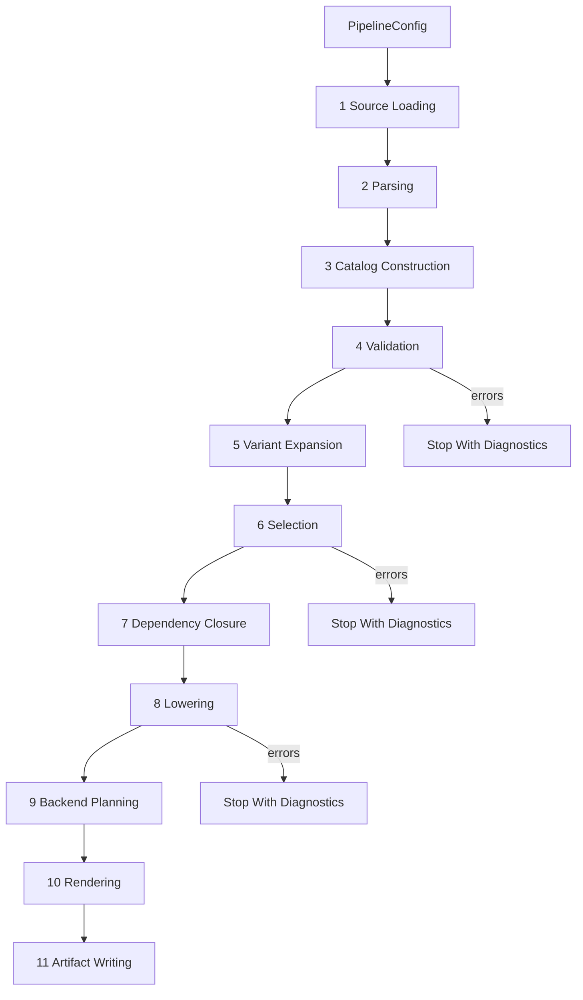

# Pipeline Design

The pipeline is a sequence of explicit stages. Each stage has typed inputs and outputs, deterministic behavior, and clear diagnostic ownership.

## Stage Overview



## Stage 1: Source Loading

Inputs:

- `SourceConfig`
- Explicit input paths.
- Standard library inclusion policy.
- Repository root or data root.

Outputs:

- `SourceSet`
- `SourceDocument` values with path, text, digest, and source kind.

Validation:

- Missing files.
- Duplicate logical source path if relevant.
- Unsupported file extension.
- Standard source directory missing when requested.

Side effects:

- Reads files only.

Determinism:

- Sort globbed paths by normalized relative path.

## Stage 2: Parsing

Inputs:

- `SourceDocument` values.
- Grammar/parser configuration.

Outputs:

- `ParsedDocument` values with syntax nodes and spans.
- Parser diagnostics.

Validation:

- Syntax errors.
- Indentation errors.
- Unterminated strings.
- Invalid scalar/list/map syntax.

Side effects:

- None.

Notes:

- TSL parsing should support the grammar behavior observed in `frozen/tsl-gen/tsl_gen/tsl_data.lark`.
- TSIL parsing may be introduced later; initially TSIL strings can remain typed as `TsilText` with source spans.

## Stage 3: Catalog Construction

Inputs:

- Parsed TSL documents.

Outputs:

- `Catalog` with typed objects.
- Catalog construction diagnostics.

Intermediate representations:

- Syntax nodes.
- Boundary schemas for manifests and TSL blocks.
- Typed domain objects.

Validation:

- Missing required fields for known block types.
- Wrong scalar/list/map value shapes.
- Duplicate definitions where duplicates are invalid.
- Unknown block type policy.

Side effects:

- None.

Design requirement:

- Parser-private keys must not leak into domain objects.

## Stage 4: Validation

Inputs:

- `Catalog`
- `ValidationConfig`

Outputs:

- `ValidatedCatalog` or `Catalog` plus diagnostics.

Validation points:

- Signature parsing and normalization.
- Signature-to-template rule coverage.
- Attribute values and required attributes.
- Template required fields.
- Type group references.
- Lane set references.
- Extension inheritance, cycles, and backend support maps.
- Flag aliases and normalized flag collisions.
- Language maps for requested backends.
- Translation maps for requested backends.
- Primitive call references, once dependency parsing exists.

Milestone 30 promotes catalog `language` and `translation` entries into typed
backend metadata boundary values for validation. Active backend manifests must
match typed language and translation data before broad backend planning or
future translation-aware lowering consumes those maps. The validation boundary
does not evaluate translation snippets.

Error handling:

- Accumulate diagnostics.
- Do not proceed to selection if errors exist.

Side effects:

- None.

## Stage 5: Variant Expansion

Inputs:

- Validated primitive declarations.

Outputs:

- Concrete primitive variants.

Behavior:

- Expand boolean wildcards such as `aligned=*`.
- Normalize concrete attribute values.
- Assign deterministic variant IDs.
- Preserve source relation back to the declaration.

Validation:

- Wildcards are allowed only where concrete boolean values validate.
- Expansion must not produce duplicate variant identities.

Side effects:

- None.

## Stage 6: Selection

Inputs:

- Validated catalog.
- Concrete primitive variants.
- `SelectionRequest`.
- Normalized CPU flags.
- Backend ID.

Outputs:

- `SelectionResult`
- Ordered `SelectedImplementation` candidates.
- Selection diagnostics.

Processing:

1. Resolve allowed extensions:
   - explicit extension list, or
   - extension autodetection result passed in config.
2. Add forced support extensions if configured.
3. Resolve extension fallback chains.
4. Filter primitive variants by requested primitive names and templates.
5. Resolve implementation entries by target extension and fallback source extension.
6. Promote selected implementation-shaped catalog values into typed
   implementation specs; defer unsupported unselected branches.
7. Expand type categories.
8. Normalize and test feature requirements.
9. Apply backend support policy.
10. Produce stable candidate identities.

Error handling:

- Unsupported backend is a diagnostic.
- Unknown requested extension/template/primitive is a diagnostic or warning based on CLI policy.
- Ambiguous implementation variants are diagnostics until a policy exists.

Side effects:

- None.

## Stage 7: Dependency Closure

Inputs:

- Initial selection result.
- Primitive dependency graph.
- Dependency policy.

Outputs:

- Primitive-name dependency closure.
- Candidate-specific dependency closure when references resolve unambiguously.
- Primitive-level fallback names for unresolved candidate-specific edges.
- Dependency diagnostics.

Processing:

- Conservatively model explicit primitive calls from implementation bodies.
- Resolve `@self` references against the current primitive variant.
- Resolve exact selected-candidate type tags where they identify one target
  candidate.
- Preserve generic or lowering-dependent type/extension dependency arguments as
  unsupported candidate-specific edges until semantic TSIL lowering exists.
- Mark support primitives required by selected primitives for later selection or
  generation stages.

Validation:

- Unknown primitive dependency.
- Dependency cycle policy.
- Dependency candidate unsupported for target extension/type/backend.

Side effects:

- None.

Milestone note:

- A first implementation can use conservative dependency extraction for documented call syntax, but the architecture should lead toward TSIL parsing.
- Milestone 32 exposes candidate-specific dependency closure through reports and
  API helpers. The pipeline derives that closure from the accepted
  primitive-level dependency graph, and reporting consumes the retained values
  without re-running this stage or changing dependency semantics.

## Stage 8: Lowering

Inputs:

- Selected implementations.
- Translation maps.
- Language type maps.
- Backend capabilities.
- Typed generation-time semantic rule sources, when selected by a milestone.

Outputs:

- `LoweredImplementation` values.
- Dependencies and required helper operations.
- Lowering diagnostics.

Processing:

- Parse TSIL text into TSIL AST.
- Resolve semantic operations.
- Evaluate generation-time conditions and generation-time type/value queries
  against explicit generation context.
- Lower to backend-neutral IR.
- Apply backend translation rules only after generation-time helpers have been
  resolved to typed semantic values.
- Attach required flags and helper includes.

Validation:

- Unknown TSIL operation.
- Unresolved generation-time helper reaching backend translation.
- Missing translation entry.
- Type mismatch.
- Unsupported immediate dispatch strategy.
- Unsupported backend-specific body form.

Side effects:

- None.

Milestone 18 establishes the first lowering boundary without full TSIL parsing.
The current lowering stage consumes `CandidateSelection`, builds deterministic
typed lowering inputs, records the generation context where
`if<generation>(...)` evaluation will live, classifies implementation payloads,
and emits structured unsupported diagnostics for semantic lowering. It does not
produce backend-neutral statements for TSIL, apply translation maps, or render
backend text.

Milestone 27 may add one mini-lowered TSIL form. That slice should update this
stage with the exact accepted input grammar, lowered representation, and
unsupported diagnostics. Any later body renderer consumes this lowered output,
not raw TSIL payload text.

Milestone 27 selects one form: direct parameter-add returns shaped as
`emit_return(<parameter> + <parameter>);`. Lowering produces backend-neutral
parameter-reference, binary-expression, and return-statement values for that
shape only. The stage still diagnoses all other TSIL, malformed nearby
`emit_return(...)` forms, generation-time branches, and non-TSIL payloads before
rendering can consume them.

The post-Milestone-34 backend-drift correction keeps native intrinsic expansion
behind this stage. Milestone 38 lowers exactly the selected
`emit_return(intrin_compose<add>(left, right));` form into typed helper data.
Milestone 39 may preserve the selected native C++ `avx2/f32` observable output
as a transitional parity slice, but it is not the pipeline model for future
native rendering. Milestone 40 adds the translation/intrinsic-composition
boundary that can turn typed helper data plus backend metadata into backend-call
IR while preserving the M39 output. The C++ renderer must receive the resolved
backend-call IR; it must not compose `_mm256_add_ps` from primitive, extension,
and type inside rendering.

Backend translation is not a second TSIL evaluator. Any
`if<generation>(...)`, `type<generation>(...)`, or `value<generation>(...)`
that influences an intrinsic modifier, type suffix, backend type spelling, or
translation value must be resolved earlier in semantic lowering. Backend
translation may handle `type<backend>(...)` and `value<backend>(...)` only as
typed requests whose inputs are already-resolved semantic values.

Milestone 41 specifies the detailed generation-time helper inventory,
`GenerationContext` fields, and selected next helper slice in
`generation-time-semantic-lowering.md`. The selected future slice is boolean
primitive-attribute branch pruning for
`if<generation>(value<generation>(primitive::attribute(aligned)))`.
Milestone 42 implements that slice for `aligned`. Helpers in the unselected
branch are discarded without diagnostics; unresolved generation-time helpers in
the selected branch remain diagnostic-producing before backend translation.
Milestone 43 implements only exact base scalar type generation queries:
`type<generation>(base::in)`,
`type<generation>(base::signed_of(type<generation>(base::in)))`, and
`type<generation>(base::unsigned_of(type<generation>(base::in)))`. The lowering
stage resolves these to typed generation type references using
`GenerationContext.type_tag_override`, `GenerationContext.selected_type_tag`, or
the selected candidate type tag in that order before any backend modifier or
type-spelling translation is allowed to consume them. If none is available,
lowering emits `TSL-LOWER-GEN-TYPE-CONTEXT-MISSING`. Backend translation still
rejects unresolved raw generation type query text; renderers do not evaluate
generation-time helpers.

The post-M43 native integer phase keeps backend modifier and type-spelling work
inside backend translation. Milestone 44 selects the modifier boundary,
Milestone 45 implements only the selected intrinsic suffix request over typed
M43 values, and Milestone 46 translates selected C++ type spellings over typed
M43 values. Milestone 47 renders the selected native integer add output only by
consuming those translated values as explicit renderer inputs.
Milestone 48 implements the selected post-M47 lowering slice: evaluate only
`value<generation>(type::is_signed(type<generation>(base::in)))` over typed M43
`GenerationTypeRef(kind="base.in")` inputs, then prune exact
`if<generation> ... else<generation>` branches with M42-style provenance. It
does not add backend translation, rendering behavior, broad TSIL parsing, or
plain `else` branch support.
Milestone 51 adds only the same signedness predicate branch form with plain
`else`. It remains lowering-only and must not add conversion body lowering,
backend translation, rendering behavior, broad TSIL parsing, or generalized
plain-`else` support.
Milestone 52 extends only those accepted concrete integer generation-time
type/signedness semantics to the full selected 8/16/32/64-bit signed and
unsigned integer tag family. It remains lowering-only: backend translation
still does not parse raw generation helper text, renderers still do not
evaluate helpers, and generated output remains unchanged.
Milestone 53 keeps Stage 8 behavior unchanged but moves the concrete integer
generation rule source to typed domain/catalog rule values prepared before
lowering consumes them. Milestone 54 wires those catalog-derived rule values
through the normal lowering-input path for pipeline-facing use by constructing
`LoweringRequest` values with an explicit catalog-derived
`ConcreteIntegerGenerationRuleSet`. Stage 8 still must not read
files, parse raw TSL, query the catalog during evaluation, or infer broad type
semantics from wildcard/group tags.
Milestone 55 keeps Stage 8 as the owner of
generation-time scalar value evaluation by adding exactly
`value<generation>(type::size_bytes(type<generation>(base::in)))` over an
explicit typed scalar size-byte rule source. The lowered result is a typed
integer generation value for selected scalar tags only; Stage 8 still does not
evaluate arithmetic/comparison expressions around that value, lower enclosing
IO/array/loop/cast/call/direct-intrinsic bodies, or pass raw generation helper
text into backend translation or renderers.
Milestone 56 reopens only the exact `type.size_bytes * 8` value-arithmetic
expression inside Stage 8. It consumes the M55 typed value and produces another
typed generation integer value; comparisons, branch pruning,
`else if<generation>`, surrounding body lowering, backend translation,
rendering, and output remain outside Stage 8's M56 work.
Milestone 57 reopens only exact `type.size_bytes == 2/4/8` predicate
evaluation inside Stage 8. It consumes the M55 typed size-byte value and
produces typed boolean predicate
results. Branch-chain pruning, `else if<generation>`, selected-arm/no-match
provenance, branch bodies, direct intrinsics, SVE array semantics, vector
metadata, backend translation, rendering, and output remain outside Stage 8's
M57 work.
Milestone 58 makes Stage 8's value -> predicate -> control-flow contract
explicit without changing accepted M42/M48/M51/M55/M56/M57 behavior or adding
new helper semantics. Lowered implementations now expose deterministic typed
generation-stage records for helper/expression recognition, accepted generation
values, accepted generation predicates, generation control-flow pruning, and
selected-body lowering. Future branch-chain pruning can consume the typed M57
predicate stage output directly; backend translation and rendering still do not
evaluate generation helpers.
Milestone 59 consumes those typed predicate stage outputs for only the
documented SVE size-byte no-final-else branch chain. It records the matching
`== 2`, `== 4`, or `== 8` arm, or explicit no-match provenance for byte size
`1`, while keeping branch bodies opaque. M59 remains lowering-only and does
not add selected-body handoff, direct intrinsic/SVE body semantics, backend
translation, rendering, or generated output.
Milestone 60 keeps Stage 8 lowering-only by turning the M59 selected-arm
pruning result into a distinct typed opaque body handoff. It does not invoke
mini TSIL lowering, produce direct-intrinsic/SVE `TsilStatement` values, parse
unselected bodies, or change backend translation, rendering, generated output,
CLI/reporting/writer behavior, Rust, or compiler execution.
Milestone 61 adds only a typed selected-body assignment-form recognition record
from M60 handoff values. That record is exposed through the distinct
`selected_body_form_recognition` stage as a staged lowering classification
boundary, not TSIL/body semantic lowering and not backend/rendering input.
Milestone 62 is accepted as the next Stage 8 lowering boundary: it consumes
only the M61 `selected_body_form_recognition` output and produces unresolved
typed selected assignment/direct-intrinsic body IR for the exact recognized
`pg = intrin<svptrue_b16/b32/b64>();` shape. M62 must preserve M61
target/token/text/provenance fields, must not derive semantics by matching
preserved original body text, and must not create backend translation requests,
renderer-ready expressions, generated output, broad TSIL body lowering, or
SVE/backend intrinsic semantics.
Milestone 63 is accepted as the following Stage 8 boundary: it consumes only
M62 `selected_body_ir_lowering` outputs and wraps selected body-IR or
no-body-IR values in a backend-neutral selected-body envelope with a
deterministic typed sequence. For M63, the selected sequence is exact and
singleton. M63 must not parse surrounding SVE-looking statements from the array
corpus, lower direct-intrinsic/SVE semantics, introduce backend translation or
renderer-ready IR, emit generated output, or broaden TSIL body lowering.
Milestone 64 is accepted as the next Stage 8 boundary: it
consumes typed M63 selected-body envelopes and assembles only the exact
`array.tsl:105-111` structural skeleton into a deterministic ordered slot
envelope. The surrounding pre/post slots are opaque provenance slots, and the
branch slot references the M63 selected/no-body envelope. M64 must not lower
declarations, arrays, stores, returns, `svbool_t`, `svst1`, vector
length/alignment, backend uninit values, direct-intrinsic/SVE semantics,
backend translation, renderer-ready IR, generated output, or broad TSIL body
syntax.
Milestone 65 is accepted as the Stage 8 pipeline-integration slice: it wires
typed/provenanced M64 skeleton input and accepted M63 envelopes through the
normal lowering pipeline so `LoweredImplementation` carries
`array_body_envelopes` and a deterministic `array_body_envelope_slot_assembly`
stage. M65 must not produce skeletons from raw body text, parse broad TSIL,
lower slot semantics, introduce backend translation or renderer-ready IR, emit
generated output, or broaden body lowering.
Milestone 66 adds the next Stage 8 slot-specific form-IR slice: it consumes
accepted M65 `ExactArrayBodyEnvelopeIr` values, refines only the
`opaque_pre_branch_array_initialization` slot at ordinal `0` into typed exact
form IR, appends `array_initialization_slot_form_lowering` after
`array_body_envelope_slot_assembly`, and keeps all other slots opaque. M66
must not evaluate vector length/alignment or backend uninit helpers, add
generic declaration/array/variable semantics, lower store or return slots,
introduce SVE/direct-intrinsic/backend translation or renderer-ready IR, emit
generated output, or broaden TSIL body lowering.
Milestone 67 is accepted as the next Stage 8 request/provenance boundary over
the M66 form IR. It may consume the direct M66 form, the
`array_initialization_slot_form_lowering` stage output, or a typed
`LoweredImplementation` carrying exactly one accepted M66 form as a
container/source. It should append a distinct helper-request stage after
`array_initialization_slot_form_lowering` and classify exactly the four M66
unresolved helper leaves into typed deferred request records. It must not
evaluate helper values, create backend translation requests, or broaden body
lowering.
Milestone 68 is accepted as the next Stage 8 request-resolution boundary over
M67 request IR. It consumes the direct M67 helper-request IR, the
`array_initialization_helper_request_lowering` stage output, or a typed
`LoweredImplementation` carrying exactly one accepted M67 helper-request IR as
a container/source. It appends a distinct base-type request-resolution
stage after `array_initialization_helper_request_lowering` and resolves only
the M67 `type<generation>(base::in)` request into a typed base-type result. It
must not resolve vector length, vector alignment, or backend uninit requests,
parse raw helper text, create backend translation requests, or broaden body
lowering.

Milestone 69 is accepted as a behavior-preserving Stage 8 maintainability
slice. It extracts the accepted M64-M68 exact array-initialization stage
assembly tail from `_lower_input` into a private typed helper/result while
preserving the same `LoweredImplementation` fields, stage names, stage order,
diagnostics, source locations, deterministic ordering, and no-skeleton/no-body
behavior. M69 does not add new public IR, new semantic helper resolution,
vector length/alignment resolution, backend uninit resolution, generic helper
dispatch, backend translation, rendering, or generated output.

Milestone 70 is accepted as a Stage 8 request-resolution boundary. It resolves
exactly the M67 `value<generation>(vector::length)` request through the M69
extracted array-initialization pipeline and explicit typed vector-length
metadata supplied before lowering evaluation. The stage follows
`array_initialization_base_type_request_resolution`, preserves unresolved
vector alignment and backend uninit requests, and must not infer lanes from raw
helper text, SVE tokens, extension names, vector-bit strings, host CPU state,
catalog data, backend translation maps, or renderers.

Milestone 71 is accepted as a Stage 8 request-resolution boundary. It resolves
exactly the M67 `value<generation>(vector::alignment)` request through the
M69/M70 extracted array-initialization pipeline and explicit typed
vector-alignment metadata supplied before lowering evaluation. The stage
follows `array_initialization_vector_length_request_resolution`, preserves the
remaining backend-uninit request, and must not infer alignment from vector
length, vector bits, scalar byte size, selected type tags, SVE token text,
extension names, host CPU state, catalog data, backend translation maps,
backend vector-alignment spellings, or renderers.

Milestone 72 is implemented as the Stage 8 helper-set completion boundary. It
consumes the accepted M71 vector-alignment resolution, identifies the
remaining exact M67 `value<backend>(uninit::array)` request by typed request
fields, and produces one typed aggregate helper-set IR after
`array_initialization_vector_alignment_request_resolution`. The backend-uninit
request remains a deferred backend-value boundary; Stage 8 must not translate
it, render it, query backend maps, lower declarations/arrays, or emit output.

Milestone 73 implements the next Stage 8 boundary after
`array_initialization_helper_set_completion`. It produces one typed exact
first-slot declaration-shell structural IR for the accepted `array.tsl:105`
`var<typed>(array_type<...>, tmp, ...)` shell. It is not a Stage 9
backend-planning input, renderer-ready declaration, generic `var`/
`array_type` parser, allocation/lifetime model, store/return lowering, or
generated-output step.

Milestone 74 implements the next Stage 8 boundary after
`array_initialization_declaration_shell_lowering`. M74 produces one typed exact
array-body structural sequence and structural/provenance slot-role
classification value for the accepted `array.tsl:105-111` body. The stage name
is `array_body_structural_sequence_classification`. It consumes accepted M64/
M65 envelope state and the accepted M73 declaration shell, and it
must not become a generic body parser, executable statement sequence,
variable/allocation model, predicate/store/return lowering, SVE/direct-
intrinsic semantic slice, backend-planning input, renderer-ready body, or
generated-output step.

Milestone 75 adds the Stage 8 boundary after
`array_body_structural_sequence_classification`. It produces one typed exact
predicate-path structural/request value for the accepted path spanning the
predicate-init role, selected-body role, and post-branch store-call-shaped
role. The stage name is `predicate_path_structural_request_lowering`. It
consumes accepted M74 sequence state and accepted M63/M62 selected-body
evidence, and it does not become SVE predicate semantics, variable/use-def
analysis, store lowering, backend-planning input, renderer-ready body, or a
generated-output step.

Milestone 76 implements the next Stage 8 boundary after
`predicate_path_structural_request_lowering`. M76 produces one typed exact
post-branch intrinsic call-site structural/request value for the accepted
`intrin<svst1>(pg, tmp.data(), a);` shape. The stage name is
`post_branch_intrinsic_call_site_structural_request_lowering`. It consumes
accepted M75 predicate-path state and accepted M74/M73 provenance only, and it
must not become store lowering, ARM/SVE intrinsic semantics, variable/use-def
analysis, backend-planning input, renderer-ready body, or a generated-output
step.

Milestone 77 implements a behavior-preserving Stage 8 module-boundary slice.
M77 does not add a new semantic lowering result. It keeps the public lowering
facade stable while moving exact recognizer shapes into
`tslgen.lowering._exact_shapes` and adding
`tslgen.lowering._pipeline` for the accepted exact array-body pipeline tail.
The new private pipeline snapshot records typed stage facts and dependencies
for the M69-M76 tail, with no pending backfeeds. Future backfeeds must be
modeled as typed facts, requests, dependencies, or deterministic coordinator
decisions; stages must not call arbitrary earlier stages through hidden
recursion, raw helper dispatch, broad registries, or central semantic
`if`/`elif` chains.

Post-M77 planning selects Milestone 78 as a behavior-preserving Stage 8
package-decomposition slice. M78 does not add a new semantic lowering result.
It must move the accepted exact array-body / array-initialization package out
of the central `boundary.py` facade into private typed modules, preserve the
accepted M57-M77 stage behavior, and reduce `boundary.py` by at least 1,000
physical lines from its 12,371-line pre-M78 baseline. The decomposition must
not create broad registries, semantic dispatchers, hidden backfeeds, generic
body/call/store/return parsing, backend planning, rendering, or generated
output.

M78 execution keeps the Stage 8 behavior unchanged while moving exact
array-initialization helper/slot shape rules into
`tslgen.lowering._array_body_shapes` and extracted exact array-body
diagnostics into `tslgen.lowering._array_body_diagnostics`. The `boundary.py`
facade remains the public import surface and now measures 11,109 physical
lines, 1,262 below the pre-M78 baseline. The new modules import no
`boundary.py` internals, so the decomposition does not introduce a circular
private dependency.

Post-M78 planning selects M79 as behavior-preserving Stage 8 typed model
ownership extraction. It does not add a new stage, semantic lowering result,
backfeed behavior, or stage dispatcher. The selected slice should move exact
array-body / array-initialization model ownership into private typed modules,
consolidate exact helper alias ownership, and tighten diagnostics typing only
where the same private model boundary supplies typed inputs. `boundary.py`
remains the public facade/coordinator, and private modules still must not
import it.

M79 execution keeps Stage 8 behavior and ordering unchanged while creating
`tslgen.lowering._array_body_models` as the private owner for exact
array-body / array-initialization typed models and tiny protocols. The existing
shape and diagnostic modules now consume that model boundary, and `boundary.py`
remains the facade at 8,915 physical lines. No new stage, helper evaluation,
backfeed execution, backend translation, rendering, generated output, or
registry/dispatcher behavior is introduced.

Post-M79 planning selects M80 as behavior-preserving Stage 8 validation
boundary extraction. It does not add a new stage, semantic lowering result,
backfeed behavior, source adapter, or stage dispatcher. The selected slice
should move exact array-body / array-initialization validation and
request-record helper ownership behind a private module such as
`tslgen.lowering._array_body_validation`, while preserving stage names, stage
ordering, output identities, keys, pipeline snapshots, selected-branch-only
diagnostics, and public facade imports.

M80 execution accepts that shape: `tslgen.lowering._array_body_validation`
owns the exact validation/request-record helper boundary, and `boundary.py`
remains the facade that wires those helpers into the accepted Stage 8
functions. Stage names, ordering, output identities, keys, pipeline snapshots,
selected-branch diagnostics, and public imports remain unchanged. The facade
now measures 7,208 physical lines, meeting the M80 reduction target without a
new stage dispatcher, source adapter, semantic evaluator, registry, or
backfeed engine.

M81 executes another behavior-preserving Stage 8 ownership extraction.
Accepted generation-time query models, typed query parsing/resolution helpers,
generation control-flow recognition, branch-chain pruning helpers, and related
diagnostics now live behind private generation modules while `boundary.py`
remains the facade/coordinator. The facade now measures 5,438 physical lines.
M81 does not add a new lowering stage, backfeed, source adapter, dispatcher,
registry, semantic evaluator, backend/rendering/output hook, or helper family.

M82 executes another behavior-preserving Stage 8 ownership extraction. The
selected-body value-model cluster around the accepted M60-M63 handoff/form/
body-IR/envelope values now lives in `tslgen.lowering._selected_body_models`,
so private exact array-body modules consume concrete selected-body envelope
models instead of broad structural checks. Stage names, ordering, output
identities, keys, and diagnostics remain unchanged; M82 does not add a new
stage, backfeed, source adapter, registry, semantic evaluator,
backend/rendering/output hook, or selected-body/body-slot semantics.

M83 is accepted as behavior-preserving Stage 8 stage-contract ownership
extraction.
The accepted `GenerationLoweringStage` stage-name/output validation contract
now lives in `tslgen.lowering._stage_contracts`, while stage execution/
coordinator behavior remains in `boundary.py`. This keeps the staged lowering
pipeline easier to extend before adding new semantic stages such as exact
return-emission structural/request IR. M83 does not introduce a stage
registry, dispatcher, source adapter, semantic evaluator, fixpoint/backfeed
engine, backend/rendering/output hook, or new stage output.

M84 is accepted as exact array-body pipeline and source-adapter ownership
extraction. It keeps Stage 8 behavior unchanged while moving the accepted
M64-M76 exact array-body pipeline/source-adapter ownership behind private typed
lowering modules. `boundary.py` remains the public facade for request/result
models, selected-body public lowerers, lower-candidate orchestration, payload
classification, and mini-TSIL lowering. The new private ownership boundary
does not import `boundary.py` or the package facade, does not add a stage
registry, dispatcher, fixpoint/backfeed engine, broad source adapter, or new
semantic output, and preserves accepted diagnostics, source locations, stage
ordering, keys, output identities, and deterministic pipeline snapshots.

Post-M84 planning selects M85 as selected-body lowering ownership extraction.
M85 should keep Stage 8 behavior unchanged while moving accepted M60-M63
selected-body lowerer/source-helper ownership behind a focused private typed
lowering module. `boundary.py` remains the public facade for request/result
models, lower-candidate orchestration, `_lower_input`, payload classification,
mini-TSIL lowering, generation control-flow pruning, and exact array-body
pipeline orchestration. The new private ownership boundary must not import
`boundary.py`, the package facade, or exact array-body source/lowering modules
as convenience dispatchers, must not add a stage registry, dispatcher,
fixpoint/backfeed engine, broad selected-body parser, or new semantic output,
and must preserve accepted diagnostics, source locations, stage ordering,
keys, output identities, selected-branch-only behavior, and deterministic
pipeline snapshots.

M85 is accepted while keeping Stage 8 outputs and ordering unchanged. The
private lowering owner is
`tslgen.lowering._selected_body_lowering`; `boundary.py` continues to own the
pipeline coordinator and public facade aliases for the selected-body lowerers.

M86 is accepted as candidate payload-intake and mini-TSIL leaf return lowering
extraction. It keeps Stage 8 orchestration unchanged while moving accepted
payload classification, typed-opaque unsupported-payload diagnostics, direct
parameter-add return lowering, and `intrin_compose<add>` return lowering
behind focused private typed modules. `boundary.py` remains the public facade
for request/result models, `LoweringInputSet`, `prepare_lowering_inputs`,
`_lower_input`, lower-candidate orchestration, generation query/control-flow
staging, selected-body lowering, and exact array-body pipeline orchestration.
The private modules do not import `boundary.py` or the package facade, do not
become a broad TSIL parser or dispatcher, and preserve accepted diagnostics,
source locations, stage ordering, keys, output identities, and deterministic
pipeline snapshots.

M87 is accepted as the next Stage 8 semantic frontier. It adds a typed
`return_emission_structural_request_lowering` step after the accepted M76
post-branch call-site step in the exact array-body pipeline. That step records
only the exact trailing `emit_return(tmp);` structural request and links `tmp`
to accepted declaration-shell provenance. It remains diagnostic-first for
malformed nearby source and does not repair source text, become a generic
return parser, interpret return/store/variable semantics, add backend
translation, or render output.

M88 is accepted as the next Stage 8 package assembly step. The
`array_body_structural_package_assembly` stage runs after
`return_emission_structural_request_lowering` and aggregates accepted M64-M87
exact array-body facts into one typed structural package. The stage is typed
aggregation and provenance validation only: it does not reparse raw body text,
repair source bodies, infer declaration/store/return/SVE/backend semantics,
create renderer-ready IR, or add generated output.

M89 is accepted as the next Stage 8 inventory step. The
`array_backend_deferred_request_inventory` stage runs after
`array_body_structural_package_assembly` and consumes the accepted M88 package
to inventory the accepted M72/M67 `value<backend>(uninit::array)` deferred
backend-value boundary as typed lowering data. The stage remains inventory and
provenance validation only: it does not resolve backend uninit, read backend
maps/catalogs, create Stage 9 backend plans, render output, or evaluate generic
backend helpers.

M90 is accepted as the next Stage 8 completion-package step. The
`array_lowering_completion_package` stage runs after
`array_backend_deferred_request_inventory` and consumes the accepted M89
inventory plus its accepted M88 package identity to produce one typed exact
array lowering completion package. The stage is a lowering-side handoff
boundary only: it packages accepted exact facts and explicit unresolved
dependencies for later backend planning, but it does not start Stage 9, read
backend maps/catalogs, resolve backend uninit, create renderer-ready IR, render
output, infer declaration/store/return/SVE/backend semantics, or repair source
text.

M91 is accepted as a behavior-preserving Stage 8 exact array pipeline
ownership consolidation step. It does not add a new semantic lowering stage or
alter the accepted stage order. Instead, it moves exact array pipeline result
aggregation into `_array_body_pipeline_results.py` and exact stage
construction plus snapshot step assembly into `_array_body_stage_assembly.py`.
The pipeline contract remains the accepted M64-M90 contract: same stage names,
same stage ordering, same deterministic keys, same output object identities,
same diagnostics, same selected-branch-only behavior, and same snapshots. M91
does not introduce broad dispatchers, hidden recursive backfeeds, fixpoint
coordination, backend planning, rendering, generated output, or broad source
protocols.

M92 is accepted as a Stage 8 exact array handoff step. The
`array_backend_handoff_request` stage runs after
`array_lowering_completion_package` and consumes the accepted M90 completion
package to produce one typed lowering-side backend handoff request for later
Stage 9 work. The stage is still Stage 8 request/provenance data: it must not
resolve backend uninit, read backend maps/catalogs, create Stage 9 plans,
produce renderer-ready IR, render output, infer body semantics, repair source
text, or broaden source protocols.

M93 is accepted as a Stage 8 dual-source lowering operation package boundary.
The `lowering_operation_package` fact packages only accepted M86 mini-TSIL
leaf return values and accepted M92 exact array backend-handoff requests. It
preserves distinct source-family identity and provenance, does not normalize
the sources into broad body semantics, and appends after the accepted source
fact without changing earlier stage order. It must not create Stage 9 backend
plans, resolve backend values, build operation schedules, read backend maps,
produce renderer-ready IR, render output, repair source text, or install a
generic operation dispatcher/registry.

M94 is accepted as a behavior-preserving ownership split around the accepted
`lowering_operation_package` stage. It keeps the same stage name, stage order,
snapshots, package keys, object identities, diagnostics, and public handoff
behavior while moving diagnostics, accepted-source narrowing, accepted M86
mini-TSIL package checks, exact-array provenance validation, and package models
into focused private modules. It adds no new Stage 8 semantic fact, Stage 9
planning, backend map reads, renderer-ready IR, broad source dispatch, hidden
backfeeds, or fixpoint machinery.

M95 is accepted as one new Stage 8 package-family slice over accepted
selected-body facts. The selected-body direct-intrinsic operation package
consumes only accepted M63 selected-body envelopes and the enclosed accepted
M62 body IR, preserves `pg`, `svptrue_b*`, selected literals, type tags,
branch identity, and source locations as provenance, and keeps
family-specific validation and entry ownership in
`_operation_package_selected_body.py` rather than generic registries or
dispatchers. It does not start Stage 9 backend planning, render output, parse
raw body text, repair source input, infer SVE/direct-intrinsic semantics, add
byte-size-to-token dispatch, or create hidden backfeeds/fixpoint machinery.

M96 is accepted as a Stage 8 lowering completion manifest slice. The
`lowering_completion_manifest` stage runs after accepted
`lowering_operation_package` facts and summarizes current accepted package
families, package identities, source locations, and unresolved backend-handoff
dependencies as one deterministic per-candidate lowering-side readiness/
provenance contract. It preserves accepted package and unresolved dependency
references by object identity. Any graph-like structure is an
identity/provenance graph only, not an operation DAG, backend readiness engine,
scheduler, dependency solver, package registry, source dispatcher, hidden
backfeed, or fixpoint coordinator. It does not resolve backend values, read
backend maps/catalogs, create Stage 9 plans, produce renderer-ready IR, render
output, infer body/SVE/direct-intrinsic semantics, repair source text, or add
new package families.

M97 is accepted as a Stage 8 lowering completion gap inventory slice. The
inventory consumes accepted M96 manifests and records only lowering-observed
gaps visible from those manifest facts: initially accepted unresolved
backend-handoff dependency records, plus a deterministic no-known-gap inventory
state for manifests without unresolved dependencies.
`lowering_completion_gap_inventory` follows `lowering_completion_manifest`.
It is still lowering-owned provenance/inventory data, not backend readiness,
semantic body completion, dependency closure, operation scheduling,
renderer-ready IR, generated output, a package registry, source dispatcher,
hidden backfeed, or fixpoint coordinator.

M98 is accepted as behavior-preserving Stage 8 stage-assembly ownership
extraction before additional lowering semantics. It moved accepted
`GenerationLoweringStage` construction helpers and the accepted
operation-package -> completion-manifest -> completion-gap-inventory
per-candidate result assembly into focused private
`_lowering_stage_assembly.py` ownership, while keeping `boundary.py` as the
public facade and preserving all accepted M57-M97 diagnostics, stage names,
stage order, keys, object identities, and public imports. It does not become a
broad coordinator, source dispatcher, registry, callback map, hidden backfeed,
fixpoint mechanism, backend planning surface, renderer-ready IR, or semantic
lowering expansion.

M99 is accepted as the next Stage 8 lowering inventory slice. The accepted
inventory follows `lowering_completion_gap_inventory` and records
accepted backend-scoped request facts visible from operation packages,
completion manifests, and gap inventories. It is still Stage 8
inventory/provenance data. It does not translate backend values, evaluate
backend maps, create Stage 9 plans, schedule operations, solve dependencies,
produce renderer-ready IR, render output, scan raw source bodies, or infer
direct-intrinsic/SVE semantics.

M100 accepts a narrow Stage 8 typed translation-result boundary after
`lowering_backend_translation_request_inventory`. M100 consumes only accepted
M99 exact-array `exact_array_backend_value_uninit_array` records plus explicit
typed C++ `value_array_uninit` rule values supplied to the stage, then produces
typed C++ backend-uninit translation-result state. It does not read backend
maps/catalogs/manifests or `tsldata/detail/lang` during lowering, does not
translate Rust, does not evaluate generic backend helpers or direct-intrinsic/
SVE semantics, and does not create Stage 9 backend plans, renderer-ready IR,
rendered code, artifact plans, generated output, schedules, or dependency
closure.

## Stage 9: Backend Planning

Inputs:

- Lowered implementations.
- Catalog metadata.
- Backend manifest.
- Wrapper shape rules.
- Test planning config.

Outputs:

- `BackendPlan`
- Optional `TestSuitePlan`
- Planning diagnostics.

Processing:

- Group render jobs by template/primitive/extension/type.
- Plan primary declarations.
- Plan specializations.
- Plan wrappers or trait methods.
- Plan test suites and variants.
- Compute required flags metadata.
- Determine artifact logical names.

Validation:

- Missing backend manifest field.
- Missing wrapper shape for a template.
- Missing backend language map.
- Missing render strategy for a template.
- Duplicate output logical name within a plan.

Side effects:

- None.

Milestone 17 adds an initial production test-source planning boundary alongside
backend artifact planning. It consumes the catalog and accepted candidate
selection output, normalizes supported TSL `tests` declarations into typed
planning data, filters them against selected candidates, and emits deterministic
test-source artifact descriptors. It is metadata-only: generated test source
rendering, test artifact writing, compiler invocation, and test execution remain
later stages.

Milestone 30 tightens backend manifest, language-map, and translation-map
validation before broader rendering depends on those values. Generic backend
planning should receive typed backend metadata and must not consume YAML or raw
catalog maps directly.

The current active backend IDs are `cpp` and `rust`. C17 may be present in
catalog or manifest evidence, but it is deferred and not derived into active
manifest sets. Artifact planning rejects inactive manifest backends and inactive
manifest language IDs before renderer dispatch. Active manifests require a
language type map keyed by `language_id` and a translation map keyed by
`backend_id`.

## Stage 10: Rendering

Inputs:

- Backend plan.
- Render environment.

Outputs:

- `ArtifactSet`
- Render diagnostics.

Processing:

- Render primary declarations, specializations, wrappers, traits, tests, and support metadata.
- Normalize text formatting if the backend defines a formatting policy.
- Attach artifact metadata.

Validation:

- Missing template file when a template strategy uses file templates.
- Template variable mismatch.
- Non-deterministic artifact ordering check in tests.

Side effects:

- None.

Milestone 26 expands C++ declarations and documents naming. Milestone 28 adds
one C++ scalar body-rendering path from mini-lowered TSIL. The C++ renderer
continues to accept selected candidates and an artifact plan, and optionally
accepts a `LoweringPlan` for body definitions. It diagnoses missing or
unsupported lowered data instead of lowering TSIL or rendering stubs. Milestone
29 adds one C++ generated production-test artifact from `TestSourcePlan`
metadata. That artifact is metadata-style source, not compiled or executable
test orchestration. Milestone 49 adds one legacy-style generated C++
`add_i32_basic` test-source fixture from typed
`TestSourcePlan` data and explicit typed C++ type-spelling input; it remains
source rendering only and does not compile, run, fetch `gtest`, infer type
spellings locally, or broaden generated-test framework parity. Milestone 31 may
add one Rust production-shaped
declaration/signature slice. Each of these rendering slices must stay
backend-owned and must not perform selection, lowering, execution, or writing.

Milestone 50 is the selected post-M49 reporting adapter slice. It serializes
one legacy-style coverage JSON row from accepted typed report DTOs and must not
rerun parsing, validation, selection, lowering, backend rendering, test-source
rendering, writer, CLI, or compiler execution during report serialization.

Corrected native rendering is a boundary repair, not an extension of the scalar
mini-renderer. Milestone 39 may keep one selected native C++ `binary/add`
specialization as transitional output. Milestone 40 must make that output flow
from backend-call IR produced by lowering/translation rather than from
renderer-local intrinsic/type tables. Generated-test, CLI compatibility, and
legacy-report parity milestones that were previously planned after native
rendering are deferred until this renderer boundary is corrected.

## Stage 11: Artifact Writing

Inputs:

- `ArtifactSet`
- Output root.
- Write policy.

Outputs:

- `WriteReport`

Processing:

- Resolve target paths.
- Reject duplicate targets.
- Compute digests.
- Create directories.
- Skip unchanged files.
- Write changed files.

Validation:

- Target escapes output root.
- Duplicate artifact target.
- Filesystem errors.

Side effects:

- Writes files.

## Backend Entry Points

Backend-specific behavior enters at:

- Backend support in extension metadata.
- Language type maps.
- Translation maps.
- Backend manifest/capabilities.
- Lowering translation services.
- Backend planner.
- Backend renderer.
- Test planner policies.

Backend-specific behavior must not enter:

- TSL parsing.
- Core domain construction.
- Generic validation except through backend-specific validation plugins.
- Artifact writing.

## Generated Files

Generated files are produced only after rendering:

- C++ headers or test `.cpp` files.
- Rust source or test `.rs` files.
- Optional CMake metadata such as required flags.
- Optional coverage reports or manifests when that workflow is implemented.
- Optional generated test-source artifacts once a test rendering slice is
  accepted.

No stage before rendering writes generated files.

## Lowering IR Taxonomy Pressure Check

After M100, lowering stages must avoid treating every accepted narrow form as a
reason to create a new bespoke object family. New lowering IR should fit one of
these stable pipeline roles:

- semantic fact;
- request;
- result;
- inventory;
- provenance value;
- rule input;
- stage envelope.

Provenance is required for diagnostics, determinism, and source traceability,
but repeated object-identity chains should be consolidated behind typed
provenance contracts when that can preserve accepted behavior. Inventories
remain deterministic collections, not readiness claims. Results fulfill typed
requests from explicit facts and rules; they do not render output or infer
semantics from raw text.

M101 is planned to apply this pressure check narrowly to the accepted M99/M100
backend-translation request/result path before more lowering features are
added.

## Pipeline Result Shape

```python
@dataclass(frozen=True, slots=True)
class PipelineResult:
    diagnostics: tuple[Diagnostic, ...]
    catalog: Catalog | None
    selection: SelectionResult | None
    dependency_closure: DependencyClosure | None
    candidate_dependency_closure: CandidateDependencyClosure | None
    lowering_plan: LoweringPlan | None
    backend_plan: BackendPlan | None
    test_source_plan: TestSourcePlan | None
    artifacts: ArtifactSet | None
    write_report: WriteReport | None
```

Rules:

- If diagnostics contain errors before rendering, `artifacts` is `None`.
- If no output root was requested, `write_report` is `None`.
- CLI decides whether diagnostics are printed and which exit code is used.
- Public result fields expose accepted stage outputs. Milestone 32 retains
  candidate dependency closure for reporting, while stable API inspection is
  provided through report DTOs instead of requiring callers to depend on raw
  closure internals.

## Deterministic Merge Points

If parallelism is introduced:

- Parse documents in parallel, merge by source path.
- Validate independent blocks in parallel, merge diagnostics by source location and code.
- Lower selected implementations in parallel, merge by candidate identity.
- Render independent groups in parallel, merge by artifact logical name.

No output order may depend on task completion order.
