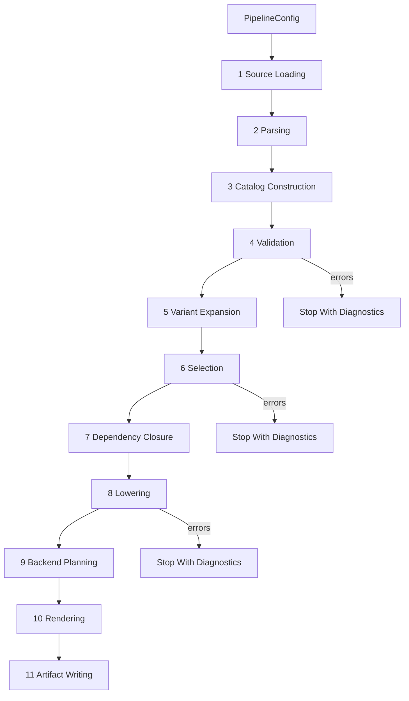

# Pipeline Design

The pipeline is a sequence of explicit stages. Each stage has typed inputs and outputs, deterministic behavior, and clear diagnostic ownership.

## Stage Overview



## Stage 1: Source Loading

Inputs:

- `SourceConfig`
- Explicit input paths.
- Standard library inclusion policy.
- Repository root or data root.

Outputs:

- `SourceSet`
- `SourceDocument` values with path, text, digest, and source kind.

Validation:

- Missing files.
- Duplicate logical source path if relevant.
- Unsupported file extension.
- Standard source directory missing when requested.

Side effects:

- Reads files only.

Determinism:

- Sort globbed paths by normalized relative path.

## Stage 2: Parsing

Inputs:

- `SourceDocument` values.
- Grammar/parser configuration.

Outputs:

- `ParsedDocument` values with syntax nodes and spans.
- Parser diagnostics.

Validation:

- Syntax errors.
- Indentation errors.
- Unterminated strings.
- Invalid scalar/list/map syntax.

Side effects:

- None.

Notes:

- TSL parsing should support the grammar behavior observed in `frozen/tsl-gen/tsl_gen/tsl_data.lark`.
- TSIL parsing may be introduced later; initially TSIL strings can remain typed as `TsilText` with source spans.

## Stage 3: Catalog Construction

Inputs:

- Parsed TSL documents.

Outputs:

- `Catalog` with typed objects.
- Catalog construction diagnostics.

Intermediate representations:

- Syntax nodes.
- Boundary schemas for manifests and TSL blocks.
- Typed domain objects.

Validation:

- Missing required fields for known block types.
- Wrong scalar/list/map value shapes.
- Duplicate definitions where duplicates are invalid.
- Unknown block type policy.

Side effects:

- None.

Design requirement:

- Parser-private keys must not leak into domain objects.

## Stage 4: Validation

Inputs:

- `Catalog`
- `ValidationConfig`

Outputs:

- `ValidatedCatalog` or `Catalog` plus diagnostics.

Validation points:

- Signature parsing and normalization.
- Signature-to-template rule coverage.
- Attribute values and required attributes.
- Template required fields.
- Type group references.
- Lane set references.
- Extension inheritance, cycles, and backend support maps.
- Flag aliases and normalized flag collisions.
- Language maps for requested backends.
- Translation maps for requested backends.
- Primitive call references, once dependency parsing exists.

Milestone 30 promotes catalog `language` and `translation` entries into typed
backend metadata boundary values for validation. Active backend manifests must
match typed language and translation data before broad backend planning or
future translation-aware lowering consumes those maps. The validation boundary
does not evaluate translation snippets.

Error handling:

- Accumulate diagnostics.
- Do not proceed to selection if errors exist.

Side effects:

- None.

## Stage 5: Variant Expansion

Inputs:

- Validated primitive declarations.

Outputs:

- Concrete primitive variants.

Behavior:

- Expand boolean wildcards such as `aligned=*`.
- Normalize concrete attribute values.
- Assign deterministic variant IDs.
- Preserve source relation back to the declaration.

Validation:

- Wildcards are allowed only where concrete boolean values validate.
- Expansion must not produce duplicate variant identities.

Side effects:

- None.

## Stage 6: Selection

Inputs:

- Validated catalog.
- Concrete primitive variants.
- `SelectionRequest`.
- Normalized CPU flags.
- Backend ID.

Outputs:

- `SelectionResult`
- Ordered `SelectedImplementation` candidates.
- Selection diagnostics.

Processing:

1. Resolve allowed extensions:
   - explicit extension list, or
   - extension autodetection result passed in config.
2. Add forced support extensions if configured.
3. Resolve extension fallback chains.
4. Filter primitive variants by requested primitive names and templates.
5. Resolve implementation entries by target extension and fallback source extension.
6. Promote selected implementation-shaped catalog values into typed
   implementation specs; defer unsupported unselected branches.
7. Expand type categories.
8. Normalize and test feature requirements.
9. Apply backend support policy.
10. Produce stable candidate identities.

Error handling:

- Unsupported backend is a diagnostic.
- Unknown requested extension/template/primitive is a diagnostic or warning based on CLI policy.
- Ambiguous implementation variants are diagnostics until a policy exists.

Side effects:

- None.

## Stage 7: Dependency Closure

Inputs:

- Initial selection result.
- Primitive dependency graph.
- Dependency policy.

Outputs:

- Primitive-name dependency closure.
- Candidate-specific dependency closure when references resolve unambiguously.
- Primitive-level fallback names for unresolved candidate-specific edges.
- Dependency diagnostics.

Processing:

- Conservatively model explicit primitive calls from implementation bodies.
- Resolve `@self` references against the current primitive variant.
- Resolve exact selected-candidate type tags where they identify one target
  candidate.
- Preserve generic or lowering-dependent type/extension dependency arguments as
  unsupported candidate-specific edges until semantic TSIL lowering exists.
- Mark support primitives required by selected primitives for later selection or
  generation stages.

Validation:

- Unknown primitive dependency.
- Dependency cycle policy.
- Dependency candidate unsupported for target extension/type/backend.

Side effects:

- None.

Milestone note:

- A first implementation can use conservative dependency extraction for documented call syntax, but the architecture should lead toward TSIL parsing.
- Milestone 32 exposes candidate-specific dependency closure through reports and
  API helpers. The pipeline derives that closure from the accepted
  primitive-level dependency graph, and reporting consumes the retained values
  without re-running this stage or changing dependency semantics.

## Stage 8: Lowering

Inputs:

- Selected implementations.
- Translation maps.
- Language type maps.
- Backend capabilities.
- Typed generation-time semantic rule sources, when selected by a milestone.

Outputs:

- `LoweredImplementation` values.
- Dependencies and required helper operations.
- Lowering diagnostics.

Processing:

- Parse TSIL text into TSIL AST.
- Resolve semantic operations.
- Evaluate generation-time conditions and generation-time type/value queries
  against explicit generation context.
- Lower to backend-neutral IR.
- Apply backend translation rules only after generation-time helpers have been
  resolved to typed semantic values.
- Attach required flags and helper includes.

Validation:

- Unknown TSIL operation.
- Unresolved generation-time helper reaching backend translation.
- Missing translation entry.
- Type mismatch.
- Unsupported immediate dispatch strategy.
- Unsupported backend-specific body form.

Side effects:

- None.

Milestone 18 establishes the first lowering boundary without full TSIL parsing.
The current lowering stage consumes `CandidateSelection`, builds deterministic
typed lowering inputs, records the generation context where
`if<generation>(...)` evaluation will live, classifies implementation payloads,
and emits structured unsupported diagnostics for semantic lowering. It does not
produce backend-neutral statements for TSIL, apply translation maps, or render
backend text.

Milestone 27 may add one mini-lowered TSIL form. That slice should update this
stage with the exact accepted input grammar, lowered representation, and
unsupported diagnostics. Any later body renderer consumes this lowered output,
not raw TSIL payload text.

Milestone 27 selects one form: direct parameter-add returns shaped as
`emit_return(<parameter> + <parameter>);`. Lowering produces backend-neutral
parameter-reference, binary-expression, and return-statement values for that
shape only. The stage still diagnoses all other TSIL, malformed nearby
`emit_return(...)` forms, generation-time branches, and non-TSIL payloads before
rendering can consume them.

The post-Milestone-34 backend-drift correction keeps native intrinsic expansion
behind this stage. Milestone 38 lowers exactly the selected
`emit_return(intrin_compose<add>(left, right));` form into typed helper data.
Milestone 39 may preserve the selected native C++ `avx2/f32` observable output
as a transitional parity slice, but it is not the pipeline model for future
native rendering. Milestone 40 adds the translation/intrinsic-composition
boundary that can turn typed helper data plus backend metadata into backend-call
IR while preserving the M39 output. The C++ renderer must receive the resolved
backend-call IR; it must not compose `_mm256_add_ps` from primitive, extension,
and type inside rendering.

Backend translation is not a second TSIL evaluator. Any
`if<generation>(...)`, `type<generation>(...)`, or `value<generation>(...)`
that influences an intrinsic modifier, type suffix, backend type spelling, or
translation value must be resolved earlier in semantic lowering. Backend
translation may handle `type<backend>(...)` and `value<backend>(...)` only as
typed requests whose inputs are already-resolved semantic values.

Milestone 41 specifies the detailed generation-time helper inventory,
`GenerationContext` fields, and selected next helper slice in
`generation-time-semantic-lowering.md`. The selected future slice is boolean
primitive-attribute branch pruning for
`if<generation>(value<generation>(primitive::attribute(aligned)))`.
Milestone 42 implements that slice for `aligned`. Helpers in the unselected
branch are discarded without diagnostics; unresolved generation-time helpers in
the selected branch remain diagnostic-producing before backend translation.
Milestone 43 implements only exact base scalar type generation queries:
`type<generation>(base::in)`,
`type<generation>(base::signed_of(type<generation>(base::in)))`, and
`type<generation>(base::unsigned_of(type<generation>(base::in)))`. The lowering
stage resolves these to typed generation type references using
`GenerationContext.type_tag_override`, `GenerationContext.selected_type_tag`, or
the selected candidate type tag in that order before any backend modifier or
type-spelling translation is allowed to consume them. If none is available,
lowering emits `TSL-LOWER-GEN-TYPE-CONTEXT-MISSING`. Backend translation still
rejects unresolved raw generation type query text; renderers do not evaluate
generation-time helpers.

The post-M43 native integer phase keeps backend modifier and type-spelling work
inside backend translation. Milestone 44 selects the modifier boundary,
Milestone 45 implements only the selected intrinsic suffix request over typed
M43 values, and Milestone 46 translates selected C++ type spellings over typed
M43 values. Milestone 47 renders the selected native integer add output only by
consuming those translated values as explicit renderer inputs.
Milestone 48 implements the selected post-M47 lowering slice: evaluate only
`value<generation>(type::is_signed(type<generation>(base::in)))` over typed M43
`GenerationTypeRef(kind="base.in")` inputs, then prune exact
`if<generation> ... else<generation>` branches with M42-style provenance. It
does not add backend translation, rendering behavior, broad TSIL parsing, or
plain `else` branch support.
Milestone 51 adds only the same signedness predicate branch form with plain
`else`. It remains lowering-only and must not add conversion body lowering,
backend translation, rendering behavior, broad TSIL parsing, or generalized
plain-`else` support.
Milestone 52 extends only those accepted concrete integer generation-time
type/signedness semantics to the full selected 8/16/32/64-bit signed and
unsigned integer tag family. It remains lowering-only: backend translation
still does not parse raw generation helper text, renderers still do not
evaluate helpers, and generated output remains unchanged.
Milestone 53 keeps Stage 8 behavior unchanged but moves the concrete integer
generation rule source to typed domain/catalog rule values prepared before
lowering consumes them. Milestone 54 wires those catalog-derived rule values
through the normal lowering-input path for pipeline-facing use by constructing
`LoweringRequest` values with an explicit catalog-derived
`ConcreteIntegerGenerationRuleSet`. Stage 8 still must not read
files, parse raw TSL, query the catalog during evaluation, or infer broad type
semantics from wildcard/group tags.
Milestone 55 keeps Stage 8 as the owner of
generation-time scalar value evaluation by adding exactly
`value<generation>(type::size_bytes(type<generation>(base::in)))` over an
explicit typed scalar size-byte rule source. The lowered result is a typed
integer generation value for selected scalar tags only; Stage 8 still does not
evaluate arithmetic/comparison expressions around that value, lower enclosing
IO/array/loop/cast/call/direct-intrinsic bodies, or pass raw generation helper
text into backend translation or renderers.
Milestone 56 reopens only the exact `type.size_bytes * 8` value-arithmetic
expression inside Stage 8. It consumes the M55 typed value and produces another
typed generation integer value; comparisons, branch pruning,
`else if<generation>`, surrounding body lowering, backend translation,
rendering, and output remain outside Stage 8's M56 work.
Milestone 57 reopens only exact `type.size_bytes == 2/4/8` predicate
evaluation inside Stage 8. It consumes the M55 typed size-byte value and
produces typed boolean predicate
results. Branch-chain pruning, `else if<generation>`, selected-arm/no-match
provenance, branch bodies, direct intrinsics, SVE array semantics, vector
metadata, backend translation, rendering, and output remain outside Stage 8's
M57 work.
The selected post-M57 plan, Milestone 58, should make Stage 8's
value -> predicate -> control-flow contract explicit without changing accepted
M42/M48/M51/M55/M56/M57 behavior or adding new helper semantics.

## Stage 9: Backend Planning

Inputs:

- Lowered implementations.
- Catalog metadata.
- Backend manifest.
- Wrapper shape rules.
- Test planning config.

Outputs:

- `BackendPlan`
- Optional `TestSuitePlan`
- Planning diagnostics.

Processing:

- Group render jobs by template/primitive/extension/type.
- Plan primary declarations.
- Plan specializations.
- Plan wrappers or trait methods.
- Plan test suites and variants.
- Compute required flags metadata.
- Determine artifact logical names.

Validation:

- Missing backend manifest field.
- Missing wrapper shape for a template.
- Missing backend language map.
- Missing render strategy for a template.
- Duplicate output logical name within a plan.

Side effects:

- None.

Milestone 17 adds an initial production test-source planning boundary alongside
backend artifact planning. It consumes the catalog and accepted candidate
selection output, normalizes supported TSL `tests` declarations into typed
planning data, filters them against selected candidates, and emits deterministic
test-source artifact descriptors. It is metadata-only: generated test source
rendering, test artifact writing, compiler invocation, and test execution remain
later stages.

Milestone 30 tightens backend manifest, language-map, and translation-map
validation before broader rendering depends on those values. Generic backend
planning should receive typed backend metadata and must not consume YAML or raw
catalog maps directly.

The current active backend IDs are `cpp` and `rust`. C17 may be present in
catalog or manifest evidence, but it is deferred and not derived into active
manifest sets. Artifact planning rejects inactive manifest backends and inactive
manifest language IDs before renderer dispatch. Active manifests require a
language type map keyed by `language_id` and a translation map keyed by
`backend_id`.

## Stage 10: Rendering

Inputs:

- Backend plan.
- Render environment.

Outputs:

- `ArtifactSet`
- Render diagnostics.

Processing:

- Render primary declarations, specializations, wrappers, traits, tests, and support metadata.
- Normalize text formatting if the backend defines a formatting policy.
- Attach artifact metadata.

Validation:

- Missing template file when a template strategy uses file templates.
- Template variable mismatch.
- Non-deterministic artifact ordering check in tests.

Side effects:

- None.

Milestone 26 expands C++ declarations and documents naming. Milestone 28 adds
one C++ scalar body-rendering path from mini-lowered TSIL. The C++ renderer
continues to accept selected candidates and an artifact plan, and optionally
accepts a `LoweringPlan` for body definitions. It diagnoses missing or
unsupported lowered data instead of lowering TSIL or rendering stubs. Milestone
29 adds one C++ generated production-test artifact from `TestSourcePlan`
metadata. That artifact is metadata-style source, not compiled or executable
test orchestration. Milestone 49 adds one legacy-style generated C++
`add_i32_basic` test-source fixture from typed
`TestSourcePlan` data and explicit typed C++ type-spelling input; it remains
source rendering only and does not compile, run, fetch `gtest`, infer type
spellings locally, or broaden generated-test framework parity. Milestone 31 may
add one Rust production-shaped
declaration/signature slice. Each of these rendering slices must stay
backend-owned and must not perform selection, lowering, execution, or writing.

Milestone 50 is the selected post-M49 reporting adapter slice. It serializes
one legacy-style coverage JSON row from accepted typed report DTOs and must not
rerun parsing, validation, selection, lowering, backend rendering, test-source
rendering, writer, CLI, or compiler execution during report serialization.

Corrected native rendering is a boundary repair, not an extension of the scalar
mini-renderer. Milestone 39 may keep one selected native C++ `binary/add`
specialization as transitional output. Milestone 40 must make that output flow
from backend-call IR produced by lowering/translation rather than from
renderer-local intrinsic/type tables. Generated-test, CLI compatibility, and
legacy-report parity milestones that were previously planned after native
rendering are deferred until this renderer boundary is corrected.

## Stage 11: Artifact Writing

Inputs:

- `ArtifactSet`
- Output root.
- Write policy.

Outputs:

- `WriteReport`

Processing:

- Resolve target paths.
- Reject duplicate targets.
- Compute digests.
- Create directories.
- Skip unchanged files.
- Write changed files.

Validation:

- Target escapes output root.
- Duplicate artifact target.
- Filesystem errors.

Side effects:

- Writes files.

## Backend Entry Points

Backend-specific behavior enters at:

- Backend support in extension metadata.
- Language type maps.
- Translation maps.
- Backend manifest/capabilities.
- Lowering translation services.
- Backend planner.
- Backend renderer.
- Test planner policies.

Backend-specific behavior must not enter:

- TSL parsing.
- Core domain construction.
- Generic validation except through backend-specific validation plugins.
- Artifact writing.

## Generated Files

Generated files are produced only after rendering:

- C++ headers or test `.cpp` files.
- Rust source or test `.rs` files.
- Optional CMake metadata such as required flags.
- Optional coverage reports or manifests when that workflow is implemented.
- Optional generated test-source artifacts once a test rendering slice is
  accepted.

No stage before rendering writes generated files.

## Pipeline Result Shape

```python
@dataclass(frozen=True, slots=True)
class PipelineResult:
    diagnostics: tuple[Diagnostic, ...]
    catalog: Catalog | None
    selection: SelectionResult | None
    dependency_closure: DependencyClosure | None
    candidate_dependency_closure: CandidateDependencyClosure | None
    lowering_plan: LoweringPlan | None
    backend_plan: BackendPlan | None
    test_source_plan: TestSourcePlan | None
    artifacts: ArtifactSet | None
    write_report: WriteReport | None
```

Rules:

- If diagnostics contain errors before rendering, `artifacts` is `None`.
- If no output root was requested, `write_report` is `None`.
- CLI decides whether diagnostics are printed and which exit code is used.
- Public result fields expose accepted stage outputs. Milestone 32 retains
  candidate dependency closure for reporting, while stable API inspection is
  provided through report DTOs instead of requiring callers to depend on raw
  closure internals.

## Deterministic Merge Points

If parallelism is introduced:

- Parse documents in parallel, merge by source path.
- Validate independent blocks in parallel, merge diagnostics by source location and code.
- Lower selected implementations in parallel, merge by candidate identity.
- Render independent groups in parallel, merge by artifact logical name.

No output order may depend on task completion order.
