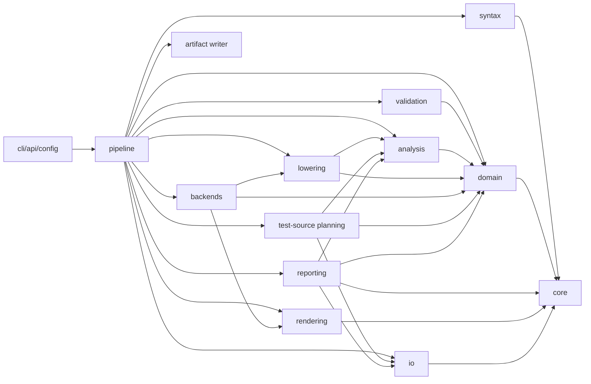

# Target Architecture

The target architecture separates source loading, parsing, domain modeling, validation, semantic analysis, selection, lowering, backend planning, rendering, artifact writing, configuration, CLI/API boundaries, diagnostics, and tests.

The package layout below is a design target. It is not a map from legacy modules.

## Proposed Package Layout

```text
tslgen/
  src/tslgen/
    __init__.py
    api.py
    cli.py
    config/
      model.py
      cli_adapter.py
      hardware.py
    core/
      diagnostics.py
      result.py
      frozen_map.py
      ordering.py
    io/
      sources.py
      manifests.py
      artifacts.py
      artifact_writer.py
      write_report.py
    syntax/
      ast.py
      lexer.py
      parser.py
      grammar/
        tsl_data.lark
        tsil.lark
    domain/
      catalog.py
      primitives.py
      signatures.py
      templates.py
      types.py
      extensions.py
      implementations.py
      tests.py
      backends.py
    validation/
      catalog_validator.py
      signature_rules.py
      attribute_rules.py
      reference_rules.py
      extension_rules.py
    analysis/
      expansion.py
      dependencies.py
      selection.py
      requirements.py
    lowering/
      model.py
      tsil_mini.py
      tsil_ast.py
      tsil_parser.py
      semantic_ir.py
      lowerer.py
      translations.py
    backends/
      base.py
      registry.py
      cpp/
        backend.py
        bodies.py
        declarations.py
        naming.py
        planner.py
        renderer.py
      rust/
        backend.py
        declarations.py
        planner.py
        renderer.py
    rendering/
      template_engine.py
      render_plan.py
      text.py
    testgen/
      declarations.py
      planner.py
      renderer.py
      cpp.py
      artifacts.py
    reporting/
      coverage.py
      dependencies.py
      artifacts.py
      html.py
    pipeline/
      stages.py
      runner.py
    tooling/
      validation.py
    testing/
      golden.py
      fixtures.py
```

Implementation may adjust names, but it must preserve the architectural boundaries.

## Dependency Direction



Rules:

- `domain` does not import `syntax`, `io`, `cli`, or concrete backends.
- `validation` reads domain objects and returns diagnostics; it does not mutate the catalog.
- `analysis` produces expanded variants, dependencies, requirement decisions, and selections.
- `lowering` consumes selected implementation bodies and translation maps.
- `backends` consume typed plans and produce artifacts.
- `testgen` plans generated production test sources; it is separate from the
  repository's own test harness.
- `io` owns filesystem loading, manifest loading, artifact path validation, and
  artifact writing.
- `cli` owns argparse/cyclopts behavior, environment reads, and process exits.

## Module Responsibilities

### `config`

Owns explicit configuration models and adapters.

Responsibilities:

- CLI option parsing.
- Environment and hardware detection adapters.
- Default source path policies.
- Conversion from CLI args to `PipelineConfig`.

Does not:

- Select implementations.
- Parse TSL.
- Render artifacts.

### `core`

Shared low-level utilities.

Responsibilities:

- Diagnostics.
- Result containers.
- Frozen maps.
- Stable ordering helpers.

Does not:

- Know TSL domain concepts.

### `io`

Filesystem and manifest boundaries.

Responsibilities:

- Resolve input paths.
- Load source documents as text.
- Load YAML or other manifests through typed schemas.
- Model artifacts and artifact plans.
- Validate artifact output paths before writing.
- Write artifact sets under an explicit output root.
- Compare content digests for skip-unchanged behavior.
- Produce deterministic write reports, including dry-run reports.

Does not:

- Validate primitive semantics.
- Render text.
- Read CPU flags.
- Decide which artifacts should exist.

### `syntax`

Parsing boundary for source languages.

Responsibilities:

- TSL grammar and parser.
- Syntax nodes with spans.
- Basic syntax diagnostics.
- TSIL grammar later, when lowering milestone needs it.

Does not:

- Resolve signatures to templates.
- Select implementations.
- Generate backend text.

### `domain`

Core vocabulary.

Responsibilities:

- Typed immutable objects for catalog data.
- Signature and shape value objects.
- Extension/type/template/implementation/test/backend models.

Does not:

- Perform I/O.
- Depend on parser-private fields.
- Include backend rendering logic.

### `validation`

Semantic checks before planning.

Responsibilities:

- Signature and attribute validation.
- Template required-field validation.
- Extension inheritance validation.
- Reference validation for type groups, lane sets, extensions, primitive calls.
- Backend manifest validation.
- Diagnostic creation.

Does not:

- Render outputs.
- Hide invalid data by silently dropping it.

### `analysis`

Pure computation over validated catalog.

Responsibilities:

- Boolean wildcard expansion.
- Type group expansion.
- Feature requirement normalization.
- Extension fallback chains.
- Dependency discovery.
- Selection planning and implementation candidate selection.

Does not:

- Read host hardware.
- Render backend code.
- Write outputs.

### `lowering`

Semantic lowering from implementation body to backend-neutral or backend-ready IR.

Responsibilities:

- Accept selected implementation candidates through typed lowering requests.
- Parse TSIL bodies when a supported subset has been chosen.
- Keep any TSIL mini-parser behind a lowering-owned model that can grow toward a
  full TSIL AST.
- Represent unsupported or deferred implementation payloads explicitly.
- Analyze primitive calls and dependencies when enough semantics are available.
- Evaluate generation-time expressions such as `if<generation>(...)`.
- Apply translation maps where that belongs before backend rendering.
- Produce lowered body objects.

Does not:

- Choose target extensions.
- Load files.
- Write artifacts.
- Render final backend text.

### `backends`

Backend-specific planning and rendering strategy.

Responsibilities:

- Expose backend capabilities.
- Plan wrappers, primaries, specializations, tests, traits, and support metadata.
- Render artifacts through template engines or structured emitters.
- Report required flags and artifact metadata.
- Consume lowered implementation inputs for production-shaped output once the
  lowering boundary supports the selected slice.
- Own backend-specific naming, parameter, and body-rendering policies for the
  supported slice.

Does not:

- Re-parse source files.
- Make selection decisions based on CPU flags.
- Own output paths.
- Evaluate generation-time TSIL conditions in template rendering.

### `rendering`

Shared rendering utilities.

Responsibilities:

- Template engine abstraction.
- Whitespace/text helpers.
- Render plan and artifact assembly helpers.

Does not:

- Know target hardware semantics.

### `testgen`

Production test-source planning and, later, rendering.

Responsibilities:

- Normalize supported TSL `tests` declarations into typed test declarations.
- Validate test declarations against known primitives, types, extensions, and
  backend capabilities.
- Produce deterministic test artifact descriptors for selected primitives and
  candidates.
- Render narrow generated test artifacts once a renderer slice is accepted.
- Keep generated production test sources separate from the repository's unit and
  golden tests.

Does not:

- Invoke compilers or run generated tests.
- Own the repository's test harness.
- Write generated test files directly.

### `reporting`

Pure report construction over accepted pipeline outputs.

Responsibilities:

- Summarize catalog, selection, candidate, dependency, artifact, and diagnostic
  coverage.
- Summarize candidate-specific dependency closure when that data is exposed by
  the accepted pipeline.
- Produce deterministic structured report values.
- Serialize report values to deterministic JSON.
- Optionally render report artifacts, such as JSON, text, or HTML, without
  writing them directly.

Does not:

- Re-run parsing, validation, selection, rendering, or dependency discovery.
- Write report files.
- Change pipeline behavior based on coverage findings.

### `pipeline`

Stage orchestration.

Responsibilities:

- Compose the stages.
- Enforce validation gates.
- Return structured results.
- Keep stage inputs and outputs inspectable.
- Optionally orchestrate test-source planning, lowering, rendering, reporting,
  and artifact writing only when the corresponding configuration requests those
  capabilities.

Does not:

- Hide side effects.
- Swallow diagnostics.

## Public Interfaces

### API

The public API should expose a small facade:

```python
def load_catalog(config: SourceConfig) -> CatalogResult: ...
def validate_catalog(catalog: Catalog) -> ValidationResult: ...
def plan_generation(catalog: Catalog, request: SelectionRequest) -> PlanResult: ...
def render_artifacts(plan: BackendPlan) -> ArtifactResult: ...
def write_artifacts(
    artifacts: ArtifactSet,
    output_root: Path,
    options: ArtifactWriteOptions,
) -> WriteReport: ...
def plan_tests(catalog: Catalog, request: TestPlanRequest) -> TestPlanResult: ...
def run_pipeline(config: PipelineConfig) -> PipelineResult: ...
def coverage_report(result: PipelineResult) -> PipelineCoverageReport: ...
```

These functions are the long-term facade. Milestone 24 decides which post-15
helpers are public API, including whether coverage/reporting is re-exported
through `tslgen.api`.

Milestone 24 exposes the accepted reporting and writer boundaries through this
facade. `tslgen.api.coverage_report(...)` derives a coverage report from a
`PipelineResult`; `coverage_report_json(...)`, `coverage_report_html(...)`, and
`coverage_report_html_artifacts(...)` serialize or wrap that report without
writing files; and `tslgen.api.write_artifacts(...)` delegates to
`io.artifact_writer`.

Future API additions after Milestone 24 should expose already-accepted values
only. Milestone 32 may add candidate-specific dependency reporting helpers or
result fields, but it must not make report generation perform dependency
analysis.

### CLI

The CLI should convert user options into `PipelineConfig`, run the pipeline, print diagnostics, write artifacts when requested, and exit with a process code.

The CLI must not expose internal stage objects unless a debug command is explicitly added.

Milestone 24 CLI options expose only already-accepted capabilities:
`--coverage-report json|html` prints deterministic report output to stdout,
`--output-root` writes already-rendered artifacts through the artifact writer,
and `--dry-run` / `--no-skip-unchanged` refine that explicit write request.
Full legacy CLI flag parity and broader output-mode UX remain deferred.

Milestone 25 must lock down the combined report/write contract before new CLI
surface is added. In particular, report stdout must remain parseable when
`--coverage-report` is combined with `--output-root`.
The accepted contract reserves stdout for the requested report in combined
report/write mode and emits write-report lines to stderr while still delegating
all filesystem mutation to `io.artifact_writer`.

## Private Implementation Details

The following should remain private or replaceable:

- Template engine choice.
- Exact grammar parser library.
- Internal IR node shapes before they stabilize.
- Backend-specific whitespace formatting helpers.
- Hardware detection implementation.
- Golden fixture organization.
- Exploratory modules that are quarantined from the production validation
  baseline.

## Extension Points

| Extension Point | Mechanism |
| --- | --- |
| New backend | Implement `Backend` protocol and register manifest/capabilities. |
| New TSL block | Add syntax node, catalog builder support, validation rules, and docs. |
| New signature term | Add signature parser support and validation rules. |
| New template | Add template metadata, signature mapping, backend rendering support, tests. |
| New hardware extension | Add extension metadata, type/lane/test support, backend policy tests. |
| New lowering operation | Add TSIL parser node, semantic IR, backend translation entries, tests. |
| New artifact type | Extend artifact model and writer policy explicitly. |
| New generated test kind | Add test declaration model, test plan descriptor, renderer, and tests. |
| New report format | Add pure report renderer and route its artifact through the writer. |
| New backend naming policy | Add backend-owned naming helper, diagnostics, and golden tests. |
| New dependency report field | Add pure report model fields from accepted dependency results. |

## Pure Computation And Side Effects

Side-effect boundaries:

- `io.sources` reads source files.
- `io.manifests` reads manifests.
- `config.hardware` may read host hardware.
- `io.artifact_writer` writes files and produces write reports.
- `cli` prints diagnostics and exits.

Pure stages:

- Catalog building from syntax nodes.
- Validation.
- Expansion.
- Selection.
- Dependency analysis.
- Lowering, including generation-time condition evaluation.
- Planning.
- Rendering.
- Reporting.
- Production test-source planning.

## Exploratory-Code Quarantine

Code that is kept as a sketch or experiment must be clearly outside the
production validation baseline until it is accepted by a milestone. Quarantined
code may be read as design evidence, but production entry points, public API
functions, and tests for accepted milestones must not import it accidentally.

Milestone 21 defines the validation profile in `tslgen.tooling.validation`.
The accepted production validation surface currently includes the public API and
CLI adapters, accepted `analysis`, `backends`, `config`, `domain`, `io`,
`lowering`, `rendering`, `reporting`, `syntax`, `testgen`, `validation`, and
accepted core foundation files.

The following paths are explicitly quarantined from the production validation
baseline:

- `tslgen/src/tslgen/frontend`: pre-redesign parser sketch; the accepted parser
  boundary is `tslgen.syntax`.
- `tslgen/src/tslgen/ir`: early primitive/signature sketch not used by the
  accepted domain, candidate, and lowering models.
- `tslgen/src/tslgen/middle_end`: legacy-shaped rewrite/filter sketch with
  unstable imports and incomplete TSIL semantics.
- `tslgen/src/tslgen/utils`: helpers used by quarantined sketches.
- `tslgen/src/tslgen/core/context.py`, `core/passes.py`, and `core/types.py`:
  early sketches outside the accepted Milestone 1 core foundation.
- `tslgen/tests/backend` and `tslgen/tests/test_timing.py`: pre-redesign sketch
  tests outside the accepted unit baseline.
- `frozen/`: legacy evidence only.
- `tsldata/`: read-only corpus fixtures exercised by tests, not Python tooling
  targets.

Future cleanup may promote or remove quarantined paths, but doing so requires a
milestone with tests and documentation. Quarantine must not be used to hide
failures in accepted redesigned modules.

Milestone 33 is responsible for deciding which quarantined paths should be
deleted, migrated behind accepted boundaries, or kept quarantined. Milestone 34
is responsible for broadening corpus and validation hygiene without treating
`tsldata/` churn as incidental implementation cleanup.

## Sketch Assessment

Promising ideas in `tslgen/`:

- `tslgen/src/tslgen/core/context.py` separates global configuration from generation context.
- `tslgen/src/tslgen/core/passes.py` uses protocols for pass boundaries.
- `tslgen/src/tslgen/ir/primitive_ir.py` recognizes source spans and primitive scope.
- `tslgen/src/tslgen/cli.py` has explicit hardware mode validation.

Design risks in `tslgen/`:

- Python `>=3.14` in `tslgen/pyproject.toml` is accepted for this redesign because the dev container has Python 3.14.4 installed; agents should still keep implementation style straightforward.
- Imports such as `tslgen.src.tslgen...` in middle-end files indicate unstable package boundaries.
- Many pass classes are placeholders or rely on string rewrites.
- `networkx` appears in context but is not declared in dependencies.
- The sketch still couples primitive IR to concrete implementation text and hardware filtering too early.

Use the sketch as a source of ideas, not as the architecture.

## Compatibility Boundaries

Must remain compatible at the behavior level:

- Parse current TSL data.
- Resolve documented signatures/templates.
- Respect extension/type/lane/test metadata.
- Generate deterministic artifacts when baselines are established.

Need not remain compatible:

- Legacy import paths.
- Legacy CLI wording.
- Legacy internal object graphs.
- Legacy accidental errors or silent skipping behavior.
