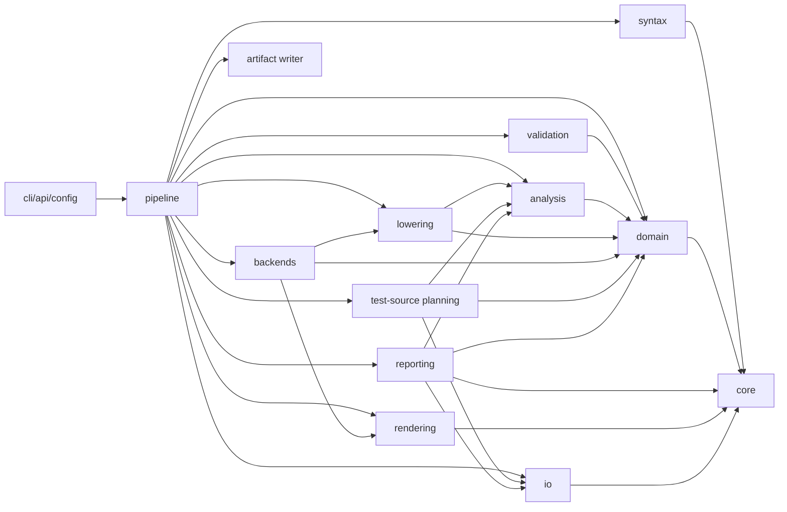

# Target Architecture

The target architecture separates source loading, parsing, domain modeling, validation, semantic analysis, selection, lowering, backend planning, rendering, artifact writing, configuration, CLI/API boundaries, diagnostics, and tests.

The package layout below is a design target. It is not a map from legacy modules.

## Proposed Package Layout

```text
tslgen/
  src/tslgen/
    __init__.py
    api.py
    cli.py
    config/
      model.py
      cli_adapter.py
      hardware.py
    core/
      diagnostics.py
      result.py
      frozen_map.py
      ordering.py
    io/
      sources.py
      manifests.py
      artifacts.py
      artifact_writer.py
      write_report.py
    syntax/
      ast.py
      lexer.py
      parser.py
      grammar/
        tsl_data.lark
        tsil.lark
    domain/
      catalog.py
      primitives.py
      generation_rules.py
      signatures.py
      templates.py
      types.py
      extensions.py
      implementations.py
      tests.py
      backends.py
    validation/
      catalog_validator.py
      backend_metadata.py
      signature_rules.py
      attribute_rules.py
      reference_rules.py
      extension_rules.py
    analysis/
      expansion.py
      dependencies.py
      selection.py
      requirements.py
    lowering/
      model.py
      tsil_mini.py
      tsil_ast.py
      tsil_parser.py
      semantic_ir.py
      lowerer.py
      translations.py
    backends/
      base.py
      registry.py
      cpp/
        backend.py
        bodies.py
        declarations.py
        naming.py
        planner.py
        renderer.py
      rust/
        backend.py
        declarations.py
        naming.py
        planner.py
        renderer.py
    rendering/
      template_engine.py
      render_plan.py
      text.py
    testgen/
      declarations.py
      planner.py
      renderer.py
      cpp.py
      artifacts.py
    reporting/
      coverage.py
      dependencies.py
      artifacts.py
      html.py
    pipeline/
      stages.py
      runner.py
    tooling/
      validation.py
    testing/
      golden.py
      fixtures.py
```

Implementation may adjust names, but it must preserve the architectural boundaries.

## Dependency Direction



Rules:

- `domain` does not import `syntax`, `io`, `cli`, or concrete backends.
- `validation` reads domain objects and returns diagnostics; it does not mutate the catalog.
- `analysis` produces expanded variants, dependencies, requirement decisions, and selections.
- `lowering` consumes selected implementation bodies and translation maps.
- `backends` consume typed plans and produce artifacts.
- `testgen` plans generated production test sources; it is separate from the
  repository's own test harness.
- `io` owns filesystem loading, manifest loading, artifact path validation, and
  artifact writing.
- `cli` owns argparse/cyclopts behavior, environment reads, and process exits.

## Module Responsibilities

### `config`

Owns explicit configuration models and adapters.

Responsibilities:

- CLI option parsing.
- Environment and hardware detection adapters.
- Default source path policies.
- Conversion from CLI args to `PipelineConfig`.

Does not:

- Select implementations.
- Parse TSL.
- Render artifacts.

### `core`

Shared low-level utilities.

Responsibilities:

- Diagnostics.
- Result containers.
- Frozen maps.
- Stable ordering helpers.

Does not:

- Know TSL domain concepts.

### `io`

Filesystem and manifest boundaries.

Responsibilities:

- Resolve input paths.
- Load source documents as text.
- Load YAML or other manifests through typed schemas.
- Model artifacts and artifact plans.
- Validate artifact output paths before writing.
- Write artifact sets under an explicit output root.
- Compare content digests for skip-unchanged behavior.
- Produce deterministic write reports, including dry-run reports.

Does not:

- Validate primitive semantics.
- Render text.
- Read CPU flags.
- Decide which artifacts should exist.

### `syntax`

Parsing boundary for source languages.

Responsibilities:

- TSL grammar and parser.
- Syntax nodes with spans.
- Basic syntax diagnostics.
- TSIL grammar later, when lowering milestone needs it.

Does not:

- Resolve signatures to templates.
- Select implementations.
- Generate backend text.

### `domain`

Core vocabulary.

Responsibilities:

- Typed immutable objects for catalog data.
- Signature and shape value objects.
- Extension/type/template/implementation/test/backend models.

Does not:

- Perform I/O.
- Depend on parser-private fields.
- Include backend rendering logic.

### `validation`

Semantic checks before planning.

Responsibilities:

- Signature and attribute validation.
- Template required-field validation.
- Extension inheritance validation.
- Reference validation for type groups, lane sets, extensions, primitive calls.
- Backend manifest validation.
- Backend language-map and translation-map boundary validation.
- Diagnostic creation.

Does not:

- Render outputs.
- Hide invalid data by silently dropping it.

### `analysis`

Pure computation over validated catalog.

Responsibilities:

- Boolean wildcard expansion.
- Type group expansion.
- Feature requirement normalization.
- Extension fallback chains.
- Dependency discovery.
- Selection planning and implementation candidate selection.

Does not:

- Read host hardware.
- Render backend code.
- Write outputs.

### `lowering`

Semantic lowering from implementation body to backend-neutral or backend-ready IR.

Responsibilities:

- Accept selected implementation candidates through typed lowering requests.
- Consume typed language and translation boundary data when a future lowering
  slice evaluates backend translations.
- Parse TSIL bodies when a supported subset has been chosen.
- Keep any TSIL mini-parser behind a lowering-owned model that can grow toward a
  full TSIL AST.
- Represent unsupported or deferred implementation payloads explicitly.
- Analyze primitive calls and dependencies when enough semantics are available.
- Evaluate generation-time expressions such as `if<generation>(...)`.
- Resolve generation-time type/value queries such as `type<generation>(...)`
  and `value<generation>(...)` into typed semantic values before backend
  translation.
- Apply translation maps where that belongs before backend rendering.
- Treat backend-scoped queries such as `type<backend>(...)` and
  `value<backend>(...)` as translation requests over already-resolved semantic
  inputs, not as raw nested TSIL text.
- Represent TSIL helpers such as `intrin_compose<...>` as typed data, including
  base intrinsic name, modifier fields, argument expressions, and required
  generation/backend context.
- Produce backend-call IR for selected translation-aware slices so renderers do
  not own semantic intrinsic or type resolution.
- Produce lowered body objects.

Current roadmap note:

- The Milestone 39 native C++ `avx2/f32` output is transitional parity
  evidence, not the final lowering/backend boundary.
- Milestone 40 is the first required boundary-correction slice: it must
  preserve that output while producing backend-call IR or an equivalent typed
  translated value before rendering.
- Milestone 41 defines the generation-time semantic lowering contract so raw
  `if<generation>`, `type<generation>`, and `value<generation>` forms cannot
  leak into backend translation.
- The detailed Milestone 41 contract lives in
  `generation-time-semantic-lowering.md`. Its first future implementation slice
  is the boolean primitive-attribute condition used by aligned load/store
  evidence.
- Milestone 42 implements that first slice in lowering. Backend translation and
  rendering still do not evaluate generation-time helpers.
- Milestone 43 implements the selected base scalar type generation queries as a
  lowering/model slice. It resolves those exact queries to typed semantic type
  values before backend modifier translation is allowed to consume them, using
  `GenerationContext.type_tag_override`, `selected_type_tag`, or the selected
  candidate type tag without introducing renderer evaluation.
- Milestone 44 is the post-M43 backend modifier boundary-selection milestone;
  it selects intrinsic suffix as the first modifier family and remains
  documentation/planning only.
- Milestone 45 implements intrinsic suffix translation inside backend
  translation, consuming typed M43 `GenerationTypeRef` values rather than raw
  helper text.
- Milestone 46 keeps C++ scalar type spelling inside backend translation and
  consumes typed M43 `GenerationTypeRef` values rather than raw helper text.
- Milestone 47 implements the selected native integer C++ output expansion and
  consumes translated suffix/type-spelling values as renderer inputs.
- Milestone 48 implements the selected post-M47 lowering slice for
  `type::is_signed(type<generation>(base::in))` branch pruning. It consumes
  typed M43 `GenerationTypeRef(kind="base.in")` values, reuses M42 branch
  provenance, and does not add backend translation or rendering behavior.
- Milestone 51 implements the exact plain-`else` syntax extension for that same
  signedness branch form. It remains generation-time semantic lowering only
  and must not add broad TSIL parsing, backend translation, rendering, or
  conversion body parity.
- Milestone 52 implements only the accepted concrete-integer generation
  type/signedness semantics for selected 8/16/32/64-bit signed and unsigned
  integer tags. It remains lowering-only and does not add backend
  suffix/type-spelling expansion, vector/register metadata, rendering,
  generated output, or branch-body semantics.
- Milestone 53 moves those concrete-integer semantic rules to a typed
  domain/catalog rule source consumed by lowering. It preserves M52 behavior
  exactly and does not make backend translation or rendering consume the
  broader rule source.
- Milestone 54 wires the M53 rule source through the normal
  catalog/lowering-input path while preserving the same lowering behavior and
  side-effect boundaries.
- Milestone 55 adds only the exact scalar
  `value<generation>(type::size_bytes(type<generation>(base::in)))` value query
  as typed generation-time lowering output. It uses explicit scalar size-byte
  rules for selected scalar tags and must not broaden backend translation,
  rendering, vector metadata, branch-body lowering, or standalone float
  `base.in`/companion semantics.
- Milestone 56 adds only the exact
  `value<generation>(type::size_bytes(type<generation>(base::in))) * 8`
  arithmetic expression as typed generation-time lowering output. It must not
  become general expression parsing, comparison/branch pruning, backend
  translation, rendering, vector metadata, or body lowering.
- Milestone 57 adds only exact size-byte equality
  predicate lowering for `== 2`, `== 4`, and `== 8`. It records typed boolean
  predicate values and must not prune branch chains, lower direct intrinsics,
  lower SVE array body statements, add vector metadata, backend translation,
  rendering, or generated output.
- Milestone 58 makes the generation-time lowering stage contract explicit so
  later control-flow pruning consumes typed values and predicates rather than
  raw helper text. The contract is exposed as deterministic typed stage records
  on lowered implementations and does not require backend or renderer changes.
- Milestone 59 consumes those typed stage records for exactly the documented
  SVE size-byte branch chain only. It records selected-arm or no-match pruning
  provenance, keeps branch bodies opaque, and avoids selected-body handoff,
  direct-intrinsic lowering, backend translation, rendering, output, and
  compiler work.
- Milestone 60 adds only a distinct typed opaque selected-body handoff record
  from accepted M59 pruning output. It remains separate from TSIL/body semantic
  lowering, direct-intrinsic/SVE body handling, backend translation, rendering,
  output, and compiler work.
- Milestone 61 adds only a typed selected-body assignment-form recognition
  record from M60 handoff values through the distinct
  `selected_body_form_recognition` stage. It stays a form-classification
  boundary and must not produce `TsilStatement` values, backend intrinsic
  calls, translation requests, rendered code, or generated artifacts.
- Milestone 62 is accepted as unresolved typed selected
  assignment/direct-intrinsic body IR from the M61 form-recognition record. It
  consumes typed M61 fields, preserves original text as provenance, and
  remains separate from SVE predicate semantics, backend intrinsic IR,
  translation requests, renderer-ready IR, generated output, broad TSIL body
  parsing, and lowering-time file/catalog reads.
- Milestone 63 is accepted as a backend-neutral selected-body envelope
  boundary over M62 typed selected-body IR/no-body-IR values. M63 introduces a
  deterministic typed sequence with only the exact singleton M62 entry for
  selected cases and an explicit no-body envelope for no-body cases. It keeps
  SVE-looking corpus text as evidence only and must not add
  direct-intrinsic/SVE semantics, surrounding array/declaration/store/return
  lowering, backend translation, rendering, generated output, or broad TSIL
  parsing.
- Milestone 64 is accepted as an exact structural
  array-body slot-envelope boundary over M63 typed selected-body envelopes.
  M64 introduces deterministic ordered opaque slots around the M63 branch slot
  for the exact `array.tsl:105-111` body evidence. It is a whole-body
  composition point for future slot-specific lowering, not declaration, array,
  store, return, SVE, vector metadata, backend translation, rendering, output,
  or broad TSIL semantics.
- Milestone 65 is accepted as the pipeline-integration boundary for that M64
  envelope. It makes normal lowering populate `array_body_envelopes` and append
  the `array_body_envelope_slot_assembly` stage from typed/provenanced skeleton
  input, without turning `lower_candidates` into a raw-text dispatcher and
  without adding skeleton recognition, slot semantics, backend translation,
  rendering, output, or broad TSIL parsing.
- Milestone 66 is the first slot-specific form-IR boundary over that M65
  envelope. It consumes `ExactArrayBodyEnvelopeIr`, refines only the
  `opaque_pre_branch_array_initialization` slot at ordinal `0` into typed exact
  form IR, appends a distinct `array_initialization_slot_form_lowering` stage,
  and preserves all other slots as opaque provenance. It must not evaluate
  vector metadata or backend uninit helpers, add broad declaration/array/
  variable semantics, lower store/return slots, introduce backend translation,
  rendering, output, or broad TSIL parsing.
- Milestone 67 is accepted as the next request/provenance boundary over the
  M66 form IR. It should consume only `ExactArrayInitializationSlotFormIr`,
  the corresponding stage output, or a typed `LoweredImplementation` carrying
  exactly one accepted M66 form as a container/source, then produce typed
  deferred helper-request records for the four exact M66 leaves. It must not
  evaluate helper values, call backend translation, parse raw slot text, or
  add declaration/array/store/return semantics.
- Milestone 68 is accepted as the first request-resolution boundary over M67
  request IR. It consumes only `ExactArrayInitializationHelperRequestIr`,
  the corresponding stage output, or a typed `LoweredImplementation` carrying
  exactly one accepted M67 helper-request IR as a container/source, then
  resolves exactly the base-type request into a typed result equivalent to
  `GenerationTypeRef(kind="base.in")`. It must not parse M67 leaf text, call
  raw query-string helper evaluators on that text, resolve vector/backend
  requests, create backend translation requests, feed renderers, or add
  declaration/array/store/return semantics.
- Milestone 69 is accepted as a behavior-preserving extraction of the accepted
  M64-M68 exact array-initialization stage assembly tail into a private typed
  helper/result. It is an architecture/maintainability boundary, not a new
  semantic boundary: it preserves the accepted M68 observable
  `LoweredImplementation` fields, stage names/order, diagnostics, and
  deterministic behavior while leaving vector/backend helper resolution,
  generic stage registries, rendering, and output deferred.
- Milestone 70 is accepted as a typed request-resolution boundary over the M69
  array-initialization pipeline. It resolves exactly the M67
  `value<generation>(vector::length)` request from explicit typed vector-length
  metadata supplied before lowering evaluation, not from raw helper text,
  extension names, SVE tokens, vector-bit strings, host CPU state, catalog
  reads, backend maps, or renderers.
- Milestone 71 is accepted as a typed request-resolution boundary over the
  M69/M70 array-initialization pipeline. It resolves exactly the M67
  `value<generation>(vector::alignment)` request from explicit typed
  vector-alignment metadata supplied before lowering evaluation, not from
  vector length, vector bits, scalar byte size, selected type tags, SVE token
  text, extension names, host CPU state, catalog reads, backend maps, backend
  vector-alignment spellings, or renderers.
- Milestone 72 is implemented as a typed helper-set completion boundary over
  the M69/M70/M71 array-initialization pipeline. It packages the accepted
  M68 base type, M70 vector length, M71 vector alignment, and remaining exact
  M67 `value<backend>(uninit::array)` request into one typed aggregate for
  later declaration/array lowering. The backend-uninit request remains a
  deferred backend-value boundary and must not become backend text,
  translation input, renderer-ready IR, declaration semantics, or output.
- Milestone 73 is implemented as a typed exact first-slot declaration-shell
  structural IR boundary after M72. It consumes the M72 helper-set aggregate
  and preserves the exact `var<typed>(array_type<...>, tmp, ...)` shape as
  typed structure only. It must not become generic declaration/array
  semantics, allocation/lifetime, initializer behavior, variable scope,
  store/return lowering, backend translation, renderer-ready IR, or generated
  output.
- Milestone 49 is accepted as the test-source rendering slice. It
  consumes typed `TestSourcePlan` / `PlannedTestCase` values and explicit typed C++
  type-spelling input for one C++ `add_i32_basic` source fixture. It must not
  compile tests, execute toolchains, read legacy templates at runtime, infer
  type spellings locally, or modify lowering/backend translation/generated
  implementation rendering semantics.
- Milestone 50 is the selected post-M49 reporting adapter slice. It consumes
  accepted typed coverage/report DTOs to render one legacy-style coverage JSON
  row for `add` / `avx2` / `cpp` / `f32`; it must not rerun pipeline stages,
  read legacy reports at runtime, change CLI/writer behavior, or broaden report
  parity.

Does not:

- Choose target extensions.
- Load files.
- Write artifacts.
- Render final backend text.
- Evaluate translation maps before a supported lowering slice defines that
  behavior.
- Pass unresolved generation-time helper IR into backend translation.
- Defer supported semantic intrinsic-name composition to text renderers.

### `backends`

Backend-specific planning and rendering strategy.

Responsibilities:

- Expose backend capabilities.
- Stay within the active backend policy for the current roadmap: C++ and Rust
  are active, while C17 is deferred evidence.
- Plan wrappers, primaries, specializations, tests, traits, and support metadata.
- Render artifacts through template engines or structured emitters.
- Report required flags and artifact metadata.
- Consume lowered implementation inputs for production-shaped output once the
  lowering boundary supports the selected slice.
- Own backend-specific naming, parameter, and body-rendering policies for the
  supported slice.
- Render backend-call IR and backend type/name values that were already
  produced by the lowering/translation boundary.

Does not:

- Re-parse source files.
- Make selection decisions based on CPU flags.
- Own output paths.
- Evaluate generation-time TSIL conditions in template rendering.
- Maintain broad hardcoded intrinsic/type lookup tables for semantic lowering.
- Decide that a semantic helper such as `intrin_compose<add>` maps to a
  particular backend intrinsic name.
- Infer generation-time type semantics from raw tag strings when a typed
  domain/catalog rule source is required by the selected milestone.

### `rendering`

Shared rendering utilities.

Responsibilities:

- Template engine abstraction.
- Whitespace/text helpers.
- Render plan and artifact assembly helpers.

Does not:

- Know target hardware semantics.

### `testgen`

Production test-source planning and, later, rendering.

Responsibilities:

- Normalize supported TSL `tests` declarations into typed test declarations.
- Validate test declarations against known primitives, types, extensions, and
  backend capabilities.
- Produce deterministic test artifact descriptors for selected primitives and
  candidates.
- Render narrow generated test artifacts once a renderer slice is accepted.
- Keep generated production test sources separate from the repository's unit and
  golden tests.

Does not:

- Invoke compilers or run generated tests.
- Own the repository's test harness.
- Write generated test files directly.

### `reporting`

Pure report construction over accepted pipeline outputs.

Responsibilities:

- Summarize catalog, selection, candidate, dependency, artifact, and diagnostic
  coverage.
- Summarize candidate-specific dependency closure when that data is exposed by
  the accepted pipeline.
- Produce deterministic structured report values.
- Serialize report values to deterministic JSON.
- Optionally render report artifacts, such as JSON, text, or HTML, without
  writing them directly.

Does not:

- Re-run parsing, validation, selection, rendering, or dependency discovery.
- Write report files.
- Change pipeline behavior based on coverage findings.

### `pipeline`

Stage orchestration.

Responsibilities:

- Compose the stages.
- Enforce validation gates.
- Return structured results.
- Keep stage inputs and outputs inspectable.
- Optionally orchestrate test-source planning, lowering, rendering, reporting,
  and artifact writing only when the corresponding configuration requests those
  capabilities.

Does not:

- Hide side effects.
- Swallow diagnostics.

## Public Interfaces

### API

The public API should expose a small facade:

```python
def load_catalog(config: SourceConfig) -> CatalogResult: ...
def validate_catalog(catalog: Catalog) -> ValidationResult: ...
def plan_generation(catalog: Catalog, request: SelectionRequest) -> PlanResult: ...
def render_artifacts(plan: BackendPlan) -> ArtifactResult: ...
def write_artifacts(
    artifacts: ArtifactSet,
    output_root: Path,
    options: ArtifactWriteOptions,
) -> WriteReport: ...
def plan_tests(catalog: Catalog, request: TestPlanRequest) -> TestPlanResult: ...
def run_pipeline(config: PipelineConfig) -> PipelineResult: ...
def coverage_report(result: PipelineResult) -> PipelineCoverageReport: ...
def candidate_dependency_report(
    result: PipelineResult | PipelineCoverageReport,
) -> CandidateDependencyReport: ...
```

These functions are the long-term facade. Milestone 24 decides which post-15
helpers are public API, including whether coverage/reporting is re-exported
through `tslgen.api`.

Milestone 24 exposes the accepted reporting and writer boundaries through this
facade. `tslgen.api.coverage_report(...)` derives a coverage report from a
`PipelineResult`; `coverage_report_json(...)`, `coverage_report_html(...)`, and
`coverage_report_html_artifacts(...)` serialize or wrap that report without
writing files; and `tslgen.api.write_artifacts(...)` delegates to
`io.artifact_writer`.

Future API additions after Milestone 24 should expose already-accepted values
only. Milestone 32 adds candidate-specific dependency reporting through a stable
`CandidateDependencyReport` DTO and helper while retaining primitive-level
dependency closure. Report generation must consume retained dependency values
and must not perform dependency analysis.

### CLI

The CLI should convert user options into `PipelineConfig`, run the pipeline, print diagnostics, write artifacts when requested, and exit with a process code.

The CLI must not expose internal stage objects unless a debug command is explicitly added.

Milestone 24 CLI options expose only already-accepted capabilities:
`--coverage-report json|html` prints deterministic report output to stdout,
`--output-root` writes already-rendered artifacts through the artifact writer,
and `--dry-run` / `--no-skip-unchanged` refine that explicit write request.
Full legacy CLI flag parity and broader output-mode UX remain deferred.

Milestone 25 must lock down the combined report/write contract before new CLI
surface is added. In particular, report stdout must remain parseable when
`--coverage-report` is combined with `--output-root`.
The accepted contract reserves stdout for the requested report in combined
report/write mode and emits write-report lines to stderr while still delegating
all filesystem mutation to `io.artifact_writer`.

## Private Implementation Details

The following should remain private or replaceable:

- Template engine choice.
- Exact grammar parser library.
- Internal IR node shapes before they stabilize.
- Backend-specific whitespace formatting helpers.
- Hardware detection implementation.
- Golden fixture organization.
- Exploratory modules that are quarantined from the production validation
  baseline.

## Extension Points

| Extension Point | Mechanism |
| --- | --- |
| New backend | Implement `Backend` protocol and register manifest/capabilities. |
| New TSL block | Add syntax node, catalog builder support, validation rules, and docs. |
| New signature term | Add signature parser support and validation rules. |
| New template | Add template metadata, signature mapping, backend rendering support, tests. |
| New hardware extension | Add extension metadata, type/lane/test support, backend policy tests. |
| New lowering operation | Add TSIL parser node, semantic IR, backend translation entries, tests. |
| New artifact type | Extend artifact model and writer policy explicitly. |
| New generated test kind | Add test declaration model, test plan descriptor, renderer, and tests. |
| New report format | Add pure report renderer and route its artifact through the writer. |
| New backend naming policy | Add backend-owned naming helper, diagnostics, and golden tests. |
| New dependency report field | Add pure report model fields from accepted dependency results. |

## Pure Computation And Side Effects

Side-effect boundaries:

- `io.sources` reads source files.
- `io.manifests` reads manifests.
- `config.hardware` may read host hardware.
- `io.artifact_writer` writes files and produces write reports.
- `cli` prints diagnostics and exits.

Pure stages:

- Catalog building from syntax nodes.
- Validation.
- Expansion.
- Selection.
- Dependency analysis.
- Lowering, including generation-time condition evaluation.
- Planning.
- Rendering.
- Reporting.
- Production test-source planning.

## Exploratory-Code Quarantine

Code that is kept as a sketch or experiment must be clearly outside the
production validation baseline until it is accepted by a milestone. Quarantined
code may be read as design evidence, but production entry points, public API
functions, and tests for accepted milestones must not import it accidentally.

Milestone 21 defines the validation profile in `tslgen.tooling.validation`.
The accepted production validation surface currently includes the public API and
CLI adapters, accepted `analysis`, `backends`, `config`, `domain`, `io`,
`lowering`, `rendering`, `reporting`, `syntax`, `testgen`, `validation`, and
accepted core foundation files.

The following paths are explicitly quarantined from the production validation
baseline:

- `tslgen/src/tslgen/frontend`: pre-redesign parser sketch; the accepted parser
  boundary is `tslgen.syntax`.
- `tslgen/src/tslgen/ir`: early primitive/signature sketch not used by the
  accepted domain, candidate, and lowering models.
- `tslgen/src/tslgen/middle_end`: legacy-shaped rewrite/filter sketch with
  unstable imports and incomplete TSIL semantics.
- `tslgen/src/tslgen/utils`: helpers used by quarantined sketches.
- `tslgen/src/tslgen/core/context.py`, `core/passes.py`, and `core/types.py`:
  early sketches outside the accepted Milestone 1 core foundation.
- `tslgen/tests/backend` and `tslgen/tests/test_timing.py`: pre-redesign sketch
  tests outside the accepted unit baseline.
- `frozen/`: legacy evidence only.
- `tsldata/`: read-only corpus fixtures exercised by tests, not Python tooling
  targets.

Milestone 33 records the retirement plan in
`docs/redesign/exploratory-code-retirement-plan.md`. The plan classifies
`frontend`, `ir`, early core context/pass/type sketches, and empty backend
sketch tests as delete candidates; `middle_end` and `frozen` as evidence-only;
and `utils`, `tslgen/tests/test_timing.py`, and `tsldata` as keep-quarantined
until their blockers are resolved. No quarantined path is approved for direct
code migration.

Future cleanup may promote or remove quarantined paths, but doing so requires a
focused milestone with tests and documentation. Any deletion or migration must
update the validation profile in the same slice, preserve required behavior
evidence in redesign docs, and keep production import-boundary tests passing.
Quarantine must not be used to hide failures in accepted redesigned modules.

Milestone 34 records corpus hygiene policy in
`docs/redesign/corpus-hygiene-policy.md`. `tsldata` remains outside Python
compile, lint, and type-check targets because it is accepted source data and
read-only fixture data, not implementation code. Current and future corpus
validation should exercise it through deterministic parser, catalog,
validation, selection, backend metadata, and rendering probes as those
behaviors are accepted.

Corpus churn is not incidental cleanup. A content diff under `tsldata/` is a
source-data change that needs behavioral evidence and focused tests. A zero-line
mode-only diff, such as `100644 => 100755`, is accidental local dirty state
unless a milestone explicitly documents executable-bit intent. Generated
artifacts and committed golden fixtures are reviewed under artifact and golden
policies rather than as corpus data.

## Sketch Assessment

Promising ideas in `tslgen/`:

- `tslgen/src/tslgen/middle_end/README.md` records dependency, filtering, and
  generation-time rewrite concerns that can inform future semantic lowering.
- `tslgen/src/tslgen/utils/timing.py` sketches performance instrumentation,
  but no accepted performance/tooling boundary currently requires it.
- `tslgen/src/tslgen/cli.py` has explicit hardware mode validation.

Design risks in `tslgen/`:

- Python `>=3.14` in `tslgen/pyproject.toml` is accepted for this redesign because the dev container has Python 3.14.4 installed; agents should still keep implementation style straightforward.
- Imports such as `tslgen.src.tslgen...` in middle-end files indicate unstable package boundaries.
- Many pass classes are placeholders or rely on string rewrites.
- `networkx` appears in context but is not declared in dependencies.
- The sketch still couples primitive IR to concrete implementation text and hardware filtering too early.

Use the sketch as a source of ideas, not as the architecture.

## Compatibility Boundaries

Must remain compatible at the behavior level:

- Parse current TSL data.
- Resolve documented signatures/templates.
- Respect extension/type/lane/test metadata.
- Generate deterministic artifacts when baselines are established.

Need not remain compatible:

- Legacy import paths.
- Legacy CLI wording.
- Legacy internal object graphs.
- Legacy accidental errors or silent skipping behavior.
